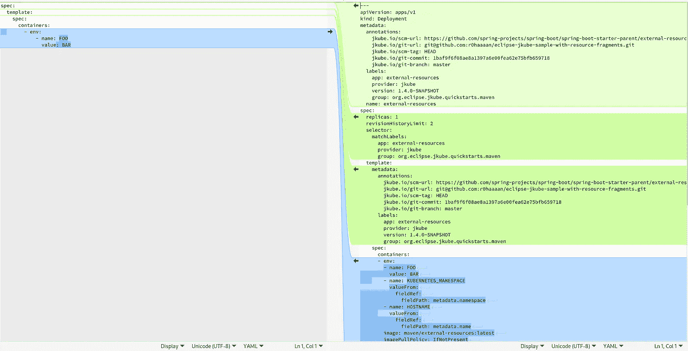
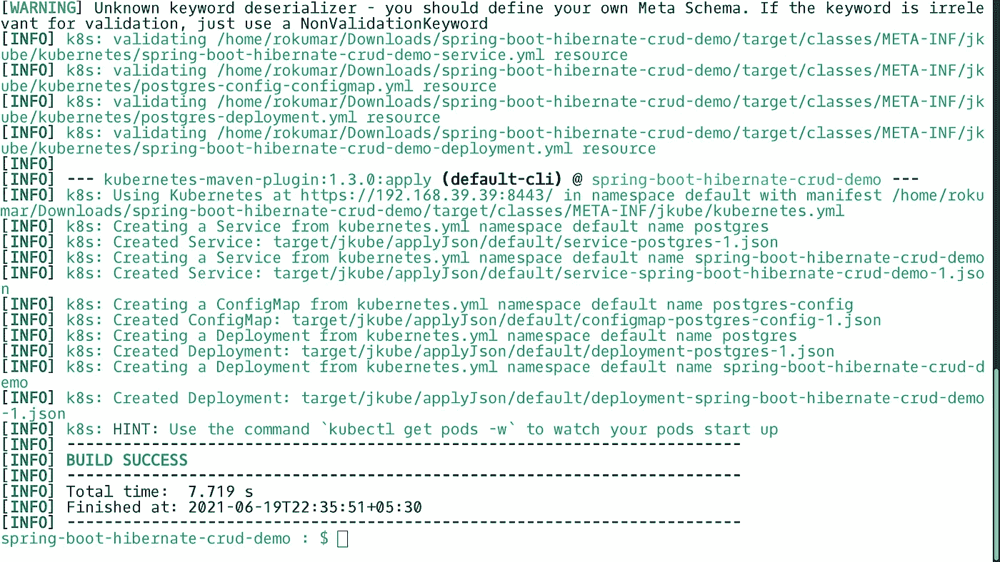
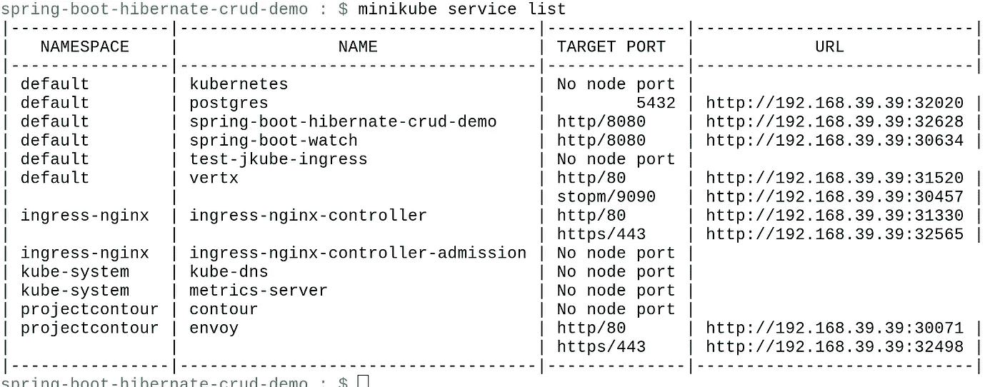

# 了解 Kubernetes Maven 插件资源片段配置

> 原文：<https://itnext.io/understanding-kubernetes-maven-plugin-resource-fragments-configuration-32b1d1e757a1?source=collection_archive---------1----------------------->


[月食 JKube](https://github.com/eclipse/jkube)

在我之前的[博客文章](/understanding-kubernetes-maven-plugins-image-xml-configuration-e98ef633e231)中，我谈到了 Eclipse JKube Kubernetes Maven 插件 XML 配置，以及如何使用它来配置 Eclipse JKube 的输出图像/清单。今天，在这篇博客中，我们将关注 Eclipse JKube [资源片段](https://www.eclipse.org/jkube/docs/kubernetes-maven-plugin#_resource_fragments):一个特定于 Kubernetes 清单(JSON/YAML)的配置选项。

# 什么是资源碎片？

在 Eclipse JKube 术语中，资源片段是完整/部分的 JSON/YAML 片段，用户将它们放在这个项目的`src/main/jkube`目录中，以便根据自己的需要调整 JKube 固执己见的清单生成机制。这种用法通常适用于对 Kubernetes 基本类型有一定了解的用户。

假设一个用户想要向他的部署添加一个额外的环境变量。她也可以通过 XML 配置来完成，但是假设她在项目的`src/main/jkube`目录中添加了一个`deployment.yml`文件:

```
**spec:
  template:
    spec:
      containers:
        - env:
            - name**: FOO
              **value**: BAR
```

这个用户照常运行`mvn k8s:resource`目标后，可以在`target/classes/META-INF/jkube/kubernetes`文件夹中看到生成的清单。最终生成的清单将是 Eclipse JKube 固执己见的默认值和用户的 YAML 片段的合并输出:



用户提供的片段和最终由 JKube 生成的部署清单之间的差异

正如你在截图中看到的，Eclipse JKube 通过检查项目依赖关系添加了它自己的固执己见的标签、注释、名称(默认为`project.artifactId`)、容器。您还会注意到，用户指定的附加环境变量也保留在最终生成的 YAML 清单中。因此，通过指定完整 YAML 清单的一个片段，我们就可以调优 JKube，这就是为什么这些片段被称为资源片段。

# 使用资源片段:

为了使用资源片段配置选项，您需要在`src/main/jkube`中提供一个部分 YAML 文件，其中包含您想要在 JKube 的固执己见的清单中覆盖的内容。文件名取决于您试图配置的 Kubernetes 资源。例如，如果它是一个`Deployment`，你将添加一个`deployment.yml`文件；如果`Service`，你会添加一个`service.yaml`文件。您可以在 Kubernetes Maven 插件的文档中找到完整的类型到文件名的映射:

 [## org.eclipse.jkube/kubernetes-maven-plugin

### 5.2.5.构建配置有两种不同的模式来构建图像:内嵌插件配置和

www.eclipse.org](https://www.eclipse.org/jkube/docs/kubernetes-maven-plugin#_kindfilename_type_mapping) 

下面是一个在`src/main/jkube`目录中指定片段的例子:

```
eclipse-jkube-sample-with-resource-fragments : $ tree src/main/jkube/
src/main/jkube/
├── configmap.yml
├── deployment.yml
├── sa.yml
├── second-configmap.yaml
└── service.yml0 directories, 6 files
```

正如你在这里看到的，我已经提供了定义`ConfigMap, Deployment`、`ServiceAccount`和`Service`的文件。您可以在下面的代码片段中看到所有这些文件的内容:

```
**$** cat src/main/jkube/configmap.yml 
apiVersion: v1
kind: ConfigMap
metadata:
  creationTimestamp: 2017-12-27T18:36:28Z
  name: game-config-env-file
data:
  allowed: '"true"'
  enemies: aliens
  lives: "3"**$** cat src/main/jkube/deployment.yml 
spec:
  template:
    spec:
      containers:
        - env:
            - name: FOO
              value: BAR**$** cat src/main/jkube/sa.yml 
metadata:
  name: ribbon**$** cat src/main/jkube/second-configmap.yaml  
application.properties: |
   spring.profiles.active=dev**$** cat src/main/jkube/service.yml 
spec:
  type: LoadBalancer
  ports:
    - name: http
      port: 8080
```

请注意，在`configmap.yml`的一个案例中，我已经提供了完整的 YAML 货单。在其他情况下，我只是指定了次要的 YAML 清单，具体到我希望覆盖的关于 JKube 默认值的清单。您可以使用 Kubernetes Maven 插件来生成清单:

```
$ mvn k8s:resource
[INFO] Scanning for projects...
[INFO] 
[INFO] ---org.eclipse.jkube.quickstarts.maven:external-resources>--
[INFO] Building Eclipse JKube :: Quickstarts :: Maven :: External Resources 1.4.0-SNAPSHOT
[INFO] --------------------------------[ jar ]---------------
[INFO] 
[INFO] --- kubernetes-maven-plugin:1.4.0-SNAPSHOT:resource (default-cli) @ external-resources ---
[INFO] k8s: Running generator spring-boot
[INFO] k8s: spring-boot: Using Docker image quay.io/jkube/jkube-java-binary-s2i:0.0.9 as base / builder
[INFO] k8s: Using resource templates from /home/rokumar/work/repos/jkube-testing/eclipse-jkube-sample-with-resource-fragments/src/main/jkube
[INFO] k8s: jkube-healthcheck-spring-boot: Adding readiness probe on port 8080, path='/health', scheme='HTTP', with initial delay 10 seconds
[INFO] k8s: jkube-healthcheck-spring-boot: Adding liveness probe on port 8080, path='/health', scheme='HTTP', with initial delay 180 seconds
[INFO] k8s: jkube-service-discovery: Using first mentioned service port '8080' 
[INFO] k8s: jkube-revision-history: Adding revision history limit to 2...[INFO] --------------------------------------------------
[INFO] BUILD SUCCESS
[INFO] ---------------------------------------------------
[INFO] Total time:  3.705 s
[INFO] Finished at: 2021-06-12T23:12:38+05:30
[INFO] ---------------------------------------------------
```

您可以在 JKube 的输出目录中检查生成的清单，看看 JKube 是如何将您的片段与其固执己见的缺省值合并在一起的。您会注意到生成的 Kubernetes 资源遵循`${RESOURCE-NAME}-${KIND}`作为文件命名策略:

```
**$** ls target/classes/META-INF/jkube/kubernetes -l
total 32
-rw-rw-r--. 1 rokumar rokumar 2438 Jun 12 23:12 external-resources-deployment.yml
-rw-rw-r--. 1 rokumar rokumar  294 Jun 12 21:21 external-resources-ingress.yml
-rw-rw-r--. 1 rokumar rokumar  860 Jun 12 23:12 external-resources-service.yml
-rw-rw-r--. 1 rokumar rokumar  306 Jun 12 23:12 game-config-env-file-configmap.yml
-rw-rw-r--. 1 rokumar rokumar  198 Jun 11 21:44 ribbon-1-serviceaccount.yml
-rw-rw-r--. 1 rokumar rokumar  198 Jun 12 23:12 ribbon-serviceaccount.yml
-rw-rw-r--. 1 rokumar rokumar  258 Jun 12 23:12 second-configmap.yml$ cat target/classes/META-INF/jkube/kubernetes/external-resources-service.yml 
---
apiVersion: v1
kind: Service
metadata:
  annotations:
    prometheus.io/path: /metrics
    jkube.io/git-branch: master
    prometheus.io/port: "9779"
    jkube.io/scm-url: [https://github.com/spring-projects/spring-boot/spring-boot-starter-parent/external-resources](https://github.com/spring-projects/spring-boot/spring-boot-starter-parent/external-resources)
    prometheus.io/scrape: "true"
    jkube.io/git-url: [git@github.com](mailto:git@github.com):r0haaaan/eclipse-jkube-sample-with-resource-fragments.git
    jkube.io/scm-tag: HEAD
    jkube.io/git-commit: 1baf9f6f08ae8a1397a6e00fea62e75bfb659718
  labels:
    expose: "true"
    app: external-resources
    provider: jkube
    version: 1.4.0-SNAPSHOT
    group: org.eclipse.jkube.quickstarts.maven
  name: external-resources
spec:
  ports:
  - name: http
    port: 8080
    protocol: TCP
  selector:
    app: external-resources
    provider: jkube
    group: org.eclipse.jkube.quickstarts.maven
  type: LoadBalancer
```

# 使用原始资源片段:

`src/main/jkube`中提供的 YAML 片段是由 Eclipse jbu be 处理的，这意味着 Eclipse jbu be 会修改它们，并向您的输入片段添加一些自以为是的增强。Eclipse JKube 有这个概念，即 [enrichers](https://www.eclipse.org/jkube/docs/kubernetes-maven-plugin#enrichers) (一组包含 Kubernetes 清单的小型配置逻辑的类)，它们利用[访问者模式](https://en.wikipedia.org/wiki/Visitor_pattern)来逐个“丰富”您的 Kubernetes 清单。

但是，当用户不希望 jbue 干扰其资源 YAMLs，而只是希望将其与应用程序相关的清单一起部署时，就像做`kubectl apply -f /path/to/manifest.yml`一样，该怎么办呢？嗯，JKube 也处理这个。您可以将这些 YAML 清单放在`src/main/jkube/raw`目录中:

```
**$** tree src/main/jkube/
src/main/jkube/
├── deployment.yml
└── raw
    ├── postgres-configmap.yml
    ├── postgres-deployment.yml
    └── postgres-service.yml1 directory, 4 files
```

在上面的例子中，`raw/`目录中提供的所有 YAML 清单都将在应用阶段被 Eclipse JKube 应用。Eclipse JKube 不会像处理放在`src/main/jkube`目录中的 YAML 清单那样添加任何额外的标签/注释。

# 示例:使用 Eclipse JKube 将 Postgres 上的 Spring Boot 部署到 Kubernetes

为了更好地理解片段，让我们举一个使用 Postgres 数据库的 spring-boot 应用程序的简单例子。为了将它部署到 Kubernetes，我们还需要确保 Postgres 作为一个 pod 在 Kubernetes 集群中运行。在本例中，我们将使用原始资源片段设置 postgres，并将 Postgres 的部署、服务和配置映射放在`src/main/jkube/raw`目录中:

```
**spring-boot-hibernate-crud-demo : $** ls src/main/jkube/raw/ -l
total 12
rokumar 192 Jun 19 19:37 postgres-configmap.yml
rokumar 479 Jun 19 19:26 postgres-deployment.yml
rokumar 161 Jun 19 19:26 postgres-service.yml
```

`postgres-deployment.yml`将包含`Deployment`，用于控制波斯特格雷豆荚。`postgres-service.yml`会暴露这个部署。`postgres-configmap.yml`将包含像用户名，密码等凭证。请注意，该部署没有使用任何卷来保存数据，因为它只是用于演示目的。

除了`raw/`目录中的这三份 YAML 清单。在`src/main/jkube`中我们有一个额外的`deployment.yml`，在这里我们定制了由 Eclipse JKube 生成的`Deployment`，以包含一些从`postgres-config` ConfigMap 中读取的额外环境变量:

```
**spec:
  template:
    spec:
      containers:
        - env:
            - name:** POSTGRESQL_USER
   **           valueFrom:
                configMapKeyRef:
                  name:** postgres-config
                  key: POSTGRESQL_USER
            - **name:** POSTGRESQL_PASSWORD
 **valueFrom:
                configMapKeyRef:
                  name:** postgres-config
                  **key:** POSTGRESQL_PASSWORD
            - **name:** POSTGRESQL_DATABASE
              **valueFrom:
                configMapKeyRef:
                  name:** postgres-config
                  **key:** POSTGRESQL_DATABASE
```

我们将修改我们的 Spring Boot `application.yml`以从这些环境变量中读取数据库名称、用户名和密码:

```
**spring.datasource.url**=jdbc:postgresql://${POSTGRES_SERVICE_HOST}:5432/${POSTGRESQL_DATABASE}?createDatabaseIfNotExist=true
**spring.datasource.username**=${POSTGRESQL_USER}
**spring.datasource.password**=${POSTGRESQL_PASSWORD}
```

一旦一切都配置好了，您就可以将您的应用程序部署到 Kubernetes 了。我在本地用 minikube 集群测试了这一点，并遵循了以下命令:

```
# Start minikube
$ minikube start # To point your shell to minikube's docker-daemon
$ eval $(minikube -p minikube docker-env) # Run Eclipse JKube build, resource, apply goals
$ mvn package k8s:build k8s:resource k8s:apply
```



使用 Eclipse JKube 将 Postgres 应用程序上的 Spring Boot 部署到 Kubernetes

构建完成后检查应用程序窗格:

```
spring-boot-hibernate-crud-demo : $ kubectl get pods
NAME                              READY   STATUS    RESTARTS   AGE
postgres-cf987cb96-svvz4          1/1     Running   0          3m7s
spring-boot-hibernate-crud-demo-5fc5697bf5-vvzwc   1/1     Running   1          3m7s 
```

一旦 pods 处于`Running`状态，尝试检查应用程序服务，我已经配置了 Eclipse JKube 来生成`NodePort`服务。我可以这样访问它:

```
minikube service list
```



minikube 服务列表

在一个窗口中检查应用程序日志，并尝试通过一些 api 测试工具访问应用程序:

```
kubectl logs pod/spring-boot-hibernate-crud-demo-5fc5697bf5-vvzwc -f
```


在 kubernetes 中检查应用程序是否运行正常

一旦一切按预期运行，您可以使用取消部署目标取消部署一切:

```
mvn k8s:undeploy
```

# 结论:

在这篇博客中，您了解了我们如何将原始的 YAML 清单(完整的或部分的)与 Eclipse JKube 一起使用，以便定制 Kubernetes 清单。这在 XML 配置可能不提供完整配置支持的各种情况下非常有用。你可以在 Github 仓库找到今天博客中使用的代码:

[](https://github.com/r0haaaan/jkube-spring-boot-hibernate-crud-demo) [## r0haaaan/jkube-spring-boot-hibernate-crud-demo

### 这是一个演示 Spring Boot 项目，展示了如何使用 Eclipse JKube 来部署 Spring Boot 应用程序…

github.com](https://github.com/r0haaaan/jkube-spring-boot-hibernate-crud-demo) 

你可以在 Kubernetes Maven 插件文档中读到更多关于它的内容。如果您有任何问题，请随时通过我们的 [Gitter 频道](https://gitter.im/eclipse/jkube)或通过 [Github](https://github.com/eclipse/jkube) 联系我们。