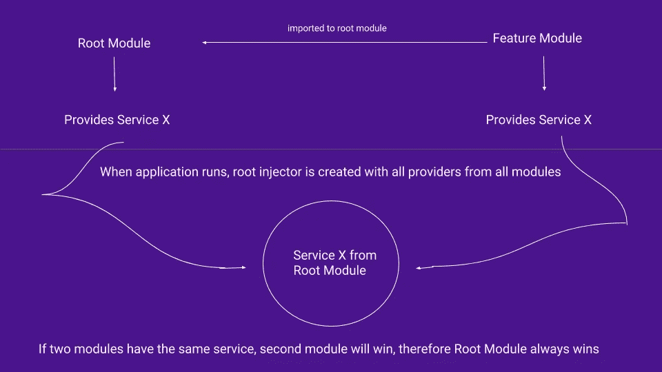
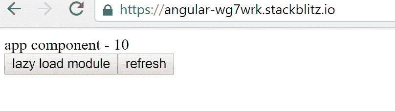
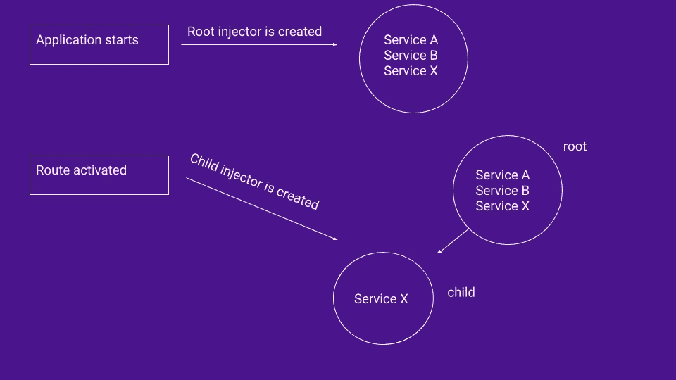

# 了解 Angular 中的提供者范围

> 原文：<https://itnext.io/understanding-provider-scope-in-angular-4c2589de5bc?source=collection_archive---------0----------------------->


服务是每个 Angular 应用程序的基本模块之一。Service 只是一个有或者没有 **@Injectable** decorator 的 TypeScript 类。

要创建服务，我们需要做的就是创建一个类

```
export class VoteService {}
```

并注册到 **@NgModule** 的 providers 数组中

```
import {VoteService} from './vote.service';...
@NgModule({
  imports:      [ BrowserModule],
  declarations: [ AppComponent],
  bootstrap:    [ AppComponent],
  providers: [VoteService]
})
```

第二种方式(在 Angular 6 中更受欢迎)是使用`@Injectable`装饰器并在属性中指定**provided**

```
import { Injectable } from '@angular/core';@Injectable({   
  providedIn: 'root', 
}) 
export class VoteService { }
```

“根”意味着我们希望在根级别(AppModule)提供服务

> 当您在根级别提供服务时，Angular 会创建一个服务的共享实例，并注入到任何请求它的类中。在`@Injectable`元数据中注册服务提供者也允许 Angular 通过删除服务来优化一个应用程序，如果它最终没有被使用的话。

这就是事情变得更有趣的地方。当您将服务提供者添加到根模块(根注入器)时，它可用于整个应用程序。这意味着，如果你有一个在 providers 中带有服务的特性模块，并且该服务也在 root 模块中提供，在这种情况下，两个模块将使用相同的服务实例(singleton 模式)。因此，请记住，无论何时向根模块添加服务，该服务在整个应用程序中都是可用的，并且所有组件/指令都可以访问该服务的同一个实例，除非功能模块是懒惰的。

让我们用代码来看看这个。我们有一个在根模块(`AppModule`)中提供的`VoteService`

```
import { Injectable } from '@angular/core';@Injectable({
  providedIn: 'root'
})
export class VoteService {
  votes: number = 10; constructor() { } getVotes() {
    return this.votes;
  } setVotes(vote: number) {
      this.votes = vote;
  }
}
```

所以这里我们有一个简单的带有`votes`属性和两个方法的服务。一个用于获取属性值，另一个用于设置新值。初始值设置为 10

现在让我们在 app.component 中注入我们的服务，并显示`votes`的值

```
@Component({
  selector: 'my-app',
  template: `app component - {{votes}}`
})
export class AppComponent  {
  votes: any;constructor(private vt: VoteService) {}

  ngOnInit() {
    this.votes = this.vt.getVotes()
    this.vt.setVotes(25);
  }
}
```

在这里，我们在构造函数中注入我们的服务，将来自服务的投票值赋给组件变量，并设置新值。到目前为止，我们将在浏览器中看到这一点

```
app component - 10
```

10 是最初设置的值。现在让我们创建一个功能模块(不是懒惰的)并提供`VoteService`

```
@NgModule({
  imports: [CommonModule],
  declarations: [FeatureComponent],
  exports: [FeatureComponent],
  providers: [VoteService]
})
export class FeatureModule { }
```

这个`FeatureModule` 是在根模块(AppModule)中导入的。所以在`FeatureComponent` 中我们也可以注入 **VoteService** 并得到`votes`的值

```
@Component({
  selector: 'app-fac',
  template: `{{votes}}`
})
export class FeatureComponent implements OnInit {
  votes: number;
  constructor(private vt: VoteService) { }ngOnInit() {
    this.votes = this.vt.getVotes()
  }
}
```

现在让我们修改`AppComponent`模板做显示`FeatureComponent`

```
template: `app component - {{votes}}
           <br>
           feature component - <app-fac></app-fac>`
```

结果我们会看到

```
app component - 10
feature component - 25
```

为什么这样原因是 app 组件和 feature 组件都在使用同一个`VoteService`实例。让我们看看这是如何工作的。

1.  我们的模块(AppModule 和 FeatureModule)在其提供者中都有`VoteService`

2.因为我们将 FeatureModule 导入到 AppModule，并且两者都有一个具有相同令牌(相同服务)的提供者，所以 AppModule 胜出。这是因为两个提供者被添加到同一个注入器中。

> Angular 使用喷射系统。当在应用程序启动时加载根模块时，来自所有导入模块的所有提供者都被添加到根注入器，这就是为什么它们在整个应用程序中都是可访问的。

当我们导入两个提供相同服务的模块时，第二个模块总是胜出，因为它是最后添加的。

3.在 app.component 中，当我们注入`VoteService` Angular 时，开始在该组件中搜索提供者，然后按层次向上搜索，直到在根模块(根注入器)中找到它。之后，Angular 检查是否有实例。如果没有，新的实例将被创建并返回到 app.component。这就是为什么当我们在 feature.component 中注入`VoteService`时，我们实际上使用了已经创建的类的实例，因此我们得到了 25 票而不是最初的 10 票。



提供者范围的可视化表示

## 懒惰模块怎么办？

当我们使用懒惰模块时，事情变得更加有趣。惰性模块是使用惰性加载的模块。这意味着只有在真正需要的时候才加载模块。例如，在你的网站上有一个关于“新产品”的页面，但是用户很少访问这个页面。你可以拆分你的应用程序的逻辑，创建一个懒惰的模块来负责那个页面，这样你的应用程序会启动得更快，因为一个模块只有在有人访问那个页面的时候才会被加载。

要创建一个懒惰模块，我们需要使用路由。因此，让我们在 AppModule 中配置应用程序路由

```
RouterModule.forRoot([{
      path: 'lazy', 
      loadChildren : './lm/lazy.module#LazyModule'
    }])
```

这里我们说如果 URL 的路径将是`/lazy` 加载这个模块，我们提供我们的懒惰模块的相对路径。不要忘记创建那个模块。您可以使用 CLI 生成一个模块— `ng generate module lazy`。我们不在根模块中导入懒惰模块。

我们还需要在 **LazyModule** 中配置路由。所以在*导入*数组的 **LazyModule** 里面我们可以这样做

```
RouterModule.forChild([{
        path: '', component: LazyComponent
      }])
```

作为路径，我们使用空字符串，因为在 AppModule 中我们已经提供了一个路由。还要注意，我们用**代替**表示根**表示孩子。**

就这样，现在我们有了懒惰模块和激活该模块的路径。让我们添加一些可以改变路线的按钮。

更改 app.component 的模板

```
@Component({
  selector: 'my-app',
  template: `app component - {{votes}}<br>
      <button routerLink='lazy'>lazy load module</button>

    <button (click)="refresh()">refresh</button>
    <router-outlet></router-outlet>
  `
})
...
```

我们仍然显示来自我们服务的`votes` count，但是我们也添加了 2 个按钮，一个用于更改路线和加载我们的惰性模块，另一个用于刷新`votes` 属性。

```
refresh() {
    this.votes = this.vt.getVotes()
  }
```

最后，让我们为我们的懒惰组件创建一个模板

```
...
template: `<br>lazy component - {{votes}} 
   <button routerLink='/'>back to app component</button>`
...
```

因此，在我们的 **LazyModule** 中，我们还提供了`VoteService`。该服务被注入到 **LazyComponent** 中，因此我们可以创建一个`votes`变量，并使用它来显示来自`VoteService`的投票数

这就是将要发生的事情。



最初`votes`的值是 10。当我们延迟加载一个模块时，这个值又是 10，而不是 25。当我们刷新时，`votes`的值只对 app.component 改变，对 lazy.component 它保持 10。现在让我们更详细地看看

1.  我们有两个模块(AppModule 和 LazyModule)提供相同的服务。
2.  当应用程序启动时，根注入器由来自所有模块的所有服务创建。然而，由于我们的模块是懒惰的，Angular 不知道我们的懒惰模块的存在。这意味着在我们的 LazyModule 的 providers 数组中列出的任何服务都是不可用的，因为根注入器还不知道 LazyModule。当我们激活路由时，将加载惰性模块并创建新的注入器。想象一个注入器树，顶部是根注入器，对于每个懒惰模块，将创建新的*子注入器*。
3.  根注入器中的所有服务都将添加到子注入器中。如果根注入器和子注入器提供相同的服务，Angular 优先选择来自*子注入器的服务实例。*所以每个懒惰组件都获得服务的本地实例，而不是根应用注入器中的实例。这就是为什么当我们刷新状态时，只有 app.component 的`votes`发生了变化，因为 lazy.component 正在与服务的另一个实例一起工作。



用惰性模块限制提供者的范围

所以快速回顾一下

1.  如果我们有几个提供相同服务的特性模块，那么只有最后一个模块的服务会被添加到根注入器中
2.  如果我们有几个提供相同服务的功能模块，并且该服务是在 AppModule(根模块)中提供的，那么只有从 AppModule 创建的实例才会被添加到根注入器中。因此，即使 FeatureModules 的组件也将使用来自 AppModule 的服务实例
3.  如果我们有不提供服务的懒惰模块，它将使用从根注入器(AppModule)创建的实例
4.  但是如果懒惰模块确实提供了服务，那么该模块的组件将使用该服务的本地实例(而不是来自根注入器的实例)

## 用组件限制提供者范围

限制提供者范围的另一种方法是在*@组件*装饰器内的*提供者*数组中提供服务。组件提供者和 NgModule 提供者是相互独立的。在组件中提供服务会将服务仅限于该组件和该组件内的组件(组件树)

```
@Component({
  ...
  providers: [VoteService]
})
```

感谢阅读。希望现在没那么复杂了。完整的代码可在[这里](https://stackblitz.com/edit/angular-wg7wrk)