# 理解反应

> 原文：<https://itnext.io/understanding-react-%EF%B8%8F-3bc9589ab166?source=collection_archive---------6----------------------->

React 是构建 web 应用程序的最现代的解决方案之一。
在这篇文章中，我想以一种实用的方式总结一下这个框架的特点。

# **让我们创建一个新的 React 项目**

首先，确保您已经安装了节点及其软件包管理器(NPM)。
然后，打开一个新的终端:

1.  全局安装`create-react-app`包
    `$ npm install -g create-react-app`
2.  创建 React app 文件夹模板
    `$ create-react-app my-awesome-app`

➡注意:不需要通过 NPX:
`$ npx create-react-app my-awesome-app`安装就可以执行`create-react-app`

现在我们已经准备好了项目文件夹。
它包含几个包，你可以在这里看到[包含的内容。](https://github.com/facebook/create-react-app#whats-included)

# **开始吧**

在开始编写代码之前，您应该了解 React 的一些工作原理。

首先，React 使用了一种叫做 JSX 的语言，这基本上是一种在 JavaScript 文件中编写 HTML 的方式。

在 React 中，几乎所有东西都是组件。
组件是呈现 HTML 代码的单一单元。
一个组件可以包含更多的组件，例如:
= >主屏幕组件
== >导航栏组件
= = =>Logo 组件
==== >链接组件
== >内容组件
= =>…等等

有两种类型的组件，功能组件和类组件。总的来说，功能组件更容易使用，也更现代。

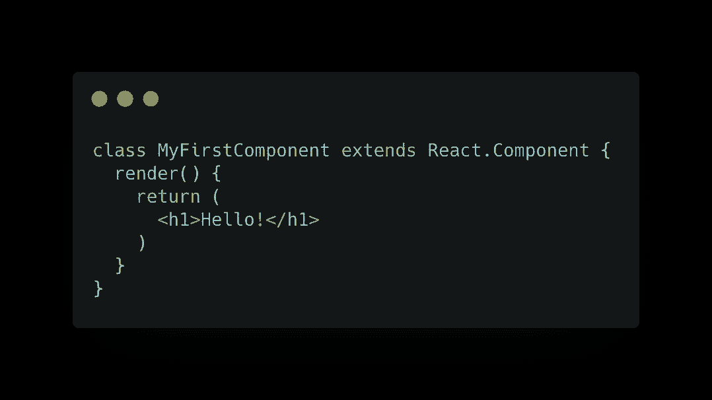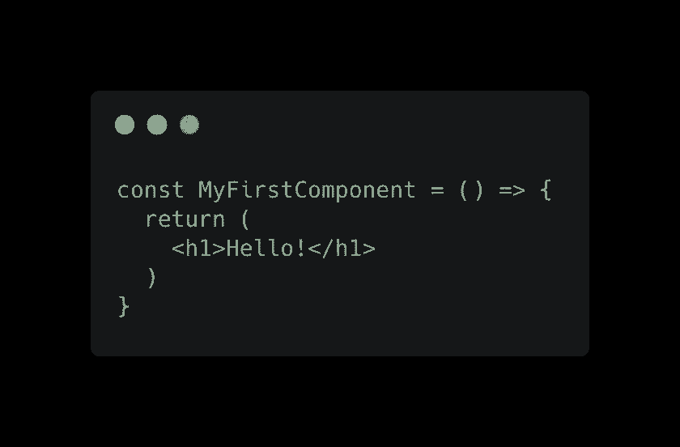

类别组件(第一个图像)—功能组件(第二个图像)

React 在虚拟 DOM 上工作。

如果您不知道，普通 JavaScript 中的 DOM(文档对象模型)是网页元素的表示，包含了更新用户界面所需的所有方法。

得益于虚拟 DOM，React 可以优化 UI 呈现，只更新需要更新的元素。

# 项目结构

使用 Visual Studio 代码打开项目(当然，您可以使用任何其他编辑器)。

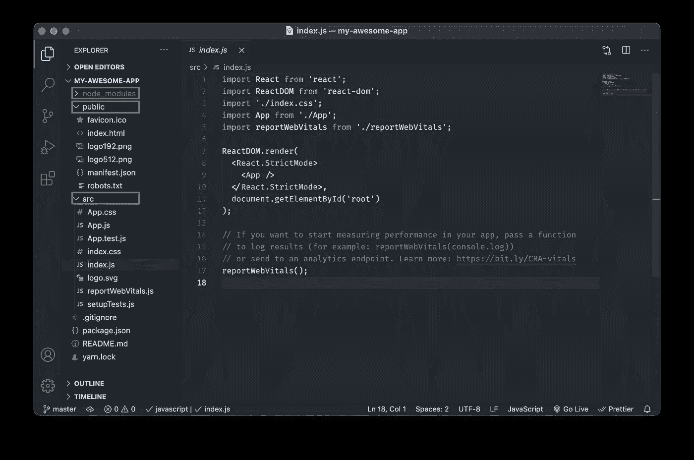

如您所见，有三个文件夹:

1.  🟥“节点模块”，我们所有的库都在这里安装
2.  🟩“公共”，反应将在其中呈现的 HTML 模板
3.  🟦“src”，我们项目的源文件

我们应用程序的入口点在“index.js”文件中。

该文件是项目的根，包含 App 组件，位于“App.js”文件中。

要运行该应用程序，您可以使用集成的终端是 Visual Studio 代码，进入菜单栏，“终端”，“新建终端”。
现在，键入:
`$ npm start`
这将在 Node.js 环境中执行名为`start`(位于我们的`package.json`文件的`scripts`对象内)的脚本。

➡注意:热重装是在调试模式下启用的。编辑并保存文件后，React 将为您重新加载浏览器选项卡。

# **创建我们的 SpaceX 发射仪表板**

在这个示例项目中，我们将创建一个简单的 web 应用程序，显示 SpaceX 的发射列表，从[https://api.spacexdata.com](https://api.spacexdata.com)获取数据。

打开“App.js”并删除所有内容，只留下一个带有标题的简单组件。

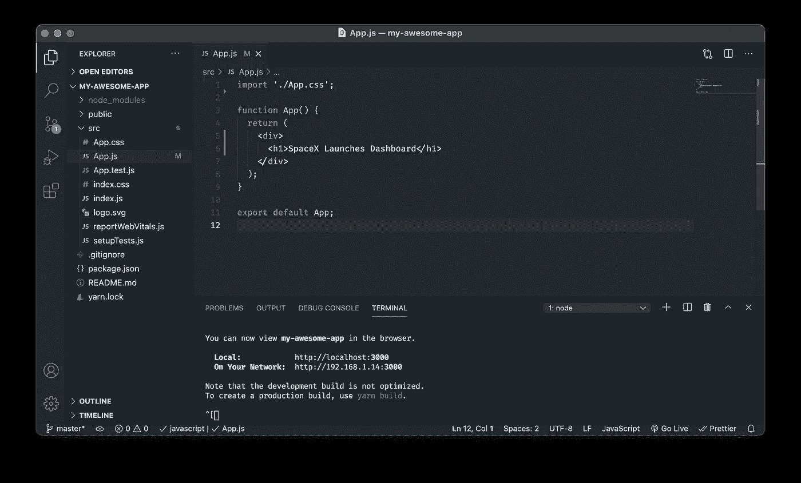

现在，让我们创建我们的第一个*有状态*变量。

状态是一个对象，它保存了在组件的生命周期中可以改变的一切。为了创建一个状态变量，我们使用 React 包中的`useState`钩子函数。
`useState`可以有一个可选参数，代表自己的默认值。
它返回两个项目的数组:

1.  第一个是状态的更新值
2.  第二个是更新状态的调度程序函数

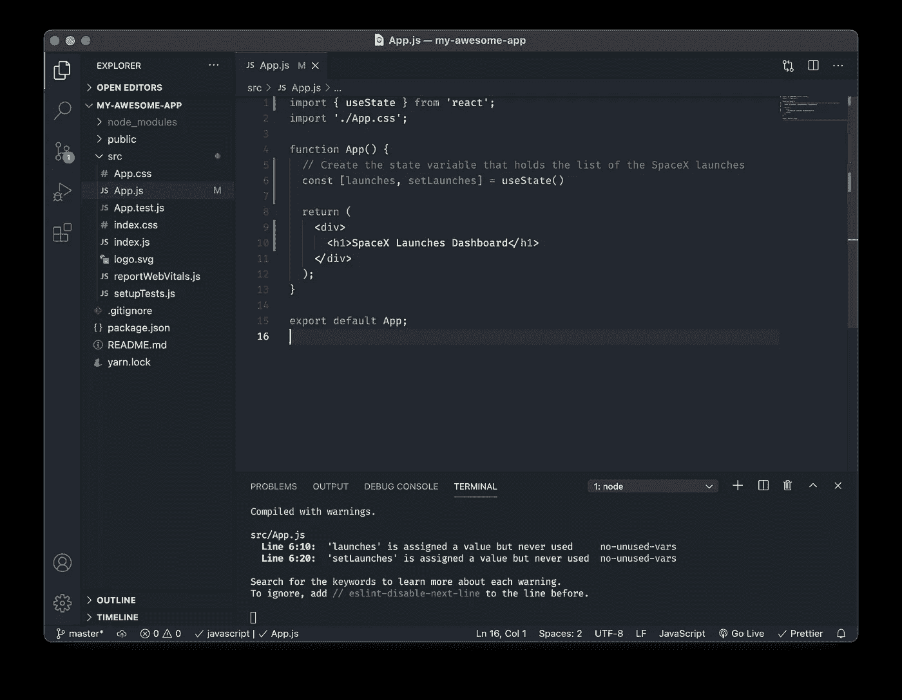

现在我们需要从远程 API 获取数据并更新`launches`状态。为此，我们需要使用另一个名为`useEffect`的 React 钩子。
该函数接受两个参数:

1.  一个函数，它告诉钩子应该做什么动作
2.  *依赖关系*，一组状态变量，当它们改变时触发函数。当数组为空时，这意味着函数将只被调用一次。如果你不传递数组，这个函数将在每次渲染时被调用。

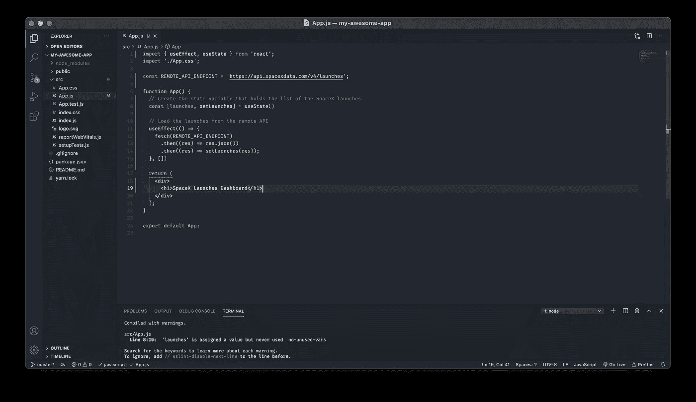

获得数据后，我们应该在 HTML 中显示它。

JSX 语法在开始时可能有点棘手，但是一旦你习惯了，就会变得容易了。

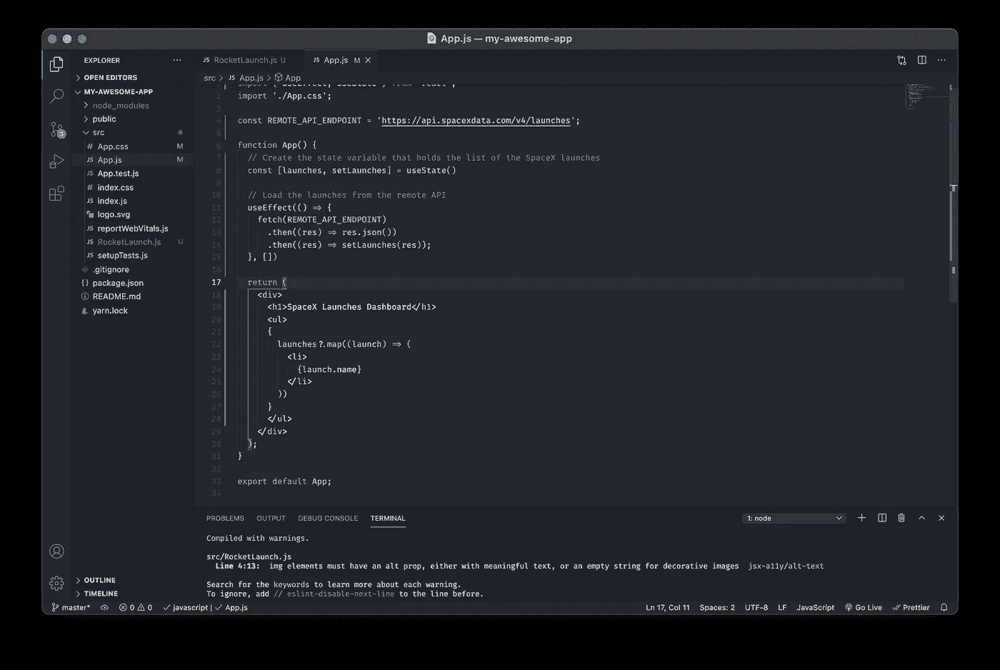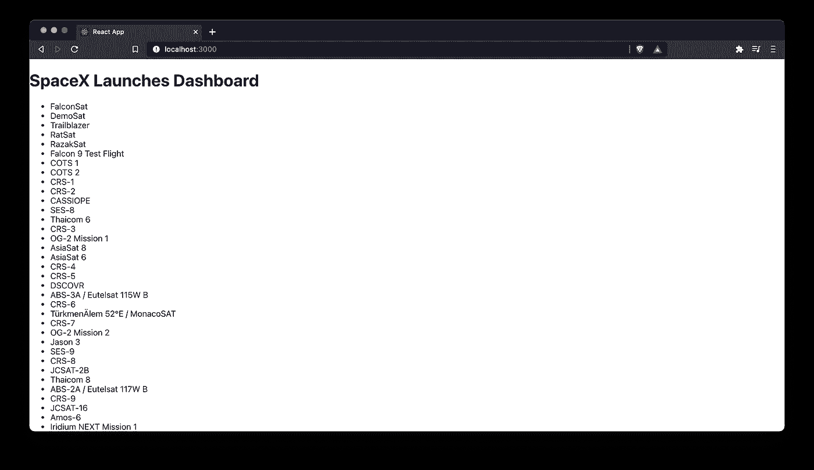

有用！🎉

我们现在可以使用一些 CSS 使它更漂亮，并显示响应中包含的图像，例如:

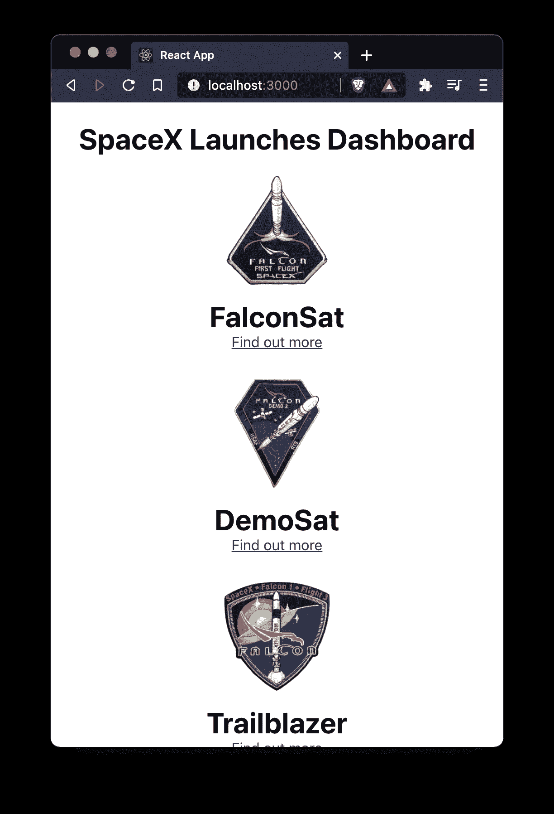

我们还可以模块化我们的应用程序，创建一个`RocketLaunch`组件。让我们创建一个名为“RocketLaunch.js”的新文件。

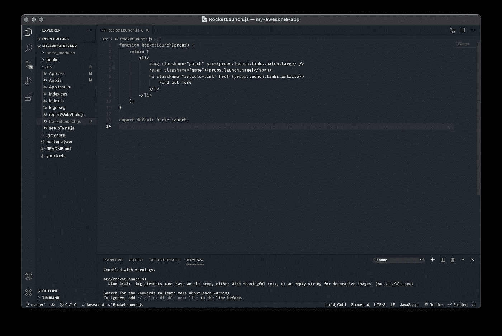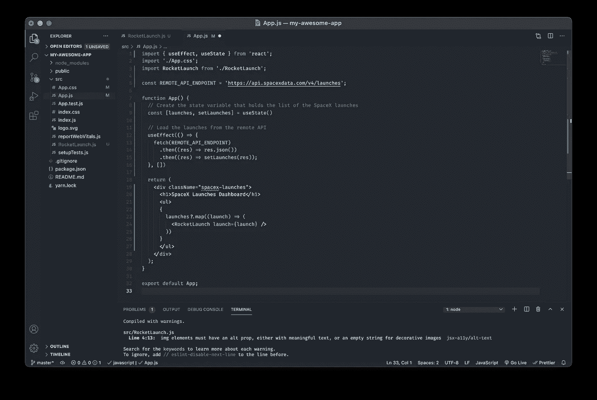

为了在组件和其子组件之间传递数据，我们使用了`props`。

Props 由一个对象表示，该对象在功能组件中作为参数传递。默认情况下，这些项目是“反应式”的，这意味着如果一个属性是一个状态，那么它的更新将在任何使用它的地方触发重新呈现。

# 就是这样！

还有很多东西需要学习，但是我希望这篇文章能够帮助您更多地了解 React 的基本概念。

祝你好运！😄