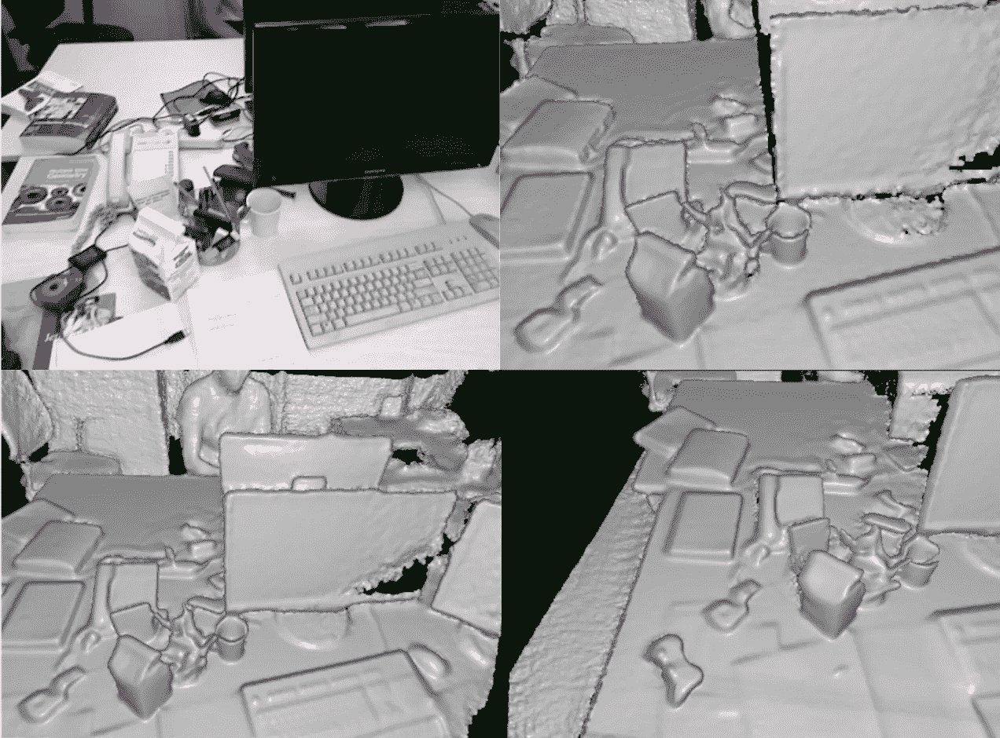
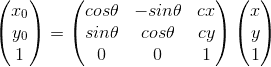
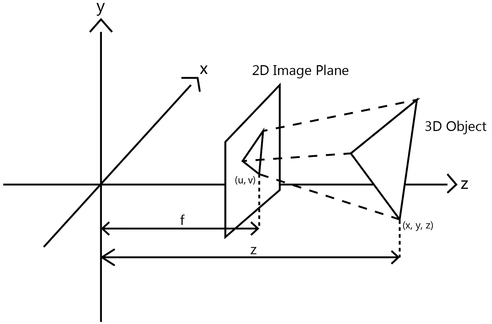
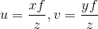
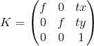
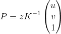
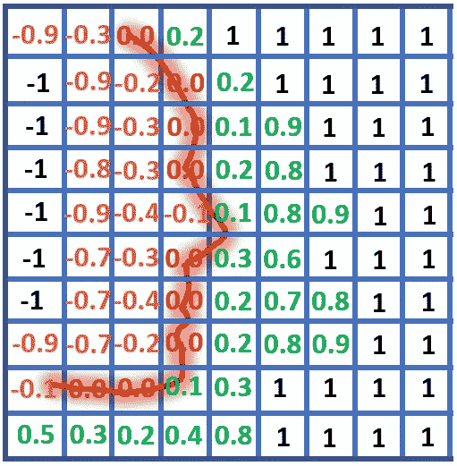

# 了解实时三维重建和动态融合

> 原文：<https://itnext.io/understanding-real-time-3d-reconstruction-and-kinectfusion-33d61d1cd402?source=collection_archive---------0----------------------->

去年，华为的 P30 Pro 智能手机凭借惊人的徕卡 50 倍变焦摄像头震惊了世界，然而这一成就掩盖了这款设备的另一个可能同样令人印象深刻的功能:飞行时间(TOF)背部摄像头。事实上，这款 TOF 相机最初由 XBox Kinect machine 采用，可用于开发实时深度扫描仪来实时重建模型！由于我很难理解提出这种方法的原始论文 KinectFusion(最后的链接)的数学原理，我想分享一下这种 3D 重建算法的整个流程和方法。尽情享受吧！

注意:本文中没有代码片段。整个 KinectFusion 的数学实现可能是漫长而艰巨的，所以我相信引入数学概念和对数据结构的理解会更好。最后提供了 Github 上的实际代码。

# **概述**

三维重建已经成为计算机视觉领域的一个热门研究课题。它的最终目标是基于多幅图像创建 3D 模型，这些图像可以是基于 RGB 或深度的。

KinectFusion 是 2011 年开发的一种较老的传统方法，它试图使用深度图像——给出深度值而不是每个像素的 RGB 值的图像——作为生成整个 3D 模型的唯一输入。

# **先决条件**

这将是我尝试用最简单明了的方式来解释 KinectFusion 的方法。尽管如此，矩阵代数的一点背景知识，如矩阵加法和乘法，将有助于更快更好地理解。下面是两个必要的基本线性代数概念:

**1。矩阵变换**

想象一个有 *x-* 轴和 *y-* 轴的 2D 平面，一个点可以用笛卡尔形式 *(x，y)* 表示。任何平移都可以用一个向量 *(cx，cy)* 来表示，一个点平移后会有一个新的坐标 *(x+cx，y+cy)* 。因此，我们可以使用矩阵计算来表示翻译。同样，旋转也可以通过矩阵来表示，也可以通过旋转矩阵来表示。

把旋转矩阵和平移矩阵结合起来，我们就能推导出一个矩阵方程，把任意一点变换到变换后的新坐标。例如，我们可以将通过 *(x，y)* 的变换计算出的任意点 *(x₀，y₀)* 表示如下:

其中 *θ* 为逆时针旋转的度数， *cx* 、 *cy* 分别为在 *x* 和 *y-* 轴上的平移。需要注意的一点是，这个等式先执行旋转，然后执行平移。

同样的想法可以应用于三维空间；矩阵会更复杂，但概念非常相似。

**2。矩阵投影**

可以通过以下方式查看真实世界对象在相机图像上的投影:

坐标为 *(u，v)* 的图像平面上的像素对应于 3D 对象上的点 *(x，y，z)* ，并且可以使用相似形状的概念通过这样的投影找到:

三维坐标与 2D 坐标的关系方程

因此，我们也可以用矩阵来表示这种计算，也就是广为人知的摄像机固有矩阵 *K* :

其中 *tx* 和 *ty* 是将摄像机置于图像平面中心的偏移量。

投影像素坐标 *(u，v)* 可以通过下式计算:

投影方程

其中 *z* 为点 P *(x，y，z)* 的深度( *z 轴*长度)。

记住这两个概念，我们可以深入到实时三维重建的 4 个步骤。

# **程序 1 —表面测量**

假设我们已经获得了前方物体的深度图。第一件事是通过将深度图中的每个像素转换回其在三维世界中的对应点来计算顶点图和法线图。这可以通过应用于每个像素点的矩阵乘法的逆特性来实现:

重新排列投影方程

然后，通过计算两个相邻顶点的叉积，可以得到一个点的法向量，因为叉积给出了一个与两个顶点都正交的向量。

同样重要的是要知道，传感器检索的深度图通常容易受到噪声的影响，因此原始论文 KinectFusion 在每个像素点上应用了双边过滤器，并使用过滤后的深度图像来计算顶点和法线图。简而言之，这种滤波器消除了噪声，但也防止了其他滤波器经常出现的边缘模糊。

这一表面测量程序将适用于整个过程中检索到的每一张深度图。顶点和法线贴图是相机姿态估计和构建 3D 模型的基本元素。

**实施**

获得深度图像后，将像素的位置视为 *(u，v)* ，深度值视为*z。*根据 TOF 相机设备提供的规格获得 *K* ，通过等式 2 计算三维点。对于 XBox Kinect 机器， *f = 525.0* ， *tx = 319.5* ，*，*， *ty = 239.5。*我们可以创建一个名为*点*的类，并存储它们的一个向量来表示点云。

# 程序 2——绘图和表面重建

为了解释这个过程，我们将首先介绍一个叫做 TSDF 的函数(Trucated Signed Distance Function)。为了解释这一功能，让我们来看看下图中的 2D TSDF:

2D TSDF 函数

中间的红色曲线代表物体的表面，在这种情况下，相机将位于上面网格/像素的右边。SDF 是一个函数，其中每个像素的值由它从对象表面到相机的距离决定，越接近表面，值越接近 0，像素“前面”(更接近相机)的所有值将为正，而“后面”的所有值将为负。TSDF 是类似的，除了我们设置一个阈值，如果一个像素离表面太远，它将自动设置为 1 或-1。这将减少实时重建的实际计算时间，因为我们可以跳过 1。

在三维空间中，TSDF 的概念保持不变，只是我们为每个体素(3D 像素)分配一个值。

但是我们为什么需要 TSDF 呢？因为 TSDF 很容易被熔断。如果我们现在在相同的体素中有两个 TSDF 函数，我们所要做的就是平均每个体素的值，我们将得到一个融合的 TSDF。

**实施**

为了实现 TSDF，我们必须想象在摄像机前有假想的体素。例如，我们可以使用捕获的第一帧，并想象在它前面有 *256x256x256* 体素，代表一个 *2x2x2* m 的空间。在程序中，体素可以由具有 TSDF 值的类*体素*来表示。现在我们可以计算出一个体素对应于图像平面上的哪个像素，如果我们要投影它的话。然后，我们可以获得该像素的深度值，计算长度差，并获得 TSDF 函数。

我们将注意到的一件事是，相应的像素实际上可能不是一个整数。在这种情况下，我们必须对体素投影点周围像素的多个深度值进行平均，以获得更好的深度值。

现在，对于随后的每个相机帧，如果我们有相机的新姿态，我们可以对每个体素执行相机姿态变换的逆变换，以便体素仍然停留在我们第一次创建它们的相同空间中。简而言之，由于我们转动或移动了相机，相同的体素现在将被投影到不同的像素上。因此，我们可以继续将 TSDFs 融合在一起以重建模型！(当然，如果我们有相机姿势，这是 KinectFusion 中最重要的一步。)

# **程序 3——光线投射**

这个过程允许我们在任何我们想要的角度可视化 TSDF，通过发送假想的光线穿过 TSDF 来探测点云的表面。

在这一过程中，我们将从每个像素生成一条假想的光线，该光线沿着朝向 3D 点的方向，通过等式 2 的反投影来计算。光线从像素的最小深度开始(因为任何具有更小深度的 TSDF 将具有值 1)，以体素长度的步长行进(因此中间没有体素被跳过)，并且当存在过零点时停止(从 TSDF 的正值变为负值)。当出现从负到正的变化时，或者当它退出我们在计算 TSDF 时创建的体素空间的边界时，行进也停止。

注意，通过光线投射，我们现在可以得到所有先前 TSDFs 融合的顶点图。我们还可以通过附近体素的 TSDF 值的值变化来计算零交叉表面上的梯度，从而计算法线贴图。我们将它们称为全局顶点图和全局法线图，因为它们将在 KinectFusion 的最后阶段使用——姿势估计——仅通过新的深度图和预先存在的 TSDFs 来估计每一帧的姿势。

**实施**

我们可以从该特定像素捕获的 TSDFS 方向上的每个像素计算单位向量。我们从深度 0 开始发出这条假想的光线，一次移动一个体素长度，并获取光线当前相交的体素的 TSDF 值。当我们遇到过零区域时(正 TSDF 值到负)，我们返回体素的 3D 坐标。

也可以应用插值，因为交点可能不是每次都在体素的中心，但是这种插值的时间复杂度非常高。另一种方法是只取最近的体素。

# **程序 4——姿态估计**

姿态估计是 KinectFusion 算法的最后也是最重要的部分。如果对于拍摄的每个新的深度帧，相机的姿态是已知的，那么我们可以容易地将新的深度帧融合到 TSDF 中，并且随着更多的帧被捕捉，慢慢地生成 3D 模型。

KinectFusion 使用一种称为 ICP 的方法进行姿势估计。ICP 代表迭代最近点，这是一种最小化两个点云之间差异的算法。ICP 背后的数学方程可能很复杂，但想法很简单:慢慢地旋转和平移两个匹配点云中的一个，以便两个云最终根据每个点的向量和法线对齐。

因此，该 ICP 算法可以用于比较由 TOF 相机捕获的新点云与前述全局顶点图。由于捕捉深度图像的帧速率很高，两帧之间的移动将相当小，因此 ICP 将提供对相机如何从一帧移动到另一帧的相当准确的估计。

**实施**

对于新输入的深度图像，我们从**过程 1** 中获得一组顶点和法线图。然后，我们通过光线投射获得全局顶点贴图，并使用 TSDF 内部的梯度获得全局法线贴图。我们通过 ICP 算法比较法线贴图和顶点贴图(这种比较的完整数学解释可以在 KinectFusion 论文的第 3.5 节中找到)，以最终获得相机在拍摄新的深度图像时的旋转和平移。

# 工作流程

因此，程序的总体流程如下:

1.  我们获得第一张深度图图像，执行**过程 1** 和**过程 2** 获得顶点和法线图，并将其存储到 TSDF 中。到目前为止，只获得了一幅图像，因此**程序 2** 中的融合部分可以忽略。
2.  我们获得新的深度图像，并对该新图像执行**过程 1** ，同时用**过程 3** 处理 TSDF，以获得 TSDF 和新深度图像的顶点和法线图。
3.  我们执行**过程 4** 以获得两个点云之间的姿态差异，并在转换新深度图像生成的点云的姿态后，通过**过程 2** 融合 TSDF。
4.  我们重复步骤 2。第三。直到所有深度图像融合在一起形成最终的融合点云。

# 密码

附件是我正在进行的代码。由于这个程序几乎是完全从头开始构建的，ICP 算法中仍然存在一些小错误，希望有一天能够修复。

**代码:**

[https://github.com/ttchengab/KinectFusion](https://github.com/ttchengab/KinectFusion)

您也可以使用 TUM RGBD-SLAM 数据集测试您自己的 KinectFusion 程序，该数据集可在以下位置找到:

[https://vision.in.tum.de/data/datasets/rgbd-dataset](https://vision.in.tum.de/data/datasets/rgbd-dataset)

# 结束注释

3D 重建是一个计算机视觉主题，由于其复杂的数学计算，很少被讨论。希望这篇文章给你一个最有影响力的 3D 重建方法的基本概述。希望在不久的将来，我可以介绍一些其他的计算机视觉主题或 3D 重建的深度学习方法！

*KinectFusion 论文:*

[https://www . Microsoft . com/en-us/research/WP-content/uploads/2016/02/ismar 2011 . pdf](https://www.microsoft.com/en-us/research/wp-content/uploads/2016/02/ismar2011.pdf)

*如果你喜欢这篇文章，确保你*👏为了让更多的人也有机会阅读它！