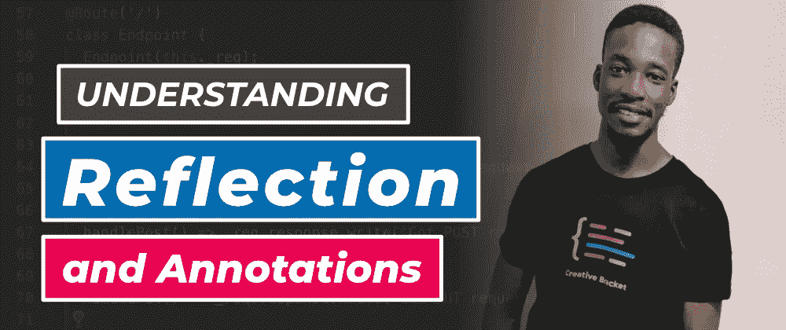

# 了解 Dart 中的反射和注释

> 原文：<https://itnext.io/understanding-reflection-and-annotations-in-dart-f1e28efdb064?source=collection_archive---------1----------------------->

## 编写复杂软件的更简洁的方法



在这个视频中，我们将探讨反射的主题，以及如何使用它来编写更干净的软件。反射允许我们在运行时检查和修改程序的结构和行为。我们将使用 **dart:mirrors** 库，它包含了实现这一点的帮助类和函数。最后，我们将看一个带有**注释**的常见用例。

# 带反射的基本示例

创建一个`main.dart`文件，并从导入我们的 **dart:mirrors** 依赖项开始。在我们实现我们的反射逻辑之前，让我们也用我们希望调用的方法定义一个类:

```
**import 'dart:mirrors';****main**() { 
  **// TODO: Implement Reflection logic** 
} // Our example class to reflect on 
class **Endpoint** { 
  handle() => print('Request received'); 
}
```

为了反映类型和对象，我们有三种方法可以使用:

1.  `**reflect()**`:反映一个类的实例
2.  `**reflectClass()**`:反映在一个类声明上
3.  `**reflectType()**`反映作为参数传入的类型

在我们的用例中，我们将使用。让我们实例化`Endpoint`并通过反射调用句柄方法:

```
main() { 
  var reflectedClass = **reflect**(Endpoint());   // Invoke the handle() method    
  reflectedClass.**invoke**(Symbol('**handle**'), []); 
}
```

然后让我们运行这个文件:

```
**$** dart /path/to/main.dart
```

反射实例为我们提供了一个公开`invoke()`方法的`InstanceMirror`。我们实例的成员被描述为`Symbol`类型。上面的例子通过传递它的`Symbol` ic 名和一个位置参数数组(如果指定了的话)来调用 handle 方法。

为了传递参数，让我们修改`handle()`方法的签名:

```
handle(**String a**) => print('Request received **$a**');
```

并将它传递给调用:

```
reflectedClass.**invoke**(Symbol('handle'), [**'argument 1'**]); 
// => Request received argument 1
```

您也可以使用文字形式的`handle()`符号:

```
reflectedClass.invoke(**#handle**, ['argument 1']);
```

如果方法名作为一个操作的值被接收或者作为用户输入被提供，那么您可以使用`Symbol('methodName')`方法。*理想地当你* ***不*** *预先知道该调用的方法。*

查看上面视频中的完整教程。

→ [**获取源代码**](https://gist.github.com/graphicbeacon/9fb6c6a951168d6a31d9b2cc442bcbe2)

# 进一步阅读

*   [**镖:镜像**库文档](https://api.dart.dev/stable/2.4.0/dart-mirrors/dart-mirrors-library.html)
*   [Dart 和 MongoDB 教程#1:使用 mongo_dart 包](https://creativebracket.com/dart-and-mongodb-tutorial-1)

# 最后一件事…

非常感谢我收到的越来越多的兴趣、支持和反馈！

有鉴于此，我今天推出了 [**官方商城**](https://bit.ly/creativebracketmerch) 。这是一个很好的机会成为运动的一部分，并保持火焰🔥真实的这将推动高质量内容的生产，涵盖的主题将超越“hello world”应用。

我还在 YouTube 频道上点击了 800 多个订户。 [**点击订阅并响铃通知**](https://youtube.com/CreativeBracket) 如果你还没有。我计划很快做一个关于代码生成的系列文章。

**喜欢、分享并关注**我，了解 Dart 的更多内容。*谢谢。*

*原载于*[*creativebracket.com*](https://creativebracket.com/understanding-reflection-and-annotations-in-dart/)*。*