# 理解 Git 中的引用、分支和悬空提交？

> 原文：<https://itnext.io/understanding-refs-branches-and-dangling-commit-in-git-192251773c7c?source=collection_archive---------0----------------------->


只是一个免费的股票图像

你有没有想过“HEAD”在 git 上是怎么工作的？如何分配、切换和创建分支？什么是超脱头状态？只要耐心听我说几分钟，你现在就不会为将来的事情烦恼了(如果你是个天才，从不犯错的话)。

如果你理解这篇文章，你就能完全理解重置、重置和恢复的概念。

**一些你应该已经知道的知识**

*   什么是提交？(只是感觉，不是定义)

(如果你已经知道，跳过)提交只是保存在一个项目中的更改，每次你改变一个文件，它会通过给它分配一个唯一的哈希(随机 40 个字符，几乎是唯一的)来跟踪这些更改，就像你在游戏中保存的检查点，可以在任何检查点开始游戏。

**参考文献**

> 引用是指向提交的指针。

就是这样。但是让我们从另一个角度来看:

每个启用 git 的项目都有。git 文件夹，所有脏活都在这里完成，所有关于 refs 的数据都存储在这里。

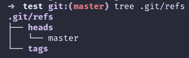

参考文献

所以如果你看到。git/refs 存储所有引用的地方，你会发现有两种类型的引用

*   分支(头)
*   标签(这个我就跳过了，因为如果你知道参考文献就容易了)

他的“heads”文件夹有称为 branch 的引用，这里目前只有 branch: `master`。

**那么，什么是分支呢？**

> 分支只是一个指向特定提交的指针。

让我们深入了解一下。我假设你知道如何在项目中提交变更(`git add .&&git commit -m "your message"` )。我创建了一个 git 启动的项目，添加了一个文件名" *hello.txt "，*，并使用不同的消息提交它，如下所示:

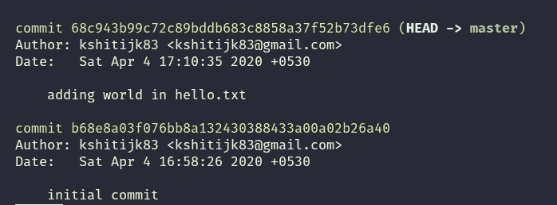

git 日志

并且这两个提交是关联的，因为最近的提交将具有作为其之前的前一个提交的父提交。这意味着:

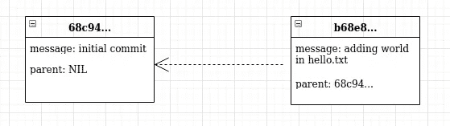

第二次提交的父项是第一个

一个**分支**仅仅是指向其中一个提交的可移动指针。Git 中默认的分支名叫做`master`。当您开始提交时，您会得到一个`master`分支，它指向您上次提交的内容。每次提交时，`master`分支指针会自动向前移动。

所以，目前`master`指向这个提交:

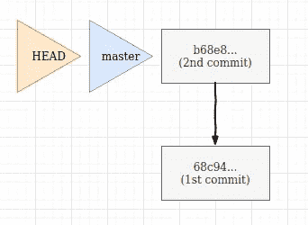

状态 1

**那么什么是头呢？**

`HEAD`git 是如何知道你当前正在哪个分支工作的。这是一个指向当前分支名称的指针。当您签出一个新分支或提交一个分支时，它会自动移动。如果它在你头上，让我们实际地看它。

现在假设我们当前的项目处于*状态 1，如上图所示，让我们创建一个新的分支*

```
git checkout -b branch1
```

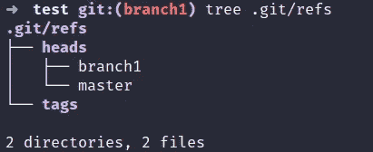

我们目前有哪些分支机构

现在我们有两个分支机构。git/ref/heads。而我们现在的分支是`branch1`。

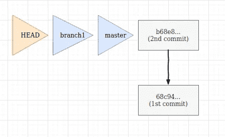

状态 2

`branch1`被创建，它指向与`master`所指向的相同的提交(最后一次提交)。而现在`HEAD`正指向 branch1。

如果你想知道`HEAD`当前指向哪里，你可以通过查看“头”文件在。git 文件夹。

```
cat .git/HEAD
```


head 指向存储所有引用的 refs 文件夹中的 branch1。

现在，如果我在处理`branch1`时提交另一个工作，会发生什么？

```
echo "change on branch1">hello.txt
git add .
git commit -m "commit 3"
```

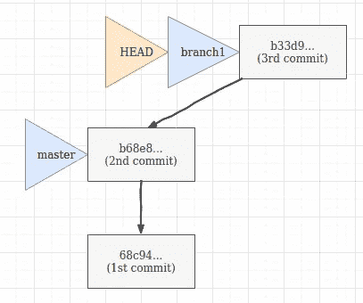

`HEAD`将随其指向的当前分支移动，即`branch1`。

所以如果我移回主位，`HEAD`也移动并指向主位，那么我们可以说:

> 是一个指针，通常指向我们正在处理的当前分支，因此被证明！！(对，对！).

回到 master 后，您再次提交一些内容，这些内容将出现在 master 分支上，如下所示:

```
git checkout master // switched to master
echo "changing the master branch file">hello.txt
git add . && git commit -m "change content in master branch"
```

现在这将会发生:

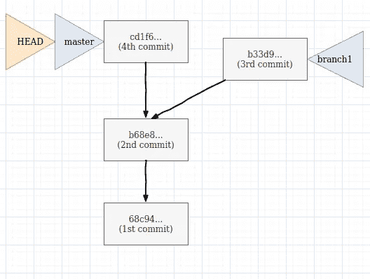

但是如果您想查看特定提交的内容呢？这是给你的奖金，如果你已经到达这里(谢谢！).

**无头/脱头状态？**

如果您想查看第一次提交的内容，那么您将检查该特定提交。

git 会做什么，它会将`HEAD`指向提交

```
git checkout 68c94
> // You are in 'detached HEAD' state...
```

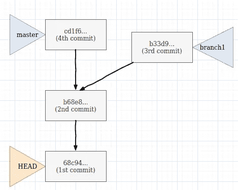

状态 5

现在，第一次提交时的内容在“hello.txt”文件中，因为我们及时返回了！！！。你可以看到`HEAD`现在指向哪里

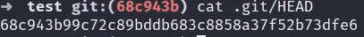

标题指向提交

你可以通过这个回到师父那里:

```
git checkout master
```

但是如果你想在分离状态下改变一些东西并提交

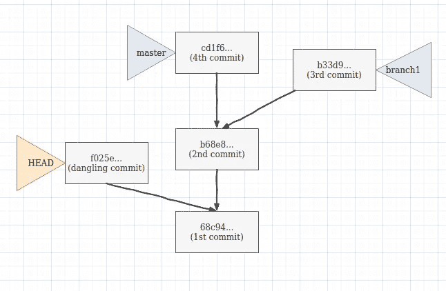

状态 6

现在`HEAD`将指向该提交，但是由于该提交没有任何分支引用它，并且如果我们回到主分支，该提交将被垃圾收集，因此被称为**悬空提交**。

感谢阅读这篇文章！如果你有任何疑问或任何疑问，请随时打电话给我。

我的下一篇文章将理解 git 的重置、复位和恢复。敬请期待！！