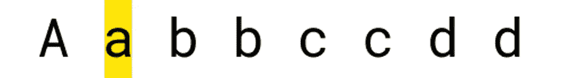
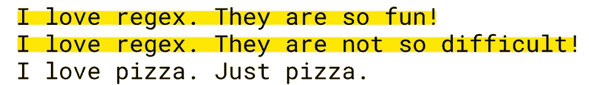

# 理解 JavaScript 中的正则表达式(简单的方法)

> 原文：<https://itnext.io/understanding-regex-in-javascript-the-easy-way-ad0e5888a3ec?source=collection_archive---------0----------------------->

不要被 RegEx 吓到！他们比你想象的要容易！

[Caleb Minear](https://unsplash.com/@calebminear) 在 [Unsplash](https://unsplash.com) 上拍摄的照片

在计算机科学中，有些话题听起来可能比其他的更可怕。详细地说，正则表达式一开始可能听起来令人难以置信地可怕…但是一旦你学会了，你会发现它们非常容易和有用！

# 为什么我需要正则表达式？

首先:什么是正则表达式？正则表达式是定义搜索模式的字符序列。

举个例子:我们有一个既包含数字又包含字母的字符串，我们想删除每一个非字母字符。

如何删除这个字符串中的所有数字？这看起来不是一个好的解决方案:

当然，上面的代码可以工作…但是我认为我们可以使用一个简单的正则表达式做得更好:

这更容易实现、阅读和测试！但是它是如何工作的呢？在 JavaScript 中，正则表达式有两种定义方式:

*   在两个斜线之间书写正则表达式:`/myregex/g`
*   使用`RegExp`类:`const re = new Regexp("myregex", "g");`

让我们写下几个例子:

你能看出不同之处吗？

*   使用`RegExp`类，我们可以传递一个字符串作为第一个参数。这意味着我们可以编写更多的动态正则表达式！
*   在`RegExp`类中，反斜杠(`\`)字符被用作转义字符。所以，如果你想使用(例如)“全数字”字符(`\d`)，你必须对它进行转义(`\\d`)。

# 正则表达式方法

一旦我们编写了正则表达式，我们就可以使用它们，这要感谢四种不同的内置方法:

exec`exec`方法在字符串中的正则表达式之后执行匹配搜索:

如您所见，即使我们使用了全局标志(`g`)，它也会在第一次出现后停止。

与`exec`方法类似，`match`将根据您的正则表达式返回一个匹配数组:

toString `toString`返回正则表达式的字符串表示:

test `test`将只对一个字符串运行正则表达式，并根据匹配返回一个布尔值:

# 编写正则表达式

正如我以前说过的，RegEx 一开始听起来可能很吓人，但是信不信由你，一旦你习惯了，它们会变得非常容易！让我们从基础开始，看一些正则表达式的例子:

我们可以编写一个匹配任何字符的正则表达式，只需在正则表达式中写入所需的字符:

如您所见，这个正则表达式只匹配第一个小写的`a`字符。如果我们想匹配小写和大写字符呢？

我们可以在正则表达式后面加上`i`(不敏感)标志！但现在我们有一个问题，我们只是匹配第一次出现！让我们通过添加`g`(全球)标志来解决这个问题:

现在我们要匹配以下任何一个字符:`a, b, c`

厉害！我们只需要把我们想要的字符放在两个方括号内，RegEx 引擎就会匹配每个字符！如果我们想匹配所有不等于下列字符的东西怎么办:`b, c`？

如此简单！只需在两个括号内添加`^`字符，RegEx 引擎就会阻止这些字符匹配！

现在，假设我们想要检测以下面的字符串开始的每一行:`"I love regex"`:

当写在正则表达式的开头时(在两个方括号之外)，`^` char 的意思是“开始于”。注意，我们还使用了`m` (multiline flag)来在多行上运行我们的正则表达式！但它是如何匹配整个系列的呢？我们用`.+`结束了正则表达式，意思是“匹配所有内容直到最后”。其实点 char ( `.`)的意思是“任意 char”，`+`的意思是“无限重复前面的匹配”。所以，这两个字符将匹配所有内容，直到字符串结束！

但是如果我们想要停止“无限”匹配呢？

超级容易！我们的正则表达式引擎从左到右读取正则表达式，因此上面的正则表达式将被解释为“匹配双引号字符，然后匹配所有内容，直到下一个双引号字符”。

# 正则表达式引用

我们只是触及了正则表达式的皮毛…不可能有一篇文章可以教你如何编写超级强大的正则表达式！但是我们必须从某个地方开始