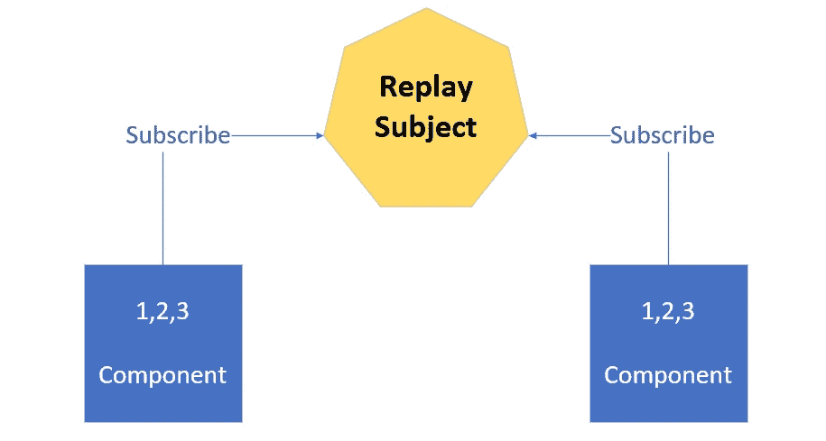
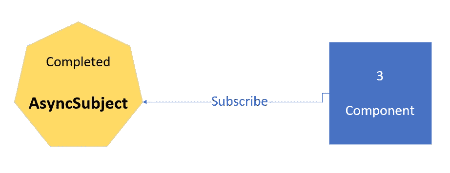
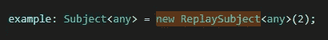

# 了解 RxJS 主题

> 原文：<https://itnext.io/understanding-rxjs-subjects-386605ad2bdb?source=collection_archive---------2----------------------->

嘿伙计们。今天我在这里讲的是 [RxJS](http://reactivex.io/) 科目。我希望在这篇文章结束时，你会更清楚主要的区别。😊

# 介绍

如你所知，RxJS 为我们的角度应用带来了许多出色的功能，我真正喜欢的一点是它对主题的支持。我们将关注四种主要类型的主题，第一种是普通的**主题**，我们将讨论它的作用和用途。然后我们再来说说**行为主体**、**回放主体**和**异步主体**。

# 科目

提供一种向侦听器发送一个或多个数据值的方法。现在，**主题**与我们将要讨论的其他主题的不同之处在于，如果另一个组件订阅了，但后来他们不会获得之前发送的所有数据。让我给你看一个例子:

假设我们有右边的这个组件，它订阅了。**主题**然后向下发送一些数据，例如数字 1。与此同时，左边的组件没有订阅，所以它当然没有得到数字 1。现在让我们假设它确实订阅了，而现在 2 是从主题**发出的。因为他们都被订阅了。因此，使用**主题**，你只有在订阅后才能获得数据。你不会得到任何以前的数据，这将是主题**与其他主题**的区别之一。**

# 行为主体

与**主题**非常相似，除了它有一个**主题**没有的大特点。稍后进入流程的订阅者仍然可以获得一些先前的数据。

看前面的图片，假设右边的组件订阅了，我们得到了数字 1。如果左边的组件要订阅，他们不会得到数字 1 或 2，因为它已经被传递了，左边的组件没有信息。这里的要点是，最后发出的值仍然可以被稍后订阅该流的人检索到。例如，我们已经讨论过 1 和 2 已经被发送到右边的组件，但是如果左边的组件现在订阅，它们将获得最后发出的值。所以，那就是数字 2。然后他们会得到任何未来的值，正如你在之前的图像中看到的。**主题**和**行为主题**的最大区别在于，使用**主题**时，你只能在订阅后获得数据，而不能获得之前的任何数据。使用 **BehaviorSubject** 你可以获得最后发送的值，即使你在 10 分钟后订阅。

# 重播主题

作为**行为主体**，**重放主体**也可以重放发送给任何新订户的最后一个值。不同的是，如果你愿意，它还可以重放所有以前的值。您可以将此视为缓存任何已发送的数据，以便订阅的任何其他组件仍然可以获得该数据。

想象一下，我们订阅，我们得到数字 1 作为数据，数字 2 也是。然后，左边的组件现在订阅。现在，如果是一个**主题**，我们知道他们不会得到任何东西。如果是一个**行为主题**他们会得到最后一个，但是有了 **ReplaySubject** 我们可以向这个新订阅者重播所有以前的项目。因此，在这个例子中，1 和 2 已经被发送到正确的组件，被重放。现在，数字 3 是一个新的数据，因为他们都订阅了，所以他们都会得到它。如果您想向流程中的后期订阅者重放一个数据序列，这将是非常强大的。

# async 主语

这和其他的很不一样。使用 **AsyncSubject** ，您只需要主题完成时的最后一个值。假设我们有一堆可以发送出去的值，但是你只对最新的值感兴趣。看看我们之前的例子，假设我们订阅了，1 被传递出去了。我们不会得到那个价值。然后 2 出来，同样的行为发生。假设 3 是最后一个值，然后 **AsyncSubject** 完成。它允许我们的组件获取最后一段数据，忽略所有其他数据。

这用于我们的组件或已订阅的组件需要最后最相关的数据的任何情况。

# 结论

一篇小评论😊。

*   通过**主题**，我们向订阅的观察者发送数据，但任何之前发出的数据都不会像您稍后订阅的那样发送。你只能获得订阅后的数据。
*   **BehaviorSubject** 允许你将最后一段数据发送给任何新的观察者，任何新的订阅者。这样，他们仍然可以保持同步。他们不会有所有以前的值，但至少他们有最新的值。
*   使用 **ReplaySubject** 我们可以回放之前发送的所有内容。
*   最后， **AsyncSubject** 向订阅者发出最后一个值，并且当发出的数据序列实际完成时，只发出最后一个值。

不管你需要什么，这是你需要了解的四大类主题。

**提示:**你可以这样配置你的 **ReplaySubject** ，例如:

这将为您提供发出的最后两个值。当你不需要所有的值时，这很酷，但是**行为主体**也不能满足你的需要。