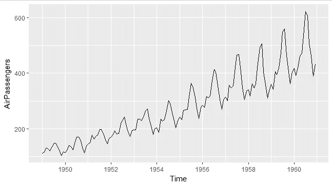
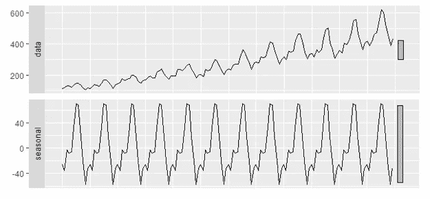
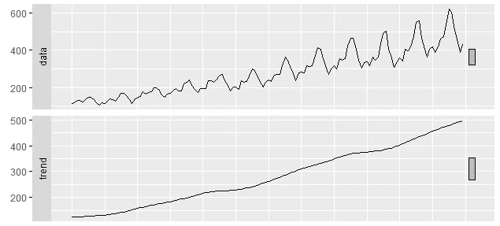
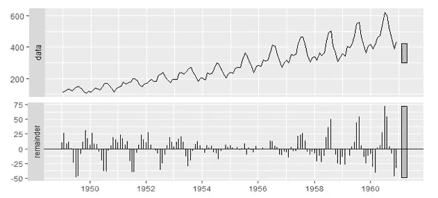
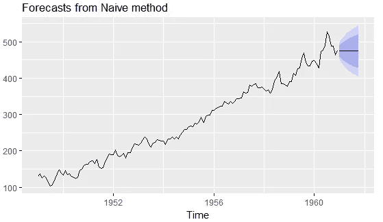
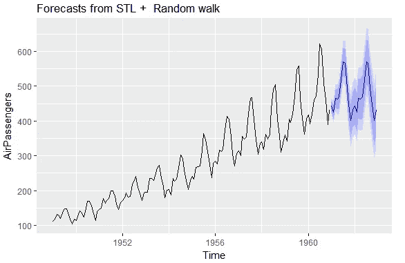
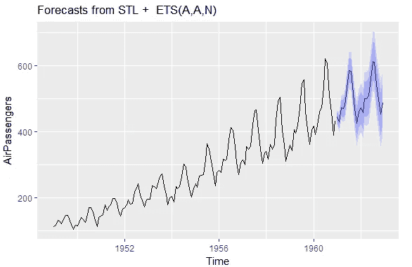
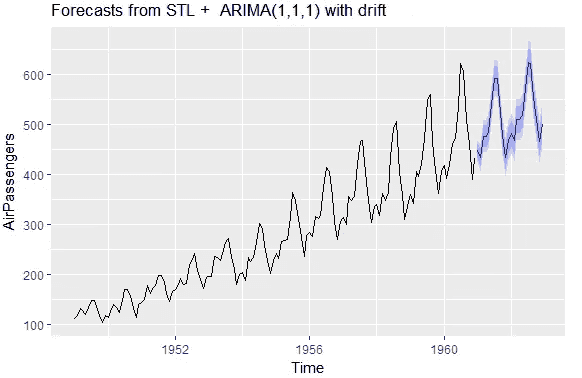

# 了解预测算法:STLF 模型

> 原文：<https://itnext.io/understanding-the-forecasting-algorithm-stlf-model-29d74b3a0336?source=collection_archive---------2----------------------->

*根据历史信息预测未来*

## 介绍

让我们从理解什么是预测开始？这是对未来价值的最佳预测，提供了从历史数据中学到的洞察力。尽管听起来很简单，但每种预测算法都试图这么做，可惜假设不同。正在讨论的 STLF 算法试图预测未来，其基础是假设一个时间序列存在不同的属性，以及这些属性有多深。让我们理解这些属性。

## STLF 模型

使用黄土预测模型可以将 STLF 定义为季节和趋势分解。那是满嘴的。但是完整的过程可以分为分解和预测，其中一个为另一个铺平道路。STLF 模型假设时间序列可以分解为误差、趋势和季节性成分。因此，如果在原始时间序列中寻找模式是困难的，分解可以使这个过程变得稍微容易一些；如果我们能够复制未来的分解模式，预测只不过是重新组合组件。让我们了解每个组件及其含义，

1.  **趋势:**当数据长期增加或减少时，趋势存在。它不必是线性的。
2.  **季节性:**当时间序列受到季节因素(如一年中的某个时间或一周中的某一天)的影响时，就会出现季节性模式。季节性总是有一个固定和已知的频率。
3.  **错误:**它是我们从时间序列数据中移除趋势和季节性后剩余的随机值。误差项中不应该有模式，如果有，那么我们在分解方面做得很糟糕。

## 分解

现在我们对组件有了基本的直觉，让我们理解分解过程。在这篇文章中，我们考虑了从 1949 年到 1960 年提供每月乘客数量的航空乘客数据集，它看起来像这样，

11 年的航空乘客月度数据集

嗯，数据中似乎有某种模式。让我们试着分解时间序列，首先从，

**季节性:**一般来说，如果数据集的季节性由`x`个点(周期)组成，那么平均季节性可以通过取所有`i + (i+x) + (i+2x) + …`个点的平均值来计算。让我们看看我们的数据集是否有季节性。为此，让我们把每个月的数据画出来。

每年航空旅客数据集的月图。

从图中我们可以看出，从 1 月到 2 月，似乎有一些下降，然后当我们接近 7 月时，乘客数量似乎有所增加，从 8 月开始，我们看到乘客数量下降，然后在 12 月再次增加。由于这种模式在许多年中都很明显，我们可以得出结论，我们的数据具有年度季节性。因此，在我们 11 年的月度数据中，季节性可以通过取每年的 1 月、2 月等的平均值来计算。复制平均数据来覆盖数据的大小，我们得到这个，

航空旅客数据集的季节性分解

**趋势:**趋势计算无非是平滑数据，对应的是用一个点来表示一桶数据点。这可以帮助我们确定数据的总体趋势。这可以通过移动平均(取一桶数据的加权平均)或黄土平滑(使用局部加权回归来拟合点)来实现。正如 STLF 的定义所暗示的(L 是黄土)，我们在这里将偏好黄土平滑。现在的问题是桶的大小应该是多少，为此将进行局部回归。一个直观的方法是保持它与季节性周期的长度相同。这样我们就否定了趋势成分中的季节性；任何趋势模式都可能与另一种预测洞察力有关。对于航空旅客数据集，由于季节性是每年一次，因此周期将为 12(一年中的月数)。我们将用这个桶的大小进行平滑。最终的趋势看起来像这样，

航空旅客数据集的黄土平滑趋势计算

**错误:**这是你从原始数据集中去掉趋势和季节性后得到的结果。因此，在计算完剩余的成分后，将它们从数据集中移除，剩余的假定随机值是错误的。

航空乘客数据集的错误组件

## 预测

现在我们已经有了所有需要的组件，让我们考虑如何使用这些知识来预测未来的值。谈到季节性，这是我们在数据中发现的模式，由于这种模式在过去几年中重复出现，我们可以假设明年也会发生同样的情况。所以让我们保持季节性不变。现在对于剩下的部分，让我们把趋势和误差结合起来，称这个结合为季节调整数据(因为它是原始的减去季节，明白吗？).现在，如果我们能够在这里做一些预测，我们将关注趋势。从数据中可以明显看出，整个数据中的趋势是增加的，如果我们能够预测未来的趋势，并将其与预测的季节性(这只是去年季节性的平均值)相结合，我们就预测了明年看不到的航空乘客数据集！

现在，要预测季节性调整数据，有很多选择，从使用朴素方法估计模型到甚至 ARIMA 模型。但是为了保持这篇文章的简单，因为我们还没有谈到其他的预测模型，让我们在这里使用简单的方法。简单方法表明预测值与最后的明显值相同。

基于朴素预测的航空旅客季节调整数据

现在，当我们将这些数据与计算出的季节数据结合起来时，我们得到了飞机乘客的预测数据，看起来像是，

基于朴素方法的航空旅客数据预测

**结论**

不错，因为我们能够识别和复制季节性，但仍有一些点需要关注。从图中我们可以得出以下结论，

*   趋势完全消失，预测值直线上升。
*   季节性也是不变的，但从数据中可以明显看出，它应该在增加。

那么这里出了什么问题呢？一个字的回答，幼稚的方法。一般来说，STLF 是非常基本但功能强大的预测技术。只要将它们与 ETS 和 ARIMA 结合起来进行季节性调整的数据预测，你就会得到对大量数据的最先进的预测。现在，我们在这里使用的是天真的方法，它有缺点，如它不能模拟趋势，这是显而易见的预测图，因为现在的未来值看起来直。除了 naive 之外，使用 STL 的任何其他组合都超出了讨论范围，但是为了展示 STL 的威力，让我们看看它们会是什么样子。

使用 ETS 进行季节性调整数据的航空乘客预测

使用 ARIMA 季节调整数据的航空旅客预报

也许在另一篇文章中，我们可以讨论每一种方法，以及为什么它们优于简单的方法。

## 参考

[1]预测:原理与实践— *罗布·J·海曼和乔治·阿萨纳索普洛斯*