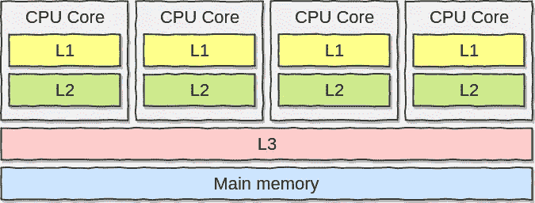
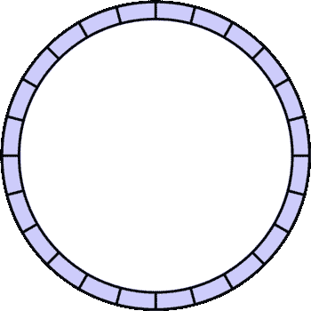
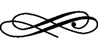

# 了解 LMAX 干扰器

> 原文：<https://itnext.io/understanding-the-lmax-disruptor-caaaa2721496?source=collection_archive---------0----------------------->


演职员表: [pixabay](https://pixabay.com)

L MAX Disruptor 是金融交易平台公司 [LMAX Exchange](https://www.lmax.com) 编写的[开源](https://github.com/LMAX-Exchange/disruptor) Java 库。这是一个优雅的，尤其是高性能的线程间消息传递解决方案。

在这篇文章中，我们将首先描述与跨线程共享内存和传统排队系统相关的问题。然后，我们将尝试了解 LMAX 干扰器的特别之处，以及如何使用它。


*   LMAX Disruptor 解决方案比 Java `ArrayBlockingQueue`和`LinkedBlockingQueue`更快。
*   机械同情(对底层硬件的良好理解)应该会让你成为一个更好的开发者。
*   线程间共享内存容易出问题，需要小心操作。
*   CPU 缓存比主内存快，但是对它们的工作原理(缓存线等)理解不深。)会毁了你的表现。

# 共享记忆的幻觉

让我们从一个简单的用例开始。我们需要使用一个循环将计数器从 0 递增到`MAX`:

因为`MAX`可能很大，而且我们可以在多核处理器上运行这个程序，出于性能考虑，我们可能希望将这个任务分成两个独立的线程。大概是这样的:

然而，这种实现有两个主要问题。

首先，让我们用等于一百万的`MAX`运行它多次。显然，我们期望打印`counter=1000000`，不是吗？

```
counter=522388
counter=733903
counter=532331
```

由于变量`sharedCounter`上的竞争条件，执行是不确定的。

当结果依赖于进程/线程的顺序或计时时，就会出现争用情况。在这种情况下，因为`sharedCounter`被两个线程**同时修改，没有任何保护**。

其次，关于性能。如果`MAX`被设置为一个足够大的值，使得两个线程的管理可以忽略不计，执行仍然比慢 3 倍以上。原因是什么？

由于两个线程都是 CPU 密集型的，操作系统很可能会将它们安排在两个不同的 CPU 内核上。此外，我们可能认为运行在两个不同内核上的两个线程可以自由共享内存。然而，我们已经忘记了 **CPU 缓存**的概念:



记忆层

CPU 将在其内部缓存中缓存数据，而不是每次都查询 DRAM 来访问内存地址:本地 L1 和 L2 缓存以及远程共享的 L3 缓存。

让我们来看看酷睿 i7 至强 5500 处理器的一些[数据](https://software.intel.com/sites/products/collateral/hpc/vtune/performance_analysis_guide.pdf):

当一个处理器想要访问一个内存地址时，它将首先检查 L1。如果它不在那里，它将产生一个**缓存未命中**，这意味着处理器将在 L2 进行检查。L2 和 L3 也是如此，处理器最终会签入比 L1 慢 60 倍的 DRAM。

在我们的例子中，因为`sharedCounter`由两个 CPU 内核同时更新，它将在两个本地 L1 缓存之间反弹变量，这将大大降低执行速度。

最后，关于 CPU 缓存，还有一个重要的概念需要理解:它们被组织成**缓存行**。

高速缓存行是连续字节的 2 的幂，通常是 64 个字节。它作为一个非链式哈希映射来管理，内存中的每个地址都被分配给一个给定的缓存行。

让我们以两个变量`x`和`y`为例，这两个变量由两个不同内核上调度的两个线程访问。几秒钟后，第一个线程修改了`x`，第二个线程修改了`y`。

如果两个变量都是同一高速缓存行的一部分(散列它们的地址给出相同的高速缓存行)，第二个内核将看到其整个行被标记为**无效**，即使程序只对`y`感兴趣而不是`x`。因此，第二个内核将从其他地方(L2、L3 或 DRAM)获取该行的更新副本。

这个问题被称为**假共享**，将导致严重的性能损失(尽管 CPU 将保证执行是确定性的)。

# 并行执行

C 当前执行的代码必须首先保证**互斥**。这意味着访问同一资源的多个线程需要协调。

此外，当进行更改时，必须将其标记为对其他线程可见。这叫做**变化的可见性**。

这是并发的两个主要概念。

## 互斥现象

**锁定**是实现互斥的一种可能的解决方案。然而，它们非常昂贵，因为满足时需要仲裁。这种仲裁是通过上下文切换到操作系统来实现的，操作系统将挂起等待该锁的线程，直到它被释放。


演职员表:【ancientpages.com 

此外，在此上下文切换期间(但也在将控制释放给可能决定做其他任务的 OS 时)，执行上下文可能会丢失先前缓存的数据和指令。

让我们检查一些[数字](http://lmax-exchange.github.io/disruptor/files/Disruptor-1.0.pdf)来理解在一个循环中运行 5 亿次的 64 位计数器的锁的影响:

锁的替代方法是 **CAS** (比较和交换)操作。CAS 操作是一种机器指令，它允许将[字](https://stackoverflow.com/a/7750439)有条件地设置为原子操作(全有或全无)。

简而言之，变量的旧值和期望值是作为参数提供的。在操作结束时，如果新值与预期值匹配，则变量被更新。否则，由线程决定是否重试另一个 CAS 操作。

在 Java 中，`AtomicInteger`这样的`Atomic*`类就是基于这个操作的。

让我们比较一下性能结果:

最后但同样重要的是，值得一提的是，如果关键部分(受保护的部分)不适合单个原子操作，它将需要多个 CAS 操作的编排，并且处理起来会更加复杂和昂贵。

## 变化的可见性

变更的可见性可以通过**内存屏障**(也称为内存栅栏)来实现。

> 存储器屏障使 CPU 对屏障指令之前和之后发出的存储器操作实施排序约束。
> 
> 来源:维基百科

为什么我们需要这样的机制？出于性能原因，大多数现代 CPU 采用性能优化，这可能会导致无序执行。

让我们回到第一个例子:

在这个例子中，何时更新循环计数器并不重要，因为循环中没有操作使用它。CPU 可以自由地**重新排序指令**以优化执行性能。

这种重新排序在单线程执行的情况下不是问题，但在并发执行的情况下可能变得不可预测。

这就是记忆障碍的目标:

*   确保从另一个 CPU 内核观察屏障两侧的所有指令时，它们以正确的顺序出现。
*   通过将数据传播到底层缓存使内存可见。

有不同类型的记忆障碍:

*   Read:为屏障前排序的写操作提供一致的视图。
*   写:给出屏障前商店运营的有序视图。
*   满:阅读和满栏的组合。


演职员表:[barriersdirect.co.uk](http://barriersdirect.co.uk)

在 Java 中，使用一个 *volatile* 字段在我们写入它之后插入一个写屏障指令，在我们读取它之前插入一个读屏障指令。同时，一旦构造函数完成，一个类的 *final* 字段使用写屏障变得可见。

也可以从*不安全*库中访问这些指令。

让我们修改我们的多线程实现，在访问`sharedCounter`之前使用读内存屏障，在访问之后使用写内存屏障:

让我们在`MAX`等于 100 万的情况下再次运行这个实现。请记住，我们仍然期望在执行结束时打印`counter=1000000`:

```
-- First multi-threaded implementation without a memory barrier
counter=522388
counter=733903
counter=532331-- New implementation with memory barriers
counter=999890
counter=999868
counter=999770
```

正如我们所见，由于记忆障碍，我们越来越接近预期结果，这是不可否认的影响。然而，执行是不确定的，因为内存屏障仍然不足以防止非原子操作的竞争情况。

# 传统队列


演职员表:[chipverify.com](http://chipverify.com)

线程间共享内存的另一种选择是消息传递范例:**通过通信共享内存**。

这意味着我们需要线程间的东西来处理通信。解决方案之一是使用传统的**队列**，比如 Java 中的`LinkedBlockingQueue`或`ArrayBlockingQueue`。

然而，它不能解决并发问题，因为即使是队列也必须确保互斥和变化的可见性。

如果我们看一下`ArrayBlockingQueue`的`put`方法，我们可以验证这两个方面都得到了处理:

对队列的访问被锁定，并且一旦添加了元素，就向等待的线程发送信号。

非常有趣的是，LMAX 团队注意到，通常情况下，由于消费者和生产者之间的速度差异，队列往往**总是接近满或接近空**。这种现象导致了高度的争用和/或昂贵的高速缓存管理。

如果队列接近满，将导致生产者之间的争用，导致上下文切换，并且可能丢失缓存的数据和指令。

此外，在传统的排队系统中，生产者要求队列的头，而消费者要求队列的尾。如果队列接近空，很可能头、尾和队列大小都属于**同一条缓存线**，这可能导致上述假共享问题。

# LMAX 干扰器


LMAX 干扰器的创造者也因发明了机械共鸣的概念而闻名。简而言之，在设计算法、数据结构等方面，理解底层硬件应该使你成为一名开发人员。基于这一理念，该团队已经能够创建这个伟大的库:

> 与同类方法相比，中断器的写入争用显著减少，并发开销更低，缓存更友好，所有这些都导致吞吐量更高，抖动更少，延迟更低。
> 
> 来源:[干扰器技术论文](https://lmax-exchange.github.io/disruptor/files/Disruptor-1.0.pdf)

我们来试着分析一下原因。

首先，中断器基于一个 [**环形缓冲区结构**](https://en.wikipedia.org/wiki/Circular_buffer) (也称为循环缓冲区)，这是一个简单的固定大小的缓冲区，就好像它是端到端连接的一样:



环形缓冲结构

启动时，根据提供的大小(必须是 2 的幂)和初始化事件的工厂来分配内存:

这里，我们在启动时分配了`MyEvent`类的`ringBufferSize`个实例。

同时，我们提供了一个为事件处理器创建线程的工厂和一个定义如何处理慢速订阅者的等待策略(这些策略在这里[描述](https://github.com/LMAX-Exchange/disruptor/wiki/Getting-Started#alternative-wait-strategies))。稍后我们将讨论生产者类型。

事件实例将被重用，并在`Disruptor`实例的持续时间内存在，以消除**垃圾收集**的问题，因为在传统队列中，事件可能会存在更长时间。

在内部，环形缓冲区由对象数组支持。据创造者说，这是有充分理由的。在硬件级别，阵列具有可预测的访问模式。这些条目可以预加载，所以处理器不会不断地回到主存储器来加载环中的下一个条目。这样，我们可以比用链表支持的队列更有效地迭代。

配置使用者可以这样完成:

我们为`handleEventsWith()`提供了一个 lambda 表达式。这个λ有三个输入:

*   事件本身
*   序列标识符
*   用于批处理管理的布尔值

在多个生产者的情况下，他们都将接收每一个事件。如果我们想要分配负载，我们可以基于序列标识符实现一个**分片**策略。大概是这样的:

然后我们可以启动中断器，它返回一个`RingBuffer`实例:

一旦`Disruptor`实例被启动，我们可以通过以下方式发布事件:

序列标识符是事件在环形缓冲区结构中的位置。

当我们创建一个`Disruptor`实例时，我们还传递了一个`producerType`变量，它可以等于`ProducerType.SINGLE`或`ProducerType.MULTI`。这向`Disruptor`表明我们将有单个还是多个生产者。

在单个生产者的情况下，`ringBuffer.next()`是完全**无锁**。另一方面，如果我们有多个生产者，这个函数依赖 CAS 操作来提供环形缓冲区中可用的下一个序列标识符。

通过添加左**和右**填充符来管理序列标识符本身，以确保它不会与任何其他东西一起出现在缓存行中:

此外，发布一个事件会创建一个内存屏障，以确保缓存与该事件保持同步。它允许在环形缓冲区结构中添加一个事件，**而没有任何锁定，这给了我们巨大的性能提升。**

最后要提的一点。我们说过环形缓冲区由一个简单的数组支持。这意味着，开发人员有责任防止属于**相同缓存行**的多个事件的潜在错误共享问题。

让我们通过分享 LMAX 团队在比较颠覆者和`ArrayBlockingQueue`时产生的性能结果来结束这篇文章。

吞吐量性能测试，单位为 ops/sec (P 代表提供商，C 代表消费者):

以纳秒/秒为单位的延迟性能测试:

非常欢迎任何与此帖子相关的建议或改进！

[](https://twitter.com/teivah)

# 进一步阅读

[](https://github.com/LMAX-Exchange/disruptor) [## LMAX-交换/中断器

### 高性能线程间消息库。通过创建一个……

github.com](https://github.com/LMAX-Exchange/disruptor) [](https://github.com/teivah/disruptor-demo) [## tei vah/干扰器-演示

### 在 GitHub 上创建一个帐户，为 teivah/disruptor-demo 开发做贡献。

github.com](https://github.com/teivah/disruptor-demo) 

*   LMAX 团队的[颠覆者技术论文](http://lmax-exchange.github.io/disruptor/files/Disruptor-1.0.pdf)
*   [解剖颠覆者:为什么这么快(上)锁是坏的](http://mechanitis.blogspot.com/2011/07/dissecting-disruptor-why-its-so-fast.html)
*   [剖析干扰器:为什么这么快(第二部分)魔法缓存线填充](http://mechanitis.blogspot.com/2011/07/dissecting-disruptor-why-its-so-fast_22.html)Trisha Gee 著
*   Trisha Gee 的《解剖破坏者:揭开记忆障碍的神秘面纱》
*   马丁·汤普森[记忆屏障/栅栏](https://mechanical-sympathy.blogspot.com/2011/07/memory-barriersfences.html)
*   [马丁·福勒的 LMAX 架构](https://martinfowler.com/articles/lmax.html)
*   [smarty streets 的 LMAX 中断器到 Go 语言的一个端口](https://github.com/smartystreets/go-disruptor)