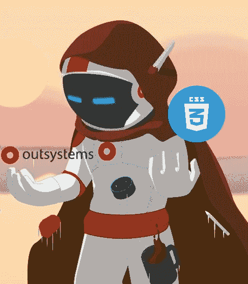
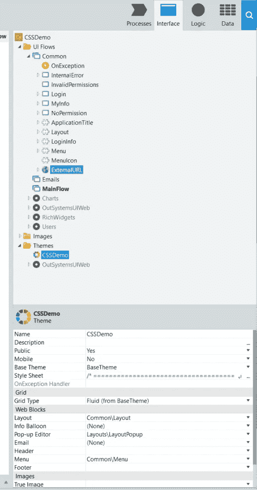
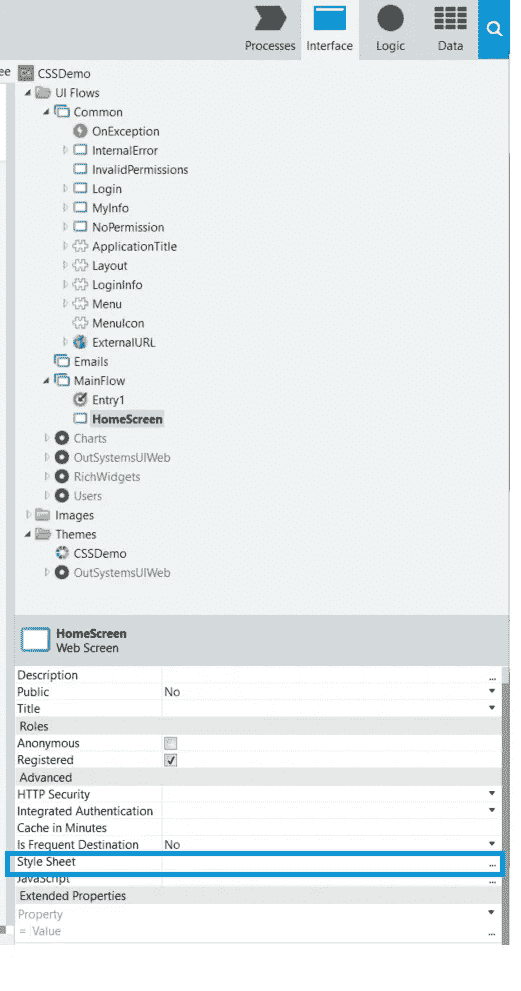
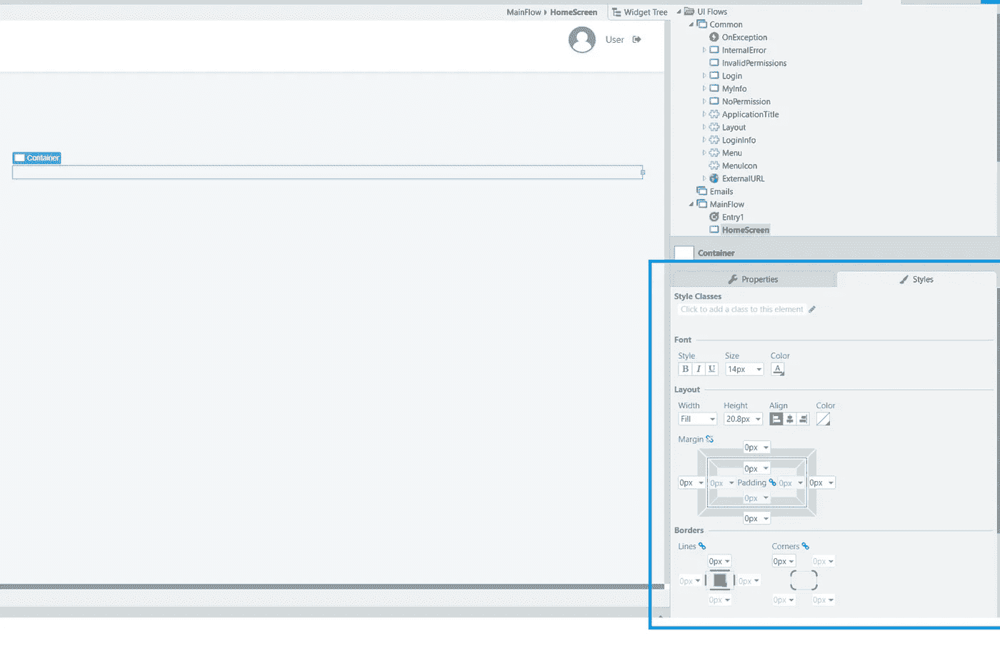
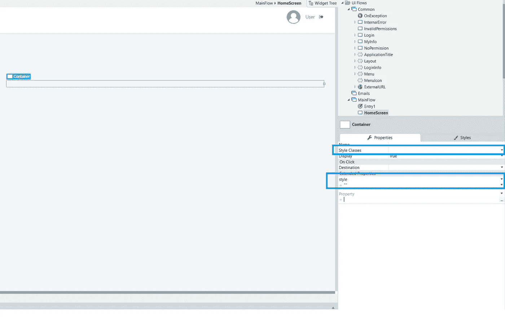

# 理解外部系统和 CSS 的结合

> 原文：<https://itnext.io/understanding-the-marriage-of-outsystems-and-css-7be4e538eecc?source=collection_archive---------8----------------------->



在过去的 10 年里，我一直是一名 web 开发人员，在过去的 7 年里，我一直是一名外部系统开发人员。这些年来，每当我告诉别人我真的很喜欢 CSS 时，所有人似乎都很惊讶。众所周知，大多数全栈开发人员或后端开发人员并不热衷于 CSS。

我在这里告诉你一个秘密，样式表并没有大多数人想象的那么复杂。

在这篇文章中，我将分享几个观点，了解它们会让一切变得更清楚。通过了解这些技巧，您将能够提高您的 CSS 技能以及样式表如何与外部系统协同工作。

**了解优先级**

首先，我们需要理解 OutSystems 平台允许你在四个地方使用 CSS 定制你的应用程序；可以在 webblock、主题、屏幕和小部件中添加 CSS。

我上面提到的那些元素将按以下顺序导入(从低到高的重要性):

*   Webblock


*   主题



*   屏幕



*   小部件(这里有一些应用 css 类和样式表的方法)



或者



这意味着，如果你在主题中有一个 CSS 规则，并且在屏幕中有相同的规则，屏幕将覆盖主题规则。

**记住选择器的速度**

第二个需要记住的是选择器的速度。像编程语言一样，我们有很多方法可以达到相同的结果，在 CSS 中，大多数时候我们都有相同的场景，这就是为什么理解如何改进和避免使 CSS 成为会导致性能问题的东西是很重要的。下面的列表显示了选择器的速度级别(从最慢到最快):

*   伪类
*   属性
*   普遍的
*   后裔
*   类型
*   班级
*   ID(应该避免在外部系统中使用，因为 ID 是由平台自动生成的)

谈论选择器知道浏览器如何读取 CSS 也是很好的，它将从右向左读取。很难理解吗？特此举例。

假设我们有以下 css:

```
.link-class a
{background-color:red;}
```

浏览器所做的是获取所有的(最右边的选择器)元素，然后获取所有在第一个选择器和过滤器中检索到的元素，只对 class 属性中有 link-class 的元素应用样式。

也就是说，我们可以得出结论，如果 link-class 是一个将应用于您想要应用样式的元素的类，为什么不将代码改为:

```
.link-class
{background-color:re}
```

在第二种情况下，浏览器将只过滤具有类 link-class 的元素。

我的建议是，当你真的需要使用多个选择器来获得某些东西时，使用组合选择器，这是一个需要组合选择器的例子:

超文本标记语言

```
<div id=”firstDiv” class=”classDiv”><span >Test</span></div>
```

半铸钢ˌ钢性铸铁(Cast Semi-Steel)

```
.classDiv span{color:gray;}
```

在这个例子中，如果您想要样式化 div 内部的 span，惟一的方法是编写选择器来获取元素(除非您为 DOM 中的所有 span 更改它，如果您想要样式化一个特定的元素，就不应该是这种情况)。

**快速提示**

还有一些小技巧可以让你的 CSS 代码变得更好，得到改进:

*   每行只放一个 CSS 规则
*   添加注释(使用/*您的注释在此*/)以使您的代码更具可读性。使用它在 CSS 中创建节，使代码更易于维护。

最好的技巧是保持简单，复杂的 CSS 意味着浏览器需要更多的时间和精力来处理它。

我希望这篇文章已经帮助你打破了 CSS 是有用的东西，如果使用正确，会把你的应用程序带到另一个层次的范式！