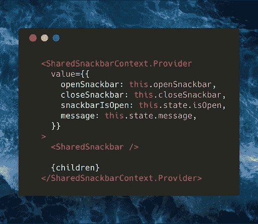
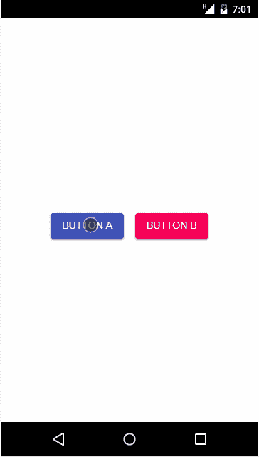

# 学习 React Context API，并将其应用到您的应用程序中

> 原文：<https://itnext.io/understanding-the-react-context-api-through-building-a-shared-snackbar-for-in-app-notifications-6c199446b80c?source=collection_archive---------0----------------------->

## 为应用内通知构建共享素材 UI Snackbar

# 前言

大多数应用程序需要一种方式，在通知发生时不引人注目地显示给用户。假设你正在进行八折销售，你想让你的用户一登录就知道，或者在他们提交反馈后，你想显示一条感谢信息。

Material UI 提供了一个 snackbar 组件，它非常适合这些类型的消息，所以我将在这个例子中使用它。也就是说，本文更多的是关于上下文 API，而不是材料 UI，用这种方法将材料 UI 换成任何其他组件库都非常简单。

许多应用程序需要触发来自几十个不同组件的消息。React 上下文 API 使得向所有组件提供对共享 snackbar 的访问变得非常简单，因此它们可以触发这些消息，而无需为每个消息实现单独的组件。以下是方法。

# 我们正在建造的东西

# 设置/依赖关系

这篇文章假设你已经有了一个 React 应用，并安装了 **@material-ui/core 1.0.0+** 和 **@material-ui/icons 1.0.0+** 作为依赖项。

# 创造环境

首先，我们需要创建我们的上下文 API **提供者**和**消费者**组件。**提供者***向所有**消费者**提供*我们的 snackbar 的状态，以及一些操作该状态的函数。这允许所有子组件访问和操作**提供者**的状态，不管它们在组件层次结构中有多深。不需要正确钻孔！

第一步是通过调用 *React.createContext()* 创建一个上下文。返回的对象包含两个属性:提供者和使用者。我们使用这些来构建管理 snackbar 状态并与之交互的组件。

*从这里开始，当我使用术语“提供者”和“消费者”时，我指的是本节中的****SharedSnackbarProvider****和****SharedSnackbarConsumer****组件。*

如您所见，我们的提供者是一个非常标准的组件。在它的*呈现*函数中，我们呈现了一个 **SharedSnackbarContext。具有*值*属性的提供者**组件。传递给 *value* prop 的对象是消费者能够访问的对象，因此他们可以与我们的 snackbar 进行交互。由于缺乏更好的术语，这是我们共享的 snackbar 组件的 **API** 。

注意第 41 行的 *TODO* 。最终，我们将在中呈现实际的 snackbar *,上下文提供者的*呈现*功能作为其子节点的兄弟。这确保了在呈现提供程序时，所有子级都将使用完全相同的 snackbar 组件。*

# 创建共享 Snackbar 组件

现在我们需要构建表示组件，负责根据提供者的状态呈现 snackbar UI。该组件将使用消费者来访问呈现所需的属性。

在这里，我们构建了一个组件，它在 **SharedSnackbarConsumer** 组件内的函数中呈现 snackbar UI。该函数的参数是我们从提供者公开的*值*属性对象。因此，当提供程序的状态更新时，它将触发 snackbar 组件重新呈现。

现在我们可以在提供者的 *render* 函数中呈现这个组件。

# 呈现提供者

此时，我们几乎完成了基础设施。还有最后一件事要做，就是在我们的应用程序中呈现提供者。我将把提供者放在整个应用程序的根目录下，这样所有的孩子都可以访问 snackbar。

# 从子组件打开 Snackbar

现在， **ButtonA** 和 **ButtonB** 可以渲染自己的 UI，触发应用内消息，而不需要直接从应用的根接收道具！🤙

# 摘要

总而言之，事情是这样的。

1.  首先，我们创建了一个**上下文提供者**组件，它管理 snackbar 的全局状态。
2.  然后，我们创建了一个组件，该组件根据提供者的状态呈现 snackbar 的 UI。该组件通过**上下文消费者**在其呈现函数中订阅提供者状态。
3.  最后，我们呈现了两个按钮，它们用 *openSnackbar* 函数更新了**上下文提供者**的状态，该函数通过**上下文消费者**传递给它们。这会导致更改向下传播到 snackbar 组件，从而触发重新渲染。

Material UI 提供了许多我在这个例子中没有实现的 snackbar 特性，比如动作按钮和颜色定制。为了简单起见，我没有添加定制这些特性的功能。如果您真的想学习上下文 API，那么自己添加该逻辑将是一个很好的下一步！

非常感谢你花时间提升自己。如果你觉得这篇文章有用，我会欣然接受。在此期间，请花几秒钟时间关注我，了解更多精彩内容:

*   [ES6 生成器的一个快速、实用的用例:构建一个无限重复的数组](/a-quick-practical-use-case-for-es6-generators-building-an-infinitely-repeating-array-49d74f555666)
*   [构建一个带有 React 和材质 UI 的“遮罩切换”密码输入组件](/building-a-toggled-mask-password-input-component-w-react-and-material-ui-f55e6bd73434)

**推特**:[@ reisner Shawn](https://twitter.com/ReisnerShawn)
**dev . to**:**[@ sreisner](https://dev.to/sreisner) **insta gram**:[@ Shawn . web dev](https://www.instagram.com/shawn.webdev)**

**编码快乐！**