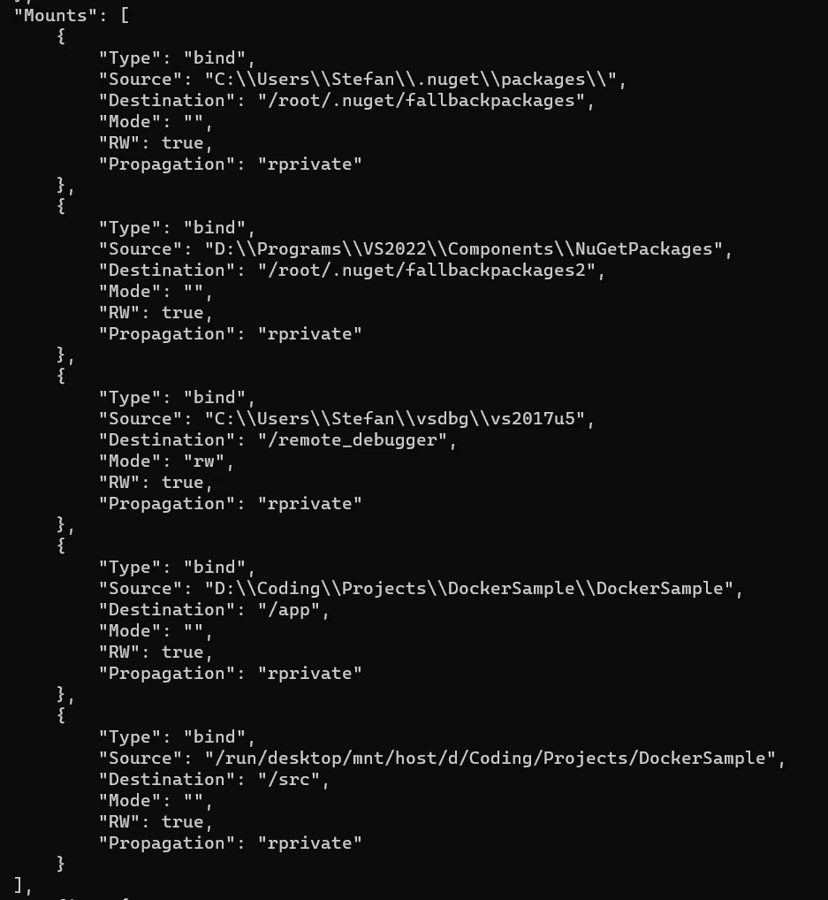

# 了解 Visual Studio Docker 快速模式集成

> 原文：<https://itnext.io/understanding-the-visual-studio-docker-fastmode-integration-c0bccc08b8f9?source=collection_archive---------0----------------------->


任何 IDE 中我最喜欢的特性之一就是无缝 Docker 如何与。NET)项目。它最大的优点是在一个隔离的、可复制的环境中运行一个应用程序是多么简单。如果你正确地坚持下去，所有那些“在我的机器上工作”的问题都将成为过去。

当您创建一个简单的控制台应用程序时，您只需右键单击该项目，“添加-> Docker 支持”，VS 将为您生成一个 Docker 文件。如果您现在运行 Docker 启动配置，VS 将为您构建一个映像，您可以运行和调试项目，而无需任何额外的工作。(我将在另一篇文章中介绍 docker-compose 集成)

在我看来，VS 已经钉死了这个特性。VS 为你做的工作量是惊人的。看起来没什么大不了的，但是 VS 并不是简单地构建 docker 文件并运行它，它使用了许多聪明的技巧来保持构建的速度。此外，VS 还在上面添加了一个调试器。这听起来很简单，但是你需要记住，docker 容器只不过是一台远程机器，如果你曾经手动设置过远程调试，你肯定知道为什么你应该对此心存感激。

在这篇文章中，我想讨论和研究 Docker 集成的所有特性，尤其是它的快速性。有一堆很酷的技巧要学，关于 Docker 和。网！

# Docker 快速模式

“Fastmode”是围绕快速调试容器中的软件而构建的整个设置的名称。

让我们从 Linux 容器的 docker 文件开始:

```
#See [https://aka.ms/containerfastmode](https://aka.ms/containerfastmode) to understand how Visual Studio uses this Dockerfile to build your images for faster debugging.FROM mcr.microsoft.com/dotnet/runtime:6.0 AS base
WORKDIR /appFROM mcr.microsoft.com/dotnet/sdk:6.0 AS build
WORKDIR /src
COPY ["DockerSample/DockerSample.csproj", "DockerSample/"]
RUN dotnet restore "DockerSample/DockerSample.csproj"
COPY . .
WORKDIR "/src/DockerSample"
RUN dotnet build "DockerSample.csproj" -c Release -o /app/buildFROM build AS publish
RUN dotnet publish "DockerSample.csproj" -c Release -o /app/publish /p:UseAppHost=falseFROM base AS final
WORKDIR /app
COPY --from=publish /app/publish .
ENTRYPOINT ["dotnet", "DockerSample.dll"]
```

如果你不熟悉这个 Dockerfile 设置:它被称为多阶段构建。每个 FROM 指令都会添加一个具有潜在不同基础图像的新图层。在这个具体的例子中，我们创建了一个运行时映像作为“基础”，以及一个“构建”映像。构建映像将接收所需的文件和 nuget 恢复，然后 dotnet 构建项目。之后，我们进行网络发布。发布映像的工件将被复制到运行时映像。

结果是一个运行时映像，其中复制了剥离下来的工件。我们没有保留 sdk 映像，所以生成的映像要小得多。在最后一幅图像上，我们将入口点设置为“dotnet DockerSample.dll ”,以便启动应用程序。

然而，当在“调试”模式下构建项目时，您会注意到“容器工具”输出在构建阶段后停止，除非另外配置。

因此，目前我们所拥有的只是一个 dotnet 运行时映像，里面没有任何东西。

您还会注意到该项目是在本地构建的。如果我们的项目是使用 dotnet build 在一个容器上构建的，那么所有的工件都将驻留在您的容器上，而不是您的主机上。然而，在我们的例子中,/bin 和/obj 文件夹将在您的主机上结束，所以没有在容器上进行构建。

在容器工具的后续步骤中，您可以看到 Visual Studio 下载(并确保)GetVsDbg.ps1 脚本，该脚本下载 VsDbg 调试实用工具。但是，它不会被下载到任何容器中，而是在您的主机上。

建立了容器和 vsdbg 之后，下一步将会把整个设置粘在一起。在容器工具中，您可以看到该命令。

```
docker run -dt -v "C:\Users\...\vsdbg\vs2017u5:/remote_debugger:rw" -v "D:\...\DockerSample\DockerSample:/app" -v "D:\...\DockerSample:/src/" -v "C:\Users\...\.nuget\packages\:/root/.nuget/fallbackpackages" -v "D:\Programs\VS2022\Components\NuGetPackages:/root/.nuget/fallbackpackages2" -e "DOTNET_USE_POLLING_FILE_WATCHER=1" -e "NUGET_PACKAGES=/root/.nuget/fallbackpackages" -e "NUGET_FALLBACK_PACKAGES=/root/.nuget/fallbackpackages;/root/.nuget/fallbackpackages2" --name DockerSample --entrypoint tail dockersample:dev -f /dev/null
```

要解开的东西太多了，但让我们一步一步来看:

1.  “docker run -dt”将运行一个带有伪终端的分离容器
2.  下一个卷装载循环回到之前运行的 Vsdbg 步骤。这是远程调试器，我们现在通过使用卷挂载将它传递到容器上。
3.  现在，我们将安装驻留在主机上的构建工件。
4.  下一步—将 Nuget 包添加到容器中。注意到我们是如何通过简单地挂载和镜像所有已经可用的东西来慢慢构建一个与你的设备非常相似的环境的吗？
5.  在所有挂载都完成后，将设置一些环境变量，尤其重要的是 NUGET_PACKAGES 和 NUGET_FALLBACK_PACKAGES，它们是全局环境变量，用于将 nuget cli 指向它可以从中获取相应包的文件夹。
6.  使用“tail”命令运行容器。

如果我们在相应的容器上运行“docker inspect <id>”,我们可以看到如下装载，如预期的那样:</id>



好了，现在我们有了一个正在运行的容器，其中有很多先决条件，但是由于 tail 命令，它基本上只是在空转。

一旦我们在 Visual Studio 中按下 F5，接下来就会发生。此时，VS Docker 集成将继续进行，并检查容器 id。

一旦获得 ID，VS 将运行以下命令:

```
docker exec -i {containerId} dotnet DockerSample.dll
```

就是这样！由于我们所做的所有卷安装，VS 已经在我们的容器上启动了应用程序。

除了启动应用程序之外，VS 现在还可以连接到我们放在容器上的 vsdbg 应用程序，并启动一个调试会话。

这就是当你在 Visual Studio 中对 Docker 项目按 F5 键时，我们最终得到的结果。

这比最初听起来要多得多！

# 逮到你了

有一些关于整个设置的问题，知道这些是很有用的。

*   您的应用程序不会进行任何热重新加载，一旦您希望看到更改，就需要重新启动
*   在你停止调试后，容器仍然会运行**！但是，一旦您停止了 Visual Studio 中的调试会话，您的应用程序也将停止。**
*   在“发布”模式下，这些神奇的事情都不会发生，取而代之的是，docker 文件会定期构建。

总而言之，Visual Studio 做得很好，为我们做了所有这些事情。

在另一篇文章中，我将研究 VS 如何与集成的 docker-compose fastmode 一起工作，这是另一个魔术！