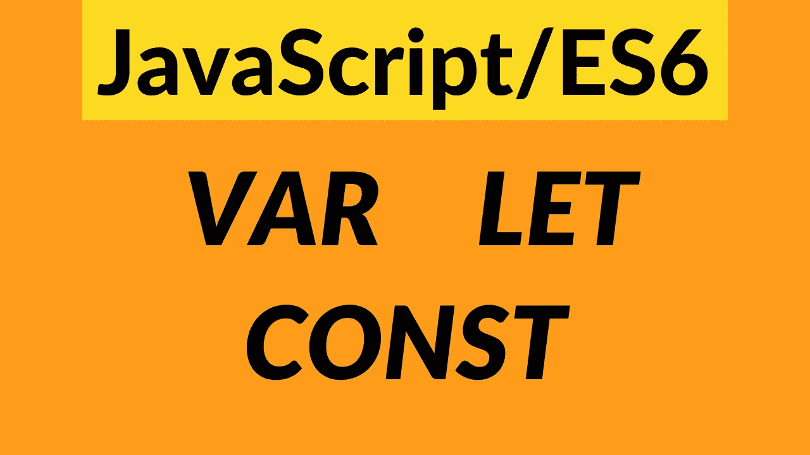
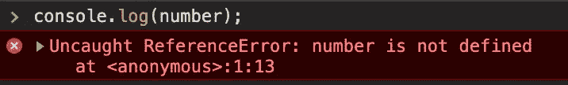
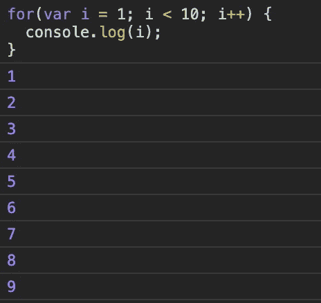
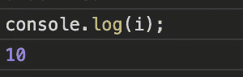
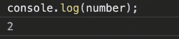
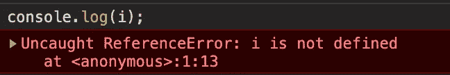
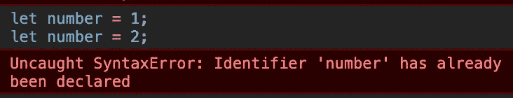
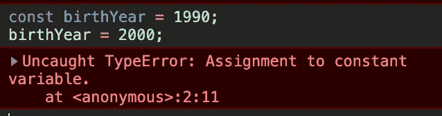

# 理解 JavaScript 中的 var，let & const—ES6

> 原文：<https://itnext.io/understanding-var-let-const-in-javascript-es6-a80d6c62a5f0?source=collection_archive---------2----------------------->



ES6 (也称为 ECMAScript 2015)对 JavaScript 的语法进行了重大改变，并带来了以前不存在的新功能。

学习 ES6 很重要，因为一个原因是，它使 JavaScript 更好更容易编写，而且 ES6 正与当今的现代 web 技术一起使用，如 **React、Node.js** 等。

在本帖中，你将学习 ES6 为**变量声明** : `let`和`const`带来的新关键词。但是首先，让我们解释一下`var`到底出了什么问题。

# var 的问题是什么？

我们已经在 JS 中使用了`var`关键字来声明变量。那么为什么 ES6 引入了额外的关键词呢？

要理解`var`中的问题，首先你需要明白 [***范围***](https://www.w3schools.com/js/js_scope.asp) 是什么。

> 范围决定了代码不同部分的变量、对象和函数的可访问性。— w3schools

JavaScript 中有 3 种类型的作用域:

*   函数(局部)范围
*   全球范围
*   数据块范围(ES6 新增)

> `**var**` **支持函数&全局作用域，不支持块作用域。**

## 函数(局部)范围

当变量在**函数**内部定义时，它将**局部**仅用于该函数，不能在外部使用:

```
**function** local() {
   **var** number = 1;

   console.log(number); // 1 gets printed
}console.log(number); // undefined
```



## 全球范围

当一个变量在函数之外声明，或者没有关键字`var`时，它将成为**全局变量**，并且可以从任何地方访问:

```
**var** number = 1;**function** local() {
  console.log(number); // 1 gets printed
}console.log(number); // 1 gets printed
```

## 块范围

循环的**花括号{ }、if-else 案例**和**内的所有内容都是**块范围的**。这是`var`不支持的部分。**

让我们在 for 循环中定义一个变量(用`var` ) **，看看会打印出什么…**

```
**for**(**var** i = 1; i < 10; i++) {
  console.log(i);
} console.log(i);    // What do we expect here?
```



一切似乎都很好，直到这里。但是第二个 **console.log 呢？**



第二个 **console.log** 在循环的**之外，并且**局部变量“I”**仍然被打印，而它应该是**未定义的**。**

但是，如果我们使用 **let 或 const，由于它们是块范围的**，这个问题就解决了。

## 风险值的重新申报问题

`var`的另一个问题是它允许**一次又一次地重新声明**相同的变量:

```
**var** number = 1;   // first declaration
**var** number = 2;   // same variable redeclared with the same nameconsole.log(number); // And we see no errors
```



现在让我们看看 ES6 是如何处理它们的…

# 用字母代替 var

为了防止我上面提到的问题，让我们用`let`再试一次:

```
**for**(**let** i = 0; i < 10; i++) {   // same local variable with **let** 
  console.log(i);
}console.log(i); // This time what do we expect?
```



所以`let`支持块范围，第二个 **console.log** 返回**未定义**。完美！

同样，试图用`let` 重新声明变量会返回一个错误:



所以`let`关键词:

*   可以代替`var`
*   **是块范围的**
*   不允许**重新申报**，但稍后可以**重新分配**

# 常数

ES6 带来的另一个新关键词是`const`。

> "不变的东西:不变的东西."

`let`和`const`的区别在于，一旦我们用`const`声明了一个变量，以后就不能更改了:



`const`关键字:

*   也可以代替`var`
*   一旦它声明了
*   和`let`一样**也是块范围的**
*   不允许**重新申报**或**重新分配**

ES6 显著改变了 JavaScript，并随着 ES7、ES8 等不断改变。如果你有问题，请在下面评论。如果你喜欢文章，请分享。

**如果你想了解更多关于 Web 开发的知识，欢迎在 Youtube 上关注我**[](https://www.youtube.com/channel/UC1EgYPCvKCXFn8HlpoJwY3Q)****！****

**感谢您的时间&再见！**