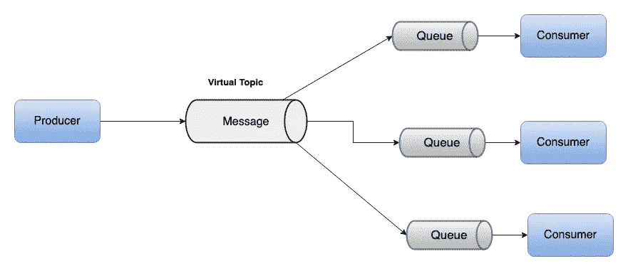
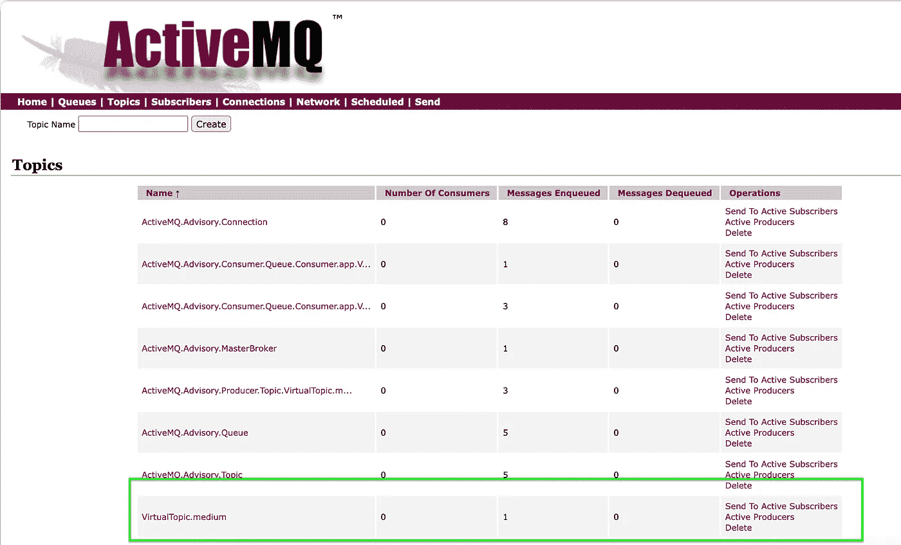
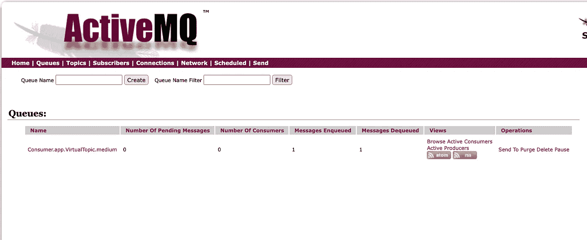

# 通过示例了解 ActiveMQ 中的虚拟目的地

> 原文：<https://itnext.io/understanding-virtual-destinations-in-activemq-with-an-example-cc814e8613d7?source=collection_archive---------0----------------------->

虚拟目的地允许我们创建映射到一个或多个物理目的地的逻辑目的地。


虚拟目的地是逻辑目的地，是映射到一个或多个物理目的地的队列或主题的组合。它提供了松散耦合的消息传递配置，尤其是在应用程序运行在多个实例上时。

在本文中，我们将借助一个简单的 Spring Boot 应用程序来看看虚拟目的地如何在 ActiveMQ 中工作。

## 先决条件

从官方[网站](https://activemq.apache.org/download)下载安装程序安装 Apache ActiveMQ。在各种操作系统上安装 ActiveMQ 的指南在[这里](https://activemq.apache.org/getting-started)描述。

创建一个简单的 Spring Boot 应用程序，并在 pom.xml 中添加以下依赖项。

```
<dependency>
  <groupId>org.springframework.boot</groupId>
  <artifactId>spring-boot-starter-activemq</artifactId>
</dependency>
```

## 虚拟话题

虚拟主题的概念是生产者以通常的 JMS 方式发送到一个主题，但是这个主题是虚拟的。听众可以从他们自己的队列或者通过逻辑主题订阅来消费。

ActiveMQ 会将主题中的每条消息复制到消费者队列中。



虚拟主题和队列

## JMS 生成器

我们将编写一个简单的生成器，它将创建一个虚拟主题并发布关于该主题的消息。

```
@Component
public class JMSProducer {

    private final JmsTemplate jmsTemplate;

    public JMSProducer(final JmsTemplate jmsTemplate) {
        this.jmsTemplate = jmsTemplate;
    }

    public void createVirtualTopicAndPublishMessage() {
        jmsTemplate.convertAndSend(new ActiveMQTopic("VirtualTopic.medium"), "Test virtual topic");
    }

}
```

请注意，主题名称是“VirtualTopic.medium”。ActiveMQ 中虚拟主题的默认命名约定以前缀“VirtualTopic”开始。>".但是，我们可以通过在 ActiveMQ 代理配置中进行配置来自定义这些名称。

## JMS 消费者

我们现在要编写一个消费者来监听队列，以接收将在虚拟主题上发布的消息。

```
@Component
public class JMSConsumer {
    private static final Logger *LOGGER* = LoggerFactory.*getLogger*(JMSConsumer.class);

    @JmsListener(destination = "Consumer.app.VirtualTopic.medium")
    public void readMessage(final TextMessage message) {
        *LOGGER*.info("Received message {}", message);
    }

}
```

队列名称按照约定命名为“消费者”。[clientName].VirtualTopic . >”，这是与虚拟主题相关联的队列的默认约定。

在虚拟主题“VirtualTopic.medium”上发布的任何消息都将被复制到队列“consumer . app . virtual topic . medium”中。

## 测试示例应用程序

让我们编写一个简单的命令行运行程序类，它将用于在应用程序启动时发布消息。

```
@Component
public class AppCommandLineRunner implements CommandLineRunner {

    private final JMSProducer jmsProducer;

    public AppCommandLineRunner(final JMSProducer jmsProducer) {
        this.jmsProducer = jmsProducer;
    }

    @Override
    public void run(String... args) {
        jmsProducer.createVirtualTopicAndPublishMessage();
    }
}
```

运行应用程序，我们将看到在 ActiveMQ 控制台中创建了主题和队列。我们可以通过[http://localhost:8161/admin/index . JSP](http://localhost:8161/admin/index.jsp)导航到 ActiveMQ 控制台。

我们应该能够在 topics 视图中看到虚拟主题。



主题

我们还将在 queues 视图中看到该队列。如果应用程序已经成功运行，那么我们将看到一条消息正在入队和出队。



行列

## 自定义配置

正如我前面提到的，命名约定可以通过代理配置进行定制。这可以通过修改 activemq.xml 文件来完成。

它不仅允许您自定义名称，还允许您打开默认情况下禁用的选择器感知。选择器感知可用于选择性地将消息转发到不同的目的地。

```
<destinationInterceptors> 
  <virtualDestinationInterceptor> 
    <virtualDestinations> 
      <virtualTopic name=">" prefix="VirtualTopicConsumers.*." selectorAware="false"/>   
    </virtualDestinations>
  </virtualDestinationInterceptor> 
</destinationInterceptors>
```

## 结论

我们可以使用虚拟主题添加任意多的消费者，而无需修改 ActiveMQ 代理配置。

我希望这篇文章能帮助你了解虚拟目的地。在[https://activemq.apache.org/virtual-destinations](https://activemq.apache.org/virtual-destinations)阅读更多内容。