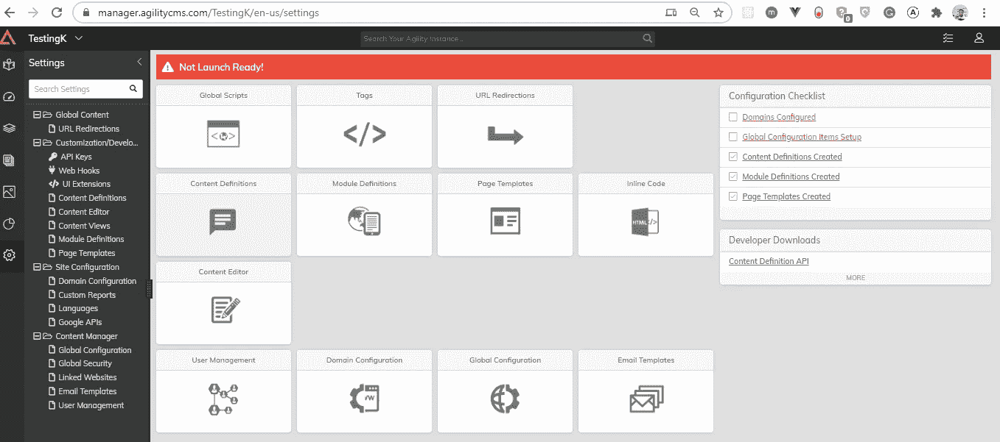
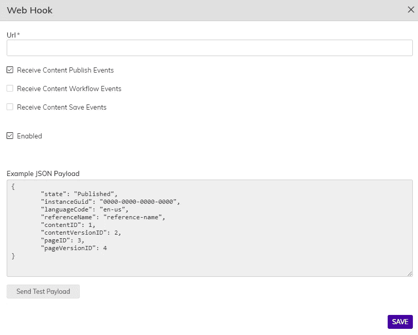
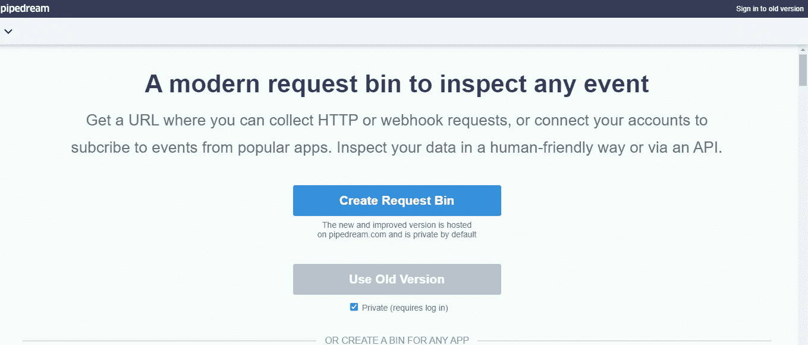
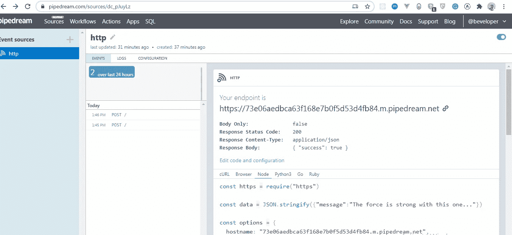
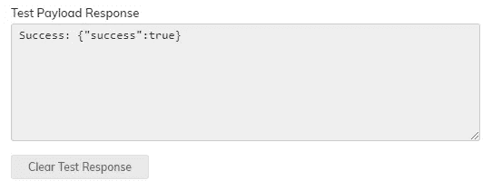
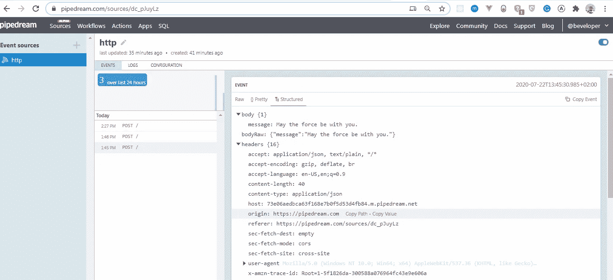

# 了解 Headless CMS 中的 Webhooks

> 原文：<https://itnext.io/understanding-webhooks-in-headless-cms-71e62fdf365b?source=collection_archive---------4----------------------->

现代发展以多种方式改变了通信。随着事情的发展，与人有效沟通的愿望开始出现。

为了达到我们所需要的这种通信需求，我们需要找到一种方法让技术相互交流。

这就是 webhooks 发挥作用的地方。

与通过 API 方法设置相比，在一个 Headless CMS 中设置 webhooks 更容易、更快、更划算。

在这篇文章中，我们将看看如何使用 [Agility CMS](https://agilitycms.com/) 来设置 webhooks，这是一个带有 JAMstack 的无头 CMS。它与现代高速网站框架无缝集成，实现高性能数字体验。

这篇文章将对你有用，如果；

*   你知道 API 和 Webhook 的区别，否则，看看这段 4 分钟的[片段](https://agilitycms.com/resources/posts/-api-vs-webhooks-what-s-the-difference)。
*   您已经构建了实时应用程序，可以在事件发生时或使用 API 立即交付数据。
*   您已经在使用第三方应用程序构建 webhooks，并且您想要检查替代方案。

我们将看看如何在 Agility CMS 中使用 Webhooks 构建一个实时的、基于事件的简单应用程序。

我们开始吧！

**注意**:本文假设你已经熟悉了 Node.Js 的基础知识

# 什么是 WebHooks？

Webhooks 是每次事件发生时自动发送的消息。它们有一个独特的使命:将消息或数据传输到一个独特的地址或 URL。是应用程序向其他应用程序提供实时信息的一种方式。它在事件发生时或几乎立即传送数据。

# 何时使用 Webhooks

Webhooks 通常充当较小数据的信使。它有助于发送和提取实时更新。

使用 webhook 的最合适的场景之一是当你的应用或平台需要实时特性，而你不想使用 API 时，因为你不想在这个过程中与设置纠缠在一起并浪费资源。在这种情况下，webhook 框架将是最有益的。

使用 webhook 的另一个最佳用例是没有提供 API 或者可用的 API 不是最合适的，在这种情况下可以使用 webhook。

Webhooks 可以被视为基于 API 的应用集成的完美补充，有时甚至是必不可少的补充。

这可用于在 Slack 中设置通知工作流，自动将静态网站重新部署到 Netlify，以及各种其他自动化用例。

# Webhooks 的优势

*   它有助于清除和管理外部系统(如网站、移动应用程序或数据库)中的自定义缓存。
*   它提供了一种与第三方系统(如 Salesforce、Mailchimp 等)集成的*同步*内容/数据的方式。
*   它有助于构建自定义内容工作流。
*   使用 webhooks 可以在内容更新时启动 CI/D 管道来重新部署您的网站——这通常用于使用静态站点生成器构建的 JAMstack 站点。

# 在无头 CMS 中使用 webhooks

在本教程中，我们将看到如何在一个无头 CMS 中集成 webhooks，我们的选择将是 [Agility CMS](https://agilitycms.com/) 。

Agility CMS 是一个内置页面管理的 JAMStack 焦点无头 CMS。更快地构建、管理和部署。Agility CMS 是一个内容优先的无头 CMS，允许您选择任何编程语言，同时还可以获得来自轻量级 API 的灵活性、速度和能力。从那里，你可以添加页面管理、电子商务、在线售票和搜索等功能。Agility CMS 成为一个完整的数字体验平台——节省时间，消除限制，并允许跨所有数字渠道的无缝体验。

# 用 Agility CMS 实现 Webhooks

这通过向 Agility CMS 提供一个列表或 URL 端点来实现。每次 CMS 中的内容发生变化时，Agility 都会将变化通知给每个端点，并传递一条消息来表示发生的确切变化。

# 如何添加 Webhook 端点

为了添加 webhook，您必须能够访问启用了**内容获取 API** 的 Agility CMS 实例。开始在 [Agility CMS](https://account.agilitycms.com/sign-up?product=agility-free) 上免费注册。

1.  接下来，在 Agility CMS 中，导航到**设置>定制/开发> Webhooks** 。

1.  点击**添加(+)** 添加一个 webhook 端点。

3.在此添加您的端点

在 **Webhook** details 弹出菜单中，输入您要向其发送事件的 **Url** 端点。

对于测试，我们推荐使用免费的服务，比如 https://requestbin.com，它允许你设置一个端点并监控发送到那里的消息。

1.  注册/登录他们的服务后，我们得到一个可以使用的 Url。

1.  接下来，选择这个 webhook 应该订阅什么类型的**事件**。您可以选择订阅所有事件(发布、工作流批准和内容保存)或仅选择您需要的类型。

*   复制给你的 **URL** 并粘贴到你的敏捷实例 webhook 页面。

1.  当你准备好了，点击**发送测试负载**按钮来测试你的 webhook 端点。这将向您定义的端点 **Url** 生成一个示例请求，并记录结果。

1.  如果您创建了一个**请求绑定**端点，那么您可以验证发送到那里的有效负载。

1.  准备好后，点击**保存**保存你的 webhook。

# 有效负载详细信息

**页面事件**

**保存时:**

**发布时:**

**内容事件**

**保存时:**

**发布时:**

# 结论

在本文中，我们看到了如何使用 Agility CMS 将 webhooks 无缝集成到一个无头 CMS 中。你会同意我的观点，与使用 API 相比，这要简单得多。

我想看看你在评论区提出了什么，也许你更喜欢另一种方法和为什么。

# 资源

*   [API vs WEBHOOKS:有什么区别](https://agilitycms.com/resources/posts/-api-vs-webhooks-what-s-the-difference) —敏捷 CMS