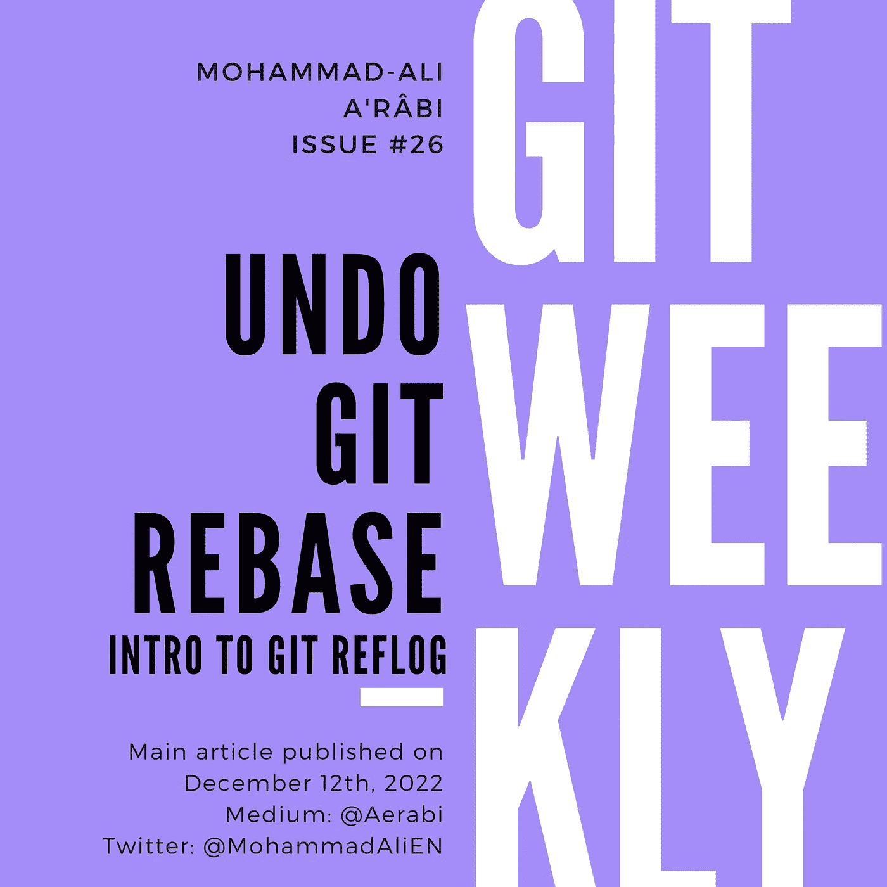

# 撤消 Git Rebase

> 原文：<https://itnext.io/undo-git-rebase-77aefc9e0f08?source=collection_archive---------3----------------------->

## Git Reflog 简介

[Git 周刊](https://medium.com/@aerabi/list/git-weekly-9fe103e35b4b) #26
等级:高级🥇

撤销常规的 git 操作相当容易。我们总是可以使用`git log`查看 git 历史，并及时回到某一点。撤销上一次提交就是一个例子:

```
$ git log --oneline
3f4176f (HEAD -> my-branch, master) :gear: Add icon and update metadata (#3)
30c4219 :wrench: Load the list of Git Weekly issues and render it (#2)
4d5389c :pencil: Add README
41d064b :gear: Initial commit
```

为了放弃散列值为`3f4176f`的最后一次提交，我们执行以下操作:

```
$ git reset --hard HEAD~1
```

正如我们在日志中所示，`HEAD`指的是最后一次提交。所以，`HEAD~1`后面是一个 commit。

这只有在我们想要撤销的 git 命令不改变历史的情况下才有效。改变历史的命令的一个很好的例子是我们刚刚使用的`git reset --hard`命令。另一个当然是 rebase。



# Git 引用日志简介

Git reflog 是一个强大的 Git 版本控制系统工具，它允许用户将丢失或被覆盖的更改恢复到他们的存储库中。与 git 中的永久历史记录(只跟踪提交的更改)不同，reflog 记录了对本地存储库的所有更改，即使它们没有提交。这意味着 reflog 可用于恢复由于意外重置或在推送到远程存储库期间被覆盖而丢失的更改。

要查看 git 存储库的 reflog，可以使用`git reflog`命令。这将显示存储库中发生的所有变更的列表，包括分支更新、重置和提交。reflog 中的每个条目都包括提交的 SHA-1 散列、更新的引用以及描述更改的简短消息。

例如，假设您的存储库中有一个名为“my-branch”的分支，您意外地将其重置为早期提交。您可以使用 reflog 来查找被覆盖的提交的 SHA-1 哈希，然后使用该哈希来恢复丢失的更改。这看起来会像这样:

```
$ git reflog
30c4219 (HEAD -> my-branch) HEAD@{0}: reset: moving to HEAD~1
3f4176f (origin/master, master) HEAD@{1}: checkout: moving from master to my-branch
3f4176f (origin/master, master) HEAD@{2}: pull: Fast-forward
...
```

在本例中，对存储库的最新更改是对`HEAD~1`的重置。reflog 中的这个状态由`HEAD@{0}`注释。先前的状态被标注为`HEAD@{1}`，这就是我们想要返回的状态。类似于撤销最后一次提交，我们使用 git reset:

```
$ git reset --hard HEAD@{1}
```

让我们做另一个 git 日志来看看结果:

```
$ git log --oneline
3f4176f (HEAD -> my-branch, master) :gear: Add icon and update metadata (#3)
30c4219 :wrench: Load the list of Git Weekly issues and render it (#2)
4d5389c :pencil: Add README
41d064b :gear: Initial commit
```

# 撤消重置基础

现在，让我们做一个交互式的重新排序，将第二个提交放到最后一个提交:

```
$ git rebase -i HEAD~3
```

在待办事项列表中:

```
pick 4d5389c :pencil: Add README
drop 30c4219 :wrench: Load the list of Git Weekly issues and render it (#2)
pick 69ef8bf :gear: Add icon and update metadata (#3)
```

保存并退出。现在日志看起来像这样:

```
$ git log --oneline
fad1087 (HEAD -> my-branch) :gear: Add icon and update metadata (#3)
4d5389c :pencil: Add README
41d064b :gear: Initial commit
```

reflog 看起来像这样:

```
$ git reflog
8e19365 (HEAD -> my-branch) HEAD@{0}: rebase (finish): returning to refs/heads/my-branch
8e19365 (HEAD -> my-branch) HEAD@{1}: rebase (pick): :gear: Add icon and update metadata (#3)
4d5389c HEAD@{2}: rebase (start): checkout HEAD~3
3f4176f (origin/master, my-branch-bak, master) HEAD@{3}: reset: moving to HEAD@{1}
30c4219 HEAD@{4}: reset: moving to HEAD~1
...
```

在 reflog 中，这种交互式的重建基础分为三步:开始、拾取和完成。我们想回到`HEAD@{3}`，那里还没有开始重定基数:

```
$ git reset --hard HEAD@{3}
```

请注意，非交互式重定基础可能需要更少的时间(例如 2 个步骤)。撤销重置基础时，总是先查看参考日志。

# 最后的话

我每周都会在 git 上写一篇博文。

*   [订阅](https://medium.com/subscribe/@aerabi)my Medium publishes，以便在新的 Git 周刊发布时获得通知。
*   在 Twitter 上关注[我，了解其他平台上发布的更多更新和文章。](https://twitter.com/MohammadAliEN)