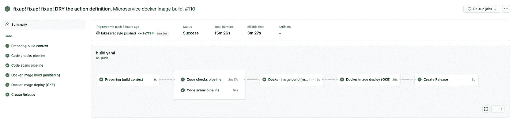
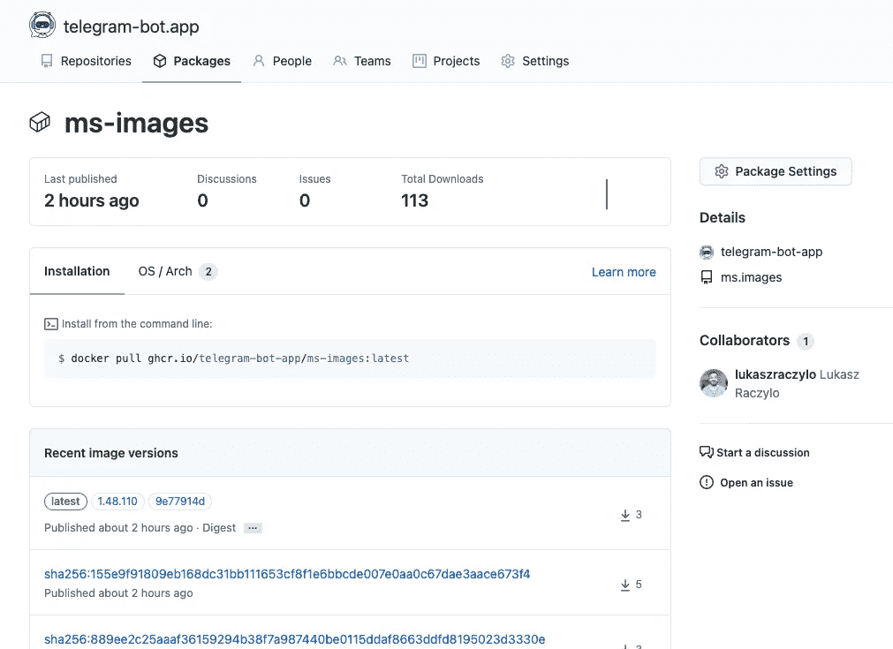
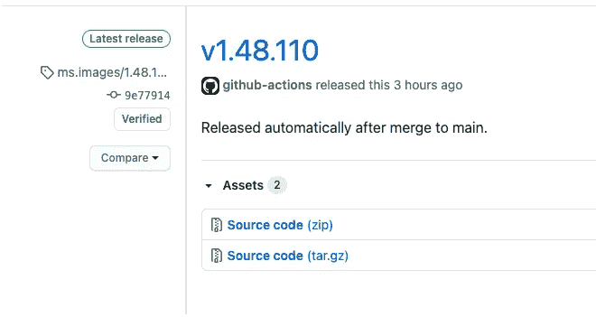

# Kubernetes、微服务和 Github 操作部署

> 原文：<https://itnext.io/unified-microservices-builds-using-github-actions-3442c4ee175e?source=collection_archive---------1----------------------->


工作中的微服务；信用:存款照片

欢迎来到微服务的世界，在这里一切皆有可能，您只需要处理小代码库，而不是拥有数千个依赖项的巨型独石。听起来差不多，对吧？

我不会浪费你的时间来解释什么是微服务，为什么它们有用，以及在开发过程中应该使用什么模式和反模式。我想重点谈谈微服务中经常被忽视的部分，即微服务的部署以及与之相关的问题。

每个人都有起点。让我们假设你刚开始这个项目，打算使用微服务来使它稳定、冗余，同时易于扩展。你有两个微服务，所以使用复制粘贴的古老方法，在这里和那里更改几行，相对容易实现 CI/CD 管道的处理。

# 避免微服务 CI/CD 漂移

开发几个月后，你就有了 30 种不同的微服务。其中一些有稍微不同的需求和构建参数，您会发现自己在不同的管道管理中挣扎。迟早，你会意识到，你对已经打了补丁的部署代码做了太多手脚，以至于它本身变成了一个项目。

我每天都在与微服务打交道，我需要说，我也经历过这种情况。这就是为什么我决定回到过去，回到我的代码冒险之初，开始使用 Makefiles。

# 让你的 CI 再次伟大

将 Makefile 视为构建的统一接口——无论您是开发人员还是愿意在本地机器或 CI bot 上试用它的产品经理——执行任何命令都不需要高深的知识。我通常用 Go 来写东西，但这并不重要，因为这种想法可以在你想使用的所有语言和技术之间移植。

我们将关注的基本命令

```
make         # to build
make test    # to test
make lint    # to lint
make update  # to pull dependencies
```

Makefile 本身(这里也有)

```
build: allcur-dir   := $(shell basename `pwd`)
SET_PRIVATE="github.com/telegram-bot-app/*"
MICROSERVICE_NAME?=$(shell basename `git rev-parse --show-toplevel`)
GITHUB_COMMIT_NUMBER?=0
GITHUB_SHA?=$(shell git rev-parse HEAD)all:
  go build -o service.bin -ldflags="-s -w -X main.SVC_RELEASE=6.1.${GITHUB_COMMIT_NUMBER} -X main.SVC_VERSION=`date +\"%Y%m%d%H%M\"`@${GITHUB_SHA} -X main.SVC_NAME=${MICROSERVICE_NAME}" *.gotest:
  go test ./...lint:
  golangci-lint run *.goupdate:
  GOPRIVATE=$(SET_PRIVATE) go get -u ./...clean:
  rm *.bin
```

解释一下:我创建的所有微服务都应该用适当的版本来标识自己，因此我在构建过程中使用 **LDFLAGS** 来设置适当的值。在我的例子中，最终结果是:

```
var SVC_RELEASE 6.1.55
var SVC_VERSION 202102261208@9e77914d
var SVC_NAME ms.image-filter
```

基础工作已经完成，现在您可以发出 **make** 命令来完成工作。如果使用您的库，不要忘记更新 **SET_PRIVATE** 值。



使用中的工作流 Github 操作的图表

# 工作流主页

必需的存储库机密:
**GHCR_TOKEN** — Github 个人访问令牌，对包具有读、写权限。
**GKE _ 访问 _ 密钥—** 您的谷歌云 Kubernetes 引擎凭证

在文章的这一部分，我将对工作流进行一些解释，让读者了解幕后发生的事情。完整的代码可以在[lukaszraczylo/universal-github-action-pipeline](https://github.com/lukaszraczylo/universal-github-action-pipeline/blob/main/workflow-push.yaml)资源库中找到。

**jobs.prepare:** 这是工作流程中最关键的工作。它会自动为构建的其余部分设置所有变量，无需您的任何输入。

*   获取存储库名称(在我的例子中是$ project.ms. $ microservice _ name)并将其用作基础。
*   清理部署流程中要与 kubernetes 配置一起使用的存储库名称(用破折号替换点)。
*   版本约定——在我们的例子中，我们将使用 1.x.y，其中 **x** 是存储库中提交的数量(因此 fetch-depth 被设置为零，以便将它们全部取出),而 **y** 是 Github 操作的连续构建号。
*   基本 docker 映像名称将采用以下格式:` ghcr . io/$ github _ repo _ owner/$ sanitized _ repo _ name '
*   在构建的后期阶段很少使用其他变量。

**jobs.test:** 运行 linter(如果工作流顶部的 **ENABLE_CODE_LINT** 变量设置为 true)并执行 **make test** 。在这个阶段，您应该会发现 Makefile 的美妙之处，它是语言不可知的。如果您有 nodejs 项目来运行测试，您可以在项目中修改 Makefile 来反映它，但是命令保持不变。

**jobs.code_scans:** 对您的代码运行安全扫描，以防止由供应商提供的软件包引入的错误。

**jobs.build:** 构建多架构映像(amd64 和 arm 64[参见我的关于树莓 Pi 上的 [Kubernetes 集群的文章](https://medium.com/swlh/building-your-home-raspberry-pi-kubernetes-cluster-14eeeb3c521e?source=post_stats_page-------------------------------------)),并将它们推送到 Github 容器注册表，并适当地进行标记。在这项工作的最后一步中，我们还将扫描输出映像，查找基础映像本身中的任何其他漏洞。



使用通用管道推送多架构 docker 图像。

查看资源库，找到我为此使用的 [Dockerfile](https://github.com/lukaszraczylo/universal-github-action-pipeline/blob/main/Dockerfile) 。

**jobs.deploy:** 该作业利用初始`jobs.prepare`作业中设置的版本值来标记成功部署后的发布。



成功运行工作流后，标记发布。

# **残局和 TL；博士**

根据所描述的工作流程，您将拥有:

*   代码安全扫描和检查你的代码
*   支持 amd64 和 arm64 架构的 Docker 映像
*   部署到您的 GKE 集群的 Docker 映像
*   基本图像安全扫描
*   发布的代码将在 Github 上标记