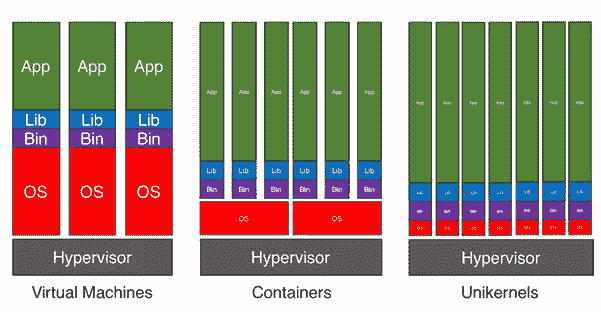

# 单核:新旧之间

> 原文：<https://itnext.io/unikernel-between-the-old-and-the-new-5128a04ea3af?source=collection_archive---------0----------------------->

## **回望过去**

两周前，我发表了一篇关于容器技术和虚拟机的[文章](https://www.linkit.nl/knowledge-base/207/Cloud_container_technology_The_old_and_the_new)。我解释了这两个概念，进行了比较，并列出了使用容器技术的优点和缺点。随着容器技术的出现，一种新的虚拟化正在出现:[单内核](https://en.wikipedia.org/wiki/Unikernel)。

快速回顾一下:容器是应用程序大小的虚拟化，它与其他容器共享操作内核。它会影响某些应用程序的便携性、安全性和适用性。尽管虚拟机更安全，但它们在调配和同时使用更多计算资源时速度较慢。

另一方面，单核则介于两者之间。它们的应用程序大小类似于容器，但使用独特的内核和操作系统，就像虚拟机一样。它们是包含库操作系统的映像，可以直接在[管理程序](https://en.wikipedia.org/wiki/Hypervisor)上运行。

## **单核、虚拟机和容器是竞争还是填补各自的空白？**

在上一篇文章中，我已经证明了容器的供应速度更快，可伸缩，并且可以共享资源。像容器一样，单核体积小，特别适合某些任务。

虽然我在上一篇文章中说过微服务适合容器化，但 unikernels 更是如此。这是因为容器仍然共享它们的内核，而 unikernels 不共享，共享内核仍然会带来某些组织无法接受的风险。unikernel 由一堆系统库、运行在 hypervisor 上的语言运行时层以及应用程序组成。因此，即使你把它比作一个容器，它也是由最少量的组件组成的。

它不是传统的操作系统，因为操作系统是由 unikernel 自带的库的组件“组装”而成的。这可以通过一种[类型安全语言](https://en.wikipedia.org/wiki/Type_safety#Type-safe_and_type-unsafe_languages)来完成，并允许选择库组件，将代码足迹减少到单一语言。一个单一的、紧凑的和检查良好的代码减少了疏忽的风险、语言的数量和不必要的大量代码，从而提高了安全性。这些组件被组装成一个直接在虚拟机管理程序上运行的可引导映像。这些特征导致了这样一个事实，即单核运行在一个单一的地址空间，没有其他相关的进程，就像传统操作系统那样。

因为没有进程，所以当前环境不支持调试。然而 [Lars Kurth](https://www.linkedin.com/in/larskurth) 认为这个问题可以通过构建适当的接口来连接调试应用程序或包来解决。当前的这个主要缺点阻碍了 unikernel 实现其潜力，因为调试是任何应用程序环境的基本组成部分。解决方案是从库中完全更改或更新包，并希望用户不要再现该错误。在大多数单核中使用的单一编程语言在未来是一个缺点还是一个优点，仍然存在争议。

另一个不便之处是，为每次不同的运行设置所有需要的模块和服务需要一些时间。但是，一旦被选中，它在资源调配方面比容器快得多，并且使用的资源也更少。正如我在上一段中提到的，这不同于具有默认设置的容器。下面这张来自 [Forbes](http://www.forbes.com/sites/janakirammsv/2016/01/26/unikernels-the-shiny-new-object-in-the-cloud/#46a144d93b6f) 的图更清晰的说明了这种区别，块越大消耗的资源越多或者说*能够*消耗的资源越多。这三个类别都有相同的资源，但在不同的类别中使用方式不同。您可以看到每个应用程序都减少了库和操作系统组件所需的计算资源。它也不像容器那样共享内核。

图 1[福布斯](http://www.forbes.com/sites/janakirammsv/2016/01/26/unikernels-the-shiny-new-object-in-the-cloud/#46a144d93b6f)云上闪亮的新物体

uni kernel 很容易扩展，需要最少的计算资源，而且由于 uni kernel 的紧凑特性，它们比容器相对更安全，供应速度也快得多。

在关于容器技术的文章中，我通过一个显示裸机、虚拟机和容器的平均调配时间的[图](/files/article/uploads/Virtualization_decoupled_provisioning_from_hardware_deployment._Containers_decouple_provisioning_from_OS_deployment_and_boot-up_by_.png)说明了调配时间的差异。分别是 8-24 小时，5-10 分钟，5-10 秒。单核的平均时间是几百毫秒的。随着时间成为微服务或大型服务的关键组成部分的一个重要因素，单核是正确的选择！

## **利弊**

为了加深您对何时使用单核，何时不使用单核的理解，这里列出了利弊。

**优点:**

*   *安全性:*通过使用单一类型安全语言而不是多种语言和大量未使用的代码来减少代码占用，从而提高安全性。
*   *引导时间:*由于代码占用空间减少，库操作系统和单一语言的引导时间减少到只有几毫秒。
*   *库操作系统:*单内核的类型安全语言和设置支持库操作系统，将操作系统简化为应用程序运行所需的组件*。*

**缺点:**

*   *可用性:*以目前 unikernel 的新颖状态，目前只适合微服务。
*   *灵活性:*要求提前安装库操作系统，如果需要不同的服务，必须提供完全不同的软件包。
*   *生产:*尚不可用于生产环境，这是因为单核的新颖特性导致无法调试*。*