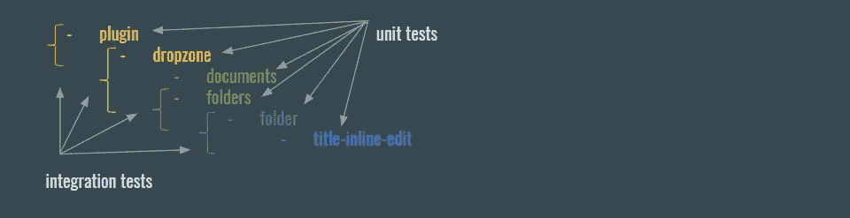
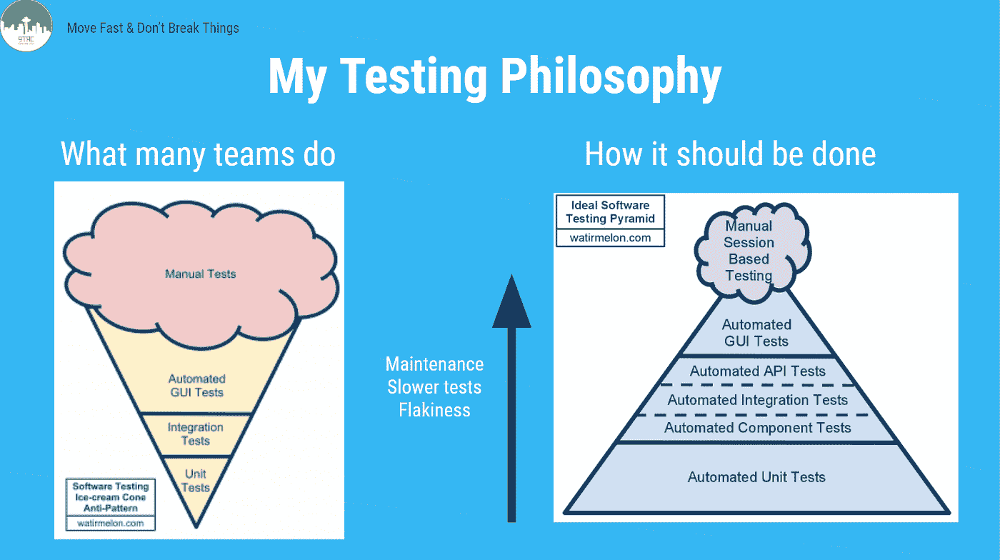

# 角形部件的单元和集成测试。第二部分，共三部分。

> 原文：<https://itnext.io/unit-and-integration-tests-for-angular-components-db43486de244?source=collection_archive---------4----------------------->

# 集成测试应该有多深？

在我之前的文章中，我已经指出了角形组件测试之间的区别。在我的研究中，我发现了马丁·福勒和谷歌测试博客上的一些有趣的帖子。请参见下面的链接。

你可能已经知道**集成测试**确保应用程序的不同单元**正确地相互通信**。所以你可以想象一个集成测试可能贯穿整个应用程序，测试越来越多的单元在一个完美的流程中一起工作。

单元测试表明它正在工作

但是我们真的想要吗？把软件想象成一连串的事件。当所有的链都是好的和健壮的时，软件将是好的和健壮的，但是一次检查整个链太难了。这就是为什么我们把它分开，首先检查每个链接(用单元测试)，然后检查最接近的链接(用集成测试)。

它如何应用于 Angular？首先对每个角度组件进行简单的测试，然后添加集成测试来检查组件与其第一级子组件的交互。让我们来看看下面的组件结构。

dropzone 模板看起来像:

dropzone 组件的单元测试配置应该是:

因此，为了实现浅层单元测试模板，您只需在测试床内部声明被测试的组件，其他什么都不用做。这意味着模板中的所有元素都将被视为简单的 DOM 节点，并且只应用常见的指令(例如 ngIf 和 ngFor)。

集成测试配置:

在单元测试中，会检查所有可能的组件场景:

*   将正确的类应用于元素
*   正确的值被放入 HTML 节点
*   鼠标事件等会触发正确的事件。

在集成测试中，测试集成点

*   正确的输出事件链
*   正确的输入值链

不要忘记谷歌的智慧和 70/20/10 法则。请记住，集成测试只检查流程，并不试图测试功能，这应该由优秀的老单元测试来完成。

点击我！

祝你们测试愉快，我的编码朋友们！这是聪明人给你的文章。

 [## bliki:集成测试

### 测试类别标签:集成测试确定独立开发的软件单元是否正确工作，当它们…

martinfowler.com](https://martinfowler.com/bliki/IntegrationTest.html)  [## bliki:单元测试

### 测试类别极限编程标签:单元测试经常在软件开发中被谈论，并且是一个术语…

martinfowler.com](https://martinfowler.com/bliki/UnitTest.html)  [## 拒绝更多的端到端测试

### 在你人生的某个时刻，你可能会想起一部你和你的朋友都想看的电影…

testing.googleblog.com](https://testing.googleblog.com/2015/04/just-say-no-to-more-end-to-end-tests.html)