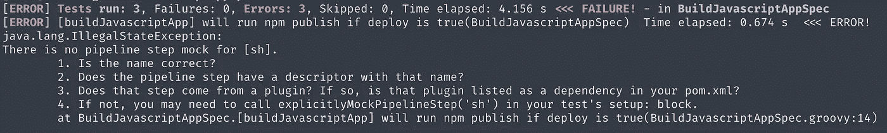
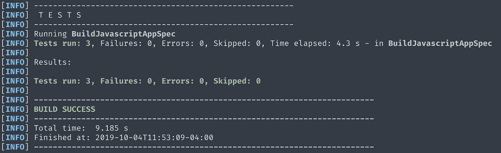
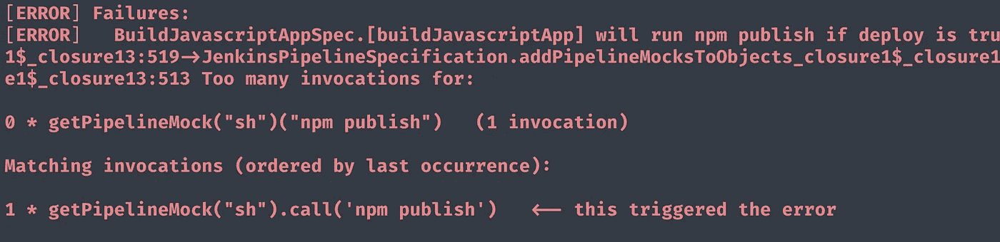

# Jenkins 共享库的单元测试

> 原文：<https://itnext.io/unit-testing-a-jenkins-shared-library-9bfb6b599748?source=collection_archive---------0----------------------->

## Jenkins 共享库系列文章的第三部分


【https://jenkins.io/ 

在我的 Jenkins 共享库系列的第二部分中，我们构建了自己的 Jenkins 共享库，将其加载到 Jenkins 中，并在管道中运行。在这一部分，我们将和 [Jenkins-Spock](https://github.com/homeaway/jenkins-spock) 一起演练如何为你的共享库编写单元测试

在本教程中，我们将利用一个名为 [Jenkins-Spock](https://github.com/homeaway/jenkins-spock) 的测试框架。Jenkins Spock 建立在 Spock 测试框架之上，并提供了一个模拟 Jenkins 环境来模拟 Jenkins，而无需实际拥有 Jenkins 实例。

上面的视频是本库作者奥斯汀·威特(Github 上的 [@awittha](https://github.com/awittha) )给出的詹金斯-斯波克的奇幻演示。我强烈建议在继续之前观看它。

# 先决条件

本教程要求我们安装了 Maven 和 Groovy。

*   玛文—[https://maven.apache.org/install.html](https://maven.apache.org/install.html)
*   groovy—[http://groovy-lang.org/install.html](http://groovy-lang.org/install.html)

# 入门指南

我们将基于我们在本系列第二部分中构建的共享库来编写本教程。如果您完成了该教程，您将能够继续使用相同的代码库。如果没有，你可以回到[第二部分](https://medium.com/@werne2j/how-to-build-your-own-jenkins-shared-library-9dc129db260c)或者你可以从[https://github.com/werne2j/jenkins-shared-library](https://github.com/werne2j/jenkins-shared-library)克隆共享库。

在写测试之前，我们要做一些设置。我们将在项目的根目录下创建一个`test`目录。在这个目录中，我们将有一个`vars`和`resources`目录。

这可以通过在项目的根目录下运行`mkdir -p test/{vars, resources}`来完成。项目的结构应该如下所示:

```
├── jenkins-shared-library
│   ├── src
│   │   ├── org
│   │   │   ├── example
│   │   │   │   ├── Constants.groovy
│   ├── test
│   │   ├── resources
│   │   ├── vars
│   ├── vars
│   │   ├── buildJavascriptApp.groovy
│   │   ├── notify.groovy
```

因为 Jenkins-Spock 要求我们使用 Maven，所以我们需要一个`pom.xml`文件来列出我们的依赖项和插件。我们将在项目的根目录中执行此操作，并粘贴以下代码:

我不打算深入讨论`pom.xml`，但有几点:

*   包括我们所有的依赖，如詹金斯-斯波克
*   包括 Jenkins 插件以及执行我们测试的`test`命令的配置
*   我们正在用`sources`标签设置我们希望测试在`gmavenplus`插件中的位置
*   如果您想了解更多关于`pom.xml`的信息，maven 在这里提供了一个很好的资源—[Pom 简介](https://maven.apache.org/guides/introduction/introduction-to-the-pom.html)

# 写作测试

在我们的共享库中，有两个全局变量，`buildJavascriptApp`和`notify`。我们将演练如何为每个变量编写测试。

先说`buildJavascriptApp`。如果你记得，这个变量是一个完整的管道，它安装依赖项，运行测试，然后发布应用程序。该变量的代码如下所示:

```
def call(Map config=[:], Closure body={}) {
  node {
    git url: "[https://github.com/werne2j/sample-nodejs](https://github.com/werne2j/sample-nodejs)" stage("Install") {
      sh "npm install"
    } stage("Test") {
      sh "npm test"
    } stage("Deploy") {
      if (config.deploy) {
        sh "npm publish"
      }
    } body()
  }
}
```

这条管道的主要逻辑是决定是否运行`npm publish`命令，然后调用传递给变量的闭包。

考虑到这一点，我看到了三种不同的测试。

1.  如果部署为真，将运行 npm 发布
2.  如果部署为假，将不运行 npm 发布
3.  如果向变量传递了一个闭包，将调用 closure

首先，我们将创建我们的测试文件。使用您喜欢的编辑器，在`test/vars`目录中创建一个名为`BuildJavascriptApp.groovy`的文件。测试将会是一个扩展来自 Jenkins-Spock 的`JenkinsPipelineSpecification`的类。

我们测试的外壳将看起来像这样:

第一行代码导入了为我们提供模拟 Jenkins 环境的`JenkinsPipelineSpecification`类。该测试是一个扩展了`JenkinsPipelineSpecification`的类，它被命名为`BuildJavascriptAppSpec`,遵循 Groovy 和 Jenkins-Spock 的命名约定。

在测试中，我们将创建一个名为`buildJavascriptApp`的变量，并使用它来加载我们的管道。

接下来我们看到的是一个叫做`setup`的方法。这是一个在我们每次测试之前运行的 [Spock 夹具方法](http://spockframework.org/spock/docs/1.3/all_in_one.html#_fixture_methods)。我们将使用这个 fixture 方法来加载变量。为此，我们使用来自詹金斯-斯波克的方法`loadPipelineScriptForTest`。在这一点上，我们有一个变量，`buildJavascriptApp`，我们已经将它分配给我们的管道变量，准备进行测试。

继续我们的测试。我们有前面列出的三个测试场景。我们使用`def`关键字来表示测试定义的开始。我们使用格式`[variable] will do something`来描述我们的测试，这使得组织我们的测试更加容易。你可以在这里阅读更多关于测试结构的信息。

下一步是向我们的测试中添加逻辑。

这里发生了一些事情，我会尽我最大的努力去打破它。

在第一次测试中，我们使用了`[when](http://spockframework.org/spock/docs/1.3/all_in_one.html#_when_and_then_blocks)`和`[then](http://spockframework.org/spock/docs/1.3/all_in_one.html#_when_and_then_blocks)`模块。`when`块用于调用我们正在测试的变量。在这个例子中，我们正在测试如果 deploy 为真，那么`buildJavascriptApp`运行`npm install`，所以在`when`块中我们有`buildJavascriptApp deploy: true`。如果我们在一个真实的 Jenkinsfile 中调用这个变量，就会得到这个结果。

在`then`块中，我们处理交互、条件和表达式。对于我们检查`npm install`是否被调用的例子，我们可以使用 [Spock 交互](http://spockframework.org/spock/docs/1.3/all_in_one.html#_interactions_2)。在我们街区我们看到了`1 * getPipelineMock(“sh”)(“npm publish”)`。这就是说“我们期望用`npm publish`作为参数来调用`sh`。如果`npm publish`没有被调用，这个交互将失败，因为它应该被调用一次。

我们的第二次测试几乎完全相同。唯一的区别是我们将`deploy: false`传递给`buildJavascriptApp`，然后检查`npm deploy`是否被调用。

希望这开始有意义了。

最后一个测试引入了一个新的概念叫做“[嘲讽](http://spockframework.org/spock/docs/1.3/all_in_one.html#_mocking)”。我们模仿传递给变量的闭包，这样我们就可以检查它是否被调用，就像我们对`sh`步骤所做的那样。在`then`块中，我们可以写`1 * body()`，也就是说我们希望模拟闭包只被调用一次。

我们已经完成了第一个测试文件！现在是运行测试的时候了！

转到您的终端，从项目的根目录运行`mvn clean test`。

我们得到一个错误！



当我们得到这样的错误时，这意味着我们有一个没有被嘲笑的管道步骤。所以看起来我们需要将这些缺失的插件添加到我们的`pom.xml`中。

添加:

```
<dependencies>
...
  <dependency>
    <!-- provides sh() step -->
    <groupId>org.jenkins-ci.plugins.workflow</groupId>
    <artifactId>workflow-durable-task-step</artifactId>
    <version>2.21</version>
    <scope>test</scope>
  </dependency>
  <dependency>
    <!-- provides stage() step -->
    <groupId>org.jenkins-ci.plugins</groupId>
    <artifactId>pipeline-stage-step</artifactId>
    <version>2.3</version>
    <scope>test</scope>
    </dependency>
  <dependency>
    <!-- provides git() step -->
    <groupId>org.jenkins-ci.plugins</groupId>
    <artifactId>git</artifactId>
    <version>3.9.1</version>
    <scope>test</scope>
  </dependency>
...
</dependencies>
```

正如我们在这里看到的，我们正在添加`sh`、`stage`和`git`管道步骤所需的插件。

将这些添加到 pom.xml 中的`org.jenkins-ci.plugins.workflow` 依赖标签之后。`pom.xml`现在应该是这样的:

现在，您可以再次尝试运行您的测试。

如果你看到这样的东西:



恭喜你！我们的测试通过了！

如果您没有看到这一点，请返回并确保您的代码看起来像上面的代码。

有时测试可以通过，但并没有真正按照我们想要的方式工作。确保我们的测试有效的一个方法是返回并改变交互。回到您的测试，对于第一个测试，将其更改为

```
def "[buildJavascriptApp] will run npm publish if deploy is true"() {
  when:
    buildJavascriptApp deploy: true
  then:
    0 * getPipelineMock("sh")("npm publish")
}
```

然后再次运行测试。您应该看到测试失败，输出如下:



这个错误是说我们期望`npm publish`不会被调用，但是它实际上被调用了一次，这正是我们希望代码做的。这很好看！

现在您已经掌握了编写 Jenkins-Spock 的知识，试着为 notify 变量编写一组测试吧！

**免责声明:**有一个名为`notify`的 Java 方法，所以我们的变量存在命名问题。编写测试时，将变量命名为`notifyVar`，而不是`notify`。

```
class NotifySpec extends JenkinsPipelineSpecification {
  def notifyVar = null

  def setup() {
    notifyVar = loadPipelineScriptForTest("vars/notify.groovy")
  } ...
}
```

你可以在这里找到完整的例子[，但是我建议在看代码之前先试一试！](https://github.com/werne2j/jenkins-shared-library/tree/tests)

感谢您阅读我的 Jenkins 共享库系列的第三部分。

在我的 Jenkins 共享库系列的第四部分中，我们将讨论如何对代码库进行一些小的修改，以允许我们收集代码覆盖率并将其发送到 [Sonarqube](https://www.sonarqube.org/) 。我希望在那里见到你！

# 我的詹金斯共享图书馆系列

[](https://medium.com/@werne2j/jenkins-shared-libraries-part-1-5ba3d072536a) [## 什么是 Jenkins 共享库，为什么你应该使用它们

### Jenkins 共享库系列文章的第 1 部分

medium.com](https://medium.com/@werne2j/jenkins-shared-libraries-part-1-5ba3d072536a) [](https://medium.com/@werne2j/how-to-build-your-own-jenkins-shared-library-9dc129db260c) [## 如何构建自己的 Jenkins 共享库

### 我的 Jenkins 共享库系列的第二部分

medium.com](https://medium.com/@werne2j/how-to-build-your-own-jenkins-shared-library-9dc129db260c) [](https://medium.com/@werne2j/unit-testing-a-jenkins-shared-library-9bfb6b599748) [## Jenkins 共享库的单元测试

### 我的 Jenkins 共享库系列的第三部分在我的 Jenkins 共享库系列的第二篇文章中，我们构建了…

medium.com](https://medium.com/@werne2j/unit-testing-a-jenkins-shared-library-9bfb6b599748) [](https://medium.com/@werne2j/collecting-code-coverage-for-a-jenkins-shared-library-c2d8f502732e) [## 收集 Jenkins 共享库的代码覆盖率

### 我的 Jenkins 共享库系列的第四部分

medium.com](https://medium.com/@werne2j/collecting-code-coverage-for-a-jenkins-shared-library-c2d8f502732e)