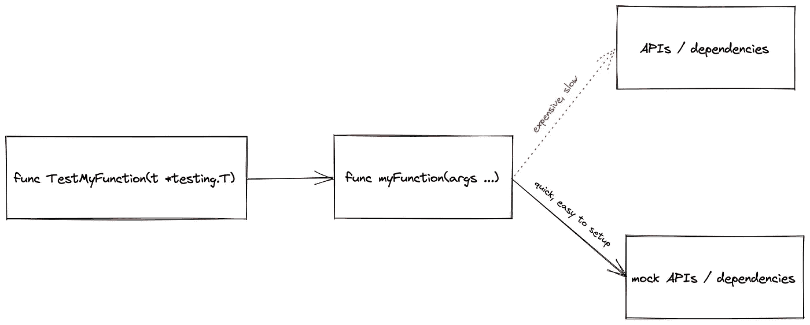

# 使用模拟对 Kubernetes 运算符进行单元测试

> 原文：<https://itnext.io/unit-testing-kubernetes-operators-using-mocks-ba3ba2483ba3?source=collection_archive---------1----------------------->

*在这篇文章中，我将带你了解使用模拟对 Kubernetes 操作符进行单元测试的想法，为什么你需要它们，以及如何实际编写一个！虽然这些想法和概念也可以在用其他语言/框架编写的操作符上实现，但我还是坚持使用 Golang、* [*控制器-运行时*](https://github.com/kubernetes-sigs/controller-runtime) *，以及* [*验证*](https://github.com/stretchr/testify) *库。本文还假设对 Kubernetes、操作人员和软件测试有很好的理解*

> 在整篇文章中，我将引用可以在中找到的`example-operator`。

# 单元测试和模拟——什么和为什么？

在我们真正进入模拟测试之前，让我们试着理解单元测试的重要性。顾名思义，单元测试处理的是测试软件的单个“单元”。它确保代码的这些独立单元或组件按预期工作，独立于代码的其他部分或外部依赖项。单元测试使你更容易发现软件的问题。软件中不同单元之间的交互只有在这些单元本身被保证能正确工作时才能正确工作——这就是单元测试重要的原因！

在 Kubernetes 控制器的上下文中，这个“单元”可以被认为是一个与 Kubernetes API 交互(通过一个客户端)并对 Kubernetes 对象和资源进行操作的单一函数(或方法)。因为这些函数需要与 Kubernetes API 对话，所以对它们进行单元测试变得有些困难，因为它们不需要额外的服务或 API 来执行。这不仅是因为我们想要隔离我们正在测试的逻辑，还因为有时，设置这些资源可能有点昂贵，并且会减慢测试过程。

这就是嘲讽的用处！它允许您模仿或模拟代码组件所依赖的服务——在本例中是 Kubernetes 客户端。模拟可以帮助您验证控制器与 Kubernetes API 的交互(比如断言是否执行了某些操作),而无需实际与 Kubernetes 集群进行交互。



图 1 —模拟测试

让我们通过查看一些代码来更好地理解这一点！

# 代码走查

每当一个`Deployment`对象被操作时，我们的控制器的协调循环就被触发。控制器基于`container/inject=true`标签-值对的存在，通过向 pod 模板中注入一个额外的容器来协调`Deployments`。

> 这个控制器实际上并不做任何有用的事情，只是为了本文而编写的。

可以在`[controller/controller.go](https://github.com/mayankshah1607/example-operator/blob/master/controller/controller.go)`找到的`[Reconcile](https://github.com/mayankshah1607/example-operator/blob/master/controller/controller.go#L31)`方法是所有和解相关活动的切入点。

```
// ... controller/controller.gotype MyReconciler struct {
 client.Client
 Scheme *runtime.Scheme
}func (r *MyReconciler) Reconcile(
 ctx context.Context, req ctrl.Request) (ctrl.Result, error) {// STEP 1: get the deployment object
 deployment := &appsv1.Deployment{}
 err := r.Get(ctx, req.NamespacedName, deployment)
 if err != nil {
  return ctrl.Result{}, err
 }// STEP 2: reconcile
 if err := r.handleDeploymentReconciliation(ctx, deployment); err != nil {
  return ctrl.Result{}, err
 }
 return ctrl.Result{}, nil
}
```

核心协调逻辑封装在`[handleDeploymentReconciliation](https://github.com/mayankshah1607/example-operator/blob/master/controller/controller.go#L48)`方法中，这就是我们将要编写单元测试的目的。这里我们想要模拟的依赖项是由[控制器-运行时](https://github.com/kubernetes-sigs/controller-runtime)提供的 Kubernetes 客户端。

## 为 Kubernetes 客户端编写模拟

[stretchr/evidence](https://github.com/stretchr/testify)模块提供了 [mock](https://github.com/stretchr/testify#mock-package) 包，用于方便地编写定制的 mock 对象，这些对象可以在编写单元测试时用来代替真实对象。让我们使用提供的机制为 Kubernetes 客户端编写一个模拟对象。

> 所有与模拟相关的代码都可以在`[utils/tesutil.go](https://github.com/mayankshah1607/example-operator/blob/master/utils/testutil.go)`中找到。

第一步是通过将`mock.Mock`嵌入到它的结构中，为客户机创建一个模拟对象。

```
// ... utils/testutil.gotype Client struct {
 mock.Mock ....
}
```

接下来，我们需要为这个模拟`Client`设置所需的方法，它将被`handleDeploymentReconciliation`方法调用。

```
// ... utils/testutil.gofunc (c *Client) Update(ctx context.Context, obj client.Object, opts ...client.UpdateOption) error {
 args := c.Called(ctx, obj, opts)
 return args.Error(0)
}
```

`Update`方法在这里不需要做任何有用的事情。它只是通知模拟对象它已经被调用，并返回没有任何错误。这个方法对真正的客户机有用，但是因为我们想模仿它，我们简单地把它去掉。

> 为了保持简洁，我只展示了一个`Update`方法的例子。为了实际使用`Client`模拟对象，它需要实现在`Client`接口中定义的所有方法。此外，您还可以使用[mock](https://github.com/vektra/mockery)来轻松地自动生成模拟代码。

## 编写您的单元测试

现在我们已经有了一个模拟客户端，让我们看看如何使用它来编写单元测试。单元测试可以在`[controller/controller_test.go](https://github.com/mayankshah1607/example-operator/blob/master/controller/controller_test.go)`中找到。

```
// ... controller/controller_test.gofunc TestHandleDeploymentReconciler(t *testing.T) {
 client := utils.NewClient()// setup expectations
 client.On("Update",
  mock.IsType(context.Background()),
  mock.IsType(&appsv1.Deployment{}),
  mock.Anything,
 ).Return(nil)ctx := context.Background()
 reconciler := &MyReconciler{
  Client: client,
  Scheme: newTestScheme(),
 }err := reconciler.handleDeploymentReconciliation(ctx, newTestDeployment())
 require.NoError(t, err)
 client.AssertExpectations(t)}
```

我们使用[验证](https://github.com/stretchr/testify)工具包提供的机制来断言对`Update`的预期函数调用使用了正确类型的参数和返回值。

*   `client.On`设置关于必须调用哪个客户端方法(在本例中为`Update`)的预期，以及使用哪种类型的参数和返回值。
*   `mock.IsType`帮助断言使用`client.On`设置的预期方法(在本例中为`Update`)是用正确的参数类型调用的。
*   `client.AssertExpectations`检查预期是否实际达到。如果调用了意外的方法，没有调用预期的方法，或者使用意外的参数类型调用了预期的方法，则测试会出现混乱。
*   最后，`require.NoError`断言`handleDeploymentReconciliation`没有错误地返回。

要运行该测试，只需在您的终端上执行以下命令:

```
$ go test -timeout 30s -run ^TestHandleDeploymentReconciler$ \ ./controllerok   github.com/mayankshah1607/example-operator/controller 0.941s
```

简单干净，不是吗？

# 结论

虽然单元测试和 Kubernetes 操作符是一个很大的主题，但是本文简要地向您介绍了一种使用模拟为 Kubernetes 操作符编写单元测试的有效方法。模拟对象对于测试代码和它所依赖的外部 API 之间的交互非常有用。我们看看如何使用[evidence](https://github.com/stretchr/testify)工具包为 Kubernetes 客户端编写模拟，并在您的单元测试中使用它。虽然本文关注的是使用 Golang 和[控制器-运行时](https://github.com/kubernetes-sigs/controller-runtime)编写的操作符，但是这些想法和概念也可以跨各种其他框架实现。

如果你觉得这篇文章有帮助，请考虑鼓掌并与你的朋友和同事分享。您可以在以下网址找到我:

*   推特—【https://twitter.com/mayankshah__ 
*   领英—[https://www.linkedin.com/in/mayankshah1607/](https://www.linkedin.com/in/mayankshah1607/)
*   GitHub—[https://github.com/mayankshah1607](https://github.com/mayankshah1607)

*感谢您花时间阅读本文！*

# 参考

*   [https://book.kubebuilder.io/](https://book.kubebuilder.io/)
*   [https://github.com/stretchr/testify](https://github.com/stretchr/testify)
*   [https://en.wikipedia.org/wiki/Unit_testing](https://en.wikipedia.org/wiki/Unit_testing)
*   [https://blog.mayadata.io/testing-kubernetes-operators](https://blog.mayadata.io/testing-kubernetes-operators)
*   [https://flugel . it/devo PS/building-custom-kubernetes-operators-article-iv-automatic-testing-using-operator-SDK/](https://flugel.it/devops/building-custom-kubernetes-operators-article-iv-automatic-testing-using-operator-sdk/)