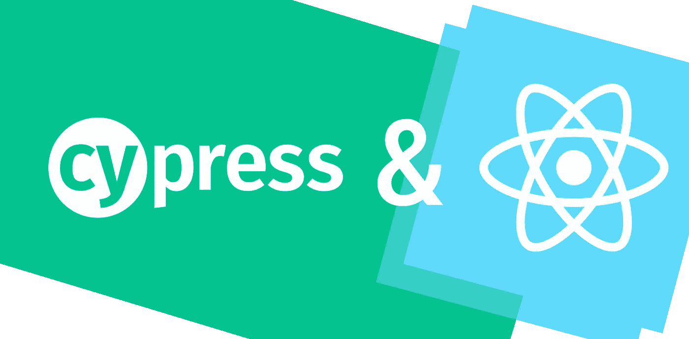
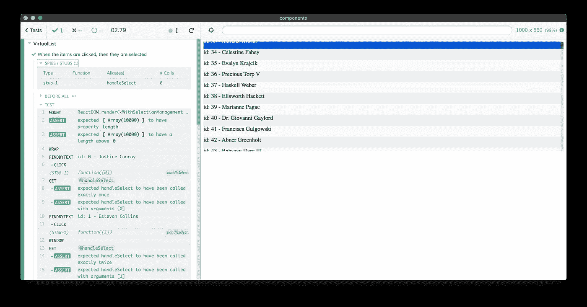

# 单元测试用 Cypress 反应组件

> 原文：<https://itnext.io/unit-testing-react-components-with-cypress-4d4cf8cd59a0?source=collection_archive---------3----------------------->

Cypress 4.5.0 推出了期待已久的特性:对框架组件渲染的一流支持。



感谢 [Dmitriy Tishin](https://itnext.io/@daedaliusx) 对英雄形象的创意。

我正在 GitHub 上做一个大的 [UI 测试最佳实践](https://github.com/NoriSte/ui-testing-best-practices?source=post_page---------------------------)项目，我分享这个帖子来传播它并有直接的反馈。

***更新****:*[*Cypress 10 不含组件测试集成 E2E 测试*](https://www.cypress.io/blog/2022/06/01/cypress-10-release/) *，请检查一下，忽略下面报道的所有配置步骤，因为它们已经过时了！*

***更新*** *:* [*柏 7 出带全新组件测试支持*](https://docs.cypress.io/guides/component-testing/introduction#What-is-Component-Testing) *，快来看看吧！其他激动人心的消息正在路上感谢* [*故事书 6.2 发布*](https://twitter.com/NoriSte/status/1378204109841571840) *！*

两个月前，我写了“[用 Cypress 和 Storybook](https://medium.com/@NoriSte/testing-a-virtual-list-component-with-cypress-and-storybook-494dc2d1d26b) 测试虚拟列表组件”的文章。这是一篇扩展文章，因为用 Cypress 可以对 React 组件进行单元测试。

前一篇文章的目标是在 **React 组件测试世界**中运行一些实验，这是当今真正重要的话题。

动机很简单:

*   你的团队中可能已经有了[故事书](https://storybook.js.org/)(如果没有，考虑添加它！)
*   您可能不熟悉使用[测试库](https://testing-library.com/)测试组件，或者您可能对 JSDom 有偏见，或者您可能想要在真实的浏览器中测试您的 UI 组件，而不是在模拟的 Dom 环境中
*   您可能熟悉 [Cypress](https://www.cypress.io/) 或 [TestCafé](https://devexpress.github.io/testcafe/) (如果不熟悉，考虑将它们用于您的 UI 测试)，并且您可能希望只使用一个工具进行测试

方法也很简单:

*   将故事的道具暴露给测试工具，用于控制呈现的组件
*   从 Cypress/TestCafé中获取它们，自动执行用户动作并断言道具的内容

但是也有一些警告

*   性能:在[的文章](https://medium.com/@NoriSte/testing-a-virtual-list-component-with-cypress-and-storybook-494dc2d1d26b)中，我做了一些额外的努力来最小化故事切换缓慢的影响
*   **测试和故事耦合**:因为 Storybook 甚至被 Cypress 消费掉了，故事不仅要负责在团队中共享设计系统，还要负责组件测试
*   **回调测试变得困难**:检查回调属性的参数和调用很困难

我实验中的一些问题可以通过 [Dmitriy Tishin 方法](/cypress-storybook-keeping-test-scenario-data-and-component-rendering-in-one-place-c57b23cc1640)来缓解，但是解决方案还不是最佳的，但是…

# Cypress 4.5.0 已经发布

4 月 28 日，Cypress 4.5.0 已经发布，唯一发布的特性如下

> 当将 experimentalComponentTesting 配置选项设置为 true 时，Cypress 现在支持使用特定于框架的适配器执行组件测试。更多细节见[cypress-react-unit-test](https://github.com/bahmutov/cypress-react-unit-test)和 [cypress-vue-unit-test](https://github.com/bahmutov/cypress-vue-unit-test) 报告。

这是什么意思？那个 Cypress 现在可以直接挂载一个 React 组件，给了这个[**Cypress-React-unit-test**](https://github.com/bahmutov/cypress-react-unit-test)一个新生！在 Cypress 4.5.0 发布之前，这个插件非常有限，但是现在它有一流的支持！事实上，cypress-react-unit-test 现在已经坚如磐石，是一个有意义的插件。

# 测试虚拟列表组件:第二集

组件总是相同的，虚拟列表，在[的前一篇文章](https://medium.com/@NoriSte/testing-a-virtual-list-component-with-cypress-and-storybook-494dc2d1d26b#0e10)中了解更多。我们需要设置 [cypress-react-unit-test](https://github.com/bahmutov/cypress-react-unit-test) 和 TypeScript 转换(该组件是用 TypeScript 编写的，它是 [Lerna](https://github.com/lerna/lerna) monorepo 的一部分，并且是用 Webpack 编译的)。这两个步骤都很简单，但是如果插件在它的文档中有一个[安装专用的部分，那么 TypeScript 编译可能不明显，因为有很多不同的方法和资源，这些方法和资源是过时的或者部分的。
最简洁有效的解决方案是](https://github.com/bahmutov/cypress-react-unit-test#install) [André Pena 的一个](https://stackoverflow.com/a/60017105/700707)，所以我所要做的就是:

*   添加一个*cypress/web pack . config . js*文件

```
module.exports = {
  mode: 'development',
  devtool: false,
  resolve: {
    extensions: ['.ts', '.tsx', '.js'],
  },
  module: {
    rules: [
      {
        test: /\.tsx?$/,
        exclude: [/node_modules/],
        use: [
          {
            loader: 'ts-loader',
            options: {
              // skip typechecking for speed
              transpileOnly: true,
            },
          },
        ],
      },
    ],
  },
}
```

*   添加一个 *cypress/tsconfig.json* 文件

```
{
  "extends": "../tsconfig.json",
  "compilerOptions": {
    "types": ["cypress", "cypress-wait-until"]
  }
}
```

请注意:

*   `../tsconfig.json`文件与 React 应用程序使用的文件相同
*   cypress-wait-until 不是强制的，但是我经常使用它，它是 cypress 安装最多的插件之一

上面的 transpiling 相关文件，以及下面的 cypress.json 文件

```
{
  "experimentalComponentTesting": true,
  "componentFolder": "cypress/component"
}
```

都足够开始玩一个*cypress/component/virtual list . spec . tsx*测试了！在上一篇文章中，第一个测试是标准呈现，即*“当组件接收 10000 个项目时，只呈现最小数量的项目”*测试，瞧:

```
/// <reference types="Cypress" />
/// <reference types="cypress-wait-until" />import React from 'react'
import { mount } from 'cypress-react-unit-test'import { VirtualList } from '../../src/atoms/VirtualList'
import { getStoryItems } from '../../stories/atoms/VirtualList/utils'describe('VirtualList', () => {
  it('When the list receives 10000 items, then only the minimum number of them are rendered', () => {
    // Arrange
    const itemsAmount = 10000
    const itemHeight = 30
    const listHeight = 300
    const items = getStoryItems({ amount: itemsAmount })
    const visibleItemsAmount = listHeight / itemHeight // Act
    **mount**(
      <VirtualList
        items={items}
        getItemHeights={() => itemHeight}
        RenderItem={createRenderItem({ height: itemHeight })}
        listHeight={listHeight}
      />,
    ) // Assert
    const visibleItems = items.slice(0, visibleItemsAmount - 1)
    itemsShouldBeVisible(visibleItems) // first not-rendered item check
    cy.findByText(getItemText(items[visibleItemsAmount]))
      .should('not.exist')
  })
})
```

与故事书相关的文章相比:

*   这

```
/// <reference types="Cypress" />
/// <reference types="cypress-wait-until" />
```

开始时需要让 VSCode 正确地利用类型脚本建议和错误报告(它也适用于普通的 JavaScript 文件)

*   我们使用 cypress-react-unit-test '`mount`API 来安装组件，如果你已经习惯了[测试库 API](https://testing-library.com/docs/react-testing-library/api)的话，这没什么特别新的

除此之外，Cypress 测试和故事书相关的测试一样继续进行😊

## 回拨测试

从[上一篇文章](https://medium.com/@NoriSte/testing-a-virtual-list-component-with-cypress-and-storybook-494dc2d1d26b#0e10)中移植所有的测试非常容易，所缺少的是“选择测试”的回调测试部分。

创建一个 *WithSelectionManagement* 包装组件来呈现*虚拟列表*并管理项目选择是非常容易的，我们可以向它传递我们的存根并断言它

```
it('When the items are clicked, then they are selected', () => {
  const itemHeight = 30
  const listHeight = 300
  let testItems const WithSelectionManagement: React.FC<{
    testHandleSelect: (newSelectedIds: ItemId[]) => {}
  }> = props => {
    const { testHandleSelect } = props
    const items = getStoryItems({ amount: 10000 }) const [selectedItems, setSelectedItems] = React.useState<(string | number)[]>([]) const handleSelect = React.useCallback<(params: OnSelectCallbackParams<StoryItem>) => void>(
      ({ newSelectedIds }) => {
        setSelectedItems(newSelectedIds)
        testHandleSelect(newSelectedIds)
      },
      [setSelectedItems, testHandleSelect],
    ) React.useEffect(() => {
      testItems = items
    }, [items]) return (
      <VirtualList
        items={items}
        getItemHeights={() => itemHeight}
        listHeight={listHeight}
        RenderItem={createSelectableRenderItem({ height: itemHeight })}
        selectedItemIds={selectedItems}
        onSelect={handleSelect}
      />
    )
  }
  WithSelectionManagement.displayName = 'WithSelectionManagement' mount(<WithSelectionManagement testHandleSelect={**cy.stub().as('handleSelect')**} />) cy.then(() => expect(testItems).to.have.length.greaterThan(0))
  cy.wrap(testItems).then(() => {
    cy.findByText(getItemText(testItems[0])).click()
    **cy.get('**[**@handleSelect**](http://twitter.com/handleSelect)**').should(stub => {
      expect(stub).to.have.been.calledOnce
      expect(stub).to.have.been.calledWith([testItems[0].id])
    })**
  })
})
```

请参考完整的 SinonJS(由赛普拉斯包装和使用)[存根](https://sinonjs.org/releases/v9.0.2/stubs/) / [Spy](https://sinonjs.org/releases/v9.0.2/spies/) 文档以获取完整的 API。

# 结论

这里是最后一次测试的截图，最完整的一次



最后一次测试用的是存根支票。

这是所有测试的记录

组件单元测试直接在 Cypress 中运行。

测试持续不到 7 秒，不依赖也不加载故事书，利用一流的 Cypress 支持。

下一步是什么？cypress-react-unit-test 插件现在非常稳定和有用，一个全新的实验世界已经开放，许多中小型项目可以选择利用 cypress 作为单一测试工具。我等着你的评论和经验😊

## 你可能会对我的其他文章感兴趣

*   使用 Cypress 和 Storybook 的原始组件测试实验:[使用 Cypress 和 Storybook 测试虚拟列表组件](https://medium.com/@NoriSte/testing-a-virtual-list-component-with-cypress-and-storybook-494dc2d1d26b)
*   UI 测试分类:[组件 vs (UI)集成 vs E2E 测试](https://medium.com/@NoriSte/component-vs-ui-integration-vs-e2e-tests-f02b575339dc)
*   避免用不必要的和不可预测的等待来减慢你的测试:[等待，不要让你的 E2E 测试休眠](https://medium.com/@NoriSte/await-do-not-sleep-your-e2e-tests-df67e051b409)

你好👋我是 Stefano Magni，我是一名热情的**反应和打字开发者**，一名**柏树大使**和一名**讲师**。我作为一名高级前端工程师为 WorkWave 做远程工作。我喜欢创造高质量的产品，测试和自动化一切，学习和分享我的知识，帮助他人，在会议上发言，以及面对新的挑战。
你可以在 [Twitter](https://twitter.com/NoriSte?source=post_page---------------------------) 、 [GitHub](https://github.com/NoriSte?source=post_page---------------------------) 、 [LinkedIn](https://www.linkedin.com/in/noriste/?source=post_page---------------------------) 上找到我。你可以找到我最近所有的投稿/演讲等。关于[我的 GitHub 总结](https://github.com/NoriSte/all-my-contributions)。