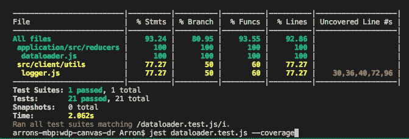

# 单元测试用 Jest 还原动作、还原器和史诗

> 原文：<https://itnext.io/unit-testing-redux-actions-reducers-and-epics-with-jest-484f8a59f1f2?source=collection_archive---------1----------------------->



Redux 是一种帮助复杂的单页面应用程序的流行模式，它允许状态、状态上的动作以及状态在 UI 中的呈现方式之间的清晰分离。

但是，当然，没有什么是免费的，Redux 也有不好的一面。尽管 Redux 的核心原则简单明了，但它们通常隐藏在助手函数之后，这会使应用程序变得复杂且难以验证。这些帮助函数往往隐藏了实际发生的事情，开发人员失去了一些代码透明性，这使得随着代码的发展或新代码路径的创建(很少被触发，例如错误处理)，错误更容易蔓延。

那么，如何快速测试和验证 Redux 类，而不需要建立应用程序的实例并使用 Selenium 等工具运行实时测试呢？(Selenium 没什么不好——我是它的粉丝——但是我想用正确的工具完成正确的工作，为此我们需要更轻的东西)。

我们的答案是一个叫做 [Jest](https://facebook.github.io/jest/) 的单元测试框架。Jest 允许我们定义测试并模拟提供底层 XHR 调用的类，这样我们可以在几秒钟内完全独立于任何浏览器运行我们的测试，所有这些都是我们 CI/CD 管道的一部分。作为一个额外的奖励，它还在报告代码覆盖率方面做得很好，允许开发人员找到那些没有运行的代码分支(这通常是导致问题的原因)。

对我们的 Redux 类进行单元测试不仅有助于在代码交付之前对其进行测试，还可以作为一个永久的回归套件，防止无害的更改引入 bug。我们还发现，对于描述 Redux 类应该如何工作，它是一个有用的参考点。

# **数据加载器示例**

为了演示我们是如何测试和模仿 Redux 类的，让我们举一个例子。 *DataLoader* 类抽象了调用各种 REST 端点和更新 UI 的复杂性。*数据加载器*类具有以下状态:

它定义了以下操作和缩减器来操纵状态:

*DataLoader* 类也使用动作副作用来执行 XHR 调用，该调用在成功或失败时将调用进一步的动作:

这个副作用代码一开始可能是难以理解的(其次..)看一下，但本质上是说在应用了 *REQUEST_DATA* 动作之后调用本地函数 *_createDataRequest()，*并且在应用了 *SET_DATA_LOADING* 动作之后调用本地函数 *_getData()* 。这些函数进行所需的 XHR 调用(通过包装器 *DataLoaderService* )并返回一个*可观察值*，用于在成功或失败时触发另一个动作:

*DataLoader* 类的最后一部分是一组选择器，允许检查状态:

有了这些，我们可以对几个方面进行单元测试:

*   **动作**创作者
*   **减速器**状态操纵
*   **选择器**返回正确值
*   在稍微高一点的层次上，想想**史诗**中的**动作副作用**，这个*数据加载器*类有几个可能的动作路径，帮助我们定义适当的单元测试。

1.  快乐路径:*请求 _ 数据*到*设置 _ 数据 _ 加载*到*设置 _ 数据 _ 可用。*
2.  错误路径:*请求 _ 数据* (XHR 失败)到*设置 _ 错误。*
3.  错误路径:*请求 _ 数据*到*设置 _ 数据 _ 加载* (XHR 失败)到*设置 _ 错误。*

(在所有情况下，根据需要应用*关闭*动作进行清理)。

# 动作创建器单元测试

最简单的单元测试是由助手类生成的动作创建函数。这些不需要模仿，可以使用一个简单的*describe…test…expect Jest 的*模式进行单元测试。我们添加这些，不仅是为了检查拼写错误，也是为了帮助理解 Redux helper 类在做什么。例如:

# 减速器单元测试

像动作单元测试一样，减速器单元测试不需要模仿，可以使用一个简单的*描述…测试…期望来自 Jest 的*模式进行单元测试。例如:

# 选择器单元测试

选择器单元测试也不需要模仿，可以使用简单的*describe…test…expect Jest 的*模式进行单元测试。例如:

# 史诗中的动作副作用

动作副作用对单元测试来说更复杂，因为它们需要创建一个虚拟 Redux 存储，以及模拟底层 XHR 调用来模拟成功或失败。

虚拟商店的创建相当简单。我们创建一个全局函数来完成创建，然后使用 Jest 在每次测试之前自动调用的 *beforeEach()* 回调来调用它:

一旦创建了虚拟存储，单元测试就可以涵盖每一个成功和失败的场景。重要的是，底层的 *DataLoaderService* 类是使用 Jest 模拟的，因此我们可以从它模拟成功和失败的响应，而不需要真正的 XHR 调用。一个成功场景单元测试的例子是:

同样，单元测试失败的一个例子是:

# 把所有的放在一起

随着单元测试的开发，它可以通过使用 [Jest CLI](https://www.npmjs.com/package/jest-cli) 在 insolation 中运行，传递要运行的测试的文件名。忽略此操作将运行找到的所有测试:

```
jest dataloader.test.js --coverage
```

`--coverage`标志意味着 Jest 也将报告加载的文件的覆盖范围:

尽管我不鼓励过分追求 100%的代码覆盖率，但令人欣慰的是，我们在 Redux 类中编写的所有代码现在都有测试覆盖率。和所有的单元测试一样，开始是痛苦的，但是一旦你开始了，就你所生产的产品的质量而言，它是有回报的。