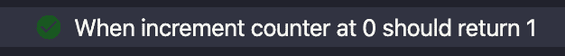
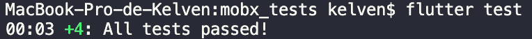

# 用 MobX 进行单元测试

> 原文：<https://itnext.io/unit-testing-with-mobx-d4d550689086?source=collection_archive---------3----------------------->


什么是单元测试？

单元测试是建立在系统的输入或输出声明(控制数据、使用程序和操作程序)上的每一个测试。它是代码中较小的可测试部分。

**什么事？**

单元测试的重要性在于确保你的代码的所有输入和输出都如你所愿地工作。这让您有信心，这些孤立的小代码片段在使用过程中不会中断。为了确保完全的安全性，编写集成测试非常重要，集成测试负责测试所有代码的功能。

**为 Mobx 编写测试。**

MobX 基于商店、动作和反应，使用透明功能反应编程(TFRP ),因为它是功能性的，所有动作都是功能，它们的数据是可观察的反应值。所以测试你的商店非常简单。

**先说计数器。**

是的，那个老柜台。

我们将测试增量是否如我们预期的那样发生。

首先，声明测试。

```
test(
‘When increment counter at 0 ‘
‘should return 1’, () {});
```

之后我们会申报专柜店。

```
final counter = Counter();
```

我们期望计数器从 0 开始计数。

为此，使用“expect”函数，该函数接收要测试的变量和您期望作为参数的值。

```
expect(counter.value, 0);
```

现在，执行增量并验证值是否增加了。

```
expect(counter.value, 1);
```

要运行测试，请在控制台中运行:

```
flutter test
```

或者使用 IDE 的“运行所有测试”选项。



*成功！*

让我们来举一个更复杂的例子，*但不要太复杂。*

**测试市场推车。**

市场购物车由一个表示商品的类和一个具有添加和删除功能的商品列表的商店组成。

让我们测试一个项目添加。

声明将要添加的购物车和商品，然后执行添加功能，预计我们的列表长度将增加到 1，并且包含我们的商品。

```
test(
‘When add a item’
‘should contains that item, () {
  final cart = Cart();
  final item = CartItem(‘test’); cart.addItem(item); expect(todoList.items.length, 1); expect(todoList.items.contains(item), true);
});
```

现在，测试移除。

与上面添加的方式相同，我们将删除列表，期望列表长度为 0，并且不再包含我们的项目。

```
test(
‘When remove a item’
‘should not contains that item, () {
  final cart = Cart();
  final item = CartItem(‘teste’); cart.addItem(item);
  expect(cart.items.length, 1);
  expect(cart.items.contains(item), true); cart.removeItem(item);
  expect(cart.items.length, 0);
  expect(cart.items.contains(item), false);
});
```

所有购物车测试:

**运行测试。**



现在，您已经准备好使用 MobX 探索测试世界了。

**重要建议:**

建议您使用测试驱动开发的 TDD。