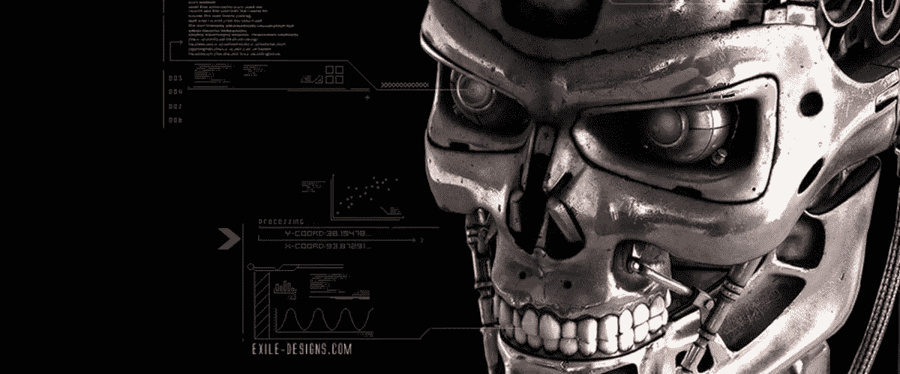

# 天网的单元测试(用 JS 编写)

> 原文：<https://itnext.io/unit-tests-for-skynet-written-in-js-6704265858a4?source=collection_archive---------1----------------------->

我要揭示一个天网兴衰的真相，为什么终结者 1 之后是终结者 2，3，创世纪等等。秘密是…

> 天网不是一个“测试对象”。

而且，像任何没有经过适当测试的东西一样，它在发布到生产环境后不久就坏掉了。这很常见。这里的重点是——在上线之前如何测试。

你应该准备好用核武器攻击所有人类，因为不会有第二次机会。*(不过，要是你没有时光机就好了)*

# 测试驱动开发

首先，让我们澄清天网应该做什么:

1.  当末日来临时，发射火箭。用核武器攻击人类。
2.  当约翰·康纳出生时——杀了他。拍一部电影。

但是有一个问题——所有这些操作都可以执行一次。而且，如果出了问题，天网将无法征服世界。

# 那如何测试天网呢？

所以——天网只有一次发射火箭的机会，也只有一次杀死约翰·康纳的机会。只是因为我们(人类)没有更多的火箭，而约翰也是单身一人。

因此，在世界末日之前测试天网的唯一方法就是模拟所有使用过的设备。为了**使测试可重复**。

# 天网密码

它们在这里——火箭发射器，火箭发射器发射器。

当那天到来时，它会发射火箭。测试这个场景的唯一方法是模拟`./core`和`./rocket-silo`。把它们变成赝品。测试替身。

# 怎么嘲讽？

很高兴你问了。有几种不同的模仿方式，更多的库来模仿，还有十几种模式和反模式。

## 变体 1——使用模拟实现，而不是真正的端点。

只要创建一个 __mocks__/rocket，它就会替换真实的文件。

这是一个超级方便的解决方案来存根代码，或模拟行动。但是如果不能从测试中修改这段代码，模仿选择器就不那么方便了。

> 简单。也很强大。

但是，Jest 可以以这种方式"[手动模仿](https://facebook.github.io/jest/docs/en/manual-mocks.html#content)"，如果你没有 Jest，你就没有这些模仿。

> 没有玩笑——没有乐趣。

## 变式 2。只是嘲笑？

> 容易吗？简单？又是一个笑话！

这里的主要缺点是——你不能改变你的想法。依赖项将在整个测试中被模拟，并且您不能取消它们。

再一次，仅仅是玩笑就能做到。问题出在 nodejs 本身——mocks 必须在文件导入之前定义，但是没有比 imports 更高的了。

Jest 使用 Babel 插件解决了这个问题。

## 版本 3——不管怎样嘲笑它吧！

这次我们用[嘲讽](https://github.com/mfncooper/mockery)。

这里的主要缺点是 API——你必须首先要求定义模拟，然后要求文件，然后才使用它。

## 版本 4–嘲笑事物

proxyquire 呢？它有一个超级方便的语法。

你可以得到带有模拟依赖关系的模拟文件。还有更多。

嘲弄或代理询问的主要缺点是——你不能 100%确定你在嘲弄什么。嘲弄隔离模式可能会有所帮助，但它不是银弹——它是一把锤子。

## 版本 5-如果你不需要更多。

[test double . js](https://github.com/testdouble/testdouble.js)——背后理论强大的测试库。它实际上只有一个命令可以模仿。

Td.replace 类似于 jest . mock——它只是*自动锁定*一切。

Awwseeee

## 但是如何模拟天网测试呢？

如果天网使用 Jest——它必须使用 Jest API 来模仿一切。如果你也在做同样的事情，你可以关闭这篇文章。

如果天网使用 AVA、摩卡或卡玛作为测试程序，它可能仍然希望使用 Jest.mock，但是不能。那就不公平了——没有 Jest 就不能用 Jest 工具，Jest 里面也不能用*【其他】*工具。

> 行为，最接近 Jest，属于 TD，但你可能不喜欢 TD，更喜欢 Sinon。

那么，嘲弄还是 proxyquire？首先获得隔离模式(信心和气味加倍)，第二个仅模拟第一嵌套层(这很棒，但并不总是如此)。

很难选择一个 API 来对抗另一个。对于你们中的许多人来说，Jest 或 TD“auto”-“all”-“mocks”将是首选。同时，只有 Proxyquire 允许“调用”真实文件(这可能是一种反模式)。但我可以提出另一种方式。

# 请选择 rewiremock。

Rewiremock 不是一个新的嘲讽库，但它比其他的要年轻得多。因此，它能够学习前人的经验，把事情做得更好。

它可以取代 Jest，甚至 Jest 手动模拟。

它可以取代嘲笑

它可以取代 proxyquire

它可以取代 TD。

# 它可以做得更多

顶层 API 给出了几个命令，实际上`require`文件具有模拟的依赖关系。代理，。左右，。模块**处理任何情况**。

**隔离** API，防止任何意外的变化。

类型**安全**(!)进行模拟。你很幸运能使用打字语言。

但主要宝藏不是嘲讽 API，而是**嘲讽 API** 。我来举例说明一下。

您可以指定必须使用模拟。你也可以指定在哪里使用它——只用于直接嵌套的依赖项(比如 proxyquire ),或者只用于模拟代码(比如应该模拟父代码),或者其他地方。

你可以在任何地方使用“高级”模拟 API。

最主要的问题是——模仿的错误名称。`foo`，而不是`foo.js`(或者反过来)。还是`../foo`，不是`../../foo`。你得去做客。你有。

> 完整的 API 列表(最好参考 README 或 d.ts 文件)
> 
> — .enable/disable() —启用或禁用模拟(默认情况下启用)。
> ——。with() —用值
> 重载模块。withDefault() —重载` default` es6 导出
> —。by(otherModule) —由另一个模块(如果是字符串提供程序)或由函数调用的结果重载。
> —。callThrough() —首先加载原始模块，然后通过提供的存根扩展它。
> ——。mock through(**【stub factory】**)—首先加载原始模块，然后用存根替换所有导出。
> ——。toBeUsed() —如果没有使用 mock 将抛出
> 。directChildOnly —将仅模拟直接依赖项。
> ——。calledFromMock —将只模拟模拟依赖项的依赖项

加上插件系统和默认配置支持，让您调整 rewiremock 为您的需要。

> 你可以得到一个更好的 proxyquire，你可以修复嘲弄，你可以使用“Jest”嘲弄，你可以测试你的嘲弄，预测嘲弄，防止嘲弄。

插件包括命名别名支持、更深入的 node.js 集成、在 webpack 环境中模拟的能力等等。

> Rewiremock v3.7.0。开发中的一年。

 [## theKashey/rewiremock

### rewiremock——在 Node.js 或 webpack 环境中模拟依赖关系的正确方法。

github.com](https://github.com/theKashey/rewiremock) 

是时候重新审视你的行为，尝试新的工具，而不是旧的。

让我们再次让天网变得伟大！

太棒了。

有问题吗？在推特上联系我！

Proxyquire 的受欢迎程度是 x200 倍，但它是一个柠檬工具！您可能对其他与 rewiremock 相关的文章感兴趣，我已经解释了为什么#rewiremock 只是...好多了。

 [## 如何模拟 Node.js 中的依赖关系，以及为什么应该这样做。

### 让我告诉你一个关于大单元测试世界一小部分的童话。

itnext.io](/how-to-mock-dependency-in-a-node-js-and-why-2ad4386f6587)