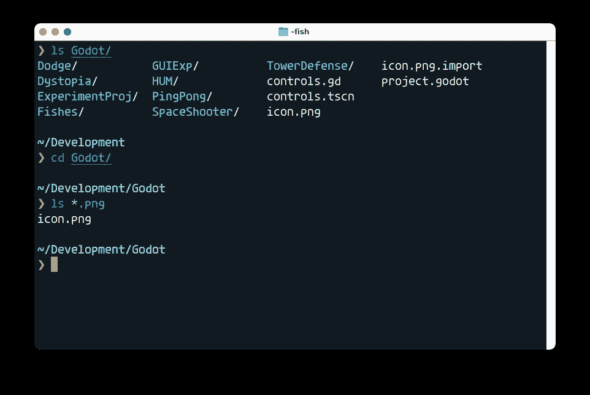
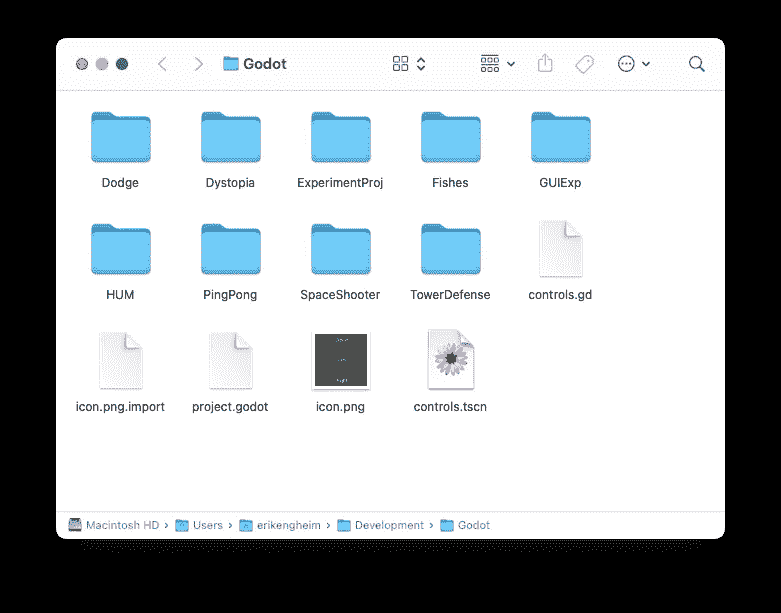
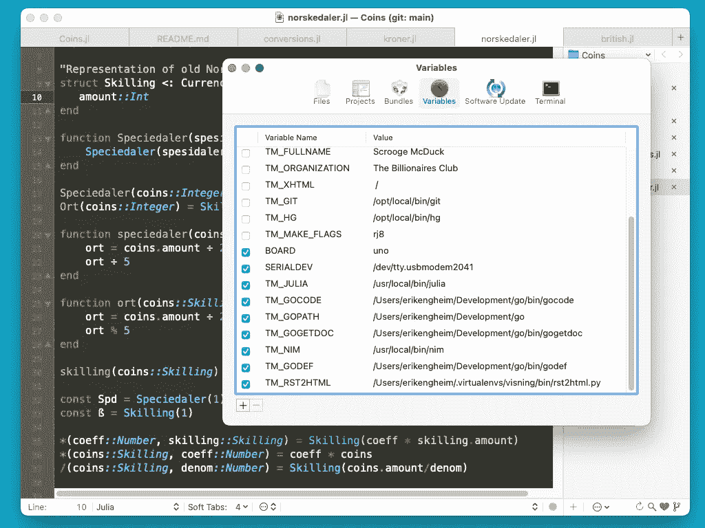

# Unix 命令行速成班

> 原文：<https://itnext.io/unix-command-line-crash-course-453e409d62f5?source=collection_archive---------2----------------------->

## 了解 Unix shell、命令和环境变量


用于在 macOS 上编写 shell 命令的 Unix 终端窗口

H 幸运的是，你之前已经见过命令行界面 CLI。你可以在几乎所有系统上找到它们:Windows、Linux、macOS，甚至我的老 Amiga 都有一个 CLI。它们的工作方式略有不同，但是有一个标准已经占据了主导地位，它基于 Unix 操作系统。Linux 和 macOS 都源自 Unix 操作系统。当在 Linux 或 Mac 上与 CLI 交互时，您将使用几乎相同的 Unix 命令。过去几年，通过【Linux 的 Windows 子系统(WSL) ，Unix 命令行界面在 Windows 上也变得流行起来。

您通过一个程序与 Unix 命令行交互，该程序通常称为终端或控制台。下面是一个在我的 Mac 上使用 [iTerm2](https://iterm2.com) 的例子。在这个特殊的例子中，我发出命令来查看`Godot`目录的内容，在那里我存储了一些我开发的游戏。



使用终端应用程序列出 Godot 目录的内容

如果您使用图形文件管理器，如 Finder，这个`Godot`目录应该如下所示:



Finder 文件管理器显示 Godot 目录

为什么您应该学习如何使用 Unix 命令行界面？在文件管理器中点击不是更容易吗？事实上，图形用户界面更容易探索和学习。但是基于文本的界面有许多在图形用户界面中难以复制的优势:

1.  他们通常证明了更多的权力和灵活性。
2.  复杂的图形界面比复杂的基于文本的界面更难学。
3.  基于文本的界面自然有助于自动化，这可以节省大量时间。

第二点需要一些理由。的确，图形用户界面更容易理解，但只是在一定程度上。大型复杂的图形应用程序可能很难学习。做什么不明显。找到正确的按钮点击或对话框打开可能需要一个视频或一系列的图像，仔细一步一步的指示。

相比之下，在本文这样的文章中，基于文本的界面很容易解释。复杂的操作，你很容易忘记如何做，所以你可以很容易地复制到一个笔记本上，并写下解释。以后可以使用搜索工具轻松检索这些笔记。搜索图形用户界面的图像要困难得多。

在这篇文章中，我将教你如何做以下事情:

*   像使用图形文件管理器一样在文件系统中导航。
*   看看一个目录里有什么文件，过滤掉你不感兴趣的文件或目录。
*   对文件进行操作。
*   解释二分搜索法路径。终端使用它来定位您编写的命令。
*   什么是环境变量，你能用它们做什么？

## 使用文件和目录

当您启动 Unix 命令行时，您会得到某种问候。这取决于您的系统和配置。我的看起来像这样:

```
Last login: Thu Jun 23 22:10:30 on ttys001
Welcome to fish, the friendly interactive shell
Type help for instructions on how to use fish

~
❯
```

提示符旁边会有一个光标，表示 CLI 正在等待您键入命令并按 enter 键。行首的提示通常是符号`$`、`#`或`❯`中的一个。我的是`❯`，因为我用的是[星舰提示](https://starship.rs)。它增加了几个很酷的功能，但你不必使用它。

让我们看看最基本的命令`ls`、`cd`、`pwd`、`man`、`cat`、`touch`和`file`。

## ls-列出目录内容

使用`ls`命令，您可以看到目录中有哪些文件和目录，就像使用文件管理器一样。

```
❯ ls /bin
[		expr		pwd
bash		hostname	rm
cat		kill		rmdir
chmod		ksh		sh
cp		launchctl	sleep
csh		link		stty
dash		ln		sync
date		ls		tcsh
dd		mkdir		test
df		mv		unlink
echo		pax		wait4path
ed		ps		zsh

❯
```

这显示了 Unix 系统上的`bin`目录的内容。这是 Unix 保存最常用命令的二进制文件的地方。我们称包含程序的文件为二进制文件。

命令比你的文件管理器更聪明。你可以做许多巧妙的把戏。像`*`和`?`这样的字符以一种特殊的方式被解释。它们形成了我们所说的球状模式。您可以使用 glob 模式来过滤显示哪些文件。`*`匹配任意数量的字母，而`?`匹配单个字母。因此`a?`将匹配名为`ab`、`ab`、`ad`、`ae`等的文件，而`*.txt`将匹配名为`foo.txt`、`bar.txt`、`baz,txt`等的文件。`foo`和`bar`的名字是怎么回事？那些只是我们在编程和 Unix 圈子里倾向于使用的愚蠢的名字。当你看到`foo`、`bar`、`qux`或`baz`时，你应该知道它们是占位符。使用的具体单词并不重要。什么都有可能。

## cd —更改工作目录

为了测试`ls`命令，我们将使用`cd`和`pwd`命令。就像图形终端一样，有一个当前工作目录。这是您的命令将应用更改的目录。您可以使用`cd`命令切换到工作目录。如果你忘记了你在哪里，你可以使用`pwd`命令。`pwd`是对打印工作目录的排序。

让我们跳过一点，看看 macOS 系统上的一些目录(在 Linux 上类似)。

```
❯ cd /bin

❯ ls
[         df        ln        sh
bash      echo      ls        sleep
cat       ed        mkdir     stty
chmod     expr      mv        sync
cp        hostname  pax       tcsh
csh       kill      ps        test
dash      ksh       pwd       unlink
date      launchctl rm        wait4path
dd        link      rmdir     zsh

❯ pwd
/bin

❯ cd /System
❯ ls
Applications DriverKit    Volumes
Developer    Library      iOSSupport

❯ pwd
/System
```

## 触摸和 mkdir —创建文件和目录

为了能够用`ls`做更多的实验，我们将创建自己的目录，并用伪造的文件填充它。我们将转到我们的主目录。如果你只写`cd`，你将跳转到你的用户的主目录。这里我们将制作一个名为`animals`的目录来实验`ls`。

从现在开始，我将在提示符上方显示我的当前目录，文件将以`*`结尾，而目录以`/`结尾。你可以通过写`ls -p`而不是仅仅写`ls`在你的系统上得到尾随斜线。这个`-p`叫做开关。每个 Unix 命令都带有几个开关，影响它们的运行方式。

好的，让我们用`touch`命令创建一些虚拟文件。

```
~
❯ mkdir animals

~
❯ cd animals 

~/animals
❯ touch bird.png dog.jpg cat.jpg monkey.gif

~/animals
❯ ls
bird.png    dog.jpg
cat.jpg     monkey.gif

~/animals
❯ touch horse.png whale.png fox.gif
```

`mkdir`命令创建一个给定名称的目录，而`touch`可以用来创建一个或多个空文件。对于这些文件，我们将看看如何使用 glob pattern 和`ls`来只显示当前目录中文件的子集。

```
~/animals
❯ ls
bird.png    fox.gif     whale.png
cat.jpg     horse.png
dog.jpg     monkey.gif
```

如果你只想看到`animals`目录中的`.png`文件，你可以使用`*.png` glob 模式，这意味着我们不关心文件名是什么，只要它以`.png`结尾

```
❯ ls *.png
bird.png   horse.png  whale.png

~/animals
❯ ls *.gif
fox.gif     monkey.gif
```

您可以使用与单个字母匹配的问号`?`找到中间带有`o`的所有三个字母文件名。

```
~/animals
❯ ls ?o?.*
dog.jpg  fox.gif
```

## man-Manual-获取帮助

一旦你掌握了 Unix 命令的基础知识，你就会希望能够看到具体的详细信息，而这些信息在博客文章中是没有意义的。我们可以使用`man`命令查看每个命令的手册。`man ls`将为我们提供`ls`(列表)命令的手册页。它会让你进入一个传呼机程序。很多初学者马上会问:我如何退出这个程序？！无论您是在`vim`程序、`less`还是`man`程序中，您都可以按`q`退出。在`vim`编辑器中，您可能需要先按`ESC`键，然后按冒号`:`，然后才能按`q`退出。

以下是对在`man`文档页面中导航最有用的命令的概述:

*   `↑`和`↓`上下一行箭头键。
*   `Ctrl-U`和`Ctrl-D`用于一次上下移动一整页。
*   `/foobar`在手册页中搜索文本`foobar`。你只需写一个斜线`/`，然后输入你感兴趣的文本。(`foobar`是个无厘头的词)。
*   `q`退出手动页面查看。

看看你能否找到`-l`开关的手动入口。它在长表单上打印关于目录内容的信息。可以通过写`/-l`来搜索。该条目应该如下所示:

```
-l   (The lowercase letter “ell”.) List files in the long
      format, as described in the The Long Format
      subsection below.
```

我们可以试试`-l`开关，看看我们如何获得更多信息:

```
~/animals
❯ ls -l
total 0
-rw-r--r--  1 erikengheim  staff  0 Jun 24 14:11 bird.png
-rw-r--r--  1 erikengheim  staff  0 Jun 24 14:11 cat.jpg
-rw-r--r--  1 erikengheim  staff  0 Jun 24 14:11 dog.jpg
-rw-r--r--  1 erikengheim  staff  0 Jun 24 14:16 fox.gif
-rw-r--r--  1 erikengheim  staff  0 Jun 24 14:16 horse.png
-rw-r--r--  1 erikengheim  staff  0 Jun 24 14:11 monkey.gif
-rw-r--r--  1 erikengheim  staff  0 Jun 24 14:16 whale.png
```

这显示了关于每个文件的一大堆信息。每列用于以下内容:

1.  是否可以读取`r`，写入`w`或执行`x`文件。用户、文件所属的组和其他所有人有一个三元组。
2.  文件链接的数量。硬盘上不同位置的不同文件可能都指向同一个文件。
3.  文件的所有者，本例中为`erikengheim`。
4.  文件所属的组。`staff`在这个例子中。
5.  文件中的字节数。它是零，因为我们创建了空文件。

最后一列是最后一次修改文件的时间，最后是文件名。

## cat-Concatenate-连接文件并显示内容

我们的文件是空的，所以为了能够测试用于显示内容的`cat`命令，我们必须实际编辑文件并添加一些内容。您可以使用任何文本编辑器将文本存储为 UTF-8 编码，也可以使用`echo`命令将文本添加到文件中。

```
~/animals
❯ echo blue bird > bird.png

~/animals
❯ echo black cat > cat.jpg

~/animals
❯ echo red fox > fox.gif
```

您可以使用`cat`查看单个文件的内容或连接多个文件的内容并显示出来。

```
~/animals
❯ cat bird.png cat.jpg
blue bird
black cat

~/animals
❯ cat bird.png cat.jpg fox.gif
blue bird
black cat
red fox
```

## 回显—显示文本

在许多情况下，我们需要向用户显示一些文本。为此，我们可以使用`echo`:

```
❯ echo Hello world
Hello world
```

这个例子可能看起来有点无意义，但是当编写更长的脚本做多件事，你想给用户反馈的时候，它是有意义的。你也可以用它来显示*环境变量*的内容。我们可以使用命名变量来存储文本，这些文本可以在以后显示:

```
❯ NAME=Joe
❯ echo hello $NAME
hello Joe
```

为什么我们需要美元符号？因为如果你只写了`NAME`，系统将无法意识到你想要一个名为`NAME`的变量的内容。它会认为你想写文本`NAME`:

```
❯ echo hello NAME
hello NAME
```

因此，虽然在设置环境变量时不需要美元符号`$`,但在使用它时会用到它。

## 命令在二分搜索法路径中的位置

大多数命令如`ls`、`cat`、`cp`、`rm`都是由操作系统加载并执行的实际小程序。当您键入一个命令时，操作系统将在不同的位置查找该命令。您可以使用`which`命令找到操作系统找到该命令的位置:

```
❯ which ls
/bin/ls

❯ which cat
/bin/cat

❯ which vim
/usr/bin/vim
```

当`vim`编辑器在`/usr/bin`目录中时，操作系统如何知道在`/bin`目录中查找`ls`和`cat`？这是使用二分搜索法路径完成的。它存储在名为`PATH`的环境变量中。我们可以使用`echo`命令查看二分搜索法路径的内容。

```
❯ echo $PATH
/usr/local/bin /usr/bin /bin /usr/sbin /sbin
```

但也许我们在其他地方也有项目。我们如何让操作系统找到它们？假设在`/opt/bin`目录中有我们想要使用的二进制文件。每个搜索路径用冒号`:`分隔，当重新定义`PATH`变量时，我们可以简单地插入现有路径:

```
❯ PATH=/opt/bin:$PATH
```

然而，我们刚刚写的有一个问题。一旦你关闭终端窗口，路径将被遗忘。这就是为什么您需要将这一行添加到主目录中的`.profile`或`.zshrc`文件中。添加到哪个文件取决于您使用的是`bash`还是`zsh` shell。您还必须添加`export`关键字，否则环境变量在 shell 配置文件`.profile`或`.zshrc`之外是未知的。所以你写道:

```
export PATH=/opt/bin:$PATH
```

因为路径可能包含空格，我们倾向于在文本字符串周围使用引号`"`来表明它是一个连续的文本块。因此我们通常写:

```
export PATH="/opt/bin:$PATH"
```

在这个例子中，我们把`/opt/bin`放在第一位，但是如果我们把它写成这样呢？

```
export PATH="$PATH:/opt/bin"
```

这是完全有效的，这意味着当寻找一个 Unix 命令时，在查找`/opt/bin`之前，系统将首先查找已经在`PATH` *中定义的路径之一。如果在多个位置有同名的命令，这可能很重要。例如，你的操作系统可能安装了`python`语言，但是你安装了自己的更新版本到`/opt/bin`。因为你希望默认使用你的新版本，你把`/opt/bin`目录放在第一位，所以它有优先权。*

## 环境变量

环境变量有许多用途。我们刚刚看到了用于指定二分搜索法路径的`PATH`环境变量。各种 Unix 工具都需要文本编辑器。例如，Git 版本控制系统有时会打开一个编辑器来编辑提交消息。你的操作系统怎么知道打开哪个编辑器？您可以使用`EDITOR`环境变量来指定。尽管有时你想为不同的程序使用不同的编辑器。例如，我不想像使用 Julia 编程语言那样使用 Git 编辑器。幸运的是，Julia 允许我在`JULIA_EDITOR`环境变量中指定一个编辑器，这个编辑器优先于`EDITOR`环境变量。让我展示给你看:

```
export EDITOR="mate -w"
export JULIA_EDITOR=mate
```

对于 Git，我使用了`-w`开关，因为它会导致调用程序(Git)暂停，直到我关闭编辑器。这不是我在使用 Julia 时想要的行为。

我使用的文本编辑器 TextMate 允许您在首选项面板中设置环境变量。可以看到`BOARD`、`SERIALDEV`、`TM_JULIA`等变量。这很有用，因为任何由 TextMate 启动的程序都可以访问这些环境变量。



在 TextMate 编辑器中配置可由自定义插件读取的环境变量

导出的环境变量由子*进程*继承。你什么意思？一个正在运行的程序被称为*进程*。流程有父子关系。终端窗口是一个进程，当运行一个命令如`ls`、`man`或`touch`时，你正在创建该窗口的一个子进程，或者更具体地说，是在窗口内运行的外壳进程。

任何正在运行的程序都可以启动子进程，并定义应该由子进程继承的环境变量。TextMate 允许你编写 shell 脚本、Python、Ruby 或 Julia 脚本来读取这些环境变量。

因此，环境变量的使用不仅限于文本模式的应用程序。您可以使用环境变量在任何程序之间传递数据。