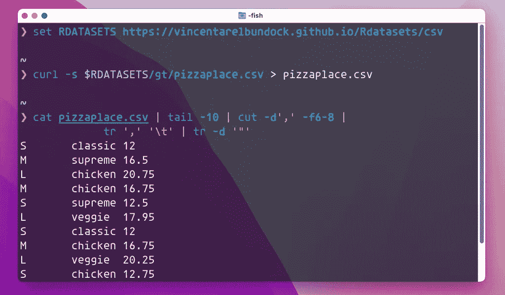
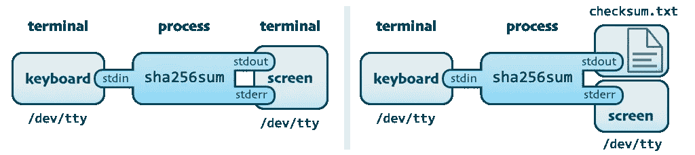
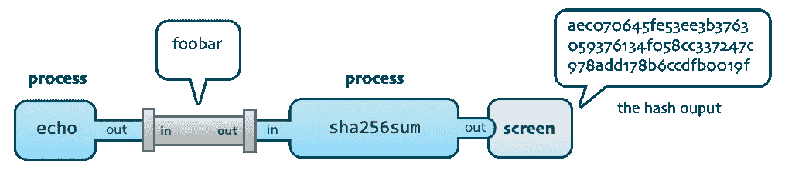
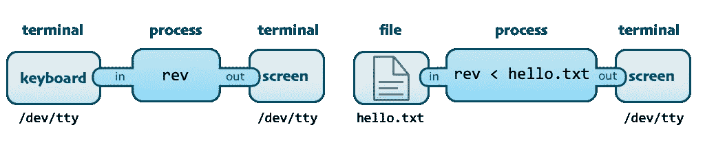
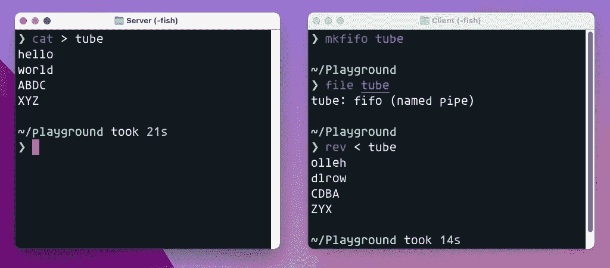
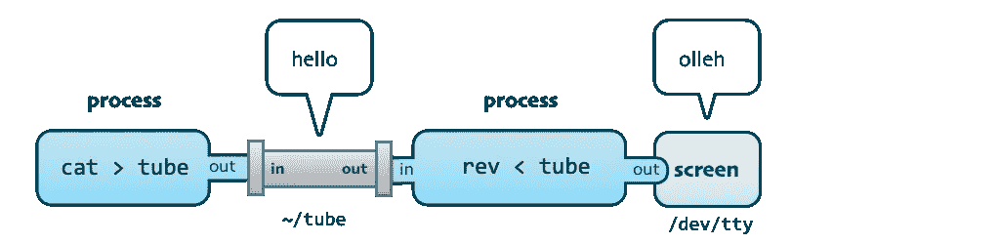
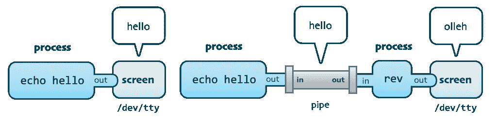
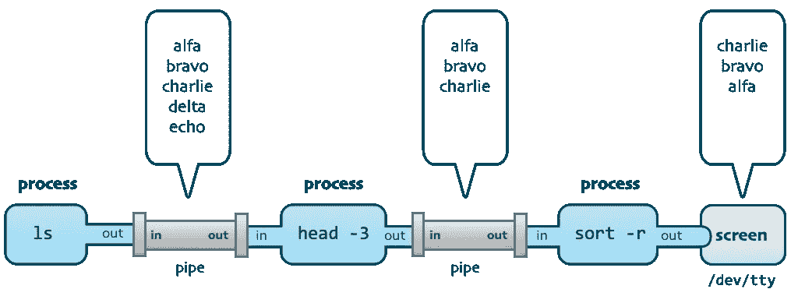
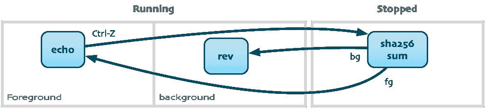

# Unix 命令、管道和进程

> 原文：<https://itnext.io/unix-commands-pipes-and-processes-6e22a5fbf749?source=collection_archive---------0----------------------->

## 如何把 Unix 命令和管道结合起来，管理正在运行的程序？



Unix 命令行如此强大的原因在于所有的命令都可以很好地协同工作。您可以将命令链接在一起，以便一个命令的输出成为另一个命令的输入。这里有一个这样做的例子。

*下载披萨销售数据，转显示三列销售数据。*

```
❯ RDATASETS=https://vincentarelbundock.github.io/Rdatasets/csv

❯ curl -s $RDATASETS/gt/pizzaplace.csv > pizzaplace.csv

❯ cat pizzaplace.csv | tail -10 | cut -d',' -f6-8 |
           tr ',' '\t' | tr -d '"'
S	classic	12
M	supreme	16.5
L	chicken	20.75
M	chicken	16.75
S	supreme	12.5
L	veggie	17.95
S	classic	12
M	chicken	16.75
L	veggie	20.25
S	chicken	12.75
```

在这个例子中，我们将命令`cat`、`tail`、`cut`和`tr`串在一起产生最终输出。我们将在后面详细介绍这些命令以及它们是如何连接在一起的。我讲这个故事的目的是给你一些处理数据的实用技巧:

*   Unix 程序如何通过管道连接在一起
*   用于验证的散列数据
*   管理正在运行的流程
*   下载数据并进行处理

# 使用 Unix 管道

Unix shell 的大部分功能来自管道的存在。为了理解管道，我们需要理解以下 I/O 概念:

*   `stdin` -标准输入是 Unix 进程读取字符输入的地方。默认情况下，这将是您的键盘。
*   `stdout` -标准输出是 Unix 进程打印字符的地方。默认情况下，这是您从中启动命令的终端窗口。
*   `stderr` -标准错误类似于标准输出，但是是错误信息的输出。将默认为运行命令的终端窗口。

您可以将这些视为每个 Unix 进程上的端口或插头。每次在类似 Unix 的操作系统(如 Linux 或 macOS)中启动一个程序，都会得到一个有一个输入`stdin`和两个输出`stdout`和`stderr`的进程。我们将使用`sha256sum`命令进行演示，该命令用于创建输入数据的 SHA256 散列。哈希对于对下载的文件进行完整性检查非常有用。



默认情况下，stdin 插入键盘，stdout 和 stderr 连接到屏幕。但是，您可以重定向输入或输出。

当使用终端模拟器时，例如 macOS 上的 Terminal.app 或 Linux 上的 GNOME 终端，您的键盘和终端窗口由一个名为`/dev/tty`的设备文件表示。我们将首先运行`sha256sum`而不进行任何重定向。您键入输入，直到您用 Ctrl-D 发出传输结束(EOT)信号。

```
❯ sha256sum
hello world
a948904f2f0f479b8f8197694b30184b0d2ed1c1cd2a1ec0fb85d299a192a447  -
```

接下来，我们将像第二幅图一样，将`stdout`重定向到一个名为`checksum.txt`的文件。

```
❯ sha256sum > checksum.txt
hello world

❯ cat checksum.txt
a948904f2f0f479b8f8197694b30184b0d2ed1c1cd2a1ec0fb85d299a192a447  -
```

哈希对于很多事情都很有用。我们可以用它作为原始的密码检查机制。在这种情况下，您必须假装“hello world”是一个没有人知道的秘密密码。如何检查某人是否知道密码？您可以通过使用`--check`开关来实现，该开关指示`sha256sum`验证输入散列值是否与存储在另一个文件中的值相同。

```
❯ sha256sum --check checksum.txt
hello
-: FAILED
sha256sum: WARNING: 1 computed checksum did NOT match

❯ sha256sum --check checksum.txt
hello world
-: OK
```

请注意，当我没有正确地编写全文时，我们的校验和失败了。这种机制用于验证下载的文件。想象一下，你在一个 zip 存档中下载了许多千兆字节的数据。你要确保传输中没有错误。允许您下载该文件的网站可以为您提供一个校验和文件，您可以对其进行验证。

向`sha256sum`命令写入输入很麻烦。有了管道，我们可以用另一个进程代替键盘作为输入。在本例中，我们使用`echo`命令来提供输入。

```
❯ echo foobar | sha256sum
aec070645fe53ee3b3763059376134f058cc337247c978add178b6ccdfb0019f  -
```

使用管道符号`|`,我们在概念上连接两个正在运行的 shell 命令，如下所示。



我们可以模仿上传带有校验和的文件的人创建一个带有文本“hello world”的文件，创建它的 SHA256 散列，然后稍后验证校验和。我们可以将该文件修改为“hello mars”，以证明 SHA256 哈希已经捕捉到了这一变化并向用户发出了警报。

```
# Create text file with "hello world" message
❯ echo hello world > upload.txt

❯ cat upload.txt | sha256sum > upload.checksum

❯ cat upload.txt | sha256sum --check upload.checksum
-: OK
```

让我们修改`upload.txt`文件，检查检查 SHA265 散列是否失败。

```
❯ echo hello mars > upload.txt

❯ cat upload.txt | sha256sum --check upload.checksum
-: FAILED
sha256sum: WARNING: 1 computed checksum did NOT match
```

在这些`sha256sum`例子中，我故意用笨拙的方式来演示管道和重定向的使用。实际上有更简单的方法来执行散列和散列验证。

```
❯ sha256sum upload.txt > upload.checksum

❯ cat upload.checksum
53d58e94e61b1c2a641dc52b402729f76c3832978e37f7f31ad1286ae32a796e  upload.txt

❯ sha256sum --check upload.checksum
upload.txt: OK
```

## 持久管道和命名管道

到目前为止，我们使用的管道是匿名的和临时的。然而，可以制作带有名称的管道。这种练习强调管道与文件非常相似，但有一些重要区别:

> 文件通常一次由一个进程读取。管道由一个进程写入，由另一个进程读取。管道不在磁盘上存储数据。写入管道的数据最终存储在内存中。

我们将使用一个叫做`rev`的愚蠢命令来完成这个例子。所有的`rev`做的就是逆转你喂它的一切。和`sha256sum`一样，你可以不带任何参数地启动它，只需键入文本，直到你用 Ctrl-D 发出传输结束(EOT)的信号。

```
❯ rev
hello
olleh
world
dlrow
```

自然，您可以通过重定向`stdin`指向一个文件，将数据从一个文件输入到`rev`。

```
❯ cat > hello.txt
hello
world  # Press Ctrl-D

❯ rev < hello.txt
olleh
dlrow
```

从概念上讲，我们已经将这些不同的联系与`rev`过程联系起来。



重定向来自文件的输入

我们将设置`rev`从持久管道中读取数据。因为你推入管道的东西也是你先取出的东西，所以这些管道被称为 FIFO 管道(先进先出)。我们用`mkfifo`命令做一个管道。我们将管道命名为`tube`。

```
❯ mkfifo tube

❯ file tube
tube: fifo (named pipe)
```

这个操作在文件系统中创建了一个名为`tube`的条目，即使在您重启之后，它也将保留在那里。但是，从命名管道写入和读取的数据从不存储在磁盘上。它完全是在内存中处理的。让我们看看这在实践中是如何实现的。



设置命名管道通信

你需要两个终端窗口来完成这项工作。在一个窗口中，你写下`rev < tube`，这意味着你试图从命名管道中读取。在另一个窗口中，你写下`cat > tube`，这意味着你在键盘上写的任何东西都将被发送到`tube`中，并且`rev`进程将意识到它可以从电子管中读取。



通常，我们对管道的名称或永久保留它不感兴趣。我们很乐意临时创建一个管道，这样我们就可以轻松地将数据从一个命令传递到另一个命令。

```
❯ echo hello | rev
olleh
```

从概念上讲，命名和匿名瞬态管道做同样的事情。



管道可以以复杂的方式组合，允许我们将许多命令提供的功能链接在一起。让我们看一个将`ls`、`head`和`sort`链接在一起的例子:

```
❯ touch hotel golf foxtrot echo

❯ ls | head -3
echo
foxtrot
golf

❯ ls | head -3 | sort -r
golf
foxtrot
echo
```

`head -3`命令选择前三行，而`sort -r`将反向排序输入。从概念上讲，进程的 stdout 和 stdin 通过管道连接，如下所示:



使用管道将三个命令链接在一起的示例。

我们将研究一种方法来管理等待从命名管道中读写的多个程序，而不使用多个终端仿真器窗口。

# 通过作业控制管理多个流程

Unix 系统提供了在多个多任务进程之间周旋的方法。通常，当您运行一个进程时，您的键盘会一直锁定，直到它完成。这是因为该进程在前台运行。但是，可以将一个进程放在后台。后台进程是您不与之交互的进程。你可以有很多。前台进程是在终端窗口中接收键盘输入的进程。

作业控制对今天的我们来说不是很有用，因为我们可以打开很多终端窗口。但是，了解这一点是很有用的，因为您有时会远程使用 Unix 机器。

在这个例子中，我们将有两个作业(进程)同时运行，从名为`hasher`和`tube`的不同管道中读取数据。让我们制作`hasher`烟斗。

```
❯ mkfifo hasher
```

接下来，我们尝试从`hasher`管道中读取数据。读数会一直阻塞，直到有东西被推进管道。我们按住 Ctrl-Z 来暂停这个过程:

```
❯ cat hasher | sha256sum
^Z⏎
```

暂停的进程不做任何事情。它基本上被搁置了。我们可以使用`jobs`命令来查看所有正在运行的作业的状态，看看我们的作业实际上是暂停了。

*注意:下面的提示看起来很搞笑，因为我用的是*[*Starship*](https://starship.rs)*跨平台 shell 提示。*

```
✦2 ❯ jobs
Job	Group	State	Command
1	44863	stopped	cat hasher | sha256sum
```

我们可以同时开始更多的工作。再次注意，我按 Ctrl-Z 来暂停`rev`进程。

```
✦2 ❯ cat tube | rev
^Z⏎
```

让我们把一些数据写入这些试管。

```
✦4 ❯ echo ABDC > tube

✦4 ❯ echo hello > hasher
```



一个作业(进程组)可能处于的不同状态，以及我们如何触发从前台到停止的转换。

这些进程不会暂停。它们将简单地写入管道并退出。我们可以通过运行`jobs`来验证这一点，并查看哪些作业仍然存在。

```
✦4 ❯ jobs
Job	Group	State	Command
2	44892	stopped	cat tube | rev
1	44863	stopped	cat hasher | sha256sum
```

这些作业都没有完成任何工作，因为它们被暂停了。我们可以运行后台`bg`命令，该命令在后台恢复列表顶部作业的执行。

```
✦4 ❯ bg
Send job 2 'cat tube | rev' to background
CDBA
```

我们打印了`CDBA`,这告诉我们作业实际上执行并反转了我们的“ABCD”文本字符串。SHA256 哈希器仍然被挂起，所以我们再次调用`bg`来启动它。

```
✦2 ❯ bg
Send job 1 'cat hasher | sha256sum' to background
5891b5b522d5df086d0ff0b110fbd9d21bb4fc7163af34d08286a2e846f6be03  -
```

我们现在可以运行`jobs`来查看所有作业都已完成:

```
❯ jobs
jobs: There are no jobs
Job 1, 'cat hasher | sha256sum' has ended
```

我们可以用`fg`将作业发送到前台，而不是将作业发送到后台。这只有在工作需要键盘输入时才有意义。如果我们想通过发送 Ctrl-C 来快速完成任务，这可能会很有用。

## 通过编号或流程 ID 识别作业

作业是您正在运行和管理的流程。在任何给定的时间，都会有更多的作业在您的系统上运行。因为作业是过程，你可以用它们的*过程 ID* 或简称 **PID** 来识别它们。

让我们启动之前的作业来比较 PID 和作业编号。

```
❯ cat tube | rev
^Z⏎

✦2 ❯ cat hasher | sha256sum
^Z⏎
```

我们可以使用作业列表和进程列表从不同的角度检查我们的作业。

```
✦4 ❯ jobs
Job	Group	State	Command
2	45247	stopped	cat hasher | sha256sum
1	45218	stopped	cat tube | rev

✦4 ❯ ps
  PID TTY           TIME CMD
31150 ttys001    0:06.11 -fish
39264 ttys002    0:03.84 -fish
41598 ttys003    0:15.00 -fish
45218 ttys003    0:00.01 cat tube
45219 ttys003    0:00.01 rev
45247 ttys003    0:00.00 cat hasher
45248 ttys003    0:00.00 sha256sum
```

在这种情况下，使用 PID 更加麻烦，因为我们必须单独终止作业中的单个进程。例如，作业 2 由进程`cat`和`sha256`组成。要终止作业，您必须同时终止它们:

```
✦4 ❯ kill -9 45247 45248
```

PID 数字也需要更长的时间来书写和记忆。如果你想终止`rev`任务，你可以写`kill %1`。为了区分工单编号和 PID 编号，您需要添加一个百分比`%`。这适用于多种环境。我们可以使用它在后台恢复特定的作业:

```
✦2 ❯ bg %1
Send job 1 'cat tube | rev' to background
```

作业状态现在表明作业正在运行。

```
✦2 ❯ jobs
Job	Group	State	Command
1	45218	running	cat tube | rev
```

将立即处理推送到命名管道的数据:

```
✦2 ❯ echo ABC > tube
CBA

❯ jobs
jobs: There are no jobs
Job 1, 'cat tube | rev' has ended
```

既然我们已经了解了基本原理，我们可以深入研究本文开头的更复杂的例子。

# 下载和处理数据

很多数据处理都是处理表格中的数据。我的许多故事都是关于一段时间内的各种经济发展，这些发展可以用人均 GDP、钢铁产量和许多其他东西来衡量。这种数据通常是从经合组织、国际货币基金组织和其他组织下载的，以逗号分隔的 ASCII 文本中的简单表格(CSV 文件)的形式提供。

通常，我们感兴趣的不是它们包含的所有数据，而是一个子集。数据的格式也可能不完全符合我们的要求。

阅读更多:[使用 Julia](https://erik-engheim.medium.com/analyze-world-data-using-julia-8f9d16c6ac2a) 分析世界数据。

幸运的是，一个标准的 Unix shell 包含许多用于获取和处理数据的工具。cURL 是一个非常有用的从网上下载数据的工具。虽然您可以自己点击各种下载链接，但您可能需要某种可复制性。假设你写了一篇文章，你想让人们复制你的结果。您可以简单地显示 cURL download 语句来获取数据，而不是告诉他们如何导航到各种站点来下载数据。您甚至可以将下载语句放在 Bash 脚本中，并将其签入版本控制系统。

在教学或实验处理数据时，我经常喜欢看 [RDatasets](https://vincentarelbundock.github.io/Rdatasets) 。这是一个在线回购，任何人都可以使用大量不同的数据集进行实验。这个故事的第一个例子下载了比萨饼数据。

将长 URL 放入环境变量中是很常见的。开发人员通常会在 shell 脚本中这样做。在我的示例中，我将所有 [RDataset](https://vincentarelbundock.github.io/Rdatasets) CSV 文件的基址存储在`RDATASETS`环境变量中，如下所示:

```
❯ RDATASETS=https://vincentarelbundock.github.io/Rdatasets/csv
```

实际上，由于我已经使用 [Fish shell](https://fishshell.com) 十多年了，所以我写这个的方式略有不同(我向任何想要使用简单而强大的 shell 环境的人推荐 Fish):

```
❯ set RDATASETS [https://vincentarelbundock.github.io/Rdatasets/csv](https://vincentarelbundock.github.io/Rdatasets/csv)
```

当使用 cURL 时，可能会有各种关于下载速度的输出，您不希望将它们存储在文本文件中。您可以使用静音`-s`开关来移除它。

```
❯ curl -s $RDATASETS/gt/pizzaplace.csv > pizzaplace.csv
```

cURL 可以以多种方式使用，甚至可以从有密码保护或其他形式的身份验证的网站下载数据。 [cURL 文档](https://curl.se/docs/manual.html)很好地概述了[使用 cURL 下载数据的各种方式。](https://curl.se/docs/manual.html)

## 头和尾

在检查刚下载的数据时，通常会使用`head`和`tail`等工具来查看部分数据。没有任何参数，每个命令给出 10 个条目。让我们看看比萨饼销售数据的前 10 个条目:

```
❯ head pizzaplace.csv
"","id","date","time","name","size","type","price"
"1","2015-000001","2015-01-01","11:38:36","hawaiian","M","classic",13.25
"2","2015-000002","2015-01-01","11:57:40","classic_dlx","M","classic",16
"3","2015-000002","2015-01-01","11:57:40","mexicana","M","veggie",16
"4","2015-000002","2015-01-01","11:57:40","thai_ckn","L","chicken",20.75
"5","2015-000002","2015-01-01","11:57:40","five_cheese","L","veggie",18.5
"6","2015-000002","2015-01-01","11:57:40","ital_supr","L","supreme",20.75
"7","2015-000003","2015-01-01","12:12:28","prsc_argla","L","supreme",20.75
"8","2015-000003","2015-01-01","12:12:28","ital_supr","M","supreme",16.5
"9","2015-000004","2015-01-01","12:16:31","ital_supr","M","supreme",16.5
```

## tr —翻译字符

所有的引号使它更难阅读。我们可以用`tr`来移除它们。`tr`是一个用于替换或删除字符的通用工具。如果你不想翻译一个字符，但删除它，你添加`-d`(删除)开关。原则上，您可以编写`tr -d "`，但是因为 Shell 会认为您开始引用某个东西，所以您需要用单引号引用双引号。

```
❯ head pizzaplace.csv | tr -d '"'
,id,date,time,name,size,type,price
1,2015-000001,2015-01-01,11:38:36,hawaiian,M,classic,13.25
2,2015-000002,2015-01-01,11:57:40,classic_dlx,M,classic,16
3,2015-000002,2015-01-01,11:57:40,mexicana,M,veggie,16
4,2015-000002,2015-01-01,11:57:40,thai_ckn,L,chicken,20.75
5,2015-000002,2015-01-01,11:57:40,five_cheese,L,veggie,18.5
6,2015-000002,2015-01-01,11:57:40,ital_supr,L,supreme,20.75
7,2015-000003,2015-01-01,12:12:28,prsc_argla,L,supreme,20.75
8,2015-000003,2015-01-01,12:12:28,ital_supr,M,supreme,16.5
9,2015-000004,2015-01-01,12:16:31,ital_supr,M,supreme,16.5
```

如果我们只对比萨饼的种类、份量和价格感兴趣，那么有很多我们不感兴趣的细节，我们希望删除。

## 剪切-剪切每条线的一部分

我们可以使用`cut`工具剪切出我们感兴趣的一部分数据。像许多 Unix 工具一样，它每行处理数据。

您可能已经注意到，数据的第一部分非常有规律。每一列都有相同数量的字符。我们可以通过指定一个字节范围来利用这一点。在字符 35 处，我们感兴趣的比萨饼数据开始。我怎么知道？只需快速试一试错误。我做了一个大概的猜测，看了看我得到的输出，然后简单地调整了一下。

```
❯ head pizzaplace.csv | tr -d '"' | cut -b 35-

hawaiian,M,classic,13.25
classic_dlx,M,classic,16
mexicana,M,veggie,16
thai_ckn,L,chicken,20.75
five_cheese,L,veggie,18.5
ital_supr,L,supreme,20.75
prsc_argla,L,supreme,20.75
ital_supr,M,supreme,16.5
ital_supr,M,supreme,16.5
```

您可以使用`-f`开关选择想要的列号，而不是按字节计数。然而，这需要用`-d`开关指定列分隔符是什么。`-f`和`-b`开关都接受数字列表，可以用逗号分隔或用破折号连接。您可以有开放或封闭的范围。例如，`-f 3-5`表示第三列到第五列，而`-f 5-`表示从第五列到最后一列。您可以通过列出感兴趣的单个列来跳过列。`f 2,4,8`给出第二、第四和第八列。

我们可以通过指定列来进行基于字节的删减:

```
❯ head pizzaplace.csv | tr -d '"' | cut -d , -f 5-
name,size,type,price
hawaiian,M,classic,13.25
classic_dlx,M,classic,16
mexicana,M,veggie,16
thai_ckn,L,chicken,20.75
five_cheese,L,veggie,18.5
ital_supr,L,supreme,20.75
prsc_argla,L,supreme,20.75
ital_supr,M,supreme,16.5
ital_supr,M,supreme,16.5
```

我们可以采用最后三列，并添加一个字符转换，将逗号转换为制表符，以生成一个更易于阅读的表格:

```
❯ head pizzaplace.csv | tr -d '"' | cut -d , -f 6- | tr , \t
size	type	price
M	classic	13.25
M	classic	16
M	veggie	16
L	chicken	20.75
L	veggie	18.5
L	supreme	20.75
L	supreme	20.75
M	supreme	16.5
M	supreme	16.5
```

如果你想用这个玩更多，你应该检查一下`paste`之类的命令。就写`man paste`了解更多。

# Sed 和 Awk 呢？

有很多比我展示的用于文本处理的工具更强大的 Unix 工具，比如`sed`和`awk`。这些几乎没有给出用于逐行处理文本的编程语言。就我个人而言，我从来没有使用过它们，因为我并不真正编写 Shell 脚本。您可能注意到，在这篇文章中，我没有展示如何用 for-loops 和 if-statement 将命令收集到 shell 脚本中。这是一个深思熟虑的选择。

一旦你需要做的事情变得更加复杂，你最好使用真正的编程语言。但是您可以将 shell 工具与其他语言结合使用。这是 Julia 使用 CSV 包的一个示例，它让您可以加载与 DataFrames 包相结合的 CSV 文件，从而可以有效地处理表格数据。

您会注意到，我们可以利用已经研究过的 Unix 命令将数据加载到一个表中。我们需要更长一点的代码来处理所有的命令。

```
# Need to install CSV and DataFrames packages first
using CSV, DataFrames

job = pipeline(`head pizzaplace.csv`, `tr -d '"'`, `cut -d , -f 6-`);

df = open(job) do io
  DataFrame(CSV.File(io))
end
```

在 Julia 中运行这段代码时，变量`df`将显示以下格式良好的数据:

```
9×3 DataFrame
 Row │ size     type     price
     │ String1  String7  Float64
─────┼───────────────────────────
   1 │ M        classic    13.25
   2 │ M        classic    16.0
   3 │ M        veggie     16.0
   4 │ L        chicken    20.75
   5 │ L        veggie     18.5
   6 │ L        supreme    20.75
   7 │ L        supreme    20.75
   8 │ M        supreme    16.5
   9 │ M        supreme    16.5
```

假设您已经在朱莉娅·REPL 环境(read-evaluate-print-loop)中运行了加载代码，那么您可以轻松地运行几个命令来操作这个比萨饼销售表，这比单独在 Unix shell 中要有效得多。您可以使用`select`选择要显示的列，包括重新排列它们。

```
julia> select(df, :type, :size, :price)
9×3 DataFrame
 Row │ type     size     price
     │ String7  String1  Float64
─────┼───────────────────────────
   1 │ classic  M          13.25
   2 │ classic  M          16.0
   3 │ veggie   M          16.0
   4 │ chicken  L          20.75
   5 │ veggie   L          18.5
   6 │ supreme  L          20.75
   7 │ supreme  L          20.75
   8 │ supreme  M          16.5
   9 │ supreme  M          16.5
```

我们可以按类型分组，然后通过对价格求和来折叠每个组，以查看我们销售每种类型的披萨赚了多少钱。这种方法很有效，因为 Julia 可以将数据不仅仅视为文本。Unix 工具非常适合处理文本，但不适用于数字数据。

```
julia> combine(groupby(df, :type), :price => sum)
4×2 DataFrame
 Row │ type     price_sum
     │ String7  Float64
─────┼────────────────────
   1 │ classic      29.25
   2 │ veggie       34.5
   3 │ chicken      20.75
   4 │ supreme      74.5
```

我最后一部分的目的不是教你 Julia，而是简单地给你一种使用“真正的”编程语言的感觉。我想说的是:

> 使用合适的工具完成工作

Unix 命令行很棒，但是我要小心不要让自己太过深入地研究每一个小命令和功能。我过去曾试图这样做，但在我看来并没有得到回报。只要不需要 if 语句和循环之类的控制逻辑，我觉得 Unix shell 工具就很好用。保持简单！