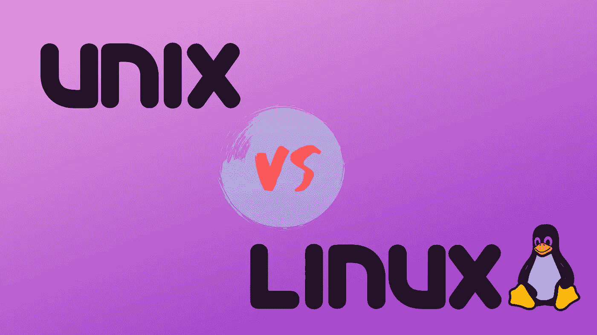
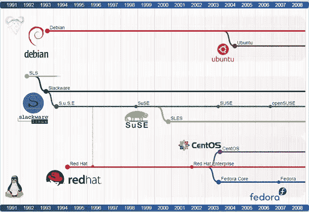
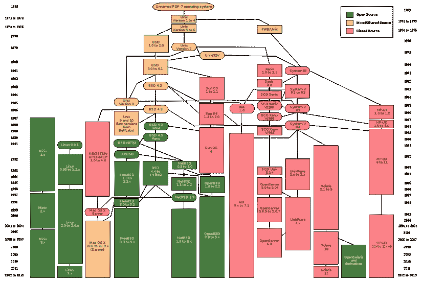

# Unix 和 Linux。起源和区别

> 原文：<https://itnext.io/unix-linux-the-origin-and-the-difference-79d1b54acb5e?source=collection_archive---------3----------------------->

Linux 不是 Unix……而是 Unix 的克隆版本



在我们开始讲述 Linux & Unix 的故事之前。你需要知道一些事情。

*   我不精通 Linux 或 Unix。我只是想写下我所知道的，了解 Linux 的世界。因为我一直认为把学过的知识写下来会帮助我更好的理解和记忆它们。希望我关于 Linux 的文章对你们许多人有用，并得到许多积极的反馈。
*   在这个故事中，我不会深究 Linux 的技术问题。但相反，我会告诉你它的发展历史的故事，以及 Linux 和另一个著名的操作系统 Unix 的关系。
*   我之所以很想写这样一篇帖子，是因为我自己对 Linux 有过很多误解，我想也会有很多人和我有同样的误解。希望通过这篇文章，您可以对 Linux 世界有一个大致的了解，然后再深入了解它。

让我们进入 Linux 的世界吧！！！

# Unix 和 BSD

说到 Linux，我们首先要回到过去了解另一个名字，那就是 Unix。Unix 是一个已经存在了很长时间的操作系统，在贝尔实验室。该项目由肯·汤普森和丹尼斯·里奇两位著名的计算机科学家领导。

Unix 的正式开发始于 1969 年夏天，1971 年 3 月发布了第一个版本，随后在 1972 年发布了第二个版本。

有一点你可能不知道，如果你在 Linux 机器或 MacOS 上输入 date 命令，你会得到一个叫做 Unix 时间戳的数字。这个数字是从 1970 年 1 月 1 日 00:00:00 开始的秒数。而为什么是 1970 年 1 月 1 日，那你现在大概有答案了。那是 Unix 处于发展过程中的时候。

是 Ken Thompson 和 Dennis Ritchie 创造了 Unix 早期版本支持的编程语言 B。然后，在 1972 年，Ritchie 重写了 B 语言，更好地改进了它，成为一种 C 编程语言，一种今天仍然非常流行的编程语言。大部分后来的 Unix 组件都是用 c 写的。

在 20 世纪 70 年代后期，美国电话电报公司与教育机构和外部商业组织共享 Unix，从而导致了许多不同版本的 Unix 的诞生。其中最突出的是由加州大学伯克利分校计算机系统研究组构建的教育版。这个版本被广泛称为 Berkeley 软件发行版，简称 BSD。

最初，BSD 建立在代码库和 Unix 设计的基础上，但是后来，Unix 和 BSD 的版本变得越来越不同，导致 Unix BSD 版本和美国电话电报公司的 Unix 版本(代号为 System V)之间的“战争”成为“标准”。结果，胜利属于 System V。后来的 BSD 版本使 System V 更接近于学习，并结合了公认的普遍接受的标准。

随着 FreeBSD、NetBSD 和 OpenBSD 等开源项目的出现，BSD 分支的历史发展走到了尽头。BSD 的最终版本于 1995 年推出。同时，Unix 的最终版本是由 Bell Laps 开发的，即 1989 年发布的 Unix 10 版本。

虽然 Unix、BSD 的官方版本早已停止开发，但它们留下的遗产至今仍是巨大的。很多操作系统，从闭源到开源，都是基于这两个分支。

商业版本，最著名和最成功的
close source，可能是苹果公司广受欢迎的 MacOS。MacOS 以及其他苹果操作系统目前的 iOS、watchOS 和 tvOS 都基于 BSD 平台。MacOS 也是少数几个被认为是类 UNIX 的操作系统之一，当时它获得了单一 Unix 规范。我们将在本文的最后详细讨论类 Unix 的概念。

# 角马

在 Unix 的发展过程中，1983 年发生了一个重要事件，这是后来大动荡的前提。

1983 年 9 月，理查德·斯托尔曼宣布引入 GNU 项目(GNU 代表 GNU 的非 Unix)😅


wikipedia.org

GNU 项目的目标是创建一个免费的类似于 Unix 的 T2 操作系统，人们可以自由地复制、开发、修改和分发软件，并且再分发不受限制。

请记住，Unix 和从 Unix 派生的版本最初是封闭的源代码，受版权保护

1985 年，Richard 创建了自由软件基金会**，或称 FSF，一个非盈利组织，旨在促进软件开发的自由。**

**Project GNU 创造了许多重要的产品如 **GNU 编译器集合**(gcc)**GNU 调试器**， **GNU Emacs 文本编辑器**(Emacs)**GNU build automator**(make)……当今使用最广泛的: **GNU 通用公共许可证** (GPL)**

**GNU 项目取得了许多伟大的成就，创造了许多类似于 Unix 上的工具。然而，GNU 仍然缺少一个重要的组件，即使其成为完整操作系统的最后一块。那就是内核，处理控制和与硬件设备(CPU、RAM、设备……)通信的部分。**

**然后莱纳斯·托沃兹出现了…**

# **Linux 操作系统**

****

**wikipedia.org**

**1991 年 8 月 25 日，一个名叫 Linus Torvalds 的芬兰学生介绍了一个个人产品，后来成为 Linux 内核。这是莱纳斯在新闻组新闻组上写的:**

> **我在 clones 做一个 386(486)的(免费)操作系统(只是爱好，不会像 gnu 那样大而专业)。这从 4 月份就开始酝酿，并开始准备。我希望得到关于人们喜欢/不喜欢 minix 的任何反馈，因为我的操作系统有点像它(文件系统的相同物理布局(由于实际原因)等等)。我目前已经移植了 bash(1.08)和 gcc(1.40)，看起来一切正常。这意味着我将在几个月内得到一些实用的东西[……]是的——它没有任何 minix 代码，并且它有一个多线程的 fs。它是不可移植的(使用 386 任务切换等)，它可能永远不会支持除了 AT-harddisks 之外的任何东西，因为这是我所有的。
> [……]它大部分是用 C 语言编写的，但大多数人不会把我写的东西称为 C。它使用了我能找到的 386 的所有功能，因为它也是一个向我传授 386 的项目。如前所述，它使用 MMU 进行分页(还没有到磁盘)和分段。正是分段使得它真正依赖于 386(每个任务都有一个 64Mb 的代码段&数据 4Gb 中最多 64 个任务。任何需要超过 64Mb/任务的人——棘手的 cookies)。[……]我的一些“C”文件(特别是 mm.c)几乎和 C 一样是汇编程序。[……]不像 minix，我也碰巧喜欢中断，所以处理中断时没有试图隐藏它们背后的原因。**

**由于许多个人和组织的贡献，Linus 的项目很快受到关注。**

**Linux 内核和 GNU 软件的结合创造了第一个完全自由的操作系统。它被命名为 **GNU/Linux** 。**

**其实关于 Linux 还有很多误解。我自己也经历了这么长时间的误解**

**从一开始到现在，你也可以从这篇文章中得出一些观点**

*   **Linux 本身只是一个内核，它不是一个完整的操作系统。你的电脑上可能还在使用的操作系统叫做 GNU / Linux，但可能因为名字比较长，人们把它简称为 Linux。以操作系统的名义移除 GNU 被认为是不公平的，低估了 GNU 的作用。反正很多人还是用 Linux 这个名字，而不是 GNU / Linux 操作系统这个名字。而说到 Linux 操作系统，我们需要明白是 GNU / Linux 操作系统。在本文中，我还将使用这个调用，Linux 操作系统。**
*   **Linux 操作系统不使用或共享 Unix 或 BSD 代码的任何部分。它是由 Linus 和 GNU 项目全新构建的 Unix 的克隆版本。这也是为什么 Linux 和现在的 Unix 后代操作系统(比如 MacOS)有很多共同点的原因。**

**我见过一个家伙问关于在 Linux 上运行`grep`，有`-P`选项，但是在他的 Mac 上，`grep`命令没有那个选项，我该怎么解决？我想到了像`ls`、`cat`、`grep` …这样的命令，无论是运行在 MacOS 还是 Linux 上，本质上都是一样的。但是那天我意识到它们是两种不同的工具。在 Ubuntu 上运行`grep --help`或`man grep`我得到了 GNU 版本的介绍，在 Mac 上，我得到了 BSD 版本的通知。当然，大多数 GNU 和 BSD (Unix)工具对于每个选项都是一样的，但是也有例外。
有时候，如果你在 Mac 上遇到的命令用例与你在 Linux 机器上仍然使用的命令不同，不要太惊讶。**

**在 Linux 上使用相同的命令，解决方案非常简单。你只需要在 Mac 上安装 **GNU** 版本，而不是默认版本。幸运的是，它们非常稳定，可以使用`homebrew`轻松安装。**

# **Linux 发行版**

****

**Linux 只是内核部分，GNU 提供了在内核上运行的必要工具。然而，我们可以自由决定内核配置，如何安装，使用软件。**

**一些组织和公司通过将 Linux 内核与实用程序或软件包管理器相结合来创建完整操作系统的发行版，从而帮助我们做到这一点。这些被称为 Linux 发行版，或发行版。**

**今天，有无数的 Linux 发行版，其中许多是非常熟悉和流行的。还有很多发行版你可能也没有听说过。一些最常用的发行版包括: **Ubuntu** ， **Debian** ， **CentOS** ， **Fedora** ， **Redhat** ， **Linux Mint** …**

**发行版可以建立在一个之上，因此一个发行版可以被认为是另一个发行版的曾孙。所以，其实我上面说的那些发行版，彼此之间有很多密切的关系。最老的两个发行版(今天仍然活跃)是 Slackware 和 Debian。它们创建于 1993 年。不太了解 **Slackware** 的后代，但是 **Debian** 的后代真的是小池塘里的大鱼。**

**Debian 的后代分支可能也是最大的发行版。除了 **Debian** 本身，这个分支的突出面孔还有 **Ubuntu** (基于 Debian)、 **Linux Mint** (基于 Ubuntu)，或者 **Kali Linux** 。**

**此外，另一个著名的发行分支是 Redhat，主发行版是 Red Hat Enterprise Linux (RHEL)，这是针对巨头 Red Hat 的企业客户的发行版之一。除了提供 RHEL 作为付费发行版，Redhat 还为社区提供了另一个免费发行版，那就是 Fedora。
事实上，Fedora 版本通常会首先进行测试，以获得反馈和错误修复，之后 RHEL 将建立在稳定的 Fedora 版本上。此外，Redhat 还为 RHEL 的几乎所有组件提供免费源代码，社区可以构建一个与 RHEL“类似”的发行版。
其中最突出的是 CentOS(社区企业操作系统)。CentOS 是一个社区产品(Redhat 不支持)，完全免费，希望带来一个类似于 RHEL 的企业级质量的发行版(当然，免费项目不等于付费项目，但 CentOS 仍然非常受欢迎)**

**您可以通过这个图表跟踪 Linux 发行版及其相互依赖关系的具体列表**

**学习和熟悉 Linux，在我个人看来，Ubuntu(或者 Debian)和 CentOS 会是你应该熟悉的二人组。它将帮助你得到一个概述，以及 Debian 和 Redhat 之间的区别。我自己有两个虚拟机 Ubuntu 和 CentOS，可以随时使用。**

**除了 Linux 发行版，操作系统还使用 Linux 内核和 GNU 组件。还有其他操作系统完全基于 Linux 内核。而其中最突出的就是 Android。Android 可能是使用 Linux 内核的最流行的操作系统**

# **Linux 内核版本**

**到现在为止(2017 年 1 月 7 日)，最新的 Linux 稳定版是 4.9。你可以在 https://www.kernel.org/[的项目主页上查看 Linux 内核发布列表](https://www.kernel.org/)**

**或者，要检查您正在使用的发行版上的内核版本，您可以使用`uname -r`命令。**

```
$ uname -r
4.8.6-x86_64 // My operating system is using the Linux kernel 4.8.6 for x86_64 computer, which is an Intel processor
```

**使用`uname -a`命令将打印出整个系统信息，或者`uname -o`将打印出操作系统名称。然后你会得到操作系统名称是 **GNU/Linux** 的结果，而不仅仅是 **Linux** 。**

# **类 Unix**

**我在开头提到，MacOS 是为数不多的通过单一 Unix 规范(SUS)认证的操作系统，被认为是类 UNIX 操作系统。**

**目前 Unix 商标的版权归 Open Group 所有(注意 UNIX 品牌名称中的字母全部大写，而对于操作系统，我们可以写成 UNIX 或 UNIX)。**

**术语“类 UNIX”是指具有 SUS 认证的操作系统，可能使用 Unix 品牌。**

**问题是:那么，根据上面的定义，Linux 是“类 Unix”操作系统吗？不幸的是，答案是**不**。
曾经有一个帮助 Linux 实现 SUS 的项目，最后不了了之，现在 Distro Linux 不允许使用商标 UNIX。**

**除了将“类 Unix”解释为 SUS 的一个组成部分之外，还有人建议“类 Unix”一词应该有更广泛的含义。具体来说，它可以分为 3 类 Unix:**

*   ****Genetic UNIX** :仅与贝尔实验室 UNIX 版本的代码库直接相关的操作系统。**
*   ****商标 UNIX** :满意的操作系统符合 SUS 要求，可以使用 UNIX 品牌。**
*   ****功能性 UNIX** :表现“像 UNIX 一样”的操作系统，Linux 可以归为这一类。**

**下面是一个简单的图表，描述了 Unix 的形成和发展过程，以及与 Unix 密切相关的操作系统。**

****

# **收场白**

**因此，我能够简单地介绍 Linux 世界中的一些重要观点，以及 Linux 和 Unix 之间的历史关系。希望能帮你回答一些你的问题(如果有的话)。**

**如果你还有其他问题，请在下面留言。谢谢你陪我走到最后。✋**