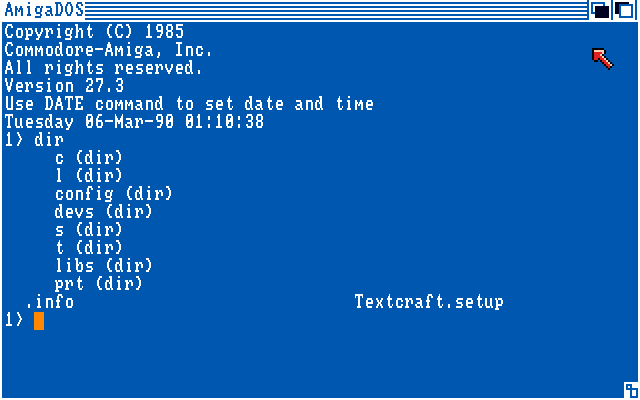
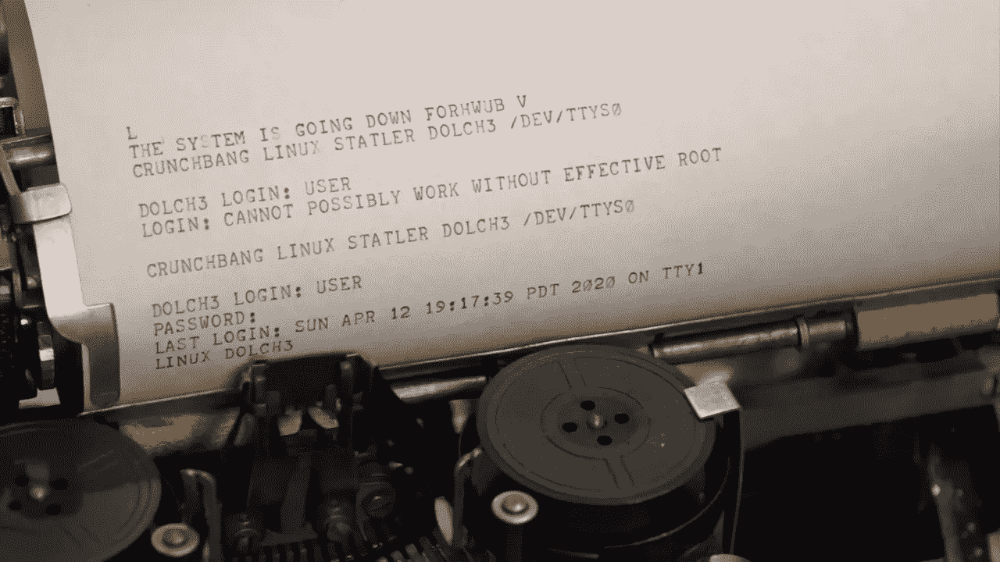
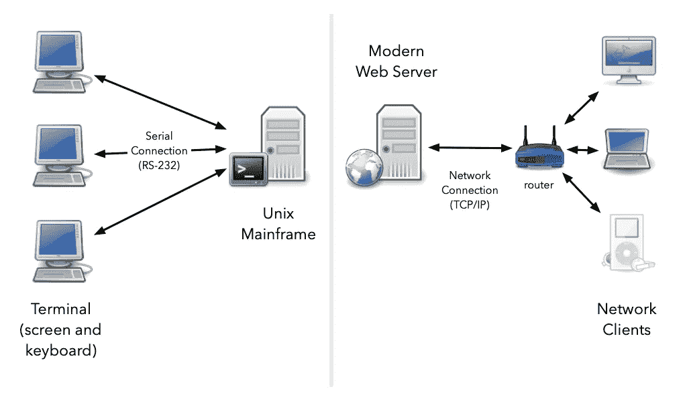
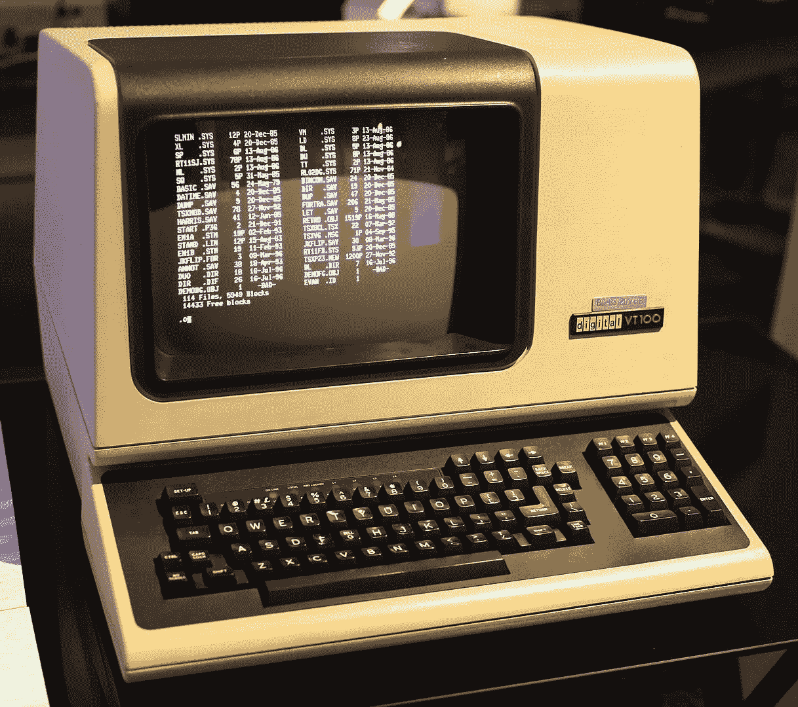
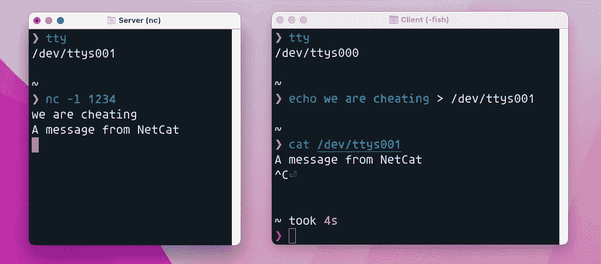
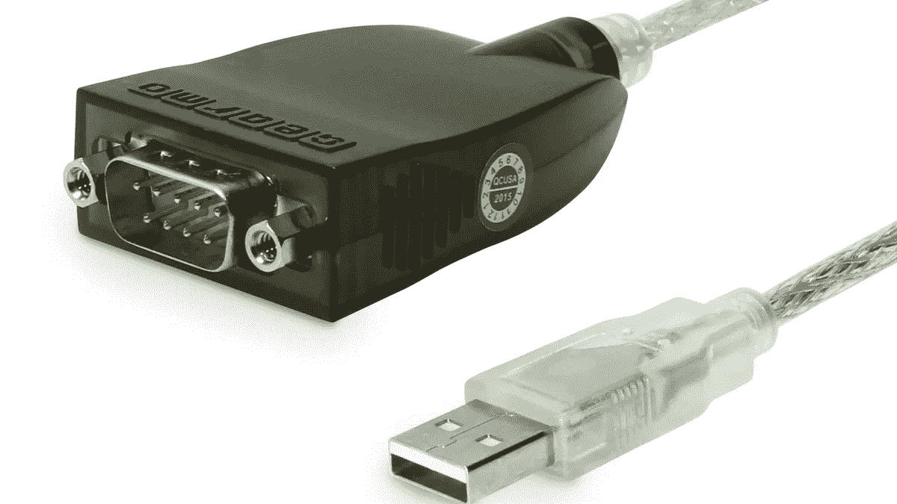
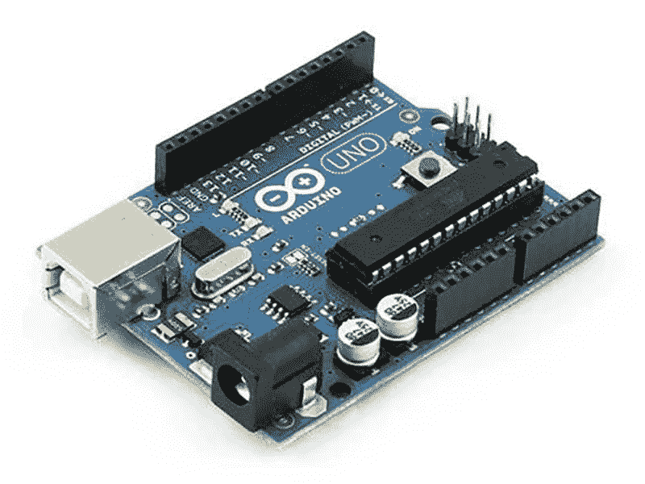
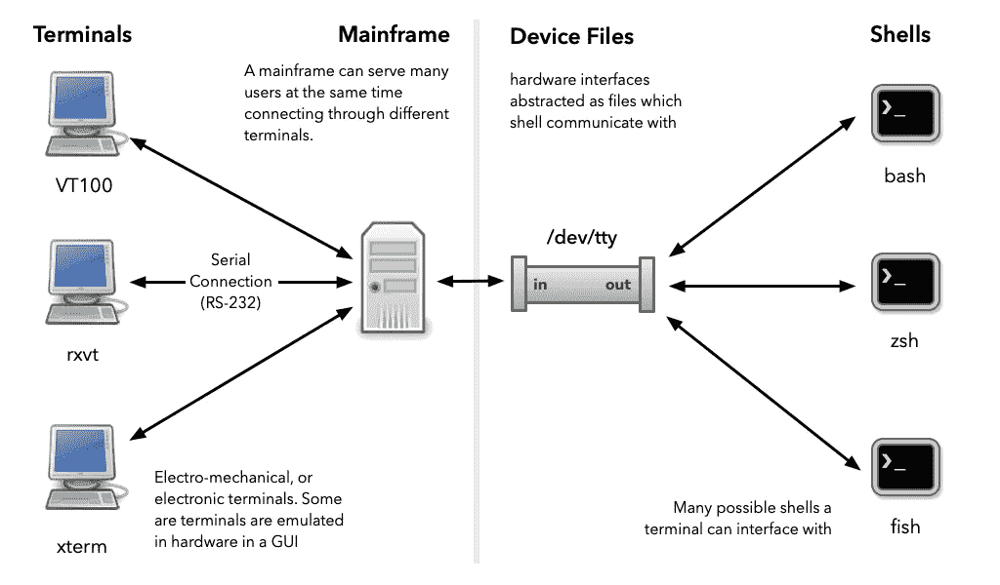

# Unix 外壳和终端

> 原文：<https://itnext.io/unix-shells-and-terminals-6012fe713e4f?source=collection_archive---------0----------------------->

## Unix shell 和 Unix 终端是一回事吗？


Unix 不是在个人计算机上诞生的。它是通过电传终端编程的。

您可能以前见过 Unix 终端模拟器。下图来自 macOS 终端应用程序。这些有很多。我最喜欢的是 [iTerm2](https://iterm2.com) 。Linux 用户可以使用 GNOME 终端，或者 KDE 应用程序 Konsole。


使用终端应用程序列出 Godot 目录的内容

这些界面的一个更通用的术语是 CLI(命令行界面)。我第一次接触 CLI 实际上不是 Unix 系统或 Microsoft DOS，而是在一台运行 AmigaDOS 的 Amiga 1000 计算机上，在一个蓝色的 CLI 窗口中。



运行 AmigaDOS 的 Amiga 命令行(CLI)。

因此，CLI 的概念是非常通用的，但是本文将集中讨论 Unix 命令行界面(CLI ),因为它们主宰了现代操作系统，如 Linux、macOS，甚至 Windows。是的，Windows 有它的 DOS 和 PowerShell CLIs，但是 Unix 命令行也通过 [Windows 子系统 for Linux (WSL)](https://docs.microsoft.com/en-us/windows/wsl/about) 接管了 Windows。

对于初学者来说，Unix 命令行可能很难理解。人们对 shell(如 Bourne Again Shell `bash`)、计算机终端(如 [VT100](https://en.wikipedia.org/wiki/VT100) )和终端模拟器(如 Konsole 或 GNOME 终端)之间的区别感到困惑。为了增加更多的混乱，我们可以谈谈[伪终端](https://en.wikipedia.org/wiki/Pseudoterminal)。

这些例子中自然会出现几个问题:

1.  究竟为什么有一个命令行界面会如此复杂？
2.  我需要知道这些吗？我能活在无知的幸福中吗？

很长一段时间，我不知道 Unix 命令行的具体细节，仍然在使用它，没有遇到太多问题。然而，如果不理解底层技术，您将经常难以理解重要的事情。

我举一个 Git 版本控制系统的例子:很长一段时间，我试图坚持只知道要发出的命令。我试图只把 Git 作为一个用户。作为一个只知道使用命令的人。那没用。我非常沮丧，准备完全放弃 Git。我的一个朋友恳求我不要放弃。所以，我做了最后的努力，读了一本关于 Git 的书。突然，一切都明白了。我实际上是基于这个经验做了一个演讲，它帮助了许多与 Git 作斗争的人:[理解 Git 版本控制系统](https://www.youtube.com/watch?v=tHr0dOtDeXI)。

Unix 命令行非常相似。通过理解底层概念，您将能够使用命令行做更多的事情。

# Unix CLI 为什么这么复杂？

如果您今天从头开始构建一个命令行界面，您可以使事情变得简单得多。它从一开始就是为鼠标、窗口和键盘设计的。在 Windows 和 Linux 上，复制粘贴可以像其他应用程序一样使用 Ctrl-C 和 Ctrl-V。一次跳一个单词或一行的热键可以像其他文本编辑器一样工作。你可以很容易地将鼠标放在字母之间。然而，您通常不能在 Unix 终端中做任何这些事情，并且可能不清楚为什么这些看似任意的限制存在。

问题是，大量的 Unix 工具，如`ls`、`telnet`、`ftp`、`ed`、`awk`、`sed`、`grep`、`tar`、`gzip`和其他许多工具是为已经不存在的计算机硬件开发的。人们不愿意放弃他们已经习惯使用的所有软件。他们宁愿不要从头重写所有这些软件。因此，随着 Unix 硬件和软件的发展，他们在上面创建了各种形式的仿真，以使现有的工具如`grep`和`tar`认为它们仍然运行在旧的 Unix 系统上。

这也是我们今天使用英特尔 x86 处理器的原因。指令集架构已经相当过时了。如果我们能从零开始设计一个微处理器，它看起来不像我们会做出来的东西。然而，设计并没有停滞不前。它已经发展和扩展了更多的功能来保持相关性。现代指令集架构将更接近于今天 M1 和 M2 MAC 电脑中使用的 Arm，或者 RISC-V 指令集。

编程语言也是如此。C++已经变成了一个怪物。如果从头开始，今天没有人会设计出像 C++这样的东西。这种语言最初流行是因为开发人员可以重用他们的旧 C 代码。后来，在保持旧的 C++代码运行的同时，它通过添加特性保持了相关性。

因此，理解今天任何广泛使用的技术，就像理解工程和程序设计一样，都是关于考古挖掘的。从 1992 年开始，我一直致力于用 C++编写的 3D 建模工具。通常理解架构和设计不是通过考虑工程上的权衡来完成的，而是通过让老前辈给你上一堂关于过去美好时光的历史课来完成的。

学习起来似乎是浪费时间和精力，但是我可以向您保证，理解 Unix 终端的历史将极大地帮助您理解系统为什么以这种方式工作。

# Unix 终端的历史

我在这一节的目的是让您掌握终端、shell 和终端模拟器之间的相互关系。

最初的 Unix 主机没有像你今天所用的电子显示器。它们不是个人电脑，而是供多个用户使用的大盒子。取而代之的是，计算机用户的办公桌上有一种叫做电传打字机的东西。你可能也听说过它们被称为电传打字机、电传打字机或 TTY。这些机器工作起来就像一台集美化了的打字机和电报于一身的机器。它没有内存、微处理器或类似的东西。它主要是一种机电设备。你在上面输入字母，字母会像真的打字机一样出现在纸上，所以你可以看到你在输入什么。关键的区别在于，你输入的信件是通过串行电缆(RS-232)发送到 Unix 计算机的。



运行在 20 世纪 30 年代电传打字机上的 Linux。shell 命令的结果打印在实际的纸上。

为了理解 Unix 计算机和电传打字机之间的关系，与我们现代网络驱动的世界进行类比是有帮助的。谷歌、亚马逊和其他公司有许多运行网络服务器软件的服务器。用户可以通过互联网从智能手机、平板电脑、笔记本电脑和运行 Firefox、Chrome 或 Safari 等网络浏览器的台式电脑连接到这些电脑。最终，多个用户通过网络电缆连接到同一台计算机。服务器用请求的网页进行响应。

在 Unix 大型机设置中，按照我们的现代标准，一切都更加原始。你连接的不是智能手机，而是一个电子机械设备，电传打字机，它甚至不是一台真正的计算机。电传打字机不能进行任何计算或运行任何软件。它所能做的就是记录你按下的字母，并通过串行电缆将它们发送到 Unix 主机。Unix 主机将通过串行电缆发回信件来作出响应。当这些信到达时，它们会在你的打字机上打印出来。

与我们现代的网络和互联网世界有几个显著的不同。网络以数据包的形式发送数据，例如 TCP/IP 数据包。甚至一根不起眼的 USB 电缆也能发送数据包。数据包是一个独立的小数据块。你可以把一个包想象成一封信:它写着它从哪里来，要去哪里，并且包含一些数据。这样，来自多个不同客户端的数据可以通过同一根网络电缆传输到服务器。当收到时，服务器可以分离出不同的包，以便它可以处理自己与不同的智能手机，桌子和笔记本电脑之间的通信，所有这些都只需要一根物理电缆。



Unix 终端与现代 Web 客户端的比较

Unix 计算机不是这样的。每台电传打字机都需要一根单独的串行电缆。它不发送数据包。只要你一按下按键，它就会发送代表你所按按键的二进制数字。这是一项基本制度。它实际上并不是首先为计算机制造的。电传打字机被用来代替电报。你不用敲电报机，听到另一端的哔哔声，你可以奢侈地输入整个文本。不需要学习莫尔斯电码。

20 世纪 70 年代，电传打字机演变成更现代的电子版本，如 VT100。你可以把它看作是一个显示器和键盘连在一起的设备。因此，你可以把旧的 Unix 主机想象成一台允许你插入多个屏幕和键盘的计算机。每个键盘和屏幕组合服务于不同的用户。



VT100 终端。不是个人电脑。只和电脑交流。

这些终端不必连接到 Unix 主机。他们可以连接到许多其他系统，如 VAX；因此它们是非常普通的设备。当 Unix 计算机缩小并成为个人用户如 PC 的台式计算机时，终端和计算机之间的关系发生了变化。Unix 有一个窗口系统，叫做 X Window System，在这里你可以运行不同的软件。您可以运行的一种应用程序是终端模拟器。一个早期的变体被简单地称为`xterm`。

终端模拟器伪装成 VT100 之类的旧物理终端。底层 Unix 系统仍然认为您是在通过串行电缆连接的物理终端上输入。但是，如何才能让 Unix 认为终端模拟器的窗口是“真正的”终端呢？这是我们将探讨的下一个问题。

## Unix 设备文件，TTY 和 PTY

在 Unix 上，文件系统更像是不同种类的操作系统资源的名称空间，而不仅仅是磁盘上的物理文件。大多数文件映射到硬盘上的文件。然而，在 Unix 上，文件也可以表示物理设备，如键盘、鼠标、声卡、硬盘、软盘驱动器、与调制解调器或终端的串行通信。

您可以在`/dev`目录中找到代表这些设备的文件。这些文件提供了一种与设备驱动程序通信的方式，设备驱动程序处理与底层物理设备的通信。设备驱动程序是使底层硬件看起来像是`/dev`目录中的文件的软件。在过去，Unix 会通过`/dev/ttyS0`、`/dev/ttyS1`和`/dev/ttyS2`文件(其中`S`代表串口)与各个串行接口进行通信。

一个程序可以打开这些文件中的一个，并从中读出电传打字机正在打印的内容。这些程序可以写入文件，把信件送到电传打字机上的纸上。

将这种与外界的联系表示为一个文件被证明是一种强大的抽象。Unix 供应商可以编写新的驱动程序，使与终端模拟器的通信看起来一样。Unix 程序会读写`/dev/tty`文件，而不知道它们现在代表了图形用户界面中许多窗口中的一个。Unix 一直延续到现代，很大程度上是因为它在早期创建了强大的抽象。

当 Unix 用户通过 TTY 设备连接物理终端时，他们会经常运行`telnet`、`rsh`、`rcp`和`rlogin`等命令(参见 [r-commands](https://en.wikipedia.org/wiki/Berkeley_r-commands) )。所有这些命令都意味着连接到另一台 Unix 机器。几台 Unix 机器可以通过 TCP/IP 网络连接起来。假设用户 Bob 坐在一台旧的电传终端旁边，通过一个串行端口连接到一台名为 Asterix 的 Unix 主机。在这台计算机上，他运行`telnet`程序连接到另一台名为 Obelix 的 Unix 计算机，该计算机通过 TCP/IP 网络连接连接到 Asterix。


在另一台 Unix 主机上远程运行 **ls** 命令，而不是 Bob 终端所连接的那台。

在远程 Obelix 机器上，Bob 发出诸如`ls`的命令。`ls`如何知道将它的输出发送到哪里？没有一台 TTY 设备可以工作，因为它们与物理端口相关，但是 Bob 通过 TCP/IP 连接进行连接。

解决方法是[伪终端](https://en.wikipedia.org/wiki/Pseudoterminal)简称 PTY。这些被表示为`/dev`下的文件，由网络应用程序动态创建。事实上，终端模拟器被当作一个伪终端来处理，因为它并不代表一个实际的物理端口，您可以随意创建多个终端窗口。在我使用的 macOS 上，它们有诸如`/dev/ttys000`、`/dev/ttys001`和`ttys002`的名字。它们是在我创建新的终端窗口和标签时按顺序创建的。

在 macOS 上，您可以通过发出`tty`命令来检查您的终端仿真窗口正在与什么 TTY 设备通信。

```
❯ tty
/dev/ttys000
```

您可以使用带有`-a`开关的 process info 命令来查看当前使用的所有 TTY 设备以及这些设备上正在运行的程序。从这个概述中可以看出，`ttys000`创建后做的第一件事是运行`login -fp erikengheim`命令。

```
❯ ps -a
  PID TTY           TIME CMD
25797 ttys000    0:00.02 login -fp erikengheim
25798 ttys000    0:00.10 -fish
25898 ttys000    0:00.00 ps -a
25849 ttys001    0:00.02 login -fp erikengheim
25850 ttys001    0:00.09 -fish
25897 ttys001    0:00.00 nc -l 1234
```

Unix 程序运行时会创建我们称之为*的进程*。进程是操作系统中正在运行的程序的表示。一个进程可以创建一个子进程，或者*产生*一个子进程，就像我们通常所说的那样。`login`进程衍生出`fish` shell 进程，后者最终衍生出`ps -a`进程，后者给出了这个概述。

与此同时，在我打开的第二个窗口中，`/dev/ttys001`我们得到了大量的其他进程。开始是一样的，但是我选择启动 NetCat 程序来监听端口 1234 上的连接。

这意味着我可以通过对本地主机上的端口 1234 进行常规的网络套接字连接来发送和接收来自 NetCat 的消息。然而，它最终所做的只是将数据转发到 NetCat 正在其中运行并监听端口 1234 的`/dev/ttys001`伪终端。我们可以测试所有这些，看看它是如何工作的。创建两个独立的终端窗口:

*   服务器—在此窗口中启动`nc -l 1234`。
*   客户端—使用`telnet localhost 1234`连接。

您可以在客户端窗口中编写一条消息，以查看它是否会在服务器窗口中弹出:

```
❯ telnet localhost 1234
Trying 127.0.0.1...
Connected to localhost.
Escape character is '^]'.
hello world
```

在服务器端，您应该会收到以下内容:

```
❯ nc -l 1234
hello world
```

如果你从另一台计算机连接，你需要使用`telnet`连接，但是因为我们是本地的，我们可以作弊，直接从`/dev/ttys001`伪终端读写。要离开`telnet`，请按 Ctrl-】。这将给出 telnet 提示符，允许您发出不同的命令。您只需输入`quit`:

```
❯ telnet localhost 1234
Trying 127.0.0.1...
Connected to localhost.
Escape character is '^]'.
^]
telnet> quit
Connection closed.

❯
```

让我们重新启动 NetCat 来做我们的小欺骗。首先，我们使用`tty`命令来确保我们得到了正确的 TTY 设备。在我的 macOS 上，我会得到`/dev/ttys001`，但是如果你在 Linux 上运行，你会得到不同的东西。

```
❯ tty
/dev/ttys001

❯ nc -l 1234
```

我们切换到另一个终端窗口，尝试发送文本到`/dev/ttys001`设备或你使用的任何 TTY。

```
❯ echo we are cheating > /dev/ttys001
```

你应该会在另一个窗口看到“我们在作弊”。

```
❯ nc -l 1234
we are cheating
```

使用`cat`，您同样可以很好地读取 TTY，就像它是一个文件一样。在这种情况下，`cat`将会阻塞，直到您写入消息。



用 NetCat 演示 TTY 通信

您可以通过从 NetCat 发送一个`Ctrl-D`来表示通信结束。另一端的`cat`命令会将其解释为挂断并退出。从技术上讲，它映射到一个 EOF(文件结束)。

```
❯ nc -l 1234
we are cheating
A message from NetCat
```

在另一端，我们会看到:

```
❯ cat /dev/ttys001
A message from NetCat
```

任何允许你读写文件的程序都可以工作。例如，像`vim`、`kak`和`emacs`这样的编辑器也可以工作。当您保存文件时，它将写入 TTY 设备，您将在 NetCat 窗口中看到您编辑的内容。

## USB 电缆上的串行通信

伪造串行通信以保持向后兼容性在许多情况下都是有益的。我们让它看起来好像一个终端窗口正在通过 RS-232 电缆使用伪终端与 Unix shell 命令进行串行通信。在 Mac 上，它们由`/dev/ttys`文件表示。这是软件中所有事情发生的一个例子。然而，我们也可以使用相同的技巧来使不是串行连接的硬件连接看起来像串行连接。

为什么这很有用？现在很少有计算机配备 RS-232 串行端口，取而代之的是 USB 端口。USB 是一个复杂得多的连接器，更像是一个发送数据包的网络连接，而不是像老式的 Unix TTY 连接那样的单个字符。



RS-232 和 USB 连接器比较

通过模拟串行连接的软件接口，我们可以编写代码来与 Arduino 等微控制器通信，就好像我们通过老式的 RS-232 端口连接到它一样。在 Arduino 板上有一个 USB 连接器，它是一个可以转换成串行连接的硬件。因此，Arduino 板上的 AVR 微控制器认为它正在通过串行电缆进行通信。它允许我们为通信链路两端的串行通信编写代码。



Arduino UNO 板作为 USB-B 端口。该板使用 USB 转串行硬件转换器。

如果你用 USB 线将 Arduino 插入 Mac，就会弹出一个设备文件，比如`/dev/cu.usbserial-10`。确切的名称会有所不同。你只要写下`ls /dev/cu.*`就能找到它们。为什么是`/dev/cu*`的名字而不是`/dev/tty*`？前者用于模型拨号。你可以坐在家里，用你的终端通过调制解调器拨号到 Unix 主机。`/dev/tty*`设备是供 Unix 主机大楼里的人直接连接的。

关键区别在于 RS-232 端口上 DTR(数据终端就绪)控制信号的使用。一个与 DTR 对话的程序将被阻止，直到 DTR 发出信号。一台电传打字机会向 DTR 发送一个信号，表示它已准备好进行通信。

对于调制解调器来说，这有一点不同，因为最初你给调制解调器的命令是关于与谁连接以及如何连接。所以在这种情况下，DTR 被用来表示已经建立了连接。因此调制解调器将使用 CU 设备。

我希望这不是一个太大的弯路。我详细阐述了这一点，是为了让大家明白，对于硬件层面上正在发生的事情，有许多方法可以呈现不同的外观，以及为什么这通常是有用的。

尽管我们已经经历了这一切，但我仍然没有解释任何有助于理解为什么终端仿真器非常复杂，并且可以配置为仿真许多终端，如 VT100、xterm、ANSI、rxvt 等。

# 控制代码和终端仿真器

如果一个终端必须发送和接收的只是可见字符，那么一切都将非常简单。问题是我们需要的不仅仅是可见的角色。当向终端发送文本时，您需要一种方法来告诉它开始新的一行或开始新的一行。如果它有不同颜色的墨盒，你需要一种方法来告诉它改变打印在纸上的颜色。

用户可能想要编辑或修改文本。因此，我们需要能够向前、向后、上下、下一页、删除一行等等移动光标。为了表现所有这些“看不见的”角色，我们开发了控制代码。不同的终端将使用不同的控制代码，这就是为什么它们不会彼此兼容的原因。

幸运的是，出现了一个 ANSI 标准，这是今天大多数使用终端的人将使用的标准。如果您曾经用 C 或受 C 启发的语言编程过，那么您可能知道其中的许多:

*   **换行** `0x0A` `\n` -移动到下一行。用 C 代码写成`\n`。在普通的 Unix 终端上，通过按 Ctrl-J 将它发送到 TTY
*   **回车** `0x0D` `\r` -移动到行首。用 Ctrl-M 发送到 TTY
*   **退格键** `0x08` `\b` -向后(向左)移动一个字符，通常是删除原来的一个字母。用 Ctrl-H 发送到 TTY
*   **标签** `0x09` `\t` -右移 8 格。用 Ctrl-I 发送。
*   **垂直标签** `0x0B` `\v` -垂直标签。向下移动。
*   **转义** `0x1B` `\e`或`\x` -开始一个转义序列或退出一些当前模式。与`Ctrl-[`一起发送
*   **EOT**—`0x04`—传输结束。当你按下`Ctrl-D`时，你告诉终端你已经完成了字母的输入。你会经常看到这被称为`EOF`，因为它可以用来在另一端引起一个文件结束条件。但是`EOF`更多的是条件。文件的结尾不存储字符值`0x04`，它们只是结束。

您知道您不是按 Ctrl-J 在终端中键入命令。相反，你是在敲真正的回车键。这是怎么回事？这是终端模拟器复杂性的一部分。您的终端模拟器将您点击 return 键、tab 键和 escape 键转换为 Ctrl-J 和 Ctrl-I 等组合键，在某些情况下，您甚至可能想要更改这种映射。实际上，您可以查询您的 TTY，以了解各种控制字符(cchars)是如何配置的:

```
❯ stty -a
speed 38400 baud; 15 rows; 69 columns;
lflags: icanon isig iexten echo echoe echok echoke -echonl echoctl
	-echoprt -altwerase -noflsh -tostop -flusho pendin -nokerninfo
	-extproc
iflags: -istrip icrnl -inlcr -igncr -ixon -ixoff ixany imaxbel iutf8
	-ignbrk brkint -inpck -ignpar -parmrk
oflags: opost onlcr -oxtabs -onocr -onlret
cflags: cread cs8 -parenb -parodd hupcl -clocal -cstopb -crtscts -dsrflow
	-dtrflow -mdmbuf
cchars: discard = ^O; dsusp = ^Y; eof = ^D; eol = <undef>;
	eol2 = <undef>; erase = ^?; intr = ^C; kill = ^U; lnext = ^V;
	min = 1; quit = ^\; reprint = ^R; start = ^Q; status = ^T;
	stop = ^S; susp = ^Z; time = 0; werase = ^W;
```

有如此多的转义码来做不同的事情，以至于当我们只有 7 或 8 位可用时，我们会很快用完字符。为此，有人制作了*转义码*。它们以 escape 键(ASCII 码`0x1B`)开始，并允许我们使用多个字符来指定我们想要的操作。如今使用的通用标准被称为 [ANSI 转义码](https://en.wikipedia.org/wiki/ANSI_escape_code)。这里有一个有用的[备忘单](https://gist.github.com/fnky/458719343aabd01cfb17a3a4f7296797)。

转义码允许我们做很多事情，比如移动光标到一个特定的位置，改变字符的颜色，清空屏幕，甚至切换换行。文本模式编辑器，如 Emacs、Vim、Pico 和 [Kakoune](https://kakoune.org) (用户友好的 Vim)广泛使用这些转义码来创建基于文本的界面。一些例子:

*   `ESC[H` -移动到初始位置(0，0)。
*   `ESC[nA` -将光标上移`n`行。
*   `ESC[n;mH` -移动到屏幕上的位置(n，m)。
*   `ESC[0m` -重置所有模式和颜色。
*   `ESC[31m` -将文本变成红色。

你可以启动一种编程语言，比如 Julia 或 Python，并尝试这些转义码。这是一些 Julia 代码，它变成红色文本，写一些字母，然后进行重置。

```
❯ julia

julia> println("\e[31m Hello world \e[0m")
 Hello world
```

你也可以用 Python 来做，只是有点笨拙，因为你不能使用`\e`转义码:

```
❯ python

>>> print("\x1b[31m Hello world \x1b[0m")
 Hello world
```

我们也可以在 Unix 终端本身实现这一点。不同的外壳支持它。我无法让它在 Z Shell `zsh`和 Bourne Again Shell `bash`上运行。然而，我让它在 Fish shell `fish`中工作。人们只需记住要避开方括号。

```
❯ echo \e\[31mhello\e\[0m world
hello world
```

# 终端、文件描述符和管道

我们越来越接近对终端如何工作有一个更完整的了解。有一个关键的缺失点:Unix 命令和程序如何将它们的输出定向到正确的终端？有时，一个程序远程运行，需要通过网络上的伪终端发送它们的输出。

事实上，Unix 程序远比这更灵活。不仅可以将输出发送到不同的终端，还可以发送到完全不同的文件。例如，如果我输入`ls`，我会得到一个发送到我默认的 TTY 终端的目录列表。但是，如果写`ls > foo.txt`这个清单会被发送到一个名为`foo.txt`的文件中。`rev`命令通常会撤销我写的所有内容(按 Ctrl-D 退出)

```
❯ rev
hello
olleh
world
dlrow
```

但是完全有可能通过编写`rev < foo.txt`从文件中获得对`rev`的输入。这里有一个例子，我们创建了一个文件，稍后我们使用重定向符号`<`将该文件的内容提供给`rev`。

```
❯ cat > hello.txt
hello
world  # Press Ctrl-D

❯ cat hello.txt
hello
world

❯ rev < hello.txt
olleh
dlrow
```

当你运行一个像`rev`这样的程序时，你创建了一个*进程*(内存中运行程序的表示)。一个 Unix 进程使用编号为*的文件描述符*与文件通信。在幕后，当您打开一个文件时，会创建一个文件描述来引用该文件。

一个 Unix 进程有 3 个文件描述符，编号为 0、1 和 2，它们总是打开的。这些代表:

*   标准输入—标准输入
*   标准输出—标准输出
*   标准错误—标准错误

其实你可以把它们看成`/dev`下的文件。在这里，您可能会发现不同 Unix 操作系统之间的差异。我正在描述这是如何在 macOS 上工作的。这些文件中的每一个都是到编号文件描述符(fd)的链接。

*   `/dev/stdin` -链接到`/dev/fd/0`
*   `/dev/stdout` -链接到`/dev/fd/1`
*   `/dev/stderr` -链接到`/dev/fd/2`

在这些例子中，我们将主要忽略`stderr`并关注`stdin`和`stdout`。你可以把一个进程想象成有三个插座，分别标为`stdin`、`stdout`和`stderr`，我们可以在那里插入不同的文件或类似文件的对象。在下图中，我只是展示了连接器，并将其缩短为`in`和`out`。


重定向来自文件的输入

默认情况下，`/dev/stdin`和`/dev/stdout`指向我们的默认终端`/dev/tty`，它又指向一个特定的伪终端，比如`/dev/ttys001`。使用`<`和`>`重定向符号，我们可以改变我们的进程实际插入的文件描述符的输入和输出。

这种抽象的一个巧妙创新是管道的概念。管道有点像文件，只是两个进程可以同时打开它。一个进程写入它，另一个进程读取它。

我们可以用`mkfifo`命令制作这样一个管道。我们正在制作一个名为`tube`的管道。

```
❯ mkfifo tube

❯ file tube
tube: fifo (named pipe)
```

这将在文件系统中创建一个名为`tube`的条目，即使在您重启后它也将保留在那里。但是，从命名管道写入和读取的数据从不存储在磁盘上。它完全是在内存中处理的。让我们看看这在实践中是如何实现的。


设置命名管道通信

你需要两个终端窗口来完成这项工作。在一个窗口中，你写下`rev < tube`，这意味着你试图从命名管道中读取。在另一个窗口中，你写下`cat > tube`，这意味着你在键盘上写的任何东西都将被发送到`tube`中，并且`rev`进程将意识到它可以从电子管中读取。


大多数时候我们不需要命名管道。我们对管道的名称或永久保留它不感兴趣。我们很乐意临时创建一个管道，这样我们就可以轻松地将数据从一个命令传递到另一个命令。我们可以使用管道`|`字符来创建这样的管道。

```
❯ echo hello | rev
olleh
```

从概念上讲，我们仍然创建了一个有两端的管道:一端用于写，另一端用于读，但是我们还没有给它命名。


管道可以以复杂的方式组合，允许我们将许多不同命令提供的功能链接在一起。让我们看一个将`ls`、`head`和`sort`链接在一起的例子:

```
❯ touch hotel golf foxtrot echo

❯ ls | head -3
echo
foxtrot
golf

❯ ls | head -3 | sort -r
golf
foxtrot
echo
```

`head -3`命令选择前三行，而`sort -r`将反向排序输入。从概念上讲，进程的 stdout 和 stdin 通过管道连接，如下所示:


使用管道将三个命令链接在一起的示例。

这些管道例子巩固了 Unix 将输入和输出重定向到不同地方的能力，而相关的程序并不知道发生了什么。`ls`命令不需要知道它发送的输出是去往管道、另一个文件，还是 telnet 客户端创建的伪终端。它甚至可以伪装成串行连接，通过 USB 电缆发送数据。

因此，当你用代码`print("hello world")`创建一个简单的程序时，很多事情会在幕后发生:

*   文本被写入文件`/dev/stdout`，但这只是一个到`/dev/fd/1`的链接
*   `/dev/fd/1`将再次指向`/dev/tty`，这是您当前的 TTY 设备。
*   `/dev/tty`将指向一个实际的伪终端，例如`/dev/ttys001`，它指向一个实际的终端仿真器窗口。

这就是“hello world”如何被发送到用户界面中的正确窗口。当然`/dev/stdout`可以被重定向，在这种情况下，文本会被放到其他地方。

# 终端与外壳

Unix 终端实际上只是一种将字符输入到`/dev/tty`设备并从同一设备读取字符和控制字符的方法。终端本身并不提供太多的功能。

为了能够解析用户输入，将输入解释为运行和显示结果的命令，我们需要一个 Unix Shell。Shell 管理诸如 prompt 之类的东西，您可以在这里编写命令。

shell 执行作业管理，比如让您在不同的运行进程之间切换，以防一个进程需要很长时间才能完成。不是每个 shell 都有相同的语法。从很多方面来说，你可以把 Python、Ruby 和 Julia 这样的编程语言看作是它们自身的外壳。然而，这些编程环境不太适合作为 Unix shells，因为文件、进程、程序、目录和管道都不是一级对象。

像`bash`这样的 Unix shell 不适合作为通用编程语言，但是它们擅长文件管理和作业控制。下图总结了端子和外壳之间的关系。



在上图中，我把终端画成了物理设备。在现代世界，这当然是罕见的。它们通常以终端模拟器的形式存在于一些窗口系统中。

当您打开一个终端模拟器窗口时，它将运行`login`程序，该程序将生成您的 shell。如果您在 macOS 上，它将启动`/etc/shells`文件中列出的一个 shells:

```
❯ cat /etc/shells
/bin/bash
/bin/csh
/bin/ksh
/bin/sh
/bin/tcsh
/bin/zsh
/usr/local/bin/fish
```

你可以看到这些年来制造了很多贝壳。在现代的 macOS 上，Z Shell `zsh`已经成为默认，尽管 Linux 和 macOS 长期以来都使用 Bourn Again Shell `bash`作为默认。

在过去，`login`程序查看`/etc/passwd`文件来登录用户。在那里，系统可以检查给定的用户是否存在以及是否给出了正确的密码。之后`login`可以启动配置好的外壳。每个像在`/etc/passwd`文件中的样子都是这样的:

```
tommy:x:1000:1000::/home/tommy:/bin/bash
```

每一行都给出了用户名、主目录和要运行的 shell。由于安全原因，这个文件已经失去了它的重要性。您不能再直接访问密码文件。黑客很容易利用它来进行字典攻击。相反，我们使用命令来修改用户数据，比如更改要使用的 shell。要更改默认外壳，我们使用`chsh`(更改外壳)命令。这是我如何改变使用`fish`外壳:

```
❯ chsh -s /usr/local/bin/fish
```

不可能在一篇文章中涵盖 Unix 终端和 shells 的所有内容，所以我将在链接中添加相关的故事。

# 相关故事

与 Unix、shells 和终端相关的商店。

*   [Unix 命令行速成班](/unix-command-line-crash-course-453e409d62f5)——重点讲解如何使用 Unix 命令。面向绝对的初学者。避免进入技术细节。