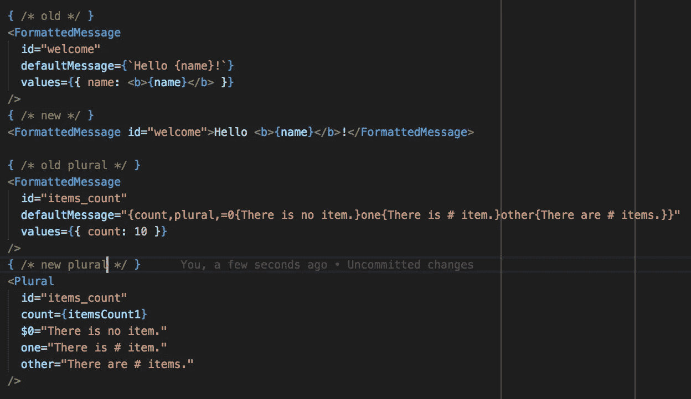

# 释放 react-intl 隐藏的超能力(第 1 部分)

> 原文：<https://itnext.io/unleash-the-hidden-superpowers-of-react-intl-part-1-a59ba5e960cf?source=collection_archive---------5----------------------->

# 第 1 部分:如何使用 babel 宏美化翻译的 react.js 标记


让图像说话，看看你会得到什么:



## 我们不喜欢这种混乱:

```
const name = 'John Doe';<FormattedMessage
   id="welcome"
   defaultMessage={`Hello {name}!`}
   values={{ name: <b>{name}</b> }}
/>
```

虽然 react-intl 工作得很好，但是到处都有这些`FormattedMessage`并不能真正帮助保持代码的美观和可读性。你可以这样写不是更好吗:

```
<FormattedMessage id=”welcome”>Hello <b>{name}</b>!</FormattedMessage>
```

## 巴别塔宏来救援了

您可以轻松地编写一个 babel 插件，将上述简化的标记转换成所需的 react-intl FormattedMessage。但是有一个更好的方法使用[肯特·c·多兹](https://medium.com/u/db72389e89d8?source=post_page-----a59ba5e960cf--------------------------------)巴别塔宏([https://github.com/kentcdodds/babel-plugin-macros](https://github.com/kentcdodds/babel-plugin-macros))。使用宏有一个很大的好处(除了它们创建起来超级简单之外),你可以在使用 [create-react-app](https://github.com/facebook/create-react-app) 创建的应用程序中使用它们，而不需要弹出(编写时需要一个 alpha build v2.x.x)。

babel 宏基本上只是一个使用宏获取节点引用的函数:

```
const { createMacro } = require('babel-plugin-macros')module.exports = createMacro(myMacro)function myMacro({references, state, babel}) {
  // the FormattedMessage imported in below code snippet
  const { FormattedMessage = [] } = references;// transform each occurance
  FormattedMessage.forEach(referencePath => { /* transform */ });
}
```

我们不会讨论用于转换简单标记的宏的所有细节，但是您可以在这里查看代码:

> [https://github . com/locize/locize-react-intl-example/blob/master/src/intl . macro . js](https://github.com/locize/locize-react-intl-example/blob/master/src/intl.macro.js)

您可以像这样使用宏:

```
// import the macro component
import { FormattedMessage } from "./intl.macro";// and use it
<FormattedMessage id=”welcome”>Hello <b>{name}</b>!</FormattedMessage>
```

宏会将其转换为 react-intl FormattedMessage:

```
<FormattedMessage
   id="welcome"
   defaultMessage={`Hello {name}!`}
   values={{ name: <b>{name}</b> }}
/>
```

## 复数和选择

我们可以在简单的复数和选择中加入更多的宏魔术:

```
import { Select, Plural } from "./intl.macro";// select
<FormattedMessage
  id="avoid_bugs"
  defaultMessage="{gender,select,he{He avoids bugs.}she{She avoids bugs.}other{They avoid bugs.}}"
  values={{ count: 10 }}
/>// will become
<Select
  id="avoid_bugs"
  switch={gender}
  male="He avoids bugs."
  female="She avoids bugs."
  other="They avoid bugs."
/>// plurals
<FormattedMessage
  id="items_count"
  defaultMessage="{count,plural,=0{There is no item.}one{There is # item.}other{There are # items.}}"
  values={{ count: 10 }}
/>// will become:
<Plural
  id="items_count"
  count={itemsCount1}
  $0="There is no item."
  one="There is # item."
  other="There are # items."
/>
```

如需更多选项(如嵌套组件)，请查看示例用法:

> [https://github . com/locize/locize-react-intl-example/blob/master/src/component using macro . js](https://github.com/locize/locize-react-intl-example/blob/master/src/ComponentUsingMacro.js)

因此，在第一部分中，你学习了如何使用 [babel-plugin-macros 模块](https://github.com/kentcdodds/babel-plugin-macros)使你的标记比仅仅使用 react-intl 提供的`FormattedMessage`更具可读性。

不要忘记，您可以在此处的示例基础上构建:

> [https://github.com/locize/locize-react-intl-example](https://github.com/locize/locize-react-intl-example)

在即将发布的第二部分中，您将了解如何使用 react-intl 扩展 react.js 项目，以提供国际化来实现简单的连续本地化生命周期，这也适用于需要将翻译拆分为多个文件的大型项目。

希望你喜欢第一部分——敬请期待第二部分。