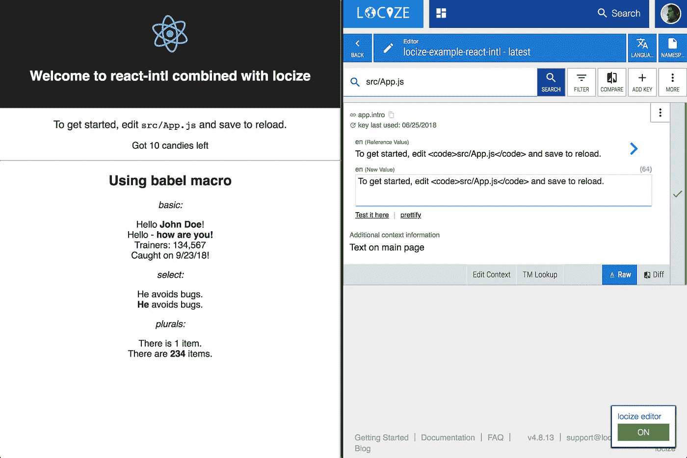

# 释放 react-intl 隐藏的超能力(第 2 部分)

> 原文：<https://itnext.io/unleash-the-hidden-superpowers-of-react-intl-part-2-b9b3d9fa4188?source=collection_archive---------2----------------------->

# 第 2 部分:使用 react-intl 让 react.js 应用程序为本地化做好准备


在第一部分中，您学习了如何使用 babel 宏来改进您的标记。

你可以在这里找到这个系列的第一部分:[https://medium . com/@ jamuhl/unleash-the-hidden-super powers-of-react-intl-part-1-d6f 99 a 32 ef 84](https://medium.com/@jamuhl/unleash-the-hidden-superpowers-of-react-intl-part-1-d6f99a32ef84)



**在这一部分**采用了[演示项目](https://github.com/locize/locize-react-intl-example)的所有功能后，您将能够:

*   将翻译分成多个文件
*   使用上下文编辑器
*   从 CDN 加载翻译
*   检测用户语言
*   自动将缺少的新字符串添加到翻译项目中
*   更新参考语言中已更改的字符串
*   将描述提交给翻译上下文
*   设置上次使用的信息，以便您可以安全地删除不再使用的密钥

## 从国际化到本土化

虽然第一部分的重点是帮助开发人员编写更好的 jsx 标记，但现在我们将把重点放在通过简化翻译人员的工作来帮助他们。在我们这个快节奏的时代，最重要的事情之一是实现快速反馈循环，这也是所有常见的“敏捷”方法所推荐的。

所以让我们更进一步:

## 从国际化到持续本地化

我们喜欢创新本地化流程，打破导出提取的翻译、将其传递给翻译人员并再次导入的缓慢循环。这种旧的过程不适合使用持续开发和敏捷方法的现代开发环境。

**我们想要的:**您的应用程序中的新内容应该立即在您的翻译管理工具中为您的翻译人员提供，新完成的翻译应该传递给应用程序，而无需开发人员向存储库添加文件或从翻译管理部门接受 PR。

## 将您的应用程序连接到翻译管理

在此示例中，我们将使用[https://locize.com](https://locize.com)作为我们的翻译管理工具，因为它公开了将本地化提升到持续本地化水平所需的所有功能。

有一个 locizer 脚本可以将您的应用程序与翻译项目连接起来:[https://github.com/locize/locizer](https://github.com/locize/locizer)

使用它，您可以加载翻译文件，保存或更新翻译片段。

**步骤 1:我们需要一种在开发过程中扩展 react-intl 组件的方法**

这应该相当容易:

```
import { FormattedMessage as FM } from 'react-intl';// find out if our react app runs in dev mode
const IS_DEV = !process.env.NODE_ENV || process.env.NODE_ENV === 'development';// export a extended replacer component while development and original while in production
export const FormattedMessage = IS_DEV ? **supportLocize()**(FM) : FM;
```

现在让我们了解一下`supportLocize()`是什么:

**步骤 2:让组件向翻译服务发送新内容**

在我们的代码中，我们像在常规的 react-intl 项目中一样使用`FormattedMessages`,但是我们在开发过程中使用被覆盖的组件:

```
// see ./locize/index.js in development mode the
// react-intl components are extended to provide
// features like save of new ids, ...
// in production you get the regular unextended
// react-intl components
import { FormattedMessage } from 'locize';<FormattedMessage
  id="app.title"
  defaultMessage="Welcome to {what} combined with locize"
  description="Welcome header on app main page"
  values={{ what: 'react-intl' }}
/>
```

我们的扩展组件将获取这些道具，并使用 *id* 和 *defaultMessage* 在 locize 上创建新的翻译片段

基于翻译目录中是否已经存在默认消息，或者默认消息已经改变，我们使用 locizer 函数来创建或更新源语言的翻译段。

太棒了，现在每当我们添加一个新的`FormattedMessage`或改变一个`defaultMessage`时，那些值会立即在你的翻译项目中被添加或改变。

**第三步:直接加载翻译**

通过覆盖`IntlProvider`，我们可以使用 locizer 脚本直接加载发布到由 [locize](https://locize.com) 提供的本地化 CDN 的翻译。

该组件主要做的是获取一个适当的名称空间来加载翻译文件和所需的 intl 语言环境数据:

```
// load the given file form locize
// and detect language while doing so
locizer.load(namespace, (err, messages, locale) => {
  currentLocale = locale;
  translations[locale] = messages;// load react intl locale data
  import('react-intl/locale-data/' + locale)
    .then(localeData => {
      addLocaleData(localeData);**// update state to render children**
      this.setState({
        locale,
        messages
      });
    });
  });
}
```

完整的代码非常简单你可以在这里找到演示库:[https://github . com/locize/locize-react-intl-example/blob/master/src/locize/index . js # L32](https://github.com/locize/locize-react-intl-example/blob/master/src/locize/index.js#L32)

因此，这不仅使我们能够加载一个翻译目录，而且通过使用该 IntlProvider，我们可以加载多个文件，并通过将它们分成多个更小的文件来简化翻译。

**步骤 4:在应用程序的上下文中启用翻译**

还有“一件事”(我的意思是，[多一个脚本](https://github.com/locize/locize-editor))可以从 locize 中使用，它使您能够将翻译编辑器集成到您的应用程序中。通过这种方式，翻译人员可以点击您网站上的任何内容，并直接在您的应用程序环境中进行翻译。


locize 编辑器的集成非常简单:

```
locizeEditor.init({
  lng: locale,
  defaultNS: DEFAULTNAMESPACE,
  referenceLng: REFERENCELANGUAGE,
  projectId: PROJECTID,
  private: PRIVATE
});
```

现在，您可以打开添加了 querystring 参数`?locize=true`的网站，您将看到上下文编辑器。

# 摘要

你看，国际化很容易，本地化也不难。使用正确的工具，您不仅可以缩短开发-翻译周期，还可以提高质量，节省时间和金钱。

你可以在这里找到完整的样本:【https://github.com/locize/locize-react-intl-example 

抓住机会，亲自体验一下 locize.com[的 14 天免费试用期。](https://locize.com)