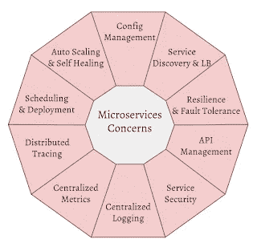
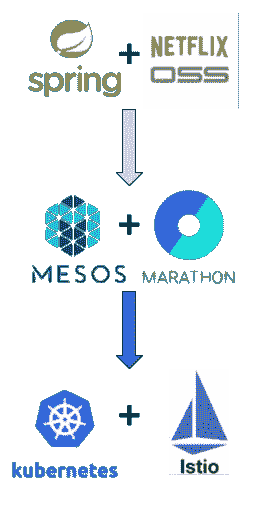
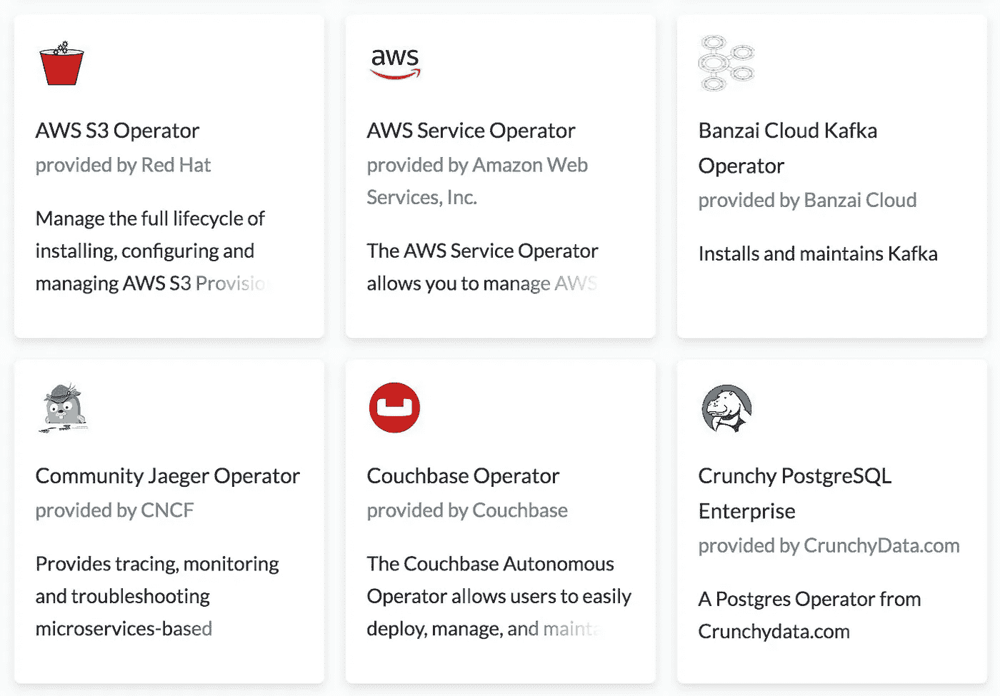
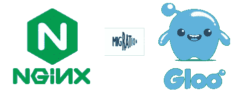

# 释放你的 Kubernetes 头盔图表的力量

> 原文：<https://itnext.io/unleash-the-power-within-your-kubernetes-helm-charts-7651b052fd52?source=collection_archive---------0----------------------->

几个我希望在开始使用 K8S 时就知道的图表技巧。他们彻底改变了我们的基础设施自动化理念。

# 从基础到高级

在大多数应用程序图表实现中，除了部署 yaml 之外，我们还可能包括入口、配置映射或秘密。我们大多数人会止步于此，继续迎接其他挑战。然而，Helm Chart 比我们想象的更强大，因为它打开了由 Kubernetes 驱动的整个自助服务生态系统的大门。

# 背景

产品开发团队(Dev)和 DevOps 团队之间经常发生争斗。开发团队希望尽可能快地交付特性，而不需要等待基础设施的改变；DevOps 团队希望保证主动选择最好的基础设施解决方案**。**

**我真的很喜欢这个游戏，因为这个过程鼓励健康的竞争，并迫使开发人员和开发人员都*提高他们的游戏*。**

# **目标**

***“Dev 永远不要等 devo PS”*。相反，DevOps 应该在开发团队需要之前预见并解决即将到来的微服务和基础设施问题(如下)。**

****

**微服务关注。美国红帽子的公司出品的计算机操作系统**

**在 Kubernetes 之前，没有简单或优雅的解决方案来实现这一点。**

*   **幸运的是，有了 Kubernetes，我们有了这个游戏的基础和必要的工具。**
*   **通过采用 Istio，我们可以将 DevOps 体验提升到一个新的水平。这些 Istio 特性是为解决基础设施和微服务问题而全新构建的。**
*   **使用操作员/控制器扩展和定制我们的 CRD 系列，并使用舵轮图将它们联合起来，我们可以释放更多的能量。**

**如果您有兴趣构建一个超级赛亚人图，并让它以自助方式为您完成所有工作，请继续阅读以了解如何实现。**

****

**龙珠超赛亚人悟空形态**

# **不断发展的景观**

**回顾过去 5 年多的时间，这一格局经历了几个阶段的演变:**

1.  **传统的[应用服务器](https://en.wikipedia.org/wiki/Application_server)**
2.  **Dockerized 微服务。传统上，使用具有有限微服务能力的 Spring-boot +网飞操作系统。(**所以昨天！😜**)**
3.  **采用*Kubernetes/Mesos/Nomad/Swarm*进行容器编排**
4.  **带服务网格的 kubernetes:Istio，LinkerD 等(**是**， **K8S 是容器编排大战的赢家！**)**

****

**上图是我自己旅途中的一个例子。四年前，Mesos 比 Kubernetes 更成熟，提供了更多的特性/框架，比如马拉松调度器和 Kafka API 框架。很多团队都采用了这个方案，比如 2015 年，[苹果用 Apache Mesos](https://www.infoq.com/news/2015/05/mesos-powers-apple-siri/) 重建 Siri 后端。**

**然而，从 2-3 年前开始，Kubernetes 击败了所有其他竞争对手，成为这场容器编排战争的明显赢家。**

**幸运的是，我们所有的应用程序和基础设施组件在 Mesos 中都是基于容器的，将它们迁移到 Kubernetes 非常容易，尤其是使用打包系统:Helm Charts。**

**老实说，一开始，对我来说，Helm chart 只是另一个新的包装系统。然而，我用得越多，它向我展示的力量就越大，这彻底改变了我的自动化哲学。**

# **超级赛亚人航海图**

**现在大家都在采用“*管道作为代码”。*大多数 CI/CD 工具都支持这个特性，包括[Tekton](https://cloud.google.com/tekton/)(Knative pipelines)[concoursci](https://concourse-ci.org/)、Jenkins 等。这通常与“ *Infrastructure as Code”一起使用，*表示在您的管道内部，一些任务可能会调用 Terraform 或 Ansible 模块来完成与基础架构相关的工作。**

**我们倾向于将这些基础设施管道用于各种任务，例如管理队列、数据库、文件存储、对象存储、秘密存储、API 路由、消息路由等。其中，以下是应用程序和基础架构的一些**共同关注点**:**

*   ****数据库自动化**:由 [flyway](https://flywaydb.org/) 、 [liquibase](https://www.liquibase.org/) 等管理的 DDL/DML/DCL**
*   ****API 路由**:添加/更新 rest API 路径，如`/api/blogs`**
*   ****交通管理**:金丝雀发布、黑暗启动、零停机部署、蓝绿部署**
*   ****队列**:新应用程序的消息队列创建(AWS SQS，GCP 发布)**
*   ****消息路由**:订阅过滤器消息过滤(AWS SNS)**
*   ****对象/文件存储** : S3 或 EFS/NFS 文件夹创建。**
*   ****认证和授权**:保护和限制服务到服务的流量。**

**以前，对于同一环境中的微服务，我们在基础设施管道中处理这些任务。问题是这些管道随着时间的推移增长很快，特别是当你有数百个微服务的时候(**或** **数以千计像优步**)。最终，它们变成了一个庞然大物，在每个环境中为每个需求运行需要很长时间。**

**在这个微服务的世界里，事情发展得更快，需要更频繁的变化，例如:**

*   **不断有新的微服务加入集群。**
*   **不相关的微服务在不需要时会被弃用**
*   **云资源需求随时变化。(从 S3 迁移到 EFS)**
*   **安全需求动态地、主动地变化(对新 API 的授权)**

**如果我们必须为每个新需求不断更新管道，测试它，在所有环境中推广它。DevOps 会很快成为瓶颈。**

**幸运的是，有了舵图，我们可以结合几种强大的解决方案来解决这些问题。**

# **多重解决方案**

## **CRD 解决方案**

> ****一个*定制资源*是 Kubernetes API** 的扩展，在默认的 Kubernetes 安装中不一定可用。它代表了特定 Kubernetes 安装的定制。然而，许多核心 Kubernetes 功能现在都是使用定制资源构建的，这使得 Kubernetes 更加模块化。**

**在大多数情况下，我们利用内置的 K8S CRDs，如 Ingress、ConfigMap 或 Secret。为了使它更加强大和智能，我们还使用可选的 CRD，它们与强大的工具一起安装，如 Istio、 [Gloo](https://gloo.solo.io/) 、Knative Serving、Knaitve Eventing 等。以下是一些常见的 CRD 用法示例:**

*   **API 路由: [K8S 入口](https://kubernetes.io/docs/concepts/services-networking/ingress/)， [Istio 虚拟服务](https://istio.io/docs/reference/config/networking/v1alpha3/virtual-service/)， [Gloo 虚拟服务](https://medium.com/solo-io/5-minutes-with-gloo-the-anatomy-of-a-virtualservice-4deb4cfc558e)**
*   **高级流量管理(金丝雀发布，黑暗启动):Istio VirtualService，Gloo VirtualSerivce**
*   **身份验证:Istio 网格策略，策略，目标规则**
*   **授权: [Istio 服务角色，服务角色绑定](https://istio.io/docs/reference/config/authorization/istio.rbac.v1alpha1/)**

## **基于初始化容器的解决方案**

> **一个 Pod 可以有多个运行应用程序的容器，但是它也可以有一个或多个 in it 容器，**，这些容器在应用程序容器启动之前运行**。在 Pod 启动期间，**在网络和卷初始化之后，每个 init 容器按顺序**启动。在下一个容器启动之前，每个容器必须成功退出。**

**下面的任务可以很容易地放入 Init-container 中。此外，我们可以在需要时轻松管理每个步骤的顺序。示例:**

*   **数据库自动化:DDL 和 DML 变化(flyway/liquibase)**
*   **特定于应用程序的 Pod 权限(AWS IAM+Kube2IAM 获取权限)。**
*   **特定于应用程序的存储创建(AWS S3)**
*   **特定于应用程序的消息队列订阅(AWS SNS/SQS)**

## **kubernetes-基于工作的解决方案**

**与 Init-containers 相比，Kubernetes job 有自己的优势。尽管它们都完成了。 **K8S 作业可以保证只运行一次。**当使用 init-containers 时，如果您的副本集有多个 pod，每个 pod 将运行它的 init-container，我们必须小心并确保它们总是**幂等的**。**

**另外，**图钩**可以在 K8S 作业上使用，控制作业执行的 `execution cycle`和`weight`，如下代码段所示。**

*   **[执行周期](https://github.com/helm/helm/blob/master/docs/charts_hooks.md#the-available-hooks)顾名思义很简单，比如预安装、后安装和预删除。**
*   **权重有助于建立确定的执行顺序。对于每个周期，Tiller 按重量和名称(重量相同的钩子)升序排列钩子。例如，-5，0，5 按此顺序执行。**

```
apiVersion: batch/v1
kind: Job
metadata:
  name: my-job-preinstall-first-to-run
  annotations:
    "helm.sh/hook": pre-install
    "helm.sh/hook-weight": "-5"
```

***提示:确保在下一个头盔展开前清理工作，因为重复的工作是不允许的。图表钩子可以用来实现这一点，比如* ***预装*** *钩子。***

## **基于运营商和定制 CRD 的解决方案**

**为了让它更上一层楼，我们定义了自己的 CRDs，让开发者的应用程序图表能够管理自己的云资源，比如 SNS、SQS 队列，这些在上面的**共享关注点**中提到过。与 K8S Job 和 Init-Container 相比，应用程序图表中的 CRD 更干净、更一致、对开发团队更友好。**

**有几个流行的框架非常方便。他们的设计都很固执己见，所以挑你最喜欢的吧。**

*   **[CoreOS 运营商框架](https://github.com/operator-framework)**
*   **[AWS 服务框架](https://github.com/awslabs/aws-service-operator)**
*   **[牧场主地形控制器](https://github.com/rancher/terraform-controller)**

**[Operatorhub](https://operatorhub.io/) 是 K8S 社区分享操作员的好地方，在你写自己的之前一定要去看看。可能有人已经创建了一个。**

****

**[https://operatorhub.io/](https://operatorhub.io/)**

# **两个网关的图表**

****

**英格拉姆·平恩的版本**

**这里有一个最近的用例，我正在将我们的 API 网关(入口控制器)从 Nginx-Ingress 控制器迁移到 [Gloo API 网关](https://github.com/solo-io/gloo)，这是一个 Envoy 支持的网关。它给了我们很多有用的特性，包括 Canary release、Dark launch、轻量级直接 Knative 支持(如果没有安装 Istio)、CloudEvent 支持(从 Gloo 调用 Lambda)等。**

***如果你也有兴趣了解更多关于入口控制器的信息，我这里有一篇* [*博客*](/kubernetes-ingress-controllers-how-to-choose-the-right-one-part-1-41d3554978d2) *帖子，里面有更多细节*。**

****

**然而，我想以一种更平稳、更安全的方式来实现这一点，这意味着我只想在一些较低的环境中部署 Gloo API Gateway，并在将其推广到较高的环境之前对其进行彻底的测试。**

**我们保留了现有的`Ingress file` 和新的 `Gloo VirtualService file`，而不是在管道或应用程序图表中添加混乱的条件逻辑，它们都用于定义 API 路由规则。这里的诀窍是只有其中一个会被激活。哪个被激活取决于哪个入口控制器正在运行。只有当我们完成了所有的混沌测试，并准备推广 Gloo gateway，我们才会以自己的速度进行，不会影响任何其他开发团队。**

***提示:确保所有 Gloo CRDs 都已展开，以避免警告***

## **给我看看代码**

****内置 *Nginx 入口控制器*** 的 K8S 入口 CRD**

```
apiVersion: extensions/v1beta1
kind: Ingress
metadata:
  name: blogs
spec:
  rules:
  - host: "example.com"
    http:
      paths:
      - path: /api/blogs
        backend:
          serviceName: blogs
          servicePort: 8080
```

****Gloo 虚拟服务 CRD*Gloo API 网关*****

```
apiVersion: gateway.solo.io/v1
kind: VirtualService
metadata:
  name: blogs
  namespace: dev
spec:
  displayName: blogs
  virtualHost:
    domains:
    - "example.com"
    name: "dev.blogs"
    routes:
    - matcher:
        prefix: "/api/blogs"
      routeAction:
        single:
          upstream:
            name: "dev-blogs-8080"
            namespace: dev
      routePlugins:
        timeout: 100
```

# **摘要**

**嗯，就是这样。我们讨论了舵图的几种使用模式，这些模式使应用程序变得更加自主和智能。有些可能适合您，有些可能不适合您的用例。然而，我希望这是信息，可以帮助你想出其他创造性的想法来满足你自己的需要。**