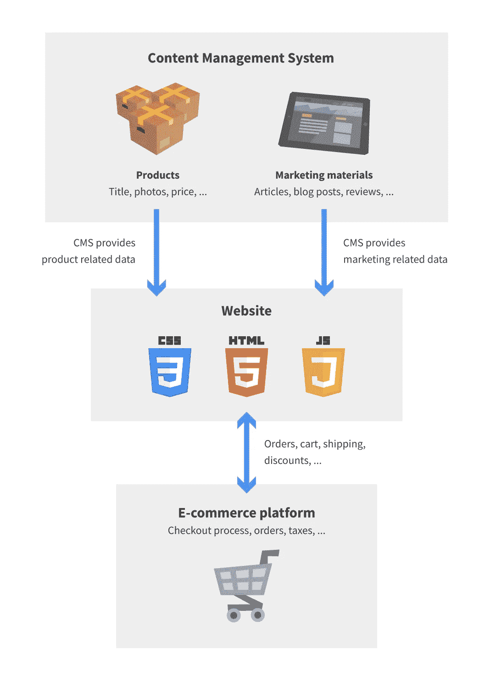
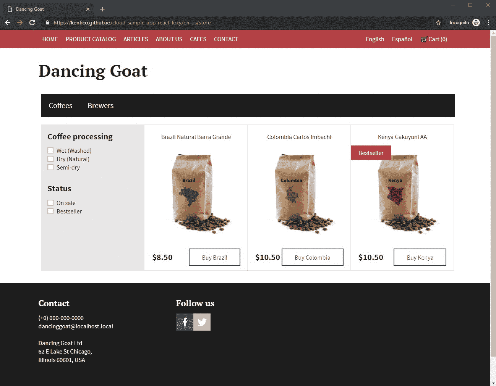
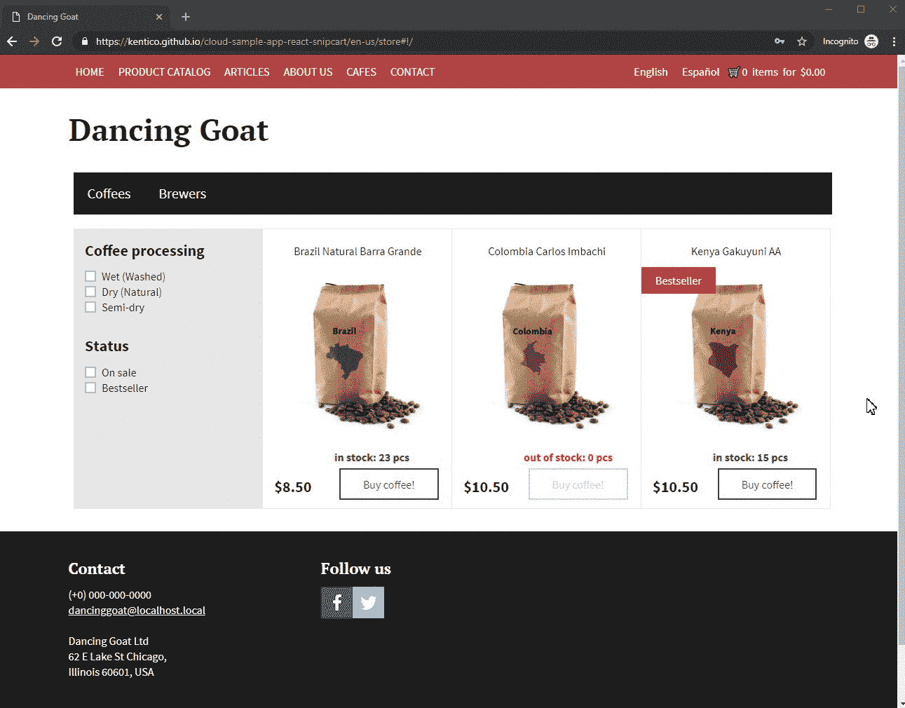
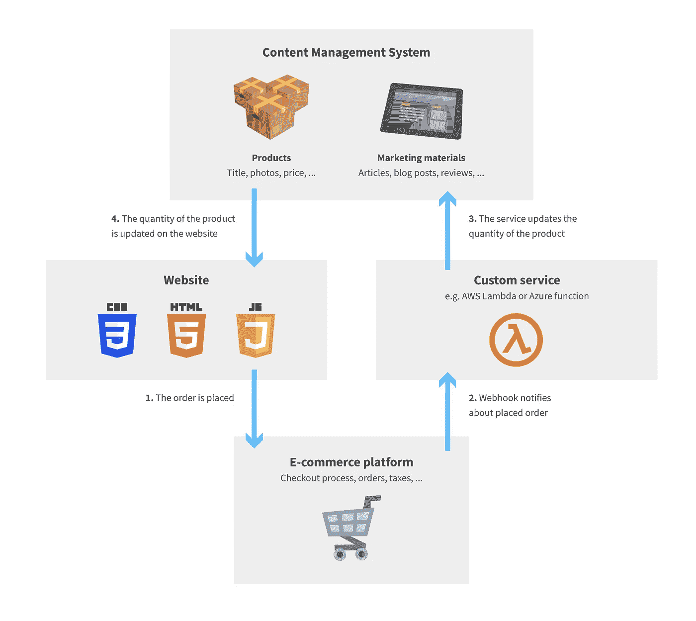
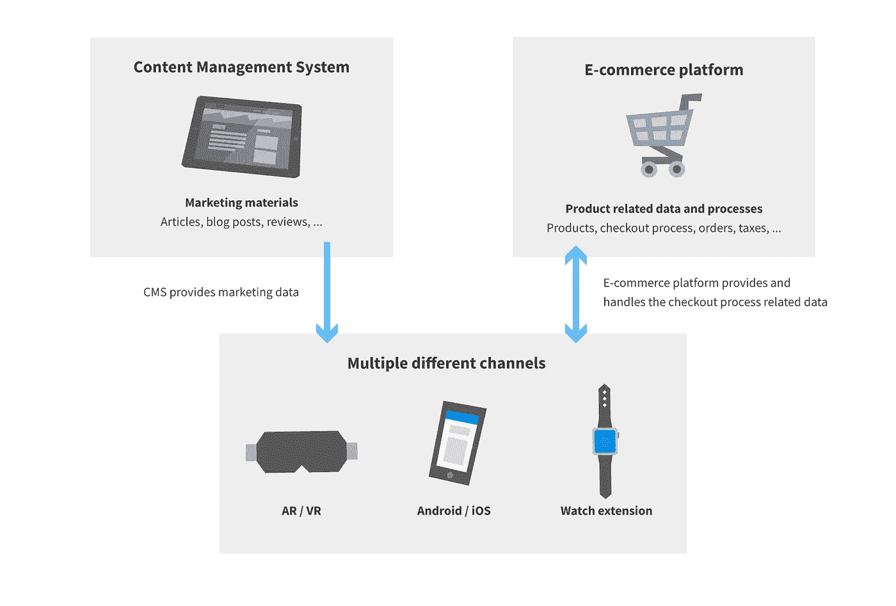
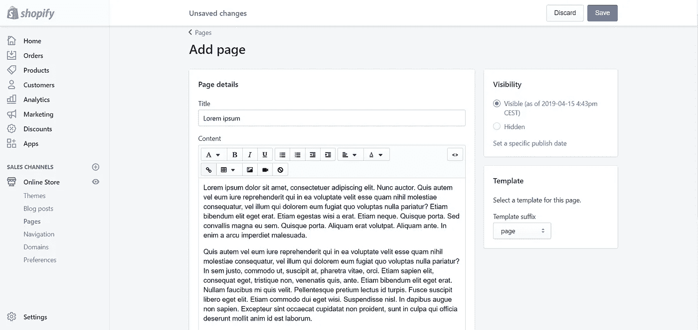
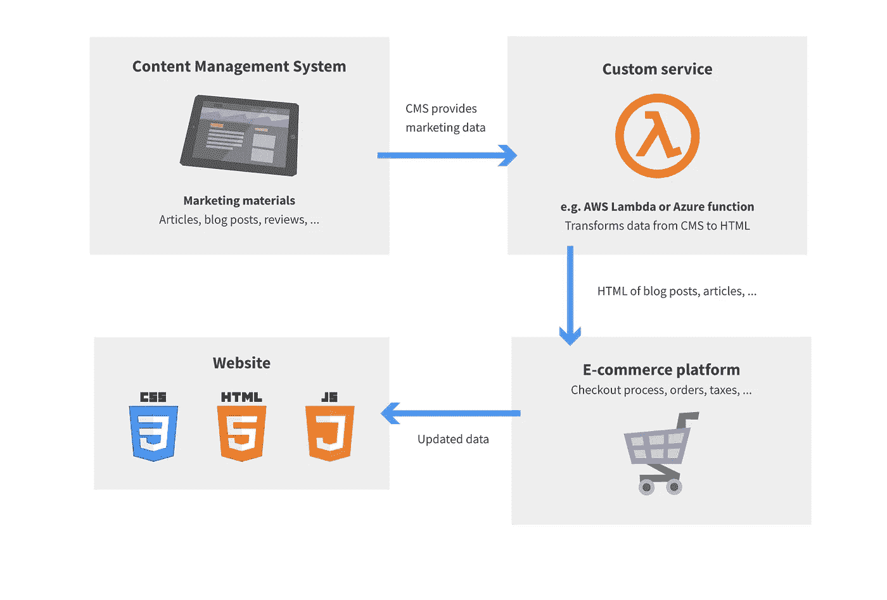
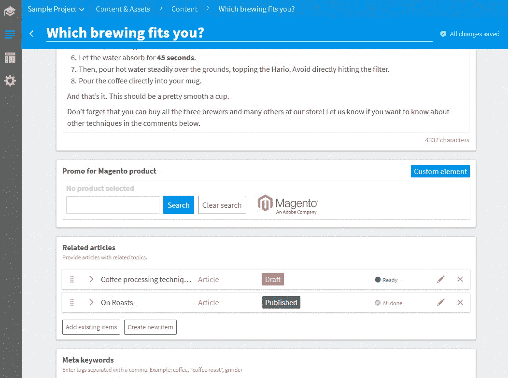

# 在无头世界中释放电子商务的力量

> 原文：<https://itnext.io/unlock-the-power-of-e-commerce-in-a-headless-world-d77f4e85e5f0?source=collection_archive---------1----------------------->

当必须做出关于电子商务平台和内容管理系统(CMS)的关键决策时，实施新的电子商务项目或升级现有项目无疑是一个具有挑战性的过程。这些判断不仅会影响项目的未来，还可能决定整个业务的成败。让我们向您展示一些集成、运行示例以及将电子商务平台与 CMSs 相结合的源代码，但首先要做的是…

无头世界中的电子商务。

电子商务能力是许多网站的重要组成部分。在过去(单一的)日子里，我们有一个内容管理系统(内置电子商务平台)统治着整个网站，然而，时代在变化。我们正在从整体系统向微服务转变，这种转变结出了果实。

有了微服务，扩展或替换系统的一部分，或者避免应用程序中复杂、神奇的逻辑变得容易得多。此外，[无头内容管理系统](https://hackernoon.com/how-to-choose-the-right-technology-for-your-next-cms-project-c9aaaf7303ba)可能是下一代内容管理解决方案。它们非常适合微服务架构。另一方面，一些集成场景仍然具有挑战性。话虽如此，在这些松散耦合的系统中有许多实现电子商务功能的方法，人们可能会对这些术语(如[、JAMstack](https://jamstack.org/examples/) 、[静态站点生成器](https://www.staticgen.com/)和周围的微服务)的工作原理感到困惑。

当然，您仍然可以构建自己的定制电子商务服务，只是不要忘记一些零碎的东西，如多种语言、各种货币、产品类别、客户管理、折扣、订单、支付网关、税务管理、运输、发票、优惠券、邮件服务器、结账流程、购物车…

来源:[https://code burst . io/your-7-mins-away-swift-4-e42e 003 d6f 69](https://codeburst.io/youre-7-mins-away-from-swift-4-e42e003d6f69)

…，以及安全性。

来源:[https://tenor.com/view/tracy-morgan-no-way-gif-13427835](https://tenor.com/view/tracy-morgan-no-way-gif-13427835)

考虑到这一点，这听起来不是很简单，利用一些开箱即用的电子商务解决方案并避免重新发明轮子可能是一个好主意。将文章、博客和营销材料等网站内容与产品数据联系起来是相当具有挑战性的。尽管事实上，可能没有银弹，我们可以找到几种方法如何将网站的常规内容与产品数据和电子商务功能相结合。

# CMS 中的产品数据

听起来可能很奇怪，在内容管理系统中管理产品数据并不是一个坏主意。这个场景非常简单——您的内容、文章和营销数据由您的内容管理系统处理，尽管订单、运输数据、折扣和所有与结账流程相关的数据都由电子商务平台处理。而商品呢？在内容管理系统中也是如此！

CMS 中的产品数据，电子商务平台处理结账流程和相关任务。

即使这个集成一点也不复杂，我也不想用实现细节来烦你，尤其是当它们可以在 GitHub 上找到的时候( [Snipcart](https://github.com/Kentico/cloud-sample-app-react-snipcart/commit/0d17b998fda7193533748afe42b53187686c3595) 和[福克西](https://github.com/Kentico/cloud-sample-app-react-foxy/commit/629971361f7ac3215802c0d4bf283e7432415113))。你可能更感兴趣的是工作样本站点，一个[使用福克西](https://kentico.github.io/cloud-sample-app-react-foxy/en-us/store)，另一个[使用 Snipcart](https://kentico.github.io/cloud-sample-app-react-snipcart/en-us/store) 。

人们可以顺利地完成结帐过程，并尝试所提供的电子商店的功能。必须指出的是，为了简单起见，在给出的例子中没有处理安全性，价格可能是伪造的。遵循电子商务平台提供的安全实践确实是个好主意(针对[福克西](https://wiki.foxycart.com/v/2.0/hmac_validation?s[]=hash)和 [Snipcart](https://docs.snipcart.com/getting-started/security) )。最后但并非最不重要的一点是——这种方法也适用于静态站点生成器，如 [Gatsby](http://gatsbyjs.org) 。如果你想知道它是如何在引擎盖下工作的，我会向你推荐 Snipcart 的《了不起的盖茨比》电子商务教程。

使用福克西和 Snipcart 购买产品。

## 在 Headless CMS 和电子商务之间同步产品数据

人们可能还想知道是否有可能在内容管理系统和电子商务平台之间同步数据—例如，CMS 中的产品数量。在 webhooks 和编写 API 的帮助下，这是一个非常合理的场景。下订单后，电子商务平台会向您的服务发送一个 webhook 请求，并直接在您的 CMS 中更新产品数量。简单吧？

下订单时更新产品的数量。

# 小部件提供的电子商务功能

如果您想在现有网站中添加电子商务功能，有时将当前内容和产品数据分开是个好主意。如果你仅仅通过在你当前的网站上添加小部件或代码片段就能实现，那就太棒了，不是吗？一个名为 [Ecwid](https://www.ecwid.com/) 的电子商务平台就有这样的功能。你只需要创建产品目录，在他们的网站上填写所有关于支付和订单的必要数据，并呈现小部件。这种方法展示了关注点的明确分离——您的营销数据在 CMS 中管理，而商品、订单以及所有与电子商店相关的必要数据和流程都由电子商务平台处理。渴望看到它的行动？试着从[的电子商店](https://kentico.github.io/cloud-sample-app-react-ecwid/en-us/store/brewers)或者[浏览代码](https://github.com/Kentico/cloud-sample-app-react-ecwid/commit/402095050e2bbbfa7054a0a7ba89de8f566d5b9a)为你最喜欢的咖啡买一些酿造器。

使用 Ecwid 的解决方案购买产品。

这种整合的另一个很好的例子是盖茨比的[商品商店](https://store.gatsbyjs.org/)。他们的电子商店用的是 GatsbyJS 静态站点生成器和 [Shopify 的购买按钮](https://help.shopify.com/en/manual/sell-online/buy-button/create-buy-button)。他们有数不清的[源插件](https://www.gatsbyjs.org/plugins)，所以你可以选择你最喜欢的[CMS](https://github.com/Kentico/gatsby-source-kentico-cloud)或符合你要求的数据源。我不想深究实现，然而，如果你感兴趣，你可以深入研究他们的源代码，因为他们的电子商店是开源的。

# 多渠道电子商务

与前面的例子一样，关注点是分开的，内容在 CMS 中，产品数据在电子商务平台中。区别在于在客户端的网站、移动应用程序或服务器上合并这两个数据源。这种平台的一个很好的例子就是商业工具。该平台为各种平台提供全面的[API](https://docs.commercetools.com/http-api.html)和[SDK](https://docs.commercetools.com/software-development-kits.html)。结合商业工具和 CMS 的 SDK 只是一个开发者的普通日常工作。如何将商业工具的功能与你的内容相结合，这完全取决于你自己。您为定制实现所做的努力以及与新的 SDK 和 API 的斗争有什么好处呢？除了聊天机器人、[手表扩展](https://github.com/commercetools/commercetools-sunrise-ios/tree/master/Sunrise%20Watch%20Extension)或增强现实等众多有趣的东西之外，在你的网站上定制最终行为，或者可能是一个[移动应用](https://github.com/commercetools/commercetools-sunrise-ios)！

多个不同渠道的电子商务数据。

# 强大的电子商务平台，但内容制作能力并不强大

有时你需要一个功能强大的电子商务平台。这不是什么秘密 [Shopify](https://www.shopify.co.uk/) 是电子商务市场的领导者之一。Shopify 的绝大多数功能都很优秀。几乎每件事都是非凡的，但你的博客文章或页面的内容制作和内容创作却落后了。为了说明我的意思，让我们看看在 Shopify 中创建一篇文章的过程——填写标题和内容，这是通过 WYSIWYG/HTML 编辑器和？

在 Shopify 中创建文章。

缺少高级工作流、版本比较或建议模式使它不适合任何严肃的内容管理。在您最喜欢的内容管理系统中制作营销内容可能会更方便，因为它缺少所有成熟的功能。这个谜题只缺一个部分——如何连接这两个世界？解决方案没有看起来那么复杂。一旦文章被创建并发布在你选择的内容管理系统中，webhook 就会通知一个定制服务——这可能是一个简单的 [Azure 函数](https://azure.microsoft.com/en-us/services/functions/)或亚马逊的 [AWS Lambda](https://aws.amazon.com/lambda/features/) 。定制服务获取页面内容并构建文章的 HTML。Shopify 有一个非常简洁的 [API](https://help.shopify.com/en/api/reference/online-store/page) (不仅仅是)用于管理页面。用你最喜欢的编程语言通过 API 推送这篇新文章只是小菜一碟。

电子商务平台中的营销内容由 CMS 管理。

# 电子商务功能直接集成到您的 CMS 中

想象一下，你有一个由 Magento 驱动的电子商店。此外，您希望通过营销材料来支持您的产品，例如由 CMS 中的编辑和营销人员管理的文章或博客帖子。在 CMS 中将产品直接绑定到营销活动听起来很自然，不是吗？如果您的 CMS 足够通用，一个熟练的开发人员会在几个小时内将绑定集成直接集成到您的 CMS 中。不信？查看[本教程](https://docs.kenticocloud.com/tutorials/develop-apps/integrate/integrating-with-e-commerce-magento)中的代码和图片，引导您创建这样一个集成。

Magento 产品选择器集成到 CMS 中。

我希望这篇文章对您有价值，并澄清了无头世界中的一些电子商务概念。我错过了什么重要的东西吗？有没有什么未提及的电商平台的经验？请在下面的评论中告诉我，或者直接联系 martinm@kentico.com。

*免责声明:文章作者在 Kentico 工作，与任何提及的电子商务平台或 GatsbyJS 无关。*