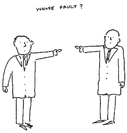
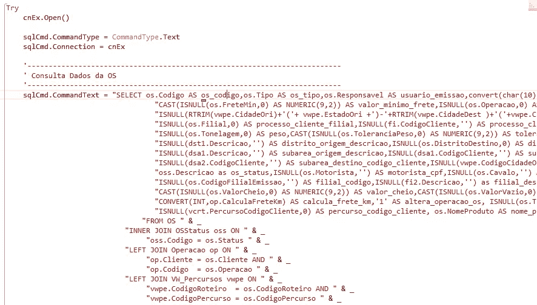
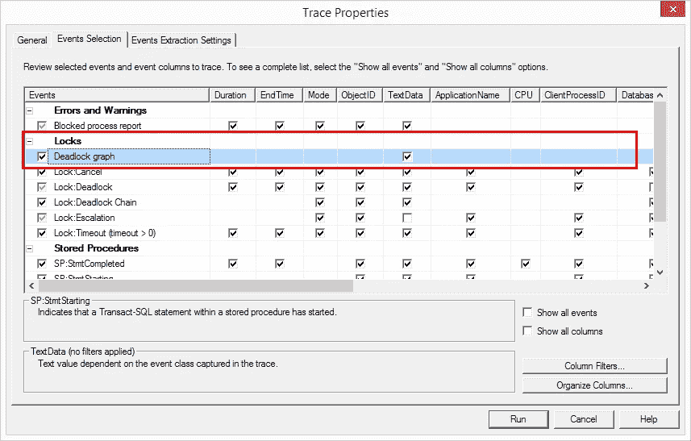
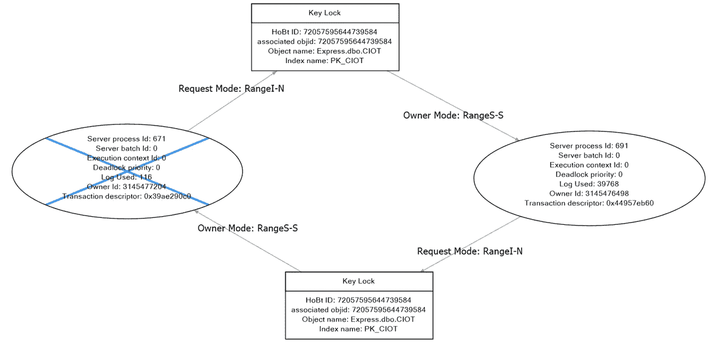
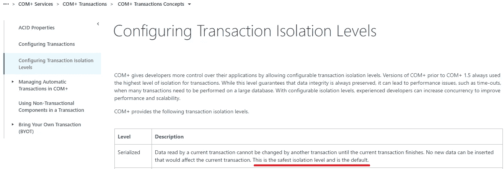

# 解开 SQL 死锁—咨询

> 原文：<https://itnext.io/untangling-sql-deadlocks-consultancy-db5c83de5a7e?source=collection_archive---------4----------------------->

来自 [Reddit](https://www.reddit.com/r/pics/comments/6qulze/traffic_deadlock/) 的交通僵局图片

# 简报会

客户是一家大型运输公司，该咨询公司的目标是解决 SQL Server 2008 上的间歇性死锁，当这些死锁发生在交易中时，将会损失金钱、公司形象和员工时间。

操作这个数据库的应用程序被编写成以 COM+运行的 Vb.net。是的，COM+，我也不知道这是什么，这是一种将应用程序作为软件组件运行的技术，由微软于 1993 年推出。[维基百科](https://en.wikipedia.org/wiki/Component_Object_Model)

这家公司位于离巴西圣保罗很近的一个城市，所以我一大早就坐车去了那里。我在公司的第一天，我的死锁知识非常基础，我知道什么是概念，但是我不知道数据库引擎锁定的细节。

# 初步调查

我首先询问开发人员他们认为死锁的原因是什么，我得到的答案是:“这是数据库故障”，您可以猜到 DBA 的答案很简单:“这是应用程序故障”。

两个男人互相指着对方— [来源](https://rabblerouserruminations.wordpress.com/2016/10/24/%F0%9F%91%89-finger-pointing-phonies-%F0%9F%91%88-open-thread/)

DBA 向我展示了发生死锁时的现有 SQL Profiler 会话，有正常的查询，但没有任何关于死锁发生原因的明显信息。

我的第一轮调查只是简单地看了一下代码。从中我发现了一些非常糟糕的做法，它们会浪费应用程序内存、网络使用，并且可维护性很低:

带有不良字符串连接的 VB.net 内联 SQL 查询

但尽管如此，我还是离死锁更近了一步，所以我回家后在回家的公交车上看了一堂关于死锁的课程。这给了我解决这个问题所需的所有工具，因为它教会了我 SQL 使用的[类型的锁、它们的粒度，尤其是如何使用 SQL Profiler(**Deadlock graph event)捕获死锁的可视化表示。**](https://technet.microsoft.com/en-us/library/ms175519(v=sql.105).aspx)

SQL 事件探查器死锁图形事件

SQL Profiler 给我的几乎所有死锁的图表如下所示:

非常好的代表性不是吗？它不仅能告诉你谁阻塞了什么，还能给出发生冲突的锁的类型。诊断中奇怪的是这个“请求模式:范围-S”，这意味着一个键范围共享锁。为什么我们会有这样的锁？

以下是关于 Key-range 的 [MSDN 文档](https://docs.microsoft.com/en-us/sql/relational-databases/sql-server-transaction-locking-and-row-versioning-guide?view=sql-server-ver15#Lock_Engine):

> 使用**可序列化事务隔离级别**时，保护查询读取的行的范围。确保在可序列化事务的查询再次运行时，其他事务无法插入符合该查询的行。

如果您不知道事务[隔离级别](https://docs.microsoft.com/en-us/sql/relational-databases/sql-server-transaction-locking-and-row-versioning-guide?view=sql-server-ver15#Lock_Basics)定义了什么:

> 事务指定一个隔离级别，该级别定义了一个事务必须与其他事务所做的资源或数据修改隔离的程度。隔离级别是根据允许哪些并发副作用(如脏读或幻像读)来描述的。

记住，我们在死锁图上得到的锁来自一个**可串行化事务级别**，这是定义:

*   **可串行化** —事务彼此完全隔离的最高级别。SQL Server 数据库引擎保留对选定数据获取的读写锁，以便在事务结束时释放。当 SELECT 操作使用范围内的 WHERE 子句时，会获得范围锁，特别是为了避免幻像读取。

在同一个 MSDN 链接上，您可以看到其他类型的事务处理级别:

*   **Read uncommitted** —最低的隔离级别，其中事务被隔离，仅足以确保物理损坏的数据不被读取。在这个级别中，允许脏读，因此一个事务可能会看到其他事务所做的尚未提交的更改。
*   **Read committed(默认)** —允许一个事务读取另一个事务先前读取(未修改)的数据，而无需等待第一个事务完成。SQL Server 数据库引擎保持写锁(对所选数据获取的锁)直到事务结束，但是读锁会在执行 SELECT 操作后立即释放。
*   **可重复读取**—SQL Server 数据库引擎保持对所选数据获取的读写锁，直到事务结束。但是，因为范围锁不受管理，所以可能会发生幻像读取。

好吧，还是很奇怪，为什么事务使用最严格的事务隔离级别？我向数据库管理员展示了我的发现，他们仍然指责应用程序。我问了开发人员，他们归咎于数据库。

因此，我们检查了数据库中的默认隔离级别，它是“ReadCommited”，这是正确的。所以我的范围是为什么有些事务是可序列化的？

我灵光一现，记起我们使用的是 COM+，于是我谷歌了一下“COM+默认事务隔离级别”，然后[得到了这个](https://msdn.microsoft.com/en-us/library/windows/desktop/ms685131(v=vs.85).aspx):

MSDN 文档— COM+将默认隔离级别设置为 Serializable

所以这只是 COM+的默认隔离级别。迁移到不同于默认隔离级别的隔离级别可以阻止死锁的发生，因为现在锁没有那么严格了。

## 结论

希望在这里您可以第一次接触到事务级的一些内部知识，锁定 SQL Server，以及如何在需要时捕获死锁事件。

有时，问题会跨越不同角色的边界，在这种情况下是在 DBA 和开发人员之间。我相信一种更加合作的态度可以帮助你跨越界限，为你的公司解决问题。