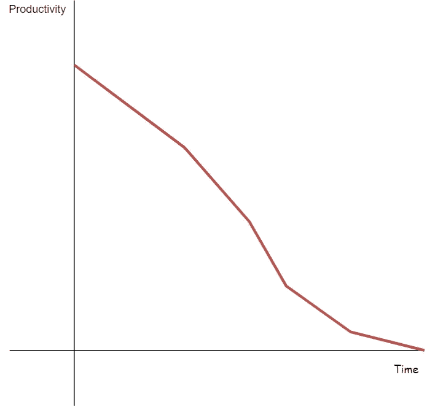
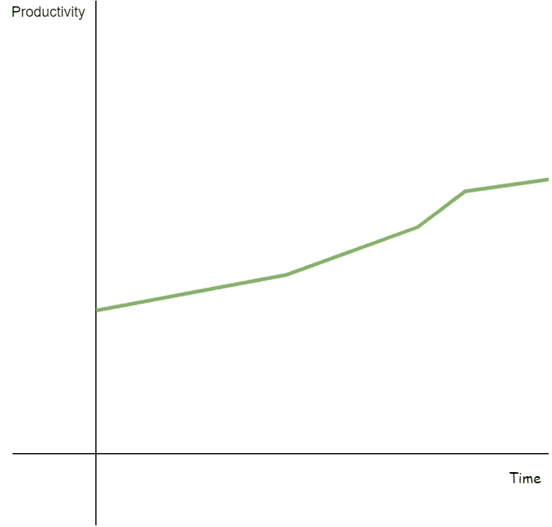

# 软件开发的基础知识

> 原文：<https://itnext.io/untaught-foundations-for-software-development-560a5e332c8e?source=collection_archive---------7----------------------->

拉格斯技术人员在 [Unsplash](https://unsplash.com/s/photos/software-developer?utm_source=unsplash&utm_medium=referral&utm_content=creditCopyText) 上拍摄的照片

当人们开始他们的编程生涯时，软件开发原则，如编程逻辑、语法和数据库建模，会在课程中教授。然而，其他原则不是，如果它们成为主流，它们可以提高我们整个职业的生产力和幸福感。

# 我们在 BAU 被淹没了吗？

你见过生产中总是有错误的团队吗？任何新特性都会导致意想不到的行为/错误，有时甚至是在不相关的代码部分？处于那种情况是很痛苦的，它会导致压力和倦怠。

团队如何进入这种情况？随着时间的推移，他们的工作效率通常是这样的:

生产率图表，短期高生产率随时间下降

在项目开始时，一切都是全新的开发，所以生产软件很快。在开发新特性时，几乎不需要对系统的其他部分进行回归测试。

代码开始变得越来越大和复杂，因为它根据业务变化从原始需求进行了大量修改。函数以我们意想不到的方式被重用，代码的可读性/可重用性从来不是优先考虑的。

然后关键的开发人员离开了项目，失去了事情应该如何工作的知识。随着软件的增长，他们没有自动测试整个系统的方法。当新开发人员挑选代码时，他们对重构没有信心。但是谁会积极地重构一个没有测试的混乱系统呢？你要么勇敢要么疯狂，也许两者兼而有之。

随着它成为巨大的意大利面条怪物，在不破坏任何东西的情况下添加新功能就成了一件神奇的事情。最终，生产率下降是由于他们不断增加的技术债务的复利。

生产力激增，然后生产力下降，这不是你想要的团队生产力图表的样子。你想要反过来:

# 如何让你的团队在长期而非短期内富有成效？

这正是你希望你的团队拥有的心态。因此，我们将在项目开始时放慢速度，不要急于推出特性。相反，我们会把时间投入到那些能为我们节省时间和理智的事情上。

例如:

*   自动化测试套件
*   连续输送管道
*   项目结构
*   编码标准
*   编写高质量的固体粘附代码。

> 如果你在一家初创公司，你需要平衡这一点，因为大多数时候初创公司只是原型。

**测试覆盖率**

最重要的事情之一是测试覆盖率。不是以%度量，而是自动化测试挑选了多少功能。如果你有一个安全网，你可以放心地重构。如果你能重构，你就能改善项目的结构和可读性，同时大大减少错误的数量。

这就是我如何在我的团队中应用测试驱动方法的 T2。

**可读性**

照片由[克里斯蒂娜@ wocintechchat.com](https://unsplash.com/@wocintechchat?utm_source=unsplash&utm_medium=referral&utm_content=creditCopyText)在 [Unsplash](https://unsplash.com/s/photos/software-developer?utm_source=unsplash&utm_medium=referral&utm_content=creditCopyText) 上拍摄

作为一名开发人员，你花多少时间读代码，花多少时间写代码？50%阅读，50%写作？不，更像是 80%的阅读和 20%的写作，研究甚至表明 90%的阅读和 10%的写作。

90%的时间你都在阅读代码。因此，确保您的代码是可理解的是一个关键的优先事项。有效的代码很容易编写。其他人能够理解的代码是一个更大的挑战。

[一个难以阅读的代码如何变得可读和可安全扩展的例子。](/tdd-lesson-5-extending-legacy-code-b0c507ee989e)

其他健全的原则提高可读性和可重用性，如固体，亲吻和代码气味。对于这个领域，开发者可以研究大量的内容，但是这里的原则是:

> **你和你的团队将主要阅读代码，所以要确保代码不仅有效，而且可以理解。**

# 你在软件开发方面的优先考虑是什么？

虽然这个问题很模糊，但我想把它归纳为三个选项:可维护性、性能和安全性。你认为这些问题的优先顺序应该是什么？

优先事项应该是:

1.  安全是第一位的，因为系统需要安全。我们目前处理财务、个人甚至医疗数据。一个简单的漏洞可能会导致企业破产。
2.  **性能**排在安全之后。例如，我们不应该禁用身份验证，因为我们希望系统更快。
3.  可维护性是指一个系统维护起来有多容易，你能多快地添加特性。我会避免为终端用户开发速度较慢的软件，只是为了让自己编写的代码更少。

这些优先事项并不是绝对的规则。在大多数情况下，它们给你的决定提供了一个很好的基础。但有时，代价太高了，例如，纳秒优化。

为了便于讨论，让我们假设三元运算符比 if-else 模型快 0.0005ms。那么，从现在开始，您应该总是使用三元运算符吗？

两个函数——If/else 模型与三元函数

不。对于需要几十或几百毫秒执行的页面或端点，我们不想牺牲几纳秒的可读性。我们必须同时考虑性能和可靠性。

你必须明智，在 80% 20%的基础上优化代码。

> 就像生活中的一切一样，你必须保持平衡。

# 包扎

这里教授的原则为制定技术决策以及团队如何随时间发展提供了一个小框架。请记住，没有错误或正确的解决方案，只有取舍。

概括一下:

*   为了您的健康，您不希望淹没在生产 bug 中。相反，投资那些不会让技术债务失控的东西——比如自动化测试、构建管道和高质量代码。
*   请记住，作为一名开发人员，您不是一双 90%时间都在打字的手。你会花 90%的时间去阅读，找到在哪里以及如何添加你的功能。
*   基本优先级，安全性>性能>可维护性

新年快乐！