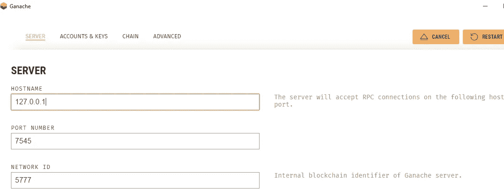
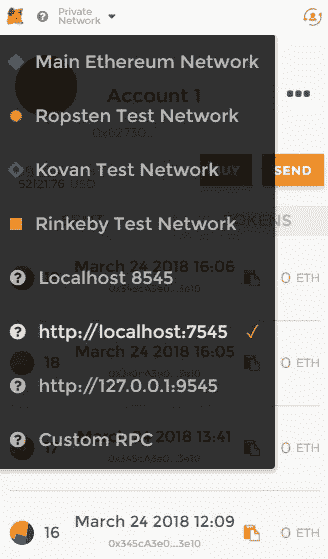
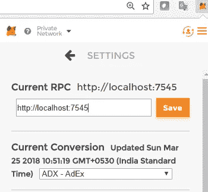
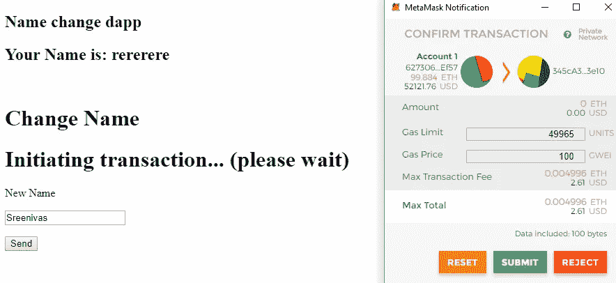
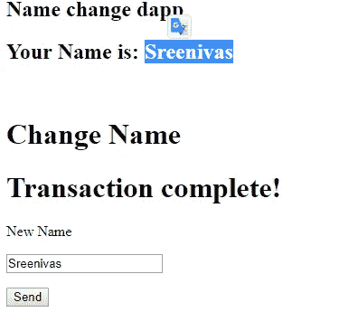

# 如何做以太坊去中心化应用

> 原文：<https://itnext.io/untitled-document-md-ecaac75e2bf?source=collection_archive---------4----------------------->


> [*点击这里在 LinkedIn 上分享这篇文章*](/untitled-document-md-ecaac75e2bf?utm_source=medium_sharelink&utm_medium=social&utm_campaign=buffer)

以太坊分散式应用程序是与以太坊区块链交互的任何类型的客户端应用程序。这篇文档为你提供了如何在以太坊区块链上创建一个分布式应用程序和测试的指导

**工具和框架**

我在 windows 平台上为这个应用程序使用了以下工具和框架。

*   诺杰斯和 NPM 公司
*   [块菌](http://truffleframework.com/) —作为开发工具。
*   [Ganache](http://truffleframework.com/ganache/) —作为以太坊开发测试网络。
*   [元掩码](https://chrome.google.com/webstore/detail/metamask/nkbihfbeogaeaoehlefnkodbefgpgknn) —作为 Web3 Api 注入器
*   angular-cli —作为 web 客户端应用程序的框架。

这些步骤是

*   下载并安装 Ganache
*   安装松露
*   创建 truffle 项目结构
*   创建智能合同
*   编译和部署智能合同
*   创建角度 5 应用程序
*   通过智能合同方法调用与区块链交互

1.安装 Ganache

基于您的操作系统下载并安装 ganache。ganache 提供 GUI 和 CLI 模式。现在让我们使用 GUI one。

[](http://truffleframework.com/ganache/) [## 加纳切|松露套房

### 你的以太坊瑞士军刀

truffleframework.com](http://truffleframework.com/ganache/) 

如果安装后打开 ganache，可以看到 10 个假以太坊账号，每个账号余额 100 以太。

2.松露项目

使用`npm install -g truffle`安装块菌

创建一个目录‘ethereumdapp’`mkdir ethereumdapp`

使用`truffle init`创建松露项目。

`D:\blockchain\ethereum>npm install -g truffle
D:\blockchain\ethereum>mkdir ethereumdapp
D:\blockchain\ethereum>cd ethereumdapp
D:\blockchain\ethereum\ethereumdapp>truffle init
Downloading...
Unpacking...
Setting up...
Unbox successful. Sweet!
Commands:
Compile: truffle compile
Migrate: truffle migrate
Test contracts: truffle test
D:\blockchain\ethereum\ethereumdapp>dir
03/24/2018 05:15 PM <DIR> .
03/24/2018 05:15 PM <DIR> ..
03/24/2018 05:15 PM <DIR> contracts
03/24/2018 05:15 PM <DIR> migrations
03/24/2018 05:15 PM <DIR> test
03/24/2018 05:15 PM 135 truffle-config.js
03/24/2018 05:15 PM 135 truffle.js
2 File(s) 270 bytes
5 Dir(s) 222,028,505,088 bytes free`

3.创建简单的智能合同

现在，我们将创建智能合同文件。我们使用 solidity 作为合同编程语言版本 0.4.19。该契约的目的是在区块链中启动一个名为“name”的状态变量，并通过从 dapp 调用我们的智能契约方法来操纵该变量的值。用户更改名称变量值，并在页面上显示更改。

合同名称为“名称变更”

视图名称方法是“showName()

更改名称的方法是 Change name(字符串)

让我们在项目文件夹(ethereumdapp)中的“contracts”文件夹下创建“NameChange.sol”文件。将此内容添加到 NameChange.sol 中

```
pragma solidity ^0.4.19;

contract NameChange{
	string name;
	function NameChange(string initialname) public {
		name = initialname;
	}
	function showName() public constant returns(string) {
		return name;
	}	
	function changename(string newname)public { 
		name = newname;
    }
}
```

4.编制合同

使用“truffle compile”来编译合同

```
D:\blockchain\ethereum\ethereumdapp>truffle compile
Compiling .\contracts\Migrations.sol...
Compiling .\contracts\NameChange.sol...
Writing artifacts to .\build\contracts
```

它在/build 文件夹中创建了一个 NameChange.json，这个文件包含契约的 ABI 细节，意味着应用程序二进制接口。应用程序二进制接口(ABI)是以太坊中使用的一种数据编码方案，用于智能合约。这可以在该过程的后期使用。

5.部署合同

到目前为止，我们已经创建了智能合同和编制。现在是把合同部署到区块链的时候了，这是加纳切，是对区块链的考验。为此，我们需要用 ganache 设置中提供的区块链地址和端口号来配置这个项目。



我们可以在项目文件夹中提供这些信息 truffle.js 或 truffle-config.js。

```
module.exports = {
  networks: {
    development: {
      host: '127.0.0.1',
      port: 7545,
      network_id: '*' // Match any network id
    }
  }};
```

上面的配置告诉这个 deploy 命令将契约部署到 ganache。要部署，请使用“truffle migrate”命令来迁移/部署合同。我们需要告诉如何为契约创建实例，并向契约构造函数发送初始参数(如果需要的话)。为此，我们需要在项目的 migrations 文件夹中创建 2_deploy_namechange.js

```
var NameChange = artifacts.require("./NameChange.sol");
module.exports = function(deployer) {
  deployer.deploy(NameChange,"initial name from chain");
};
```

一切准备就绪，部署合同。

```
D:\blockchain\ethereum\ethereumdapp> truffle migrate
Using network 'development'.
Running migration: 1_initial_migration.js
  Replacing Migrations...
  ... 0xd0b495e94047c454c62eaa31533491d559de11c84914b5d4a9ce0f7b5703ef57
  Migrations: 0x8cdaf0cd259887258bc13a92c0a6da92698644c0
Saving successful migration to network...
  ... 0xd7bc86d31bee32fa3988f1c1eabce403a1b5d570340a3a9cdba53a472ee8c956
Saving artifacts...
Running migration: 2_deploy_namechange.js
  Replacing NameChange...
  ... 0x4dcf9df45f91b76d204eb86f3e839d9257c7b15008fc5efb6b14abbe0bbdfdf2
  NameChange: 0x345ca3e014aaf5dca488057592ee47305d9b3e10
Saving successful migration to network...
  ... 0xf36163615f41ef7ed8f4a8f192149a0bf633fe1a2398ce001bf44c43dc7bdda0
Saving artifacts...
```

在这个阶段，契约被部署到 ganache 并生成一个契约地址。

这可以在 ganache 交易清单中确认

6.Dapp

这是 angular 5 应用程序，我们为用户提供用户界面，以便与区块链 t 进行交互。我们使用 **angular-cli** 命令来创建/运行应用程序。

将目录改回上一级并执行“ng new ethereumdapp”

```
D:\blockchain\ethereum\ethereumdapp>cd..
D:\blockchain\ethereum>ng new ethereumdapp
```

让我们添加用于在页面上查看区块链州变量值的 UI，以及更改该值的规定。

将以下代码添加到 src\app\app.component.html 中

```
<section class="hero is-medium is-info is-bold">
  <div class="hero-body">
    <div class="container">
      <h1 class="title is-1">
        Name change dapp
      </h1>
      <h2 class="title">
        Your Name is: <span class="is-medium has-underline">{{name}}</span>
      </h2>
    </div>
  </div>
</section>
<br>
<div class="container">
  <h1 class="title">Change Name</h1>
  <h1 class="title is-4 is-info help">{{status}}</h1>

  <form #nameForm="ngForm">
    <div class="field">
      <label class="label">New Name</label>
      <p class="control">
        <input
          [(ngModel)]="NewName"
          class="input"
          type="text"
          placeholder="New Name"
          name="NewName"
          required
          #nameChangeModel="ngModel">
      </p>
      <div *ngIf="nameChangeModel.errors && (nameChangeModel.dirty || nameChangeModel.touched)"
           class="help is-danger">
          <p [hidden]="!nameChangeModel.errors.required">
            This field is required
          </p>
      </div>
    </div>

    <div class="field is-grouped">
      <p class="control">
        <button
          [disabled]="!nameForm.valid"
          (click)="changeName()"
          class="button is-primary">
          Send
        </button>
      </p>
    </div>
  </form>
</div>
```

src\app\app.component.ts 中的 UI 组件/控制器代码

```
import { Component, HostListener, NgZone } from '@angular/core';
const Web3 = require('web3');
const contract = require('truffle-contract');
const nameChangeArtifacts = require('../../build/contracts/NameChange.json');

declare var window: any;

@Component({
  selector: 'app-root',
  templateUrl: './app.component.html',
  styleUrls: ['./app.component.css']
})
export class AppComponent {
  name = 'Initial name from component';
  NewName : string;
  nameChange = contract(nameChangeArtifacts);

  account: any;
  accounts: any;
  web3: any;
  status: string;
  constructor(private _ngZone: NgZone) {

  }
  @HostListener('window:load')
  windowLoaded() {
    this.checkAndInstantiateWeb3();
    this.onReady();
  }

  checkAndInstantiateWeb3 = () => {
    // Checking if Web3 has been injected by the browser (Mist/MetaMask)
    if (typeof window.web3 !== 'undefined') {
      console.warn(
        'Using web3 detected from external source. If you find that your accounts don\'t appear or you have 0 MetaCoin, ensure you\'ve configured that source properly. If using MetaMask, see the following link. Feel free to delete this warning. :) http://truffleframework.com/tutorials/truffle-and-metamask'
      );
      // Use Mist/MetaMask's provider
      this.web3 = new Web3(window.web3.currentProvider);
    } else {
      console.warn(
        'No web3 detected. Falling back to http://127.0.0.1:8545\. You should remove this fallback when you deploy live, as it\'s inherently insecure. Consider switching to Metamask for development. More info here: http://truffleframework.com/tutorials/truffle-and-metamask'
      );
      // fallback - use your fallback strategy (local node / hosted node + in-dapp id mgmt / fail)
      this.web3 = new Web3(
        new Web3.providers.HttpProvider('http://127.0.0.1:7545')
      );
    }
  };

  onReady = () => {
    // Bootstrap the MetaCoin abstraction for Use.
    this.nameChange.setProvider(this.web3.currentProvider);

    // Get the initial account balance so it can be displayed.
    this.web3.eth.getAccounts((err, accs) => {
      if (err != null) {
        alert('There was an error fetching your accounts.');
        return;
      }

      if (accs.length === 0) {
        alert(
          'Couldn\'t get any accounts! Make sure your Ethereum client is configured correctly.' 
        );
        return;
      }
      console.log(accs);
      this.accounts = accs;
      this.account = this.accounts[0];

      // This is run from window:load and ZoneJS is not aware of it we
      // need to use _ngZone.run() so that the UI updates on promise resolution
      this._ngZone.run(() =>
        this.refreshName()
      );
    });
  };

  refreshName = () => {
    let nc;
    this.nameChange
      .deployed()
      .then(instance => {
        nc = instance;
        return nc.showName.call({
          from: this.account
        });
      })
      .then(value => {
        this.name = value;
      })
      .catch(e => {
        console.log(e);
        this.setStatus('Error getting name; see log.');
      });
  };

  changeName = () => {
    const nawname = this.NewName;
    let nc;

    this.setStatus('Initiating transaction... (please wait)');

    this.nameChange
      .deployed()
      .then(instance => {
        nc = instance;
        return nc.changename(nawname,{from: this.account})
      })
      .then(() => {
        this.setStatus('Transaction complete!');
        this.refreshName();
      })
      .catch(e => {
        console.log(e);
        this.setStatus('Error changing name; see log.');
      });
  };
  setStatus = message => {
    this.status = message;
  };
}
```

7.元掩码

Metamask 充当我们页面的 web3 注入器。

*   给你的 chrome 浏览器添加扩展
*   使用您的 ganache rpc url 添加自定义 RPC，这将 [http://localhost:7545](http://localhost:7545)


Ganache 设置



单击自定义 RPC



*   您可以在 metamask 帐户列表中看到您的 ganache 生成的第一个帐户
*   用户提交调用合同方法的“更改姓名自”页面。
*   元掩码要求确认，单击元掩码确认上的提交。

现在准备将应用程序更改目录到 ethereumdapp

```
D:\blockchain\ethereum>cd ethereumdapp
D:\blockchain\ethereum\ethereumdapp>ng serve -o
```

它用 [http://localhost:4200](http://localhost:4200) 打开浏览器并显示我们的页面。

在**新名字**文本框中输入名字，点击发送按钮。Metamask 确认将事务提交给区块链，然后单击“提交”。



提交后，您的页面会显示新名称



8.结论

谢谢你

从 https://github.com/cnu-online/ethereum-dapp[下载源代码](https://github.com/cnu-online/ethereum-dapp)

如需帮助，请联系

*   斯里尼瓦斯·钦尼
*   schinni.vija@gmail.com