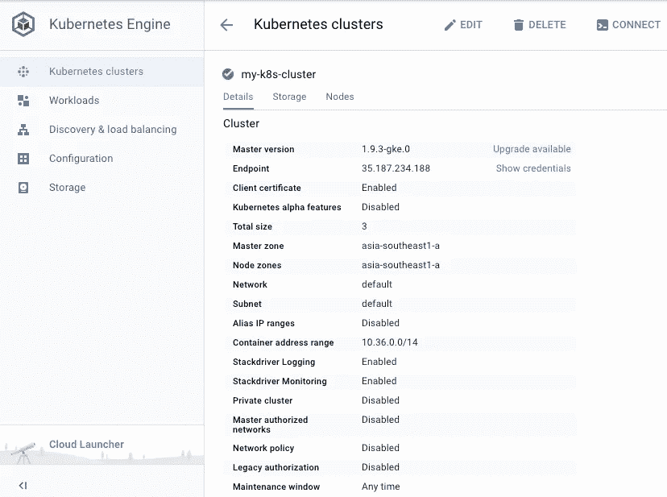
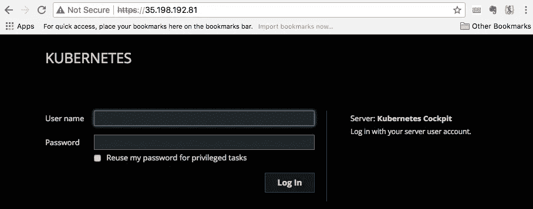
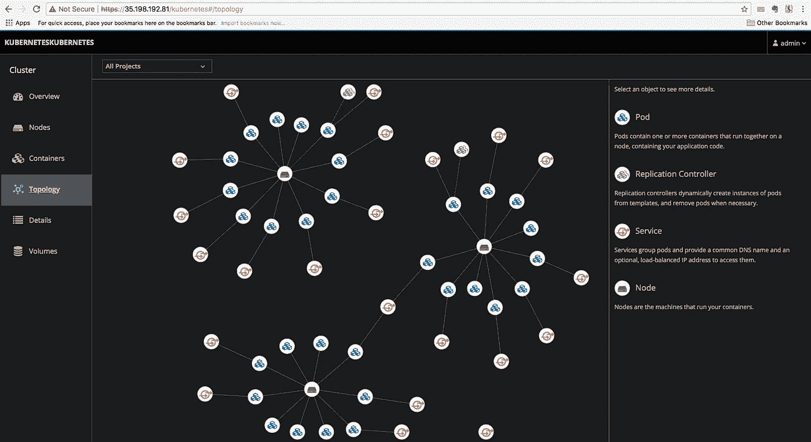

# 启动并运行:谷歌 Kubernetes 引擎驾驶舱(GKE)

> 原文：<https://itnext.io/up-and-running-cockpit-for-google-kubernetes-engine-gke-4aca68f182bf?source=collection_archive---------4----------------------->

我个人找到一个快速的方法来更好地向朋友解释 kubernetes。为 [Google Kubernetes 引擎设置](https://cloud.google.com/kubernetes-engine/)[驾驶舱](http://cockpit-project.org/)仪表盘。顾名思义，Cockpit 是一个服务器管理器，可以通过网络浏览器轻松管理我们的 GNU/Linux 服务器。驾驶舱仪表板可以作为 pod 中的容器部署在 kubernetes 上(在本例中),也可以通过普通的认证驾驶舱会话使用。Cockpit 通过其 REST API 与 Kubernetes 通信。

我们来演示一下。

**在谷歌云上建立一个 GKE 集群。**

```
$ kubectl get nodes

NAME                                            STATUS    ROLES     AGE       VERSION
gke-my-k8s-cluster-default-pool-85aa2e6c-18nn   Ready     <none>    2d        v1.9.3-gke.0
gke-my-k8s-cluster-default-pool-85aa2e6c-509w   Ready     <none>    2d        v1.9.3-gke.0
gke-my-k8s-cluster-default-pool-85aa2e6c-c95p   Ready     <none>    2d        v1.9.3-gke.0
```

**我将在我的 kubernetes 相关工作下创建一个名为“cockpit”的目录。**

```
$ pwd
/Users/sai/hellocloud/github
$ mkdir cockpit
$ cd cockpit
```

**下载驾驶舱舱单文件。**

```
$ wget https://raw.githubusercontent.com/cockpit-project/cockpit/master/containers/kubernetes-cockpit.json

--2018-04-05 14:50:24--  https://raw.githubusercontent.com/cockpit-project/cockpit/master/containers/kubernetes-cockpit.json
Resolving raw.githubusercontent.com (raw.githubusercontent.com)... 151.101.8.133
Connecting to raw.githubusercontent.com (raw.githubusercontent.com)|151.101.8.133|:443... connected.
HTTP request sent, awaiting response... 200 OK
Length: 447 [text/plain]
Saving to: 'kubernetes-cockpit.json'

kubernetes-cockpit.json                                 100%[============================================================================================================================>]     447  --.-KB/s    in 0s     

2018-04-05 14:50:25 (10.9 MB/s) - 'kubernetes-cockpit.json' saved [1628]

$ ls
kubernetes-cockpit.json
```

**创建一个名为“cockpit-demo”的名称空间，我将在其中部署 cockpit 仪表板作为 kubernetes pod。**

```
$ kubectl create namespace cockpit-demo
namespace "cockpit-demo” created
```

**在 kubernetes-cockpit.json 中将服务类型从“ClusterIP”修改为“load balancer”。**

```
$ more kubernetes-cockpit.json

{
   "kind":"List",
   "apiVersion":"v1",
   "items":[
      {
         "kind":"ReplicationController",
         "apiVersion":"v1",
         "metadata":{
            "name":"kubernetes-cockpit",
            "labels":{
               "name":"kubernetes-cockpit"
            }
         },
         "spec":{
            "replicas":1,
            "selector":{
               "name":"kubernetes-cockpit"
            },
            "template":{
               "metadata":{
                  "labels":{
                     "name":"kubernetes-cockpit"
                  }
               },
               "spec":{
                  "containers":[{
                    "name": "kubernetes-cockpit",
                    "image": "cockpit/kubernetes:latest",
                    "ports":[{
                        "containerPort":9090,
                        "protocol":"TCP"
                     }],
                    "env":[{
                        "name": "KUBE_INSECURE",
                        "value": "false"
                    }]
                  }]
               }
            }
         }
      },
      {
         "kind":"Service",
         "apiVersion":"v1",
         "metadata":{
            "name":"kubernetes-cockpit",
            "labels":{
               "name":"kubernetes-cockpit"
            }
         },
         "spec":{
             "type": "LoadBalancer",
             "ports": [{
                 "protocol": "TCP",
                 "port": 443,
                 "targetPort": 9090
             }],
            "selector":{
               "name":"kubernetes-cockpit"
            }
         }
      }
   ]
}
```

**部署驾驶舱并获取负载平衡器 IP 以访问驾驶舱仪表板。**

```
$ kubectl create -f kubernetes-cockpit.json -n cockpit-demo

replicationcontroller "kubernetes-cockpit" created
service "kubernetes-cockpit” created

$ kubectl get svc -n cockpit-demo

NAME                 TYPE           CLUSTER-IP      EXTERNAL-IP     PORT(S)         AGE
kubernetes-cockpit   LoadBalancer   10.39.244.214\.   35.198.192.81   443:31418/TCP   45s
```

**浏览驾驶舱仪表板**[**https://35.198.192.81。**T21**从 GKE 得到国书。(点击显示凭证)**](https://35.198.192.81.)



谷歌 Kubernetes 引擎



驾驶舱仪表板

**注:**

cockpit kubernetes 仪表板可以作为一个 pod 部署在 kubernetes 上，要求用户使用为访问其 API 而配置的标准身份验证进行登录。

这个 pod 可以在配置了基本身份验证的 kubernetes 上使用。默认情况下，pod 会尝试安全地访问 kubernetes API，并期望 kubernetes API 服务器已经部署了 CA、证书文件和服务帐户密钥。为了改变这种行为，编辑 kubernetes-cockpit.json 并将 KUBE _ 不安全环境变量改为 true。

**成功登录后…**



集成 GKE 的驾驶舱仪表板

恭喜你！！！驾驶舱仪表板现在作为 GKE 上的 kubernetes 吊舱运行。享受使用驾驶舱学习 Kubernetes。

请检查:

*   [驾驶舱](http://cockpit-project.org/)
*   [谷歌 Kubernetes 引擎](https://cloud.google.com/kubernetes-engine/)