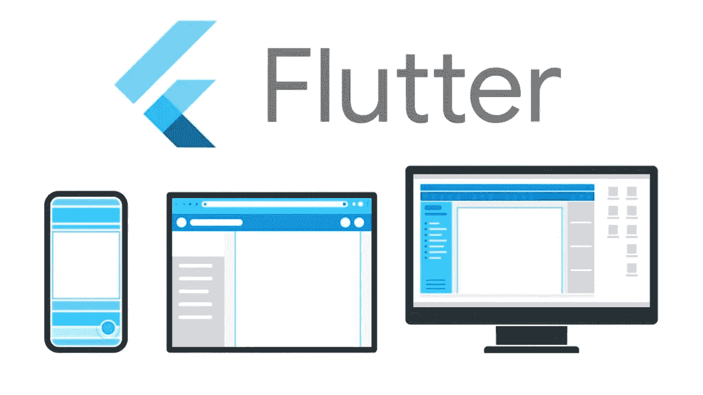
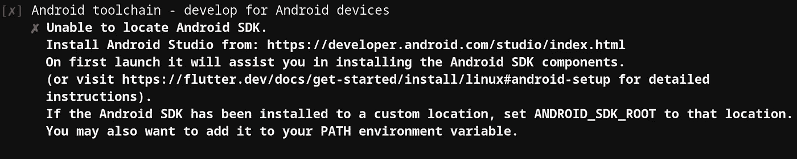
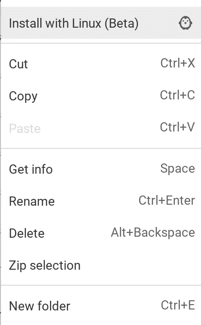
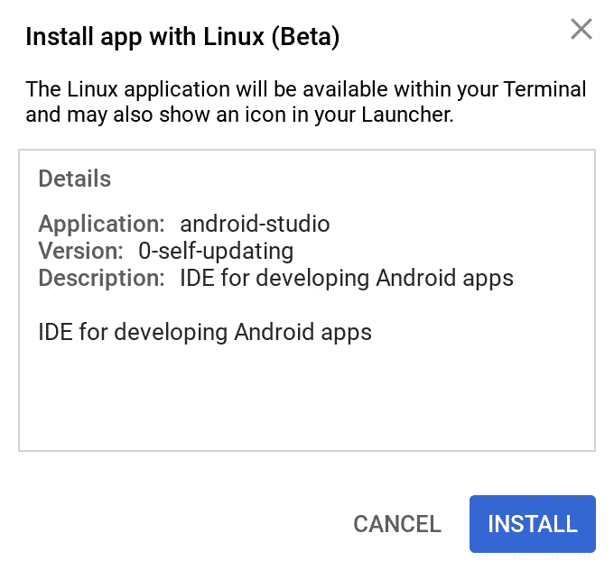
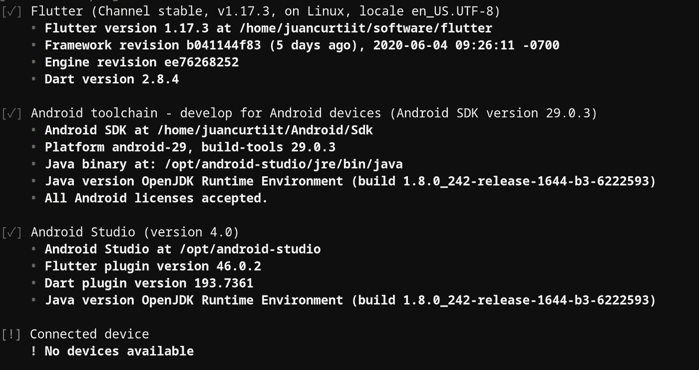

# Pixelbook [2020]上的 Flutter

> 原文：<https://itnext.io/up-and-running-with-flutter-2020-b122ae44554b?source=collection_archive---------6----------------------->



被谷歌扑住了

Flutter 已经存在了一段时间，它证明了 iOS 和 Android 应用程序可以快速高效地一起开发。我必须在 2018 年 12 月 Flutter 上线时就发现它是关于什么的。在它准备生产之前，Github 上没有太多的库和框架，也没有太多的教程，在 YouTube 上搜索“Flutter”也不太符合预期。但拥有 iOS 和 Android 原生开发的背景帮助我弥补了这些差距，并在市场上推出了几个功能齐全的应用程序。幸运的是，今天这个社区很大，所有的资源都可以在网上找到。这不是神话:用单一语言构建原生移动应用程序现在是可能的。更重要的是:还可以构建桌面和网络应用。

## 所以，让我们开始安装颤振

Flutter 适用于 Windows、macOS 和 Linux。我用的是谷歌 Pixelbook，也就是 ChromeOS+Linux。由于 Flutter 的跨平台特性，我们现在能够为这些系统构建跨平台的应用程序。为了安装 Flutter，我们应该遵循官方网站的说明([https://flutter.dev/docs/get-started/install](https://flutter.dev/docs/get-started/install))。我们将继续这里的说明，唯一的事情是，我将遵循 ChromeOS 的说明，这可能会推迟其他人的说明。

*   下载安装包以获得 Flutter SDK 的最新稳定版本。这一天最新版本是 1.17.3 ( [链接](https://storage.googleapis.com/flutter_infra/releases/stable/linux/flutter_linux_1.17.3-stable.tar.xz))。官方指南没有提到的一个步骤是，当你在 ChromeOS 上从谷歌 Chrome 下载一个文件时，默认情况下它会被下载到下载文件夹中，这个文件夹实际上与 Linux 文件系统是分开的。您需要将. tar.xz 文件从下载文件移到 Linux 文件中。请注意，该文件夹在解压缩后将作为 SDK 的路径，因此我将它保存在/software/文件夹中(这只是个人意见，提醒您不要忘记它的位置——它可能会被意外删除)。
*   我们使用 tar xf 命令提取文件

```
tar xf ~/software/flutter_linux_1.17.3-stable.tar.xz
```

*   更新 PATH 变量，不仅针对当前会话，而且是永久更新。为此，我们需要在~/的顶部添加。bashrc:

```
$ export PATH**=**"$PATH:[PATH_TO_FLUTTER_DIRECTORY]/flutter/bin"
```

*   我们使用以下命令仔细检查安装是否正确:

```
which flutter
```

此时，我们可以使用 Flutter 命令行工具。其中一个最重要的命令是“颤振博士-v”。
在我的例子中，当运行 fluter doctor 的命令时，我得到一个关于 Android 工具链的错误:



Android 工具链需要安装才能工作

对于大多数用户来说，安装 Android studio 就足以解决这个问题，即使是 ChromeOS 用户。但如果你使用的是低规格的 Chromebook，Android Studio 可以将你的电脑变成一台微波炉。幸运的是，Flutter 为我们提供了安装 Android SDK 和不安装 Android Studio 的选项。我会选择为 https://developer.android.com/studio/?authuser=1#downloads 的 ChromeOS 安装 Android Studio。

当我们的 ChromeOS 安装程序(。deb)被下载后，我们右击它并选择“用 Linux 安装”选项，然后点击“安装”:



从 Pixelbook 安装 Linux



安装完成后，我们会发现 Android Studio 安装在我们的 dock 上。首次启动时，它将开始初始设置。

当询问安装类型时，我们将选择自定义。我们安装 Android SDK，完成后程序将重新启动。

在关闭 Android Studio 之前，我们需要再安装 2 个工具。为此，我们进入底部菜单，配置>插件，然后搜索“Flutter”。点击“安装”也将安装 Dart 插件。重新启动 IDE，并关闭它。

我们打开终端，输入*颤振医生——安卓——执照。*这将接受 Android 许可，这是 Flutter Doctor 的必需步骤。

我们可以使用 Flutter doctor 命令仔细检查，看看我们是否准备好了:



颤振博士-v 的结果

颤振终于装好了！在接下来的日子里，我会上传更多的内容。我们将创建第一个 Flutter 应用程序。我们将完成架构设置，构建一个小型后端来处理请求，最后，我们将构建一个功能齐全的应用程序来上传到商店。