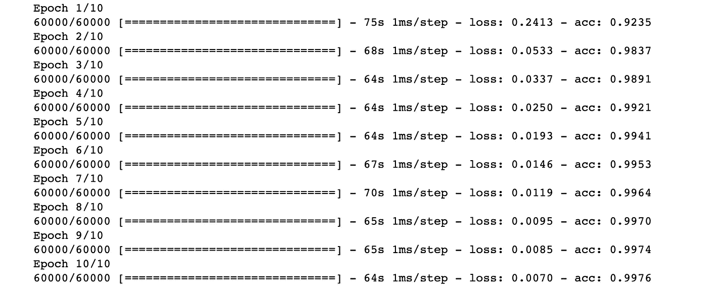
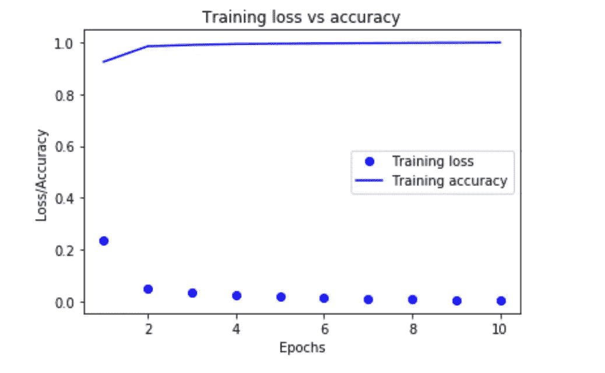

# Keras 的启动和运行:使用 CNN 的深度学习数字分类

> 原文：<https://itnext.io/up-and-running-with-keras-deep-learning-digit-classification-using-cnn-804777073e43?source=collection_archive---------3----------------------->

正如 [Keras](https://keras.io) 文档所说——“Keras 是一种高级神经网络 API，用 Python 编写，能够在 [TensorFlow](https://github.com/tensorflow/tensorflow) 、 [CNTK](https://github.com/Microsoft/cntk) 或 [Theano](https://github.com/Theano/Theano) 之上运行。”我们将使用 Tensorflow 作为后端。为此，您需要安装 Keras 和 Tensorflow 库。

有关完整的安装说明和将 Tensorflow 配置为 Keras 后端的信息，请点击此处的链接—[https://keras.io/#installation](https://keras.io/#installation)和此处—[https://www . pyimagesearch . com/2016/11/14/installing-Keras-with-tensor flow-back end/](https://www.pyimagesearch.com/2016/11/14/installing-keras-with-tensorflow-backend/)

请注意，可以使用 GPU 来训练深度学习模型，但这超出了本文的范围。感兴趣的读者可以在这里找到用 GPU 设置 Tensorflow 的说明——[https://keras.rstudio.com/reference/install_keras.html](https://keras.rstudio.com/reference/install_keras.html)

在本文中，我们将开发一个简单的 CNN(卷积神经网络),也称为 *convent* ,将大小为 28x28 像素的灰度图像中的数字 0-9 分类为 10 个类别(0 到 9)。这是一个多类分类问题，我们将尝试使用深度学习算法 CNN(卷积神经网络)来解决，准确率在 99%以上。

**加载数据集**:

首先，我们将使用下面的代码从 keras 数据集加载著名的 MNIST 数据集

> 从 keras.datasets 导入 mnist
> 
> (train_images，train_labels)，(test_images，test_labels) = mnist.load_data()

这里，数据集被加载并分成训练和测试图像以及相应的标签。MNIST 有 70，000 个数据样本，其中 60，000 个是训练数据，10，000 个是测试数据。我们可以检查数据的形状如下—

> 火车 _ 图像.形状

```
(60000, 28, 28)
```

和

> 测试 _ 图像.形状

```
(10000, 28, 28)
```

**准备模型**:

接下来，我们用下面的代码准备我们的 CNN 模型(也被称为*修道院*)

> 从 keras 导入模型
> 从 keras 导入层
> 
> **def make_classifier(优化器):**
> model = models。
> 
> ()【层层相续。Conv2D(filters=32，kernel_size=(3，3)，activation='relu '，padding='same '，input_shape=(28，28，1)))
> model.add(layers。MaxPooling2D(pool_size=(2，2))
> 
> model . add(layers。Conv2D(filters=64，kernel_size=(3，3)，activation='relu '，padding = ' same ')
> model . add(layers。MaxPooling2D(pool_size=(2，2)))
> 
> model.add(layers。Conv2D(filters=64，kernel_size=(3，3)，activation='relu '，padding = ' same ')
> model . add(layers。
> )
> (图层展平())。Dense(64，activation = ' relu ')
> model . add(图层。Dense(10，激活='softmax '))
> 
> model . compile(optimizer = ' optimizer '，
> loss = ' category _ cross entropy '，
> metrics=['accuracy'])
> 
> **返回模型**

模型/网络基本上是 Conv2D、MaxPooling2D 和密集层的堆栈。我们将在这里讨论模型配置超参数，但是解释 CNN 如何工作超出了本文的范围。对此，我建议在这里过一遍好看的文章——*卷积神经网络的直观解释(*[*https://ujjwalkarn . me/2016/08/11/Intuitive-explain-conv nets/*](https://ujjwalkarn.me/2016/08/11/intuitive-explanation-convnets/)*)*

这里，修道院的输入形状是——(图像 _ 高度，图像 _ 宽度，图像 _ 通道)。在我们的例子中，因为图像是灰度的，所以 image _ channels = 1(0 到 255 之间的值)。我们将用输入形状(28，28，1)训练网络。我们已经在 Covn2D 层中使用了 *padding = "same"* ，以便在学习特征映射时不会丢失 Conv2D 层上的任何维度。一个 3×3 矩阵被用作“ *kernel_size* ”来学习具有 32 个滤波器的特征图，这些滤波器通过 Conv2D 的第一个后期的卷积来计算。此外，我们还使用了' *relu* '激活功能。

我们还使用了 MaxPooling2D 层。最大池包括从输入要素地图中提取窗口并输出每个通道的最大值。我们使用 2x2 的窗口大小。

我们的网络也由一系列的两个致密层组成。第二层(也是最后一层)是 10 路' *softmax'* 层，这意味着它将返回 10 个概率得分的数组。每个分数将是当前数字图像属于我们的 10 个数字类之一的概率。

最后，我们使用了—

—优化器:rmsprop(作为参数传递)

—损失函数:分类交叉熵

—指标:准确性

**形状转换:**

我们的训练和测试图像存储在 uint8 类型的 shape (60000，28，28)数组中，其值在[0，255]区间内。根据模型的要求，我们将它转换成一个形状为(60000，28，28，1)的 float32 数组，其值介于 0 和 1 之间。

> train _ images = train _ images . shape((60000，28，28，1))
> train _ images = train _ images . as type(' float 32 ')/255
> 
> test _ images = test _ images . shape((10000，28，28，1))
> test _ images = test _ images . as type(' float 32 ')/255

**分类编码:**

我们还在标签上应用分类编码。分类交叉熵(我们的损失函数)期望标签遵循分类编码。

> 从 keras.utils 导入到 _ categorical
> 
> train _ labels = to _ categorial(train _ labels)
> test _ labels = to _ categorial(test _ labels)

**车型总结**:

接下来，我们准备模型并打印模型摘要，如下所示—

> model = make _ classifier(' rms prop ')
> model . summary()


**图**:模型总结

我们可以看到，每个 maxpooling 将输入维度减少了一半，而没有损失任何维度，因为我们在 out 模型中使用了**填充**。

**列车型号**:

接下来，我们训练我们的模型如下—

> history = model.fit(train_images，train_labels，epochs=10，batch_size=200)



**图**:模型训练

**损失与精度图:**

我们用下面的代码绘制了模型训练历史的损失与准确性的关系图

> 将 matplotlib.pyplot 作为 plt 导入
> 
> history _ dict = history . history
> loss _ values = history _ dict[' loss ']
> ACC _ values = history _ dict[' ACC ']
> 
> 历元=范围(1，len(acc_values) + 1)
> 
> plt.plot(epochs，loss_values，' bo '，label = ' Training Loss ')
> PLT . plot(Epochs，acc_values，' b '，label = ' Training Accuracy ')
> PLT . title(' Training Loss vs Accuracy ')
> PLT . xlabel(' Epochs ')
> PLT . ylabel(' Loss/Accuracy ')
> PLT . legend()
> PLT . show()

情节看起来如下—



**图**:训练损失与精度图

我们可以看到，每个时期的损耗都在下降，而精度却在提高。

**车型评价**:

最后，我们在测试数据上评估了我们的模型，我们发现测试准确率为 99.27%，测试损失为 0.03166。

> test_loss，test _ ACC = model . evaluate(test _ images，test_labels)

**批量正常化和剔除:**

批量规范化和剔除是用于增加规范化和减少过度拟合的技术。然而，本文作者并没有发现在这个例子中使用这些技术有什么好处。

完整的源代码可以从 Jupyter 笔记本这里获得—[https://github . com/imeraj/machine learning/blob/master/DeepLearnPython/MNIST _ 分类器. ipynb](https://github.com/imeraj/MachineLearning/blob/master/DeepLearnPython/MNIST_classifier.ipynb)

**参考文献:**

[1]用 Python 进行深度学习:[https://www.manning.com/books/deep-learning-with-python](https://www.manning.com/books/deep-learning-with-python)

我不是机器学习/深度学习方面的专家，但我希望这篇文章能帮助一些读者。如果你喜欢这篇文章，请关注我这里或者上 [*推特*](https://twitter.com/meraj_enigma) *别忘了鼓掌；)*