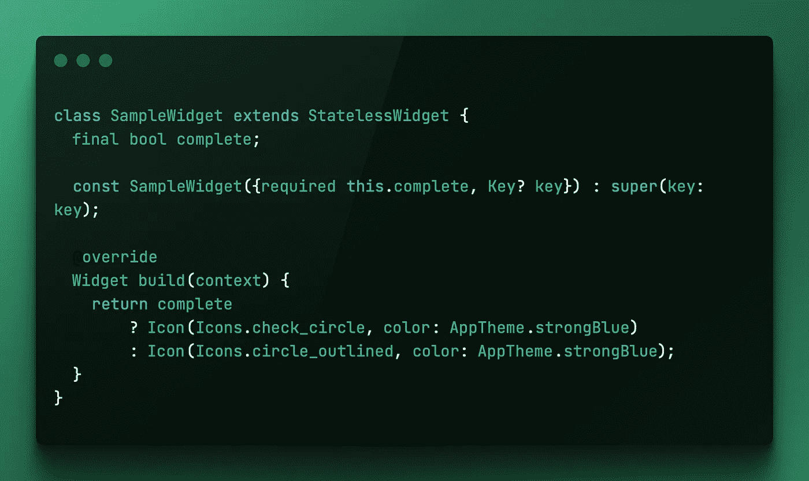

# 颤振:你的测试游戏

> 原文：<https://itnext.io/up-your-testing-game-ae40cb5d4449?source=collection_archive---------1----------------------->



今天，我们将看看 Flutter 的测试框架提供的一个伟大的工具，它给了我们更多的能力来准确地测试我们的小部件。

通常情况下，使用`find.byType`、`find.text`和`find.byKey`可以非常简单地测试小部件。其中每一个都很容易使用，你选择哪一个取决于你到底要测试什么，但是有一些场景，像这样的基本测试不会产生有价值的结果。

以下面的小部件为例:

```
class SampleWidget extends StatelessWidget {
  final bool complete;

  const SampleWidget({required this.complete, Key? key}) : super(key: key);[@override](http://twitter.com/override)
  Widget build(context) {
    return complete
        ? Icon(Icons.check_circle, color: AppTheme.strongBlue)
        : Icon(Icons.circle_outlined, color: AppTheme.strongBlue);
  }
}
```

# 简单用例(图标)

就我个人而言，我通常不会测试我的所有小部件，上面是一个非常简单的用例的样本，它会让我考虑编写测试，虽然它非常基本，但这个小部件本身确实提出了一些逻辑，在这个小部件内做出了一个决定，虽然这并不复杂，但它的目的是说明测试的理想场景。

在上面的小部件中没有我可以寻找的文本，我没有为单独的图标提供任何键，它们都是图标，所以使用它们的类型不会在准确的测试中产生。

如果我把测试写成这样:

```
testWidgets('Should render the check_circile_icon', (tester) async {
  await tester.pumpApp(const SampleWidget(complete: true));

  await tester.pumpAndSettle(); final iconFinder = find.byType(Icon); expect(iconFinder, findsOneWidget);
});testWidgets('Should render the circle_outlined icon', (tester) async {
   await tester.pumpApp(const SampleWidget(complete: false));

   await tester.pumpAndSettle(); final iconFinder = find.byType(Icon); expect(iconFinder, findsOneWidget);
 });
```

它们都肯定会通过，如果你在哪里看覆盖率报告，那也会显示 100%的测试覆盖率，但是测试作为一个整体是非常没有价值的，当它运行逻辑时，逻辑肯定是工作的，你的测试不能证明这一点。

如果你打算花时间写测试(我希望你这样做)，测试应该总是提供覆盖报告之外的价值，测试行覆盖，淡化了单元测试你的代码的价值和目的。

这就是`find.byWidgetPredicate`派上用场的地方，它将允许您编写与上面相同的测试，同时能够唯一地识别各个图标。

`find.byWidgetPredicate`是一个基于函数的查找，它提供小部件作为它的函数参数，这允许你使用小部件的属性来专门定位同一个小部件的唯一实例。

如果我们看下一个例子，我已经更新了`iconFinder`来使用`find.byWidgetPredicate`查找而不是`find.byType`:

```
testWidgets('Should render the circle_outlined icon', (tester) async {
      await tester.pumpApp(const SampleWidget(complete: false));

      await tester.pumpAndSettle(); final iconFinder = find.byWidgetPredicate((widget) => widget is     Icon && widget.icon ==                              Icons.circle_outlined,
   ); expect(textFinder, findsOneWidget);
});
```

如您所见，在函数体中，我们正在寻找一个小部件，它是一个`Icon`(因此是一个类型比较)，并且该图标小部件的图标属性与`IconData` `Icons.circle_outlined`匹配。

这样，如果出于某种原因，有人出于某种奇怪的原因将*错误的*图标更改为`Icons.menu`，那么`find.byWidgetPredicate`查找将会失败。如果我们使用了`find.byType`或者甚至`find.byKey`，假设我们提供了惟一的键，测试应该会通过。

小部件测试中的`find.byWidgetPredicate`查找允许您编写近乎防弹的测试。

# 更好的用例(RichText)

上面是一个非常简单的例子，但是在 Flutter 中，如果一个人想要写一行文本，但是有一个单独的单词，一个风格不同的短语，无论是**粗体**还是*斜体*，我们都必须使用`RichText`小部件和一系列`TextSpan`来实现想要的结果。

举个例子:

```
RichText(
        text: TextSpan(
          children: [
            const TextSpan(
              text: "Required",
              style: TextStyle(
                fontWeight: FontWeight.bold,
                color: Colors.black,
              ),
            ),
            TextSpan(
              text: " 70%",
              style: const TextStyle(
                color: Colors.black,
              ),
            ),
          ],
        ),
      )
```

虽然这个特定的小部件我可能不会实际测试，但它是在更复杂的场景中使用`find.byWidgetPredicate`的另一个很好的例子。

```
final requiredScoreFinder = find.byWidgetPredicate(
      (widget) =>
          widget is RichText &&
          widget.text.toPlainText().contains("70%"),
    );
```

对于上面的小部件，您可以像上面的示例一样定位它，因为`RichText`小部件实际上将文本分成多个部分，`find.text`将不起作用。

您可以使用`contains`进行部分查找，或者您可以简单地使用严格等式，contains 对于较长的句子可能更简单。

```
final requiredScoreFinder = find.byWidgetPredicate(
      (widget) =>
          widget is RichText &&
          widget.text.toPlainText() == "Results 70%",
    );
```

正如你现在所看到的，`find.byWidgetPredicate`可能是你的测试工具箱中一个非常强大的工具，它将允许你编写更好、更精确的测试。

我希望您对此感兴趣，如果您有任何问题、评论或改进，请随时发表评论。享受你的颤振发展之旅:D

如果你喜欢，一个赞会很棒，如果你真的喜欢，一杯咖啡会很棒。

感谢阅读。

希望继续单元测试的话题，请看:

[](/automated-unit-testing-with-github-actions-1305759fc726) [## 使用 GitHub 动作的自动化单元测试

### 今天我们将讨论一个非常简单的方法，你可以用 GitHub 的动作来自动化单元测试…

itnext.io](/automated-unit-testing-with-github-actions-1305759fc726) [](https://medium.com/geekculture/unit-testing-datetime-now-with-the-help-of-dart-extensions-d2b0c9f991bf) [## 借助 Dart 扩展对 DateTime.now()进行单元测试

### 当需要使用 DateTime.now()时，快速演练 Flutter 中的单元测试

medium.com](https://medium.com/geekculture/unit-testing-datetime-now-with-the-help-of-dart-extensions-d2b0c9f991bf) 

*原载于 2022 年 4 月 12 日*[*https://remelehane . dev*](https://remelehane.dev/posts/up-your-testing-game/)*。*