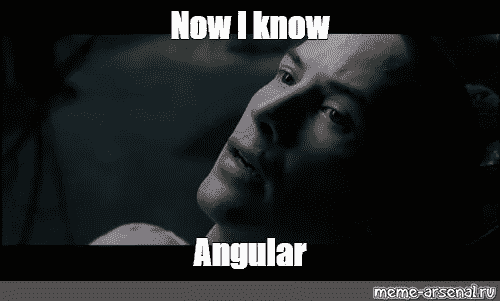
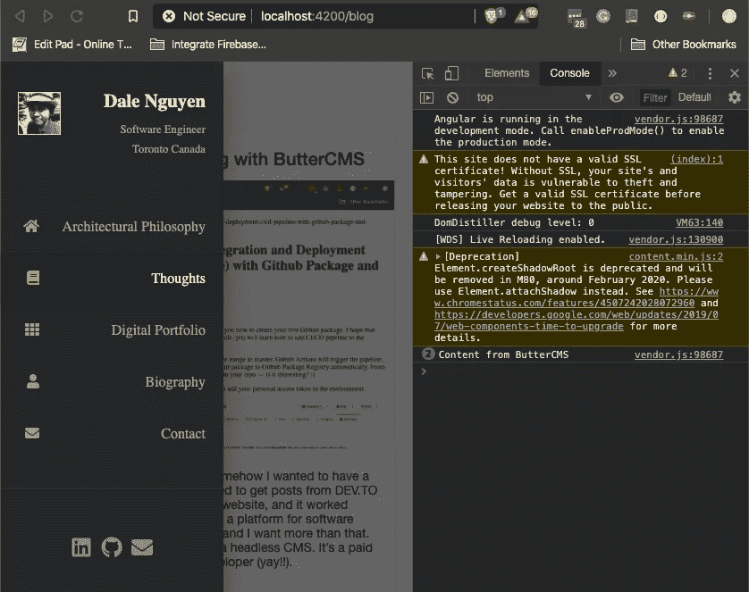
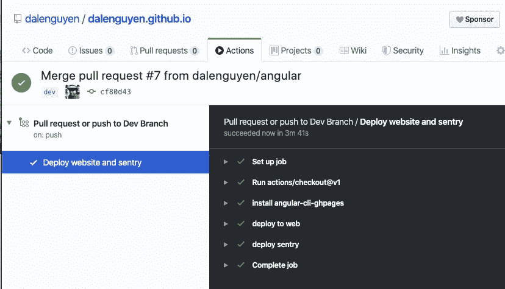

# 将 Angular 更新至版本 9

> 原文：<https://itnext.io/update-angular-to-version-9-5e6ce43c5496?source=collection_archive---------4----------------------->



这是一个新年任务:把我的个人网站从 Angular 8x 更新到 Angular 9。这个过程非常简单，只需要@angular/cli 的两个命令。你可以从 Angular 网站查看[指南。](https://next.angular.io/guide/updating-to-version-9)

在开始更新到 v9 之前。需要将@angular/cli 和@angular/core 更新到 v8 最新版本。

```
ng update @angular/core@8 @angular/cli@8 --force
```

然后开始更新 Angular 到版本 9

```
ng update @angular/cli @angular/core — nextThe installed Angular CLI version is older than the latest pre-release version.Installing a temporary version to perform the update.Installing packages for tooling via yarn.Installed packages for tooling via yarn.Using package manager: ‘yarn’Collecting installed dependencies…— — — —Your project has been updated to Angular version 9!For more info, please see: [https://v9.angular.io/guide/updating-to-version-9](https://v9.angular.io/guide/updating-to-version-9)
```

在本地机器上启动应用程序并检查错误。



创建一个拉取请求并部署到生产中



构建过程已成功完成。我的网站现在运行的是 Angular v9。你查看我的 [GitHub](https://github.com/dalenguyen/dalenguyen.github.io/pull/7) 的拉取请求。

帖子最初发布在 [dalenguyen.me](http://dalenguyen.me/blog/update-angular-to-version-9) 上。