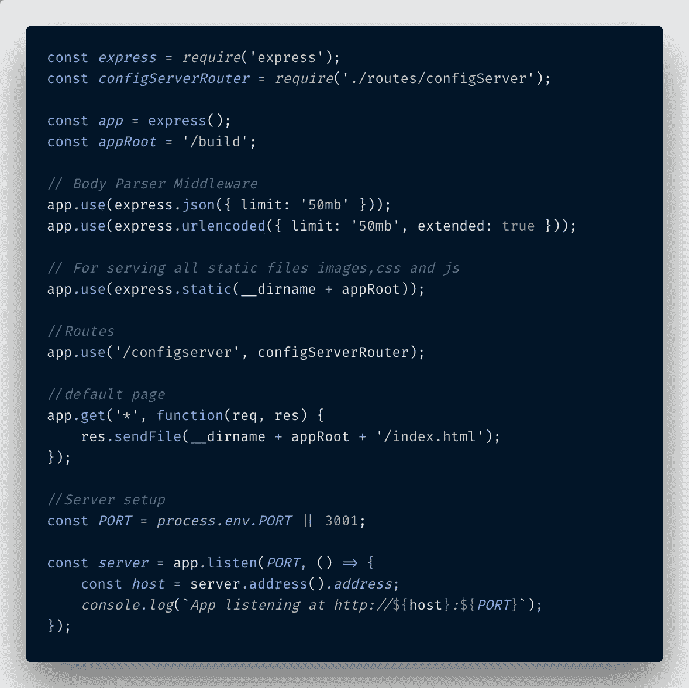
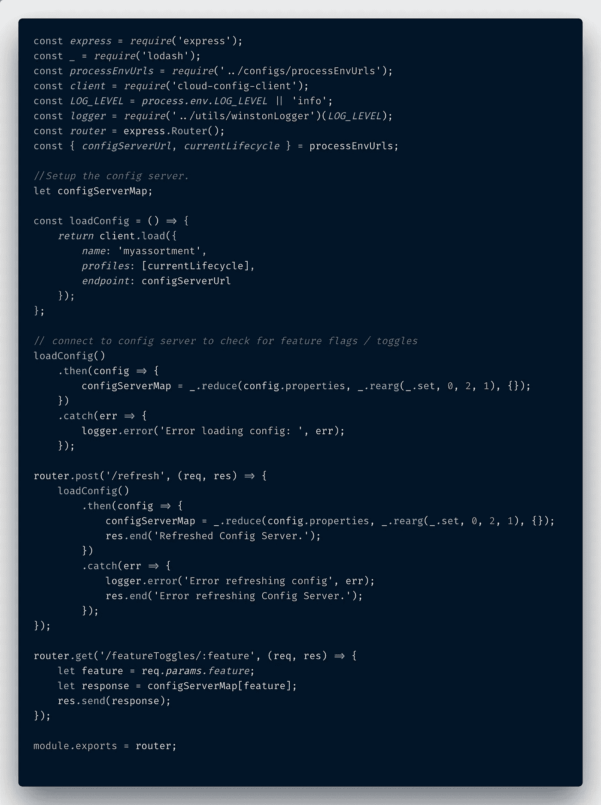
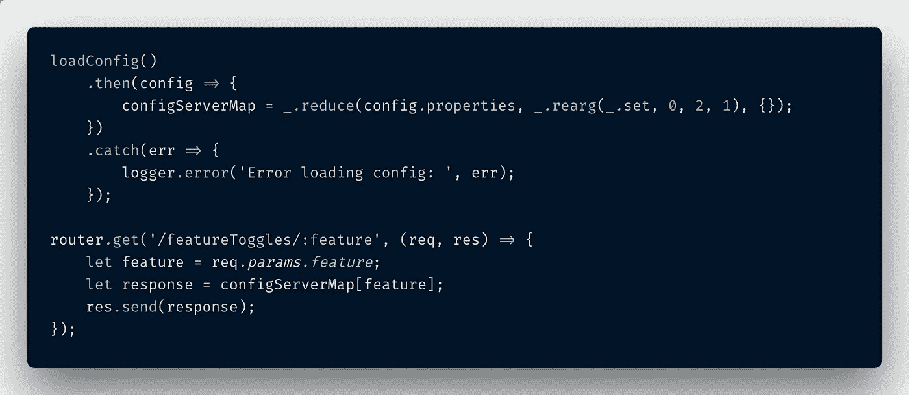
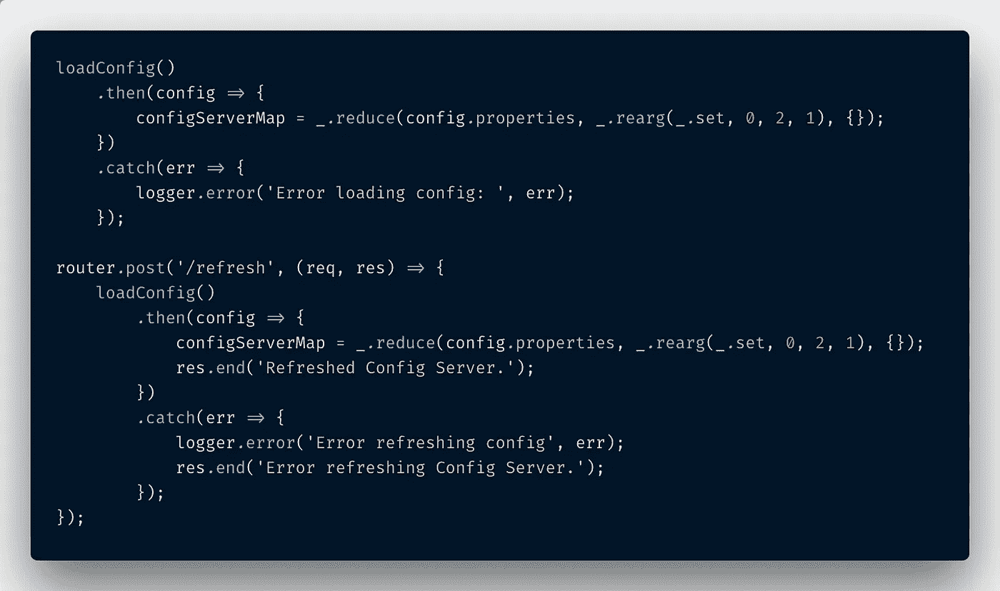
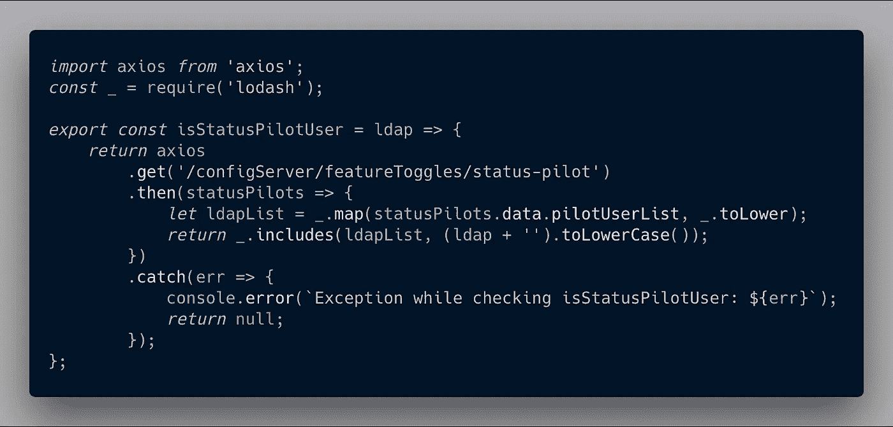
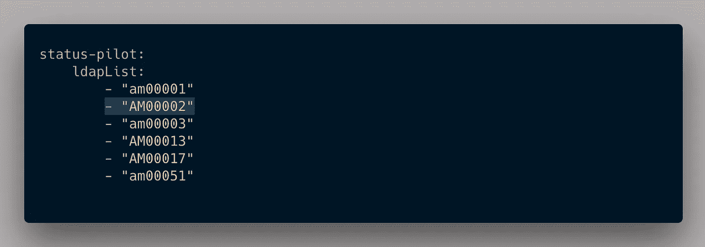
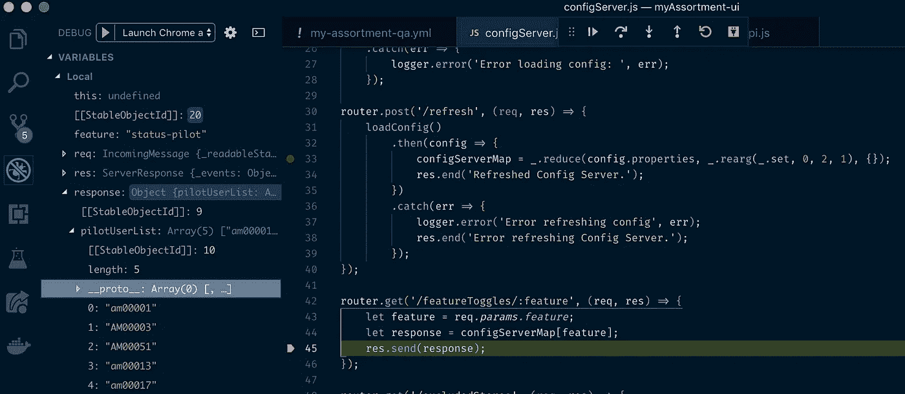
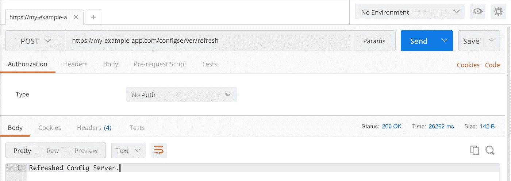
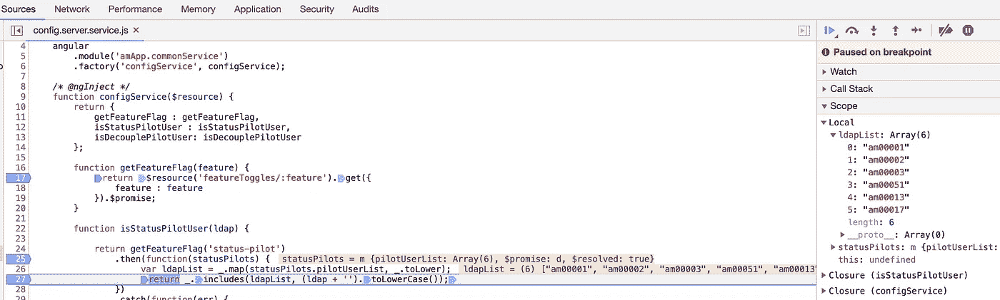

# 更新功能在 React 应用程序中切换，无需重新部署

> 原文：<https://itnext.io/update-feature-toggles-in-a-react-app-without-redeploying-5b95674a5bb1?source=collection_archive---------2----------------------->

# Spring Cloud Config 使特性切换变得容易，Node.js 端点使重新部署 JavaScript 应用程序变得不必要

在 [Unsplash](https://unsplash.com/search/photos/developer?utm_source=unsplash&utm_medium=referral&utm_content=creditCopyText) 上由[米米·蒂安](https://unsplash.com/photos/t1bz9XpJ2-Y?utm_source=unsplash&utm_medium=referral&utm_content=creditCopyText)拍摄的照片

# 特性切换:测试新 UI 特性的首选方式

H 你有没有对自己说过:“哎呀，我希望我能一次只给我的几个用户部署这个新功能。我想在向整个用户群开放之前，测试一下他们是否喜欢它，它是否运行良好。”？

然后你耸耸肩，部署到产品中，当 250 个用户发现一个你甚至没有想到的不愉快的路径时，网站崩溃了，这远远超出了如何合理地使用网站的范围(因为这是用户擅长的)。

这种情况(以及随之而来的疯狂编码快速修复)可以通过特性切换来避免。

## 什么是特征切换？

除了我上面描述的场景，根据维基百科:

> **特性切换**是[软件开发](https://en.wikipedia.org/wiki/Software_development)中的一项技术，它试图提供一种维护多个[源代码](https://en.wikipedia.org/wiki/Source_code)分支(称为特性分支)的替代方法，这样一个特性甚至可以在完成并准备发布之前就被测试。功能切换用于在运行时隐藏、启用或禁用功能。例如，在开发过程中，开发人员可以为测试启用该特性，并为其他用户禁用它。
> 
> — [维基百科，功能切换](https://en.wikipedia.org/wiki/Feature_toggle)

特性切换允许开发人员向一小组用户(beta 测试人员)介绍新的特性，确保所有的问题和缺陷都解决了，并且在让每个人访问之前，特性是可靠的并且受到用户的欢迎。

它还允许一个应用程序同时存在多个版本。虽然特性切换通常被认为是暂时的，用于测试特性，然后在通过审查后向公众发布，但是它们也可以用于维护应用程序的多个版本，不同的用户可以使用不同的版本。

如果你想了解更多关于如何设置配置服务器的信息，你可以阅读我不久前写的一篇关于借助 Spring Boot 的云配置包设置配置服务器的文章。

如果你想看看在稍微老一点的 JavaScript 应用程序中设置特性切换的另一种方式，我也写了一篇关于这个的[文章](https://medium.com/@paigen11/leveraging-a-spring-cloud-config-server-in-a-nodejs-application-for-feature-toggles-pt-2-f331c08dfdb6)。不过，这种实现需要在每次添加新的用户或组时使用特性切换来重新部署整个应用程序，但是有了这种新的解决方案，这就没有必要了。

> 在这篇博客中，我将向您展示如何在 React UI 中向现有功能切换添加新信息，而不必重新部署整个应用程序。

最精彩的部分？这并不复杂。

**请注意:**

# 重建和重新部署 ui 并不总是必须的

回到 JavaScript 开发的早期，当 Grunt 和 Gulp 任务重新构建 jQuery 驱动的应用程序时，如果您想用新信息修改 UI 中的特性切换，整个应用程序必须从 Node.js 服务器重新构建。重新编译、重新缩小、重新美化、重新构建并重新部署到服务器或云。

这并没有花费太长的时间，但仍然是一个痛苦。对于我的商业伙伴来说，他们想要相对容易地点击一个按钮来启用或禁用某些用户组的功能切换，这使之成为不可能。

这就是我的商业伙伴希望功能切换变得多么简单:只需按下按钮。

现在，有了 Webpack 这样的新工具和 React 这样的框架，浏览器中的热重装功能就不再是那样了。

您可以简单地更新从配置服务器提供给 UI 的信息，通过 Node.js 服务器刷新它，瞧——修改在浏览器中获得。

# 功能切换设置

## 启用功能与云配置客户端 NPM 包切换

为了设置我们的 JavaScript 应用程序连接到 Spring Cloud Config 服务器，我使用了来自 NPM 的名为 [cloud-config-client](https://www.npmjs.com/package/cloud-config-client) 的包。

有十几个这样的包用于将 Node.js 应用程序连接到 Spring Boot 云配置服务器，但这个包是 NPM 上更受欢迎、记录良好的包之一，所以这是我这次选择使用的包。

我将这些步骤分为服务器端和客户端，这样您就可以看到 Node.js 文件与 React 文件的区别。

## 服务器端:在 Server.js 中配置

在最初用`npm i --save cloud-config-client`安装了 cloud-config-client 包之后，是时候配置节点的`server.js`文件了。每个优秀的 Express powered 节点应用的起点。

我的`server.js`文件相对较小，因为许多路由、日志程序和其他节点服务器附加程序已经被分离到它们自己的文件夹中，以保持更有组织性。

对该文件唯一需要的调整是需要文件顶部的配置服务器路径:

`const configServerRouter = require('./routes/configServer');`

然后确保当 React 客户端的请求到达节点服务器并在 URL 路径中包含`/configserver/`时，它会路由到`configServer.js`文件，在那里存储了访问 Spring Cloud 配置服务器的逻辑。像这样:

`app.use('/configserver', configServerRouter);`

**server.js**

节点的 server.js 文件中没有太多需要更新的内容，因此可以访问云配置服务器。

接下来，我转到`configServer.js`文件，它位于服务器端我的`routes/`文件夹中。

## 服务器端:连接到 Spring Cloud 并创建两个节点配置服务器端点

`configServer.js`文件包含了运行在云中的 Spring Cloud config 服务器的大部分连接信息。

下面是整个文件的截屏——我将详细介绍每个部分，但在较高层次上，它包含一个函数调用，用于最初连接到配置服务器并加载任何可能存在的特性切换信息:`loadConfig()`。

有一个端点用`/refresh`端点刷新提供给配置服务器的信息——这是启用或禁用特性切换的关键，而不必每次都重新构建和重新部署整个 JavaScript 应用程序。

最后，还有实际的`/featureToggles/:feature`端点，React UI 就是这样调用 Node.js 服务器来确定哪些特性可用。

好了，现在让我们进入每个功能的细节。

**configServer.js**

这是我的整个 configServer.js 文件，用于检查/刷新特性切换。

## 服务器端:功能切换端点

这里是用于以下目的的`loadConfig()`和`/featureToggles/:feature`功能的特写:

1.  从 Spring Cloud 配置服务器获取任何特性切换信息，并
2.  处理来自 UI 的调用，以检查某些功能切换是否对用户组可用。

对于实际的`loadConfig()`功能，我只是遵循了[云配置客户端](https://www.npmjs.com/package/cloud-config-client)提供的文档。

一旦从该函数建立了初始连接，就有一个很好的 [Lodash](https://lodash.com/) 用于将配置服务器数据传递到每个单独特性切换的键和值的映射中。如果这有点难以理解，那么当我展示一个功能切换的实际例子时，可能会更有意义。现在，请继续阅读。

`router.get(/featureToggles/:feature)`函数是处理来自 React 客户端的调用的端点，检查`:feature`是否作为一个键存在于先前创建的`configServerMap`中，如果是，则向客户端返回一个肯定的 200 响应。

这就是这部分的全部内容，实际上并不复杂。

**configServer.js**

从 Spring Cloud 服务器获取信息的初始 loadConfig()调用和从客户端检查 configServerMap 发送的特性切换调用的特写。

## 服务器端:功能切换刷新端点

这里需要注意的另一个函数是`router.post(/refresh)`端点。这个端点既可以从浏览器调用，也可以(更有可能)从 API REST 客户端调用，比如 [Postman](https://www.getpostman.com/) 或[失眠症](https://insomnia.rest/)。

这就是对配置服务器文件所做的更改被更新并被拉入 UI 的方式。

> 这个“/refresh”端点是修改提供给 React UI 中现有功能切换的信息的关键。

如您所见，Node.js 服务器第一次启动时调用的同一个`loadConfig()`函数，在`/refresh`端点被触发时再次被调用。为了让用户知道刷新成功了，当 POST 成功时，会发回一条简单的 JSON 消息:`res.send('Refreshed Config Server.');`

**configServer.js**

触发刷新端点以引入与 UI 应用程序中已经实现的功能切换相关的新信息。这是关键。

## 客户端:功能切换调用

现在，我们在 React UI 中进入客户端，这非常简单。在 UI 方面，我在 React 中有一个名为`/services`的文件夹，所有共享的业务逻辑文件都在其中，还有一个文件与配置服务器有关，名为`configServerService.js`。

这充当 React UI 客户机和 Node.js 服务器之间的连接点。

正如您可能从下面的截图中看到的那样，这个示例特性开关被称为`'status-pilot'`，它检查用户的`ldap`(用户名)，这是由 Spring Cloud config server 通过`/configServer/featureToggles/status-pilot`端点提供的。然后，它根据来自配置服务器的用户列表检查客户端提供的`ldap`，如果其中一个用户与列表中的名字匹配，它将返回一个 true boolean。

通过这种确认，用户可以看到应用程序中目前正在测试的某些功能，这些功能由一小组选定的用户使用。仅此而已。

只要 React 应用程序在 UI 中检查用户权限时调用`isStatusPilotUser()`函数，并在节点服务器根据来自配置服务器的信息给出响应后，将`isStatusPilotUser`的布尔值设置为`true`或`false`。

这种相同类型的功能设置也可以被添加到这个服务文件中，用于同时切换多个特征。

**configServerService.js**

这是客户端的函数:isStatusPilotUser()，它与节点服务器通信，节点服务器保存配置服务器提供的特性切换信息。

# 功能在动作中切换

好了，现在我已经介绍了如何将节点服务器连接到 Spring Cloud 配置服务器，以及如何将 React 客户端连接到节点服务器，是时候展示一个功能切换了。

首先需要一个简单的、更新的配置 YAML 文件，供 Spring Cloud config server 使用。

继续上面的`'status-pilot'`例子，这里有一个`.yml`文件，带有一个 LDAPs(用户名)列表。突出显示的用户名“AM00002”是 Node.js 服务器还不知道的列表中的新成员。

配置服务器本身不会立即注册这一更改，我将不得不手动触发它来更新(或设置一个 cron 作业)并从文件中获取新信息，但我稍后会谈到这一点。

## 更新 Spring Cloud 配置服务器的配置文件

这是我上面提到的简单的 YAML 文件。突出显示的用户“AM00002”是文件(和状态试点列表)的新成员。

**status-pilot-example . yml**

这里有一个 YAML 文件的例子。“AM00002”是添加到“状态-试点”功能切换的新用户。

## 验证发送到节点服务器的配置信息

目前，当我启动连接到 Spring Cloud 服务器和 React UI 客户端的节点服务器时，它会从 Spring Cloud config 服务器获取之前存在的信息列表。因为 Spring 服务器不知道它提供的信息已经改变，所以它继续向客户机提供以前缓存的配置信息。

如果您仔细观察右边的截图，您会发现用户‘am 00002’不在`pilotUserList`中。没关系，这个问题很快就会得到解决。

**configServer.js**

只是确认 UI 的节点服务器当前是否将谁视为 pilotUserList 的一部分。请注意，“AM00002”还不在该列表中…

## **通过邮递员**命中节点服务器的 `**/refresh’**` **端点**

是时候告诉 Spring 服务器更新它提供的文件了。打开 Postman REST 客户端，输入应用程序的`/refresh`端点的 URL，并向其发送一个`POST`请求。

如果刷新触发器成功，下面的成功消息将作为服务器端的响应出现。

这是 Postman 对配置服务器端点的成功调用。

## 检查 React UI 现在是否将“AM00002”视为状态试点用户

最后，在通过 Postman 刷新 Spring Cloud 服务器的信息之后，我可以通过在客户端的`isStatusPilotUser()`函数上的 Chrome DevTools 中放置一个断点来验证这些更改是否已经生效。

当浏览器在断点处暂停时，我可以看到包含在从 Spring config 服务器提供给节点服务器的`ldapList`中的用户名。如果你仔细观察，你会发现`'am00002'`现在就在那里；一清二楚。

对 UI 特性切换信息的刷新起作用了，而且不需要重新构建或重新部署 JavaScript 应用程序。我完成了，现在这个用户也是这个特殊 UI 特性切换中的`status-pilot`程序的一部分。

**configServerService.js**

通过使用这些断点，我可以看出对状态引导功能切换的修改生效了，现在‘am 00002’也是状态引导的一部分。

# 结论

对现有功能切换“状态-试点”的更新起作用了，而且所有这些都无需重新构建或重新部署 JavaScript 应用程序。

只需对使用 cloud-config-client 的节点服务器进行一些添加，并调用一个`/refresh` REST 端点，React UI 的现有特性就可以在短时间内进行修改和更新。

过几周再来看看，我会写一些关于 React 或者其他与 web 开发相关的东西，所以请关注我，这样你就不会错过。

感谢您的阅读，我希望您可以使用这个实现来更新您自己的 JavaScript 应用程序的特性切换，并且能够用您自己的用户子集更容易地测试新特性。

**如果你喜欢读这篇文章，你可能也会喜欢我的其他博客:**

*   [为什么 Spring Cloud 配置服务器对一个好的 CI/CD 管道至关重要，以及如何设置它(第 1 部分)](https://medium.com/@paigen11/why-a-cloud-config-server-is-crucial-to-a-good-ci-cd-pipeline-and-how-to-set-it-up-pt-1-fa628a125776)
*   [利用 NodeJS 应用程序中的 Spring Cloud 配置服务器实现特性切换(Pt 2)](https://medium.com/@paigen11/leveraging-a-spring-cloud-config-server-in-a-nodejs-application-for-feature-toggles-pt-2-f331c08dfdb6)
*   [调试 Node.js 最简单的方法——使用 VS 代码](/the-absolute-easiest-way-to-debug-node-js-with-vscode-2e02ef5b1bad)

**参考资料和更多资源:**

*   维基百科，功能切换:[https://en.wikipedia.org/wiki/Feature_toggle](https://en.wikipedia.org/wiki/Feature_toggle)
*   云配置客户端，https://www.npmjs.com/package/cloud-config-client NPM:
*   云配置客户端，Github:[https://github.com/victorherraiz/cloud-config-client#readme](https://github.com/victorherraiz/cloud-config-client#readme)
*   洛达什:[https://lodash.com/](https://lodash.com/)
*   邮递员休息客户端:[https://www.getpostman.com/](https://www.getpostman.com/)
*   失眠休息委托人:【https://insomnia.rest/ 