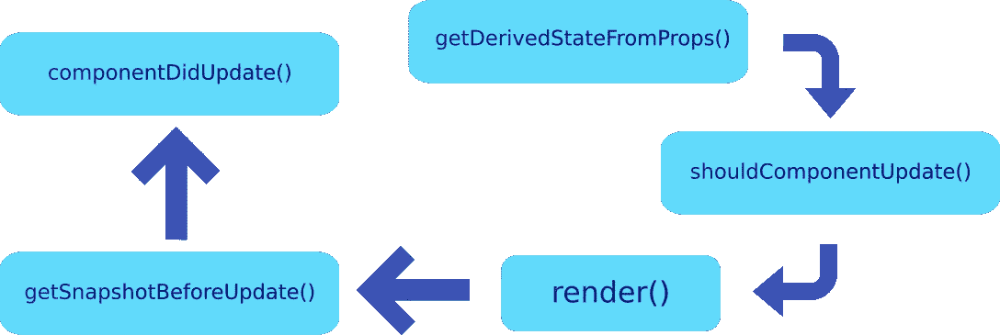

# 更新基于类的 React 组件的生命周期

> 原文：<https://itnext.io/update-lifecycle-of-a-class-based-react-component-f0cb800a8aca?source=collection_archive---------3----------------------->

# 更新生命周期

上一篇文章是关于基于类的组件在创建时的生命周期挂钩。在本文中，我们将看到当一个基于类的组件被更新时，钩子开始发挥作用。

# 组件何时更新？

当组件的属性或状态发生变化时，组件被更新。发生这种情况时，组件将被重新评估，并经历与创建生命周期不同的生命周期。

## 1.getDerivedStateFromProps

因为这个钩子给我们的状态来自于 props 的变化，所以它是组件更新时调用的第一个生命周期钩子。

它检查是否对道具进行了任何改变，并从这些改变中导出新的状态。就像在创建生命周期中一样，这种生命周期挂钩很少是必要的，因为很可能会有更好的解决方案。

## 2.shouldComponentUpdate

这个生命周期钩子在 *getDerivedStateFromProps* 之后和 *render* 函数之前被调用，并允许我们**取消**更新过程。它可以用来让 React 知道组件的状态或属性的变化是否会影响组件的输出。为了优化性能，我们可以决定 React 是否应该继续更新和重新呈现组件。

默认情况下，组件将在每次状态改变时重新呈现，但是使用这个钩子，我们可以防止不必要的重新呈现。这使得这个钩子非常强大，因为我们可以避免不必要的渲染循环。但是，如果做得不正确，我们可能会阻止更新并破坏组件。

[React docs](https://reactjs.org/docs/react-component.html#shouldcomponentupdate) 推荐使用`PureComponent`如果你不确定手动实现*shouldcomponentdupdate*。

## 3.提供；给予

接下来是*渲染*功能。如果 *shouldComponentUpdate* 返回 false，这意味着组件应该**而不是**更新，则不调用渲染函数。

在创建生命周期中，render 函数评估所有 JSX，并将组件呈现到 DOM 中。然而，在更新生命周期中，在评估 JSX 之后，render 函数构造虚拟 DOM 并检查它是否需要更新真实 DOM。如果需要更新，它不是更新整个 DOM，而是比较虚拟 DOM 和真实 DOM，只对需要更新的部分进行修改。

这意味着改变按钮的颜色只会更新该按钮，而不是整个页面。

## 4.getSnapshotBeforeUpdate

尽管*getsnapshotbeforedupdate*出现在 React 组件的更新生命周期中的 render 函数之后，但它是在任何更新实际提交到真正的 DOM 之前被调用的。这也是一个不常使用的生命周期挂钩，主要用于最后的操作，比如在更新之前从 DOM 中捕获一些信息。

这个钩子接收以前的状态和属性作为参数，并且可以返回一个快照对象或 null。这个钩子的一个用例是在 DOM 更新之前捕获页面上的滚动位置，并将当前的滚动位置设置为那个值。这将确保即使在 DOM 重新呈现后，滚动位置也保持不变。

由*getsnapshotbeforupdate*返回的任何值都作为参数传递给 *componentDidUpdate* 。

## 5.componentDidUpdate

这个钩子在 *render* 函数执行完毕并且 DOM 更新后被调用。这个钩子不是在页面初始呈现时调用，而是在组件更新时调用。

像执行 HTTP 请求这样的异步任务可以在这个钩子中完成。虽然在这个钩子中更新状态不会阻止更新过程，因为渲染已经完成，但是我们仍然需要小心，因为我们可能会陷入重新渲染的无限循环中。

如果您需要更新状态，请确保在承诺中使用 *setState()* ，以避免导致不必要的重新呈现。虽然这种重新渲染不会导致任何可见的更改，但仍会影响组件的性能。

这个钩子将组件更新之前的状态和属性作为参数。可以将先前的属性与当前的属性进行比较，以检查如果属性已经改变，是否有必要执行网络请求。如果您的组件实现了很少使用的*getsnapshotbeforupdate()*生命周期钩子，那么 *componentDidUpdate()* 将接收第三个参数— **快照**。如果*getsnapshotbefore update()*没有实现，第三个参数将是未定义的。

> 注意:如果`shouldComponentUpdate()`返回 false，`componentDidUpdate()`将不会被调用

# 包扎

当一个组件经历一次更新时，这些是被调用的生命周期钩子。在下一篇文章中，我们将看到 *useEffect* 钩子，它可以用在功能组件中来代替这些生命周期钩子。

*原载于* [*我的博客*](https://niharraoteblog.netlify.app/update-lifecycle-of-a-react-component) *。*