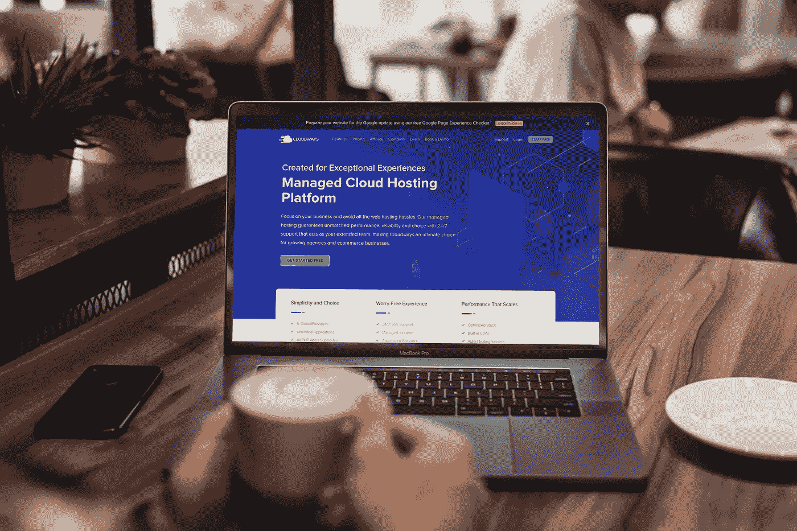
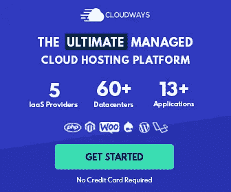

# 使用 NVM 在没有 sudo 的 Cloudways 服务器上更新 Node.js

> 原文：<https://itnext.io/update-node-js-on-a-cloudways-server-without-sudo-using-nvm-2c19c6286d44?source=collection_archive---------3----------------------->

[Cloudways](https://skr.pt/cloudways) 是目前最受欢迎的云托管平台之一。以非常实惠的价格，你可以轻松地在世界各地的服务器上部署来自不同提供商的新网站应用程序。

在 [Cloudways](https://skr.pt/cloudways) 主要用于部署&主机 WordPress 网站的地方，它们也提供了托管其他类型应用的可能性，比如 Laravel & Magento。也可以安装基于节点的项目，如 Nuxt.js，但有一个问题:默认的节点版本可能不符合您的要求，您不能使用`sudo`来更新它们。

即使在互联网上找不到具体的解决方案(在撰写本文时)，也有办法通过 **NVM** 让另一个节点版本工作。这种方法得到了 [Cloudways](https://skr.pt/cloudways) 的官方支持，因此它不是一种“黑客”的变通方法。按照下面的步骤让它工作。

[单击此处开始免费试用 Cloudways，无需信用卡！](https://skr.pt/cloudways)

1.  **使用主凭证通过 SSH 连接到您的服务器** 您可以使用 Putty 或 [Cloudways](https://skr.pt/cloudways) 仪表板中的 SSH 终端(或任何其他 SSH 客户端)，但是使用主凭证而不是应用凭证非常重要。您可以在您的 [Cloudways](https://skr.pt/cloudways) 仪表板中的服务器管理>主凭证下找到主凭证。
    如果你不知道如何连接到你的服务器，你可以遵循 Cloudways 提供的这个教程:[https://support . Cloudways . com/how-to-connect-to-your-application-using-sftp-ssh/](https://support.cloudways.com/how-to-connect-to-your-application-using-sftp-ssh/)
2.  **导航到主目录** 主目录应该是连接到服务器时的默认文件夹。但是，如果您不在这个目录中，请运行以下命令:`cd ~`
3.  **安装 NVM
    您可以通过运行`nvm --version`来验证这一点。这将打印 NVM 的版本。
    如果 NVM 不工作，但您在执行上述 2 个命令时没有收到任何错误，请尝试重新连接到您的服务器。**
4.  **安装需要的节点版本**
    现在 NVM 正在工作，我们只要运行`nvm install <version>`就可以安装任何节点版本。例如，如果我们想安装节点 V12.16.2，我们运行`nvm install 12.16.2.`
5.  **更新 NPM(可选)** 这一步并不总是必要的，但是你服务器上默认的 NPM 版本并不是最新的。这可能会在您尝试安装软件包或尝试运行应用程序时导致一些问题。通过运行`npm install npm@latest -g`，将安装最新稳定的 NPM 版本。

    运行`npm config delete prefix`从 NPM 配置中删除旧的节点版本也很重要。不需要手动设置新安装的节点版本，因为这将自动发生。
6.  **激活所需的节点版本** 剩下要做的唯一一件事就是告诉 NVM 使用您的应用需要的节点版本。您可以通过运行`nvm use <version>`来实现这一点，其中`<version>`与您在步骤 4 中安装的相同(例如:`nvm use 12.16.2`)。

    您的服务器现在应该全局使用已安装的节点版本和 NPM 版本！您可以通过运行`node -v`和`npm -v`进行复查。如果它不起作用，请尝试重新连接到您的服务器并再次检查。当这仍然不起作用时，您可以随时联系 [Cloudways](https://skr.pt/cloudways) 实时聊天支持，这样他们可以帮助您解决您的问题。

[单击此处开始免费试用 Cloudways，无需信用卡！](https://skr.pt/cloudways)