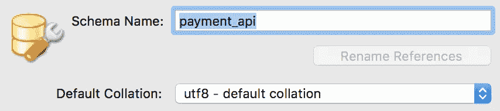
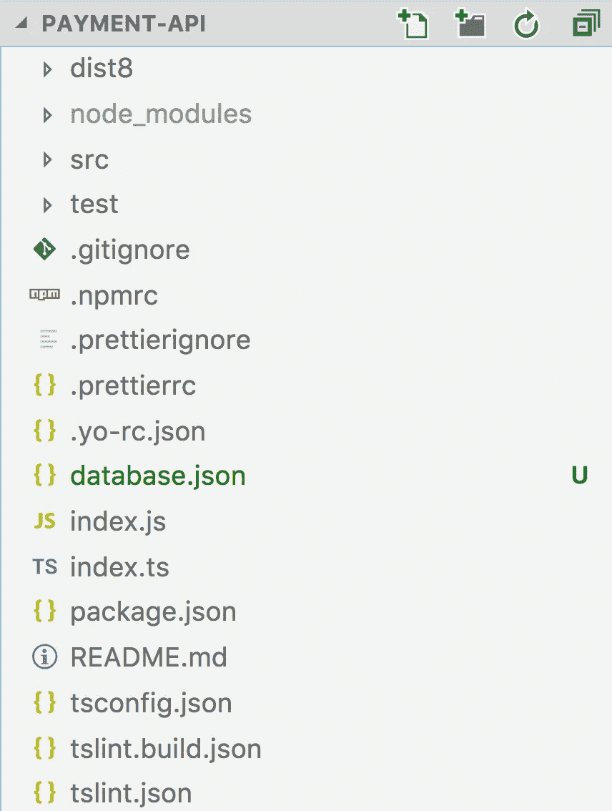
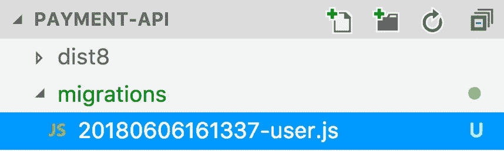
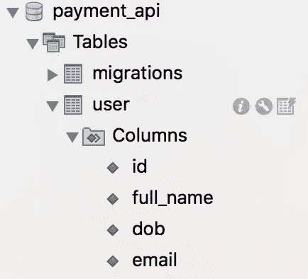
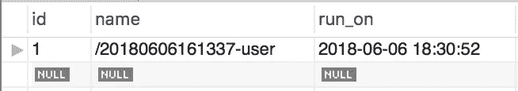

# 使用 Node.js 更新 SQL 数据库模式

> 原文：<https://itnext.io/updating-an-sql-database-schema-using-node-js-6c58173a455a?source=collection_archive---------0----------------------->


数据库迁移

许多 Node.js 项目利用 NoSQL 数据库来满足持久层组件的需求。只要逻辑支持新的数据定义，NoSQL 数据库的开发人员就不需要太担心影响应用程序的数据模型变化。

## 问题是

然而，许多项目仍然更适合使用关系数据库，如 MySQL 或 Postgres。与 NoSQL 不同，关系数据库模式的更改需要在数据库服务器上进行管理，这与代码是分开的。这通常会导致以下问题:

*   开发人员和系统之间的数据库模式状态变得不一致
*   进行更改需要人工操作，并且实时应用程序可能会停机
*   在团队中维护一个项目变得很困难，因为模式不容易共享

## 解决方案

数据库迁移是在各种状态之间转换数据的过程，无需任何人工干预。这个过程将允许我们跟踪模式更新之间的变化。

我们将利用一个名为 [node-db-migrate](https://github.com/db-migrate/node-db-migrate) 的开源框架。无论是构建简单的控制台应用程序还是复杂的 API，该框架都可以用来管理数据库模式的更改。本文将使用一个简单的 LoopBack 4 应用程序来展示这个框架。

[*阅读此文开始使用 LoopBack 4。*](https://medium.com/@miki_94094/getting-started-with-loopback-4-c5d12cd84d0a)

# 入门指南

*本文假设您已经* [*创建了一个 LoopBack 4 应用程序*](https://medium.com/@miki_94094/getting-started-with-loopback-4-c5d12cd84d0a) *，或者已经在一个现有的 Node.js 项目中工作。*

## 装置

node-db-migrate 框架包括一个简洁的 CLI 工具，我们可以用它来管理数据库迁移脚本。我们可以使用以下命令在我们的计算机上全局安装它:

```
npm install -g db-migrate
```

*确保您位于 Node.js 应用程序的工作目录中。*

我们将管理一个 MySQL 数据库模式。node-db-migrate 有各种包，负责连接到各种数据库引擎，比如 MySQL。为了使用 node-db-migrate 管理 MySQL 数据库，我们需要在项目中安装以下包:

```
npm install --save db-migrate-mysql
```

这将安装 db-migrate-mysql node_module 并跟踪 *package.json* 文件中的依赖版本。

## 配置

我们需要告诉 node-db-migrate 框架如何连接我们的数据库。我已经安装了一个本地 MySQL 服务器，并创建了一个名为“payment_api”的模式。



使用 UTF8 排序规则在 Mac 上使用 MySQL Workbench 创建新模式

[***模式***](https://stackoverflow.com/questions/45141673/what-exactly-is-database-schema) *:描述数据库中对象的全部集合的定义。我们称之为 MySQL 服务器上的数据库。* [***排序规则***](https://dev.mysql.com/doc/refman/8.0/en/charset-general.html) *:排序规则是比较一个字符集中字符的一组规则。我们使用 utf8 默认排序规则，以便在我们的应用程序中支持广泛的字符集。*

现在我们在本地 MySQL 服务器上有了一个数据库模式，我们可以告诉 node-db-migrate 如何连接它。默认情况下，node-db-migrate 将在项目的根目录中查找名为 *database.json* 的文件。



根项目目录中的新 database.json 文件

```
{
  "dev": {
    "driver": "mysql",
    "host": "localhost",
    "port": "3306",
    "user": "root",
    "password": "root",
    "database": "payment_api"
  }
}
```

*database.json* 文件包含一个 json 对象，该对象具有一个名为***【dev】***的属性。根据 node-db-migrate 文档，默认情况下，框架将使用名为“dev”或“development”的对象。在运行我们的迁移时，这可能会被重写或传入。这在为具有不同配置的各种数据库实例配置迁移时也很有帮助，这将在以后的文章中看到。

配置属性是不言自明的。唯一值得一提的是 ***【驱动】*** 属性。我们使用***【MySQL】***作为属性值，这将向 node-db-migrate 框架表明它需要使用我们之前安装的 *db-migrate-mysql* npm 包来连接数据库。

如果您错过了这一步，稍后您可能会看到以下错误消息:

```
[ERROR] Error: No such driver found, please try to install it via npm install db-migrate-mysql or npm install -g db-migrate-mysql
```

*建议不要使用-g，而是使用-s 标志来保存项目的 package.json 文件中的 db-migrate-mysql 依赖项。*

## 创建新的迁移脚本

我们可以通过运行以下命令来创建新的迁移脚本:

```
db-migrate create user*[INFO] Created migration at /projects/payment-api/migrations/20180606161337-user.js*
```

迁移脚本代表数据库的新版本或状态。调用上述命令后，将创建一个新目录，其中包含一个新的。js 文件。



新的迁移脚本(数据库模式版本)

该文件以日期时间戳为前缀，后跟我们传递给 db-migrate create 命令*用户*的名称。

## 探索迁移脚本

每个迁移框架通常都有两个函数，我们可以用来实现向上*和向下*的迁移*和*。

*Up* :包含向前移动数据库的代码，或者 *up，*到下一个数据库版本。
*下移*:包含向后移动数据库的代码，或者*下移*，到先前的数据库版本，即**回滚！**

```
exports.up = function(db, callback) {
  return null;
};exports.down = function(db, callback) {
  return null;
};
```

这两个函数都传入一个已经连接的 *db* 实例，该实例通过 node-db-migrate 框架使用的 *database.json* 配置文件来处理。这些函数还传入第二个回调参数，这个参数在生成脚本后并不明显(只有在研究了文档后才明显)。我已经将它包含在上面的代码片段中。包含回调参数很重要，因为我们的迁移脚本是异步的。代码需要在完成数据库操作后回调到 node-db-migrate 框架。

## 创建新的用户表

让我们使用迁移脚本创建一个新表。[文档概述了所有可用的 SQL 操作函数](https://db-migrate.readthedocs.io/en/latest/API/SQL/)。我们将使用 *db#createTable* 和 *db#dropTable* 函数。

```
exports.up = function(db, callback) { db.createTable('user', {
    id: {
      type: 'int',
      primaryKey: true
    },
    full_name: {
      type: 'string',
      length: 40
    },
    dob: {
      type: 'date'
    },
    email: {
      type: 'string',
      length: 50
    },
  }, function(err) {
    if (err) return callback(err);
    return callback();
  });};exports.down = function(db, callback) { db.dropTable('user', callback);};
```

当我们向前移动数据库版本时，我们的代码应该创建一个新表，而当恢复时，应该删除该表。让我们来测试一下。

```
db-migrate up[INFO] Processed migration 20180606161337-user
[INFO] Done
```



成功执行 db-migrate up 命令后的新用户表

## 迁移表？

node-db-migrate 框架跟踪哪些脚本运行了一个*迁移*表。这将禁止同一个脚本运行两次。我们可以在表上运行一个简单的 *SELECT* 查询来查看下面的结果。



跟踪我们的用户迁移脚本的单行

再次运行 *db-migrate up* 将导致以下终端输出:

```
[INFO] No migrations to run
[INFO] Done
```

我们还可以尝试恢复我们的数据库更改，以测试出 *down* 函数。

```
db-migrate down[INFO] Defaulting to running 1 down migration.
[INFO] Processed migration 20180606161337-user
[INFO] Done
```

用户表应该已经被删除，我们的迁移表应该不包含任何行。太好了，我们可以直播了！

# 新要求

应用程序已经成功部署，一切都在运行。几周之后，应用程序显然需要将*全名*分成*名*和*姓*属性。

在使用数据库迁移之前，可以使用以下开发过程来完成这一更改:

1.  登录到实时 MySQL 服务器
2.  运行几个 SQL 命令来添加、删除和/或更改表和列
3.  部署新的应用程序代码
4.  重启服务器

这是一个简单的例子，只需要运行最少的 SQL，但仍然为简单的人为错误敞开了大门。在已部署的服务器上完成这一更改后，每个团队成员还需要手动更新他们的数据库模式，然后才能继续他们的日常开发工作。很明显，这会很快导致一个不可维护的项目。

幸运的是，我们使用 node-db-migrate 跟踪了我们的数据库模式。做出改变很简单:

```
db-migrate create update-user[INFO] Created migration at /payment-api/migrations/20180606164321-update-user.js
```

我们希望应用以下更改:

1.  添加名为 *firstname* 的新列
2.  添加一个名为*姓氏*的新列
3.  将所有现有数据从 *full_name* 列移动到单独的 *firstname* 和 *lastname* 列*(这将在以后的文章中更详细地探讨，因为现在我们将只关注模式定义更新)。*
4.  删除名为 *full_name* 的旧列

```
exports.up = function (db, callback) { db.addColumn('user', 'firstname', {
    type: 'string',
    length: 50
  }, function(err) {
    if (err) return callback(err);

    db.addColumn('user', 'lastname', {
      type: 'string',
      length: 50
    }, function(err) {
      if (err) return callback(err); db.removeColumn('user', 'full_name', callback);
    });
  });};exports.down = function (db, callback) { db.addColumn('user', 'full_name', {
    type: 'string',
    length: 50
  }, function(err) {
    if (err) return callback(err);

    db.removeColumn('user', 'lastname', function(err) {
      if (err) return callback(err);
      db.removeColumn('user', 'firstname', callback)
    });
  });};
```

*为了简单起见，我们跳过了从* ***全名*** *到* ***名字*** *和* ***姓氏*** *的实际数据迁移。这将在后面的文章中探讨。*

```
db-migrate up[INFO] Processed migration 20180606161337-user
[INFO] Processed migration 20180606164321-update-user
[INFO] Done
```

用户表现在应该反映了我们数据库的最新版本。

# 结论

本文探讨了开发人员在使用 MySQL 等关系数据库时面临的一些问题。这些问题可以通过简单的数据库迁移脚本来解决，在本例中由 node-db-migrate 框架管理。迁移脚本可以被签入到您最喜欢的版本控制系统中，并像我们跟踪代码版本更新一样被跟踪。