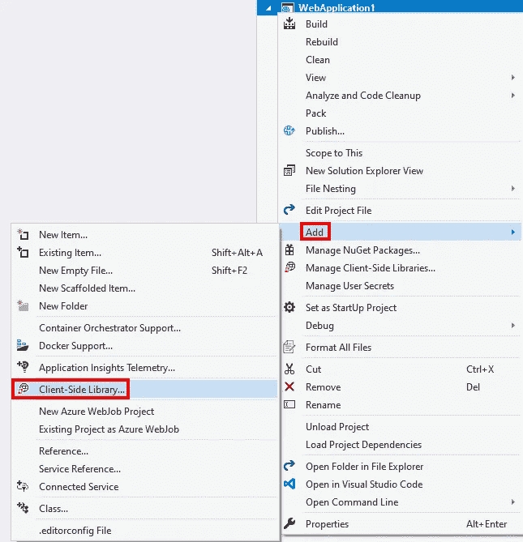
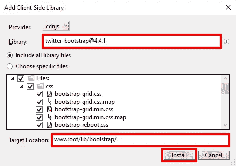

# 将 ASP.NET 核心应用程序升级到 Bootstrap 4

> 原文：<https://itnext.io/upgrade-an-asp-net-core-application-to-bootstrap-4-78cc2daf6450?source=collection_archive---------5----------------------->

作为工作的一部分，我在上周的 [web.config transform](https://elanderson.net/2020/02/asp-net-core-3-1-web-config-transform-for-production/) 帖子中提到的应用程序上做了工作。我还将应用程序从 Bootstrap 3 升级到 Bootstrap 4，这篇帖子将介绍一个过程，让新版本的 Bootstrap 在站点中运行。


## 创建一个示例应用程序

如果您希望在尝试生产站点之前先试用安装了 Bootstrap 3 的项目，在命令提示符下运行以下命令，将创建一个安装了 Bootstrap 3 的 ASP.NET Core 2.1 应用程序。

```
dotnet new webapp -f netcoreapp2.1
```

## 升级引导文件

我采取的第一步是删除可以在 **wwwroot/lib** 目录中找到的现有引导相关文件，并删除整个**引导**目录。

现在在 Visual Studio 中打开项目，右键单击项目文件并选择**Add>Client-Side Library**。



显示的对话框将允许您搜索要包含在应用程序中的客户端库。在这种情况下，我们要寻找 **twitter-bootstrap** 。您的版本号可能高于下面截图中显示的版本号。我更改了目标位置，以匹配模板默认安装 Bootstrap 的位置，但这不是必需的。最后点击**安装**。



上面的对话框和文件的安装是 LibMan 的一部分，它提供了很多管理客户端库的功能。查看[官方 LibMan 文档](https://docs.microsoft.com/en-us/aspnet/core/client-side/libman/libman-vs)了解更多信息。

## 处理引导数据库的变化

本节将非常详细地介绍 Bootstrap 4，因为 Bootstrap 4 是 Bootstrap 的重新启动，并且发生了大量变化。我将在这里给出一两个例子，但是真正的[官方引导迁移到 v4 指南](https://getbootstrap.com/docs/4.4/migration/)是你想要去了解所有细节的地方。

这里有几个你将要做的改变的例子。

```
Before:
<label asp-for="User" class="control-label"></label>

After:
<label asp-for="User" class="col-form-label"></label>
```

按钮的外观已经改变，所以在我们使用默认之前，我们改变到次要的。

```
Before:
<input type="submit" value="Load" class="btn btn-default" />

After:
<input type="submit" value="Load" class="btn btn-secondary" />
```

## 包扎

希望这能帮助你从 Bootstrap 3 升级到 Bootstrap 4。值得庆幸的是，在您将文件放在正确的位置后，Bootstrap 的迁移指南应该会帮您完成剩下的工作。

*原载于*[](https://elanderson.net/2020/02/upgrade-an-asp-net-core-application-to-bootstrap-4/)**。**