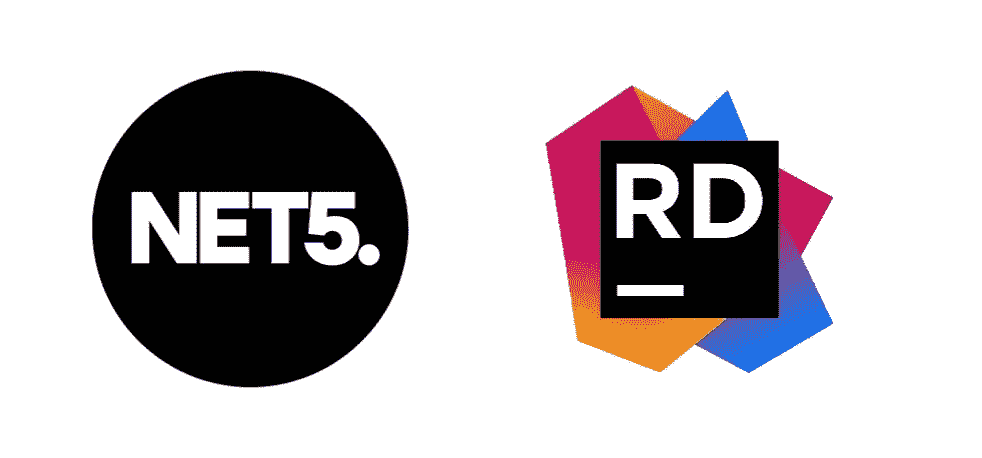
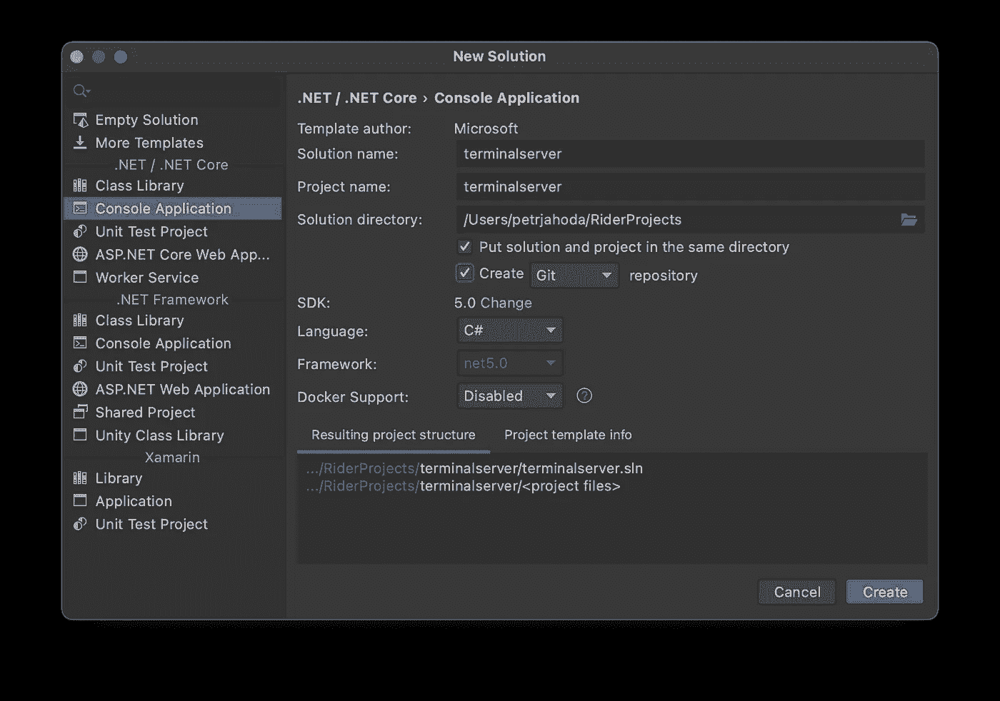
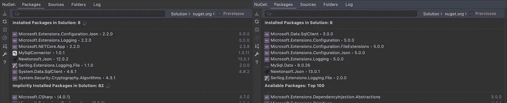
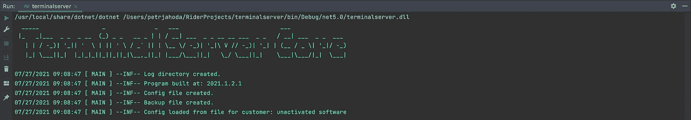

# 从升级应用程序。NET Core2 to。网络 5

> 原文：<https://itnext.io/upgrade-application-from-net-core2-to-net-5-cfc5ba95966a?source=collection_archive---------1----------------------->

## 使用 Jetbrains Rider

这将是一个简短的教程“如何使用 Jetbrains 骑士升级应用程序从。网络核心 2 和/或。网络核心 3 到。净 5”。

有许多方法，如何做到这一点。在本文中，我们将创建一个新的。NET 5 项目，并使用旧项目中的所有内容。最终，我们将有两个项目:旧的、正在工作的项目(以防出错)和一个全新的项目。NET 5 项目。

只有几个步骤，升级(取决于你的项目的大小)是容易理解的，没有时间消耗。

# 1.在 Rider 中打开原始项目

我们将使用这个原始项目中的文件，我们还需要一些关于使用的 Nugets 的信息。

# 2.在 Rider 中创建新项目

按照您想要的方式命名和设置项目(在我的例子中，我喜欢将解决方案和项目放在同一个目录中，并创建 git 存储库)。

别忘了把 SDK 设置成 5.0。

# 3.将原始项目中的必要文件复制到新项目中

在我的情况下，这意味着所有*。cs 文件。

正如你所看到的，在复制之后，我们的项目中有一堆错误。你的坚果不见了。

# 4.将 Nugets 添加到新项目中

在旧项目和新项目中打开 Nuget 选项卡，然后简单地添加这些 nu get(使用最新发布的版本)。

请记住，应该有一些谷歌搜索你使用的号码。以我下面的截图为例。在左边你可以看到来自原始项目的 Nugets，在右边是来自. Net5 项目的 Nugets。

有些数字保持不变，有些则不然。
比如:`System.Data.SqlClient`到`Microsoft.Data.SqlClient`。

# 5.测试应用程序

运行您的应用程序，了解它的工作原理。在我的情况下，一切都在工作，正如预期的那样。

# 摘要

也许您会问，如果有许多方法可以直接升级您的原始应用程序(使用同一个项目)，我为什么要使用这种方法。

我的“观点”很简单。跳转到。NET 5 是如此的重要，值得做一个新的项目，就像全新安装一个新版本的操作系统。

如果你正在阅读这篇文章，很可能你是一个 C#开发人员。我有 C#、Java 和 Go 的经验。如果你对一些关于围棋的信息感兴趣，你可以阅读[彼得·贾霍达](https://medium.com/u/6f72c855da06?source=post_page-----cfc5ba95966a--------------------------------)的这篇文章

 [## 你应该尝试围棋的 7 个理由

### 原因，我们停止使用 Java 和 C#

itnext.io](/7-reasons-you-should-try-use-go-5fb4714015d1)