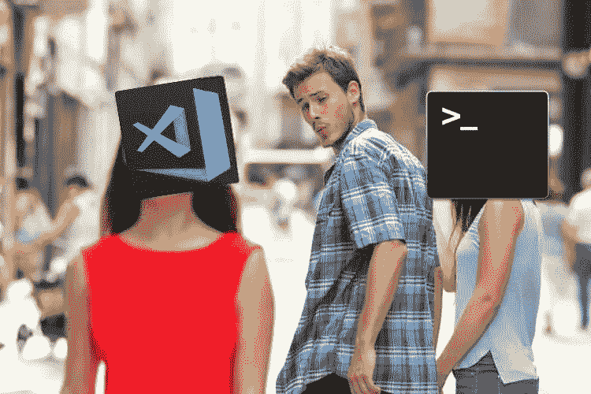
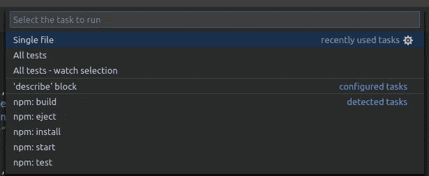

# 使用 VS 代码升级您的 Javascript 测试执行技术！

> 原文：<https://itnext.io/upgrade-your-javascript-test-execution-techniques-with-vs-code-2cda226715fd?source=collection_archive---------2----------------------->



我们来谈谈 Visual Studio 代码中的测试。

有没有想过如何以最大的灵活性轻松地从 VS 代码中执行测试？

在本教程中，我们将讨论如何改进 JavaScript 项目中的测试执行。

我们将使用来自脸书的' **create-react-app** 。本教程可以与任何安装了“Jest”的项目一起使用。

您可以通过克隆这个存储库来继续操作:

```
git clone [https://github.com/ersah123/vscode-task-tests.git](https://github.com/ersah123/vscode-task-tests.git)
```

或者，您可以执行以下操作，将任务集成到现有项目中:

–你必须做的第一件事就是创造。vscode 文件夹，如果您的根目录上没有。并在其中创建 tasks.json .并在那里添加以下代码:

1.  **任务**数组包含可以通过 VS 代码执行的任务数组。它包含分别执行**所有测试、单个文件、单个测试**。
2.  **inputs** 数组包含输入数组，将用于从用户处获取选项和输入。

要运行测试，您可以执行以下操作:

*   **终端**菜单从 VS 代码菜单中选择**运行任务…**


*   可用任务将显示在您的列表顶部，该列表由**中的 **tasks.json** 文件添加。vscode** 文件夹。



运行示例，尝试以下列表以查看存储库提供的所有不同示例:

*   **单个文件:**该任务将只运行一个测试文件，要求用户提示文件名。例如，通过键入**链接**将只执行 **Link.test.js** 文件。
*   **所有测试:**如果有任何更改，该任务将运行所有测试文件。
*   **所有测试—观察选择:**该任务将运行所有测试文件，但期望用户选择有争议地观察所有测试文件的选项。
*   **‘describe’或‘link’块:**该任务期望用户输入字符串，用于在所有测试文件的 **describe** 或 **test** 块中包含正则表达式搜索。例如，如果您键入' **itnext '，**它将只找到一个**测试**块并执行它。

更多高级用法请参考官方文档:
[https://code.visualstudio.com/docs/editor/tasks](https://code.visualstudio.com/docs/editor/tasks)

# 额外收获:如何使用 VS 代码任务在 Docker 容器中执行 Jest 测试。

首先，确保 Docker 已经安装并运行在你的机器上。您可以使用以下命令进行确认:

```
docker --version
```

然后你可以建立你的形象:

```
docker build -t "react-vscode-jest-test" .
```

最后，您可以运行您的容器

```
docker run -d -p 3000:3000 --name="react-tasks" react-vscode-jest-test
```

现在，您可以通过以下网址确认 docker 已经启动并且可以访问: [http://localhost:3000/](http://localhost:3000/)

关键是，你需要给容器分配一个名字，并用它来连接来自 VS 代码任务的 docker。

最终的 tasks.json 文件如下所示:

现在，任务将在运行的 docker 容器中执行，就像没有 docker 容器时一样。