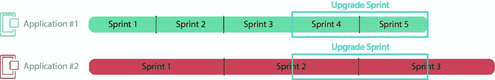
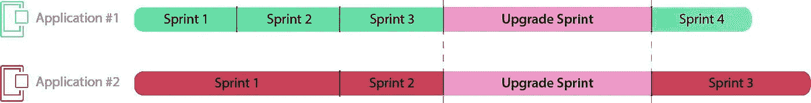
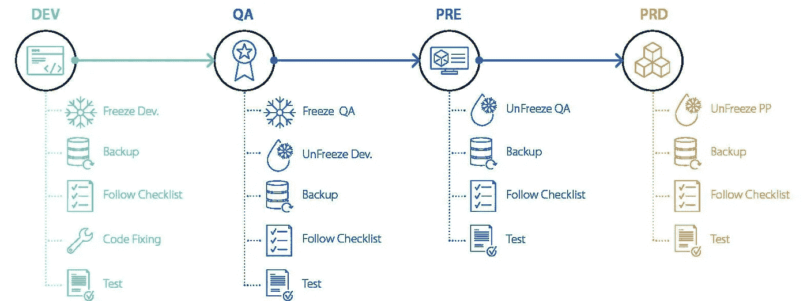

# 将 OutSystems 平台升级到版本 11

> 原文：<https://itnext.io/upgrading-outsystems-platform-to-version-11-88ad6b62d38e?source=collection_archive---------8----------------------->

# 一般

本文主要是为那些还没有升级到 OutSystems 11 的人编写的

OutSystems 去年发布了版本 11。为了保持在维护版本的循环中，您应该考虑从您的当前版本升级到 Platform 11 的稳定版本。到今年年底，OutSystems 可能会发布版本 12，然后他们可能会停止对平台 10 的维护。旧版本已被否决。

在平台的版本 11 中，OutSystems 改变了一些需求。这些变化包括:

*   LifeTime 需要获得自己的专用环境(服务器和数据库)。不再可能在其他应用服务器上运行 LifeTime。

*   特殊的平台服务器安装终身可用。此安装支持版本 10 (10.0.105.0 或更高版本)和 11。它也有自己的[清单](https://www.outsystems.com/downloads/Download.aspx?URL=https%3a%2f%2fapi.outsystems.com%2freleaseshub%2fv1%2freleases%2f595%2fassets%2f140)。
*   应用服务器必须至少是 Windows 2016。最新的[平台](https://success.outsystems.com/Documentation/11/Setting_Up_OutSystems/OutSystems_system_requirements)版本也支持 Windows 2019。
*   最新版本中增加了从清单中接管安装前步骤的可能性。这些步骤是通过 PowerShell 脚本自动完成的，但是现在可以作为可执行文件中的一个选项。
*   在旧版本中，MS MQ 是默认的，而在版本 11 中，RabbitMQ 作为一种队列机制被引入。
*   数据库管理系统的支持仅限于微软 SQL(2014、2016、2017 版本以及最终在 Azure 或 Amazon RDS 中)或 Oracle(也在 Amazon RDS 上)。不再支持 MySQL。这可能会对您的环境产生影响，这取决于您的 OutSystems 数据库存储在哪里。
*   升级到版本 11 仅适用于版本 9.1 的平台(9.1.616.0 **或更高版本**)。因此，如果您使用旧版本的平台，首先您必须升级到版本 9.1.616.0 或更高版本。
*   检查[副作用和突破性变化](https://www.outsystems.com/goto/breaking-changes-11)文件。根据这个文档，您和开发团队可以估计修复重大变更所需的时间。

# 规划升级

*   提前规划升级；考虑到您不能将开发冲刺和升级冲刺混合在一起，因为您可能会得到难以查明和解决的不受控制的副作用。
*   发展环境变了。新版本的 Service Studio(开发环境)只能与平台服务器 11 通信。幸运的是，您可以在同一台机器上同时安装版本 10 和 11，并同时使用这两个版本。
*   计划在最佳时间内升级生产环境。根据此初始规划，计划升级其他环境(升级生产环境)。

# 外部系统的新功能 [11](https://success.outsystems.com/Documentation/11/New_in_OutSystems_11)

*   你可以简单地通过拖放来替换数据。
*   有一个新的 OutSystems UI 框架，有许多预先设计的 UI 模式和屏幕模板。这个框架可以用来替代 SilkUI 框架。如何用 OutSystems UI 替换 SilkUI 框架值得一篇新文章。
*   可以构建服务模块来支持微服务。
*   更好地处理模块之间的依赖关系。
*   您可以将应用程序部署到容器中。
*   改进了发布过程；部署速度更快，因为只有更改会被部署。
*   可以禁用部分流。

# 逐步升级

当安装了正确版本的 Microsoft Windows 的应用程序服务器可用时，您可以开始升级。确保来自应用服务器和数据库的备份可用。

*   根据您的更新策略，选择要在您的环境中实施的版本。如果您总是希望使用最新版本，请选择最新发布的版本。如果你的组织更保守，选择至少 3 个月前的版本。为你的一生环境做同样的选择。
*   检查具有副作用和突破性变更的文件，并在必要时采取预防措施。这些变化可能会对您现有的环境产生一些影响。
*   必须升级的第一个环境是生存期环境，它应该在自己的服务器上运行。按照清单上的所有必要步骤进行操作。升级后，LifeTime 可以与现有的版本 10 环境通信。也可以将软件从这些环境部署到下一个阶段。不可能从运行版本 11 的环境部署到运行版本 10 的环境。升级开发环境时，必要的错误修复只能在 TAP 环境中完成。修复也应该应用到开发环境中，否则，当您更新环境的其余部分时，您会将 bug 引入到系统中。
*   下一个应该升级的环境是开发环境。按照清单上的步骤运行它们。
*   安装 platform 11 需要新的许可证文件。如果您可以访问[许可页面](https://www.outsystems.com/PlatformLicensingFO/LicenseActivationCode.aspx)，您可以更改版本，如有必要，还可以更改序列号。如果序列号已更改，请释放现有许可证并注册更新的环境。
*   确保默认部署区域没有改变。通常这是全局区域，但是可以将其更改为另一个区域。我们在安装服务中心时遇到了问题，因为错误的部署区域，更新无法完成。建议将默认部署区域临时更改回默认设置，稍后再恢复到升级前的设置。
*   部署系统组件后，您可以重新部署所有自己的构建应用程序。修复所有引用并测试所有应用程序。
*   经过全面测试后，可以决定继续升级。下一步是测试环境的升级。
*   为了更新测试环境，采取与开发环境相同的步骤。没有必要创建一个解决方案，但是您必须将所有更新的应用程序部署到测试环境中。
*   对于验收和生产环境，重复测试环境中的步骤。这就完成了整个 OutSystems 环境中的升级。